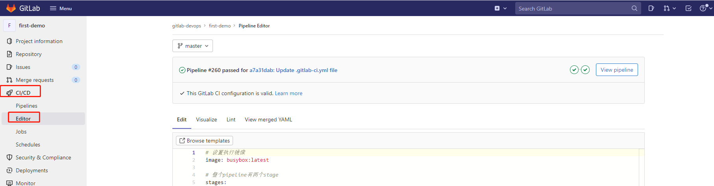
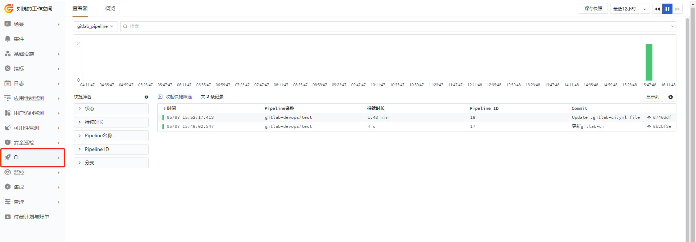
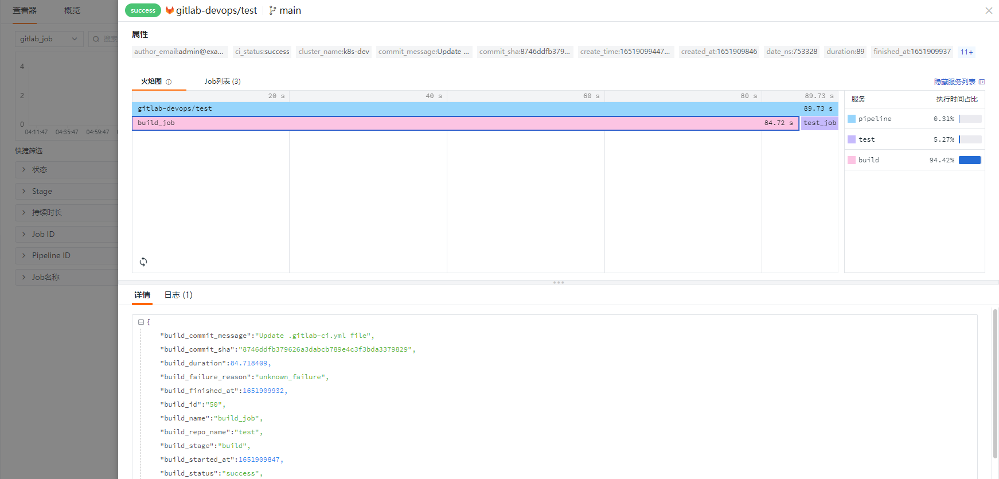

# Gitlab-CI 可观测最佳实践
--- 
## GitLab

**GitLab **是由 GitLabInc. 开发，使用 [MIT 许可证](https://baike.baidu.com/item/MIT%E8%AE%B8%E5%8F%AF%E8%AF%81)的基于[网络](https://baike.baidu.com/item/%E7%BD%91%E7%BB%9C)的 [Git](https://baike.baidu.com/item/Git) [仓库](https://baike.baidu.com/item/%E4%BB%93%E5%BA%93)管理工具，且具有 [wiki](https://baike.baidu.com/item/wiki) 和 issue 跟踪功能。使用 [Git](https://baike.baidu.com/item/Git) 作为代码管理工具，并在此基础上搭建起来的 web 服务。

## CI/CD 
**CI/CD** 是持续集成（Continuous Integration : CI）、持续交付(Continuous Delivery: CD)、持续部署(Continuous Deployment CD)的简称.<br />**持续集成**的重点是将各个开发人员的工作集合到一个代码仓库中。通常，每天都要进行几次，主要目的是尽早发现集成错误，使团队更加紧密结合，更好地协作。<br />**持续交付**的目的是最小化部署或释放过程中固有的摩擦。它的实现通常能够将构建部署的每个步骤自动化，以便任何时刻能够安全地完成代码发布（理想情况下）。<br />**持续部署**是一种更高程度的自动化，无论何时对代码进行重大更改，都会自动进行构建/部署。<br />几款 CI/CD 工具:

> 1. Jenkins
>
> 1. Gitlab CI
> 1. Travis CI
> 1. GoCD


## GitLab CI

GitLab CI/CD（后简称 GitLab CI）是一套基于 GitLab 的 CI/CD 系统，是 CI/CD 领域的一个新手玩家，但它已经在 Forrester Wave 持续集成工具中占据了领先地位。可以让开发人员通过  .gitlab-ci.yml 在项目中配置 CI/CD 流程，在提交后，系统可以自动/手动地执行任务，完成 CI/CD 操作。而且，它的配置非常简单，CI Runner 由 Go 语言编写，最终打包成单文件，所以只需要一个 Runner 程序、以及一个用于运行 jobs 的执行平台（如裸机 +SSH，Docker 或 Kubernetes 等，我推荐用 Docker，因为搭建相当容易）即可运行一套完整的 CI/CD  系统。

## <<< custom_key.brand_name >>>

“[<<< custom_key.brand_name >>>](https://<<< custom_key.brand_main_domain >>>/)” 是一个云时代的系统可观测性平台。平台包含基础设施、日志、指标、事件、应用性能、用户访问、云拨测、系统级安全巡检等功能模块，针对上述功能产生的 Logging、Metrics、Tracing 这三类数据提供全链路级别的数据分析和洞察能力。H5、iOS、Android、小程序等应用全面覆盖，支持完整追踪用户访问行为及真实体验，提供了页面性能、资源调用、错误告警、业务访问等一系列数据及分析视图。与链路追踪相联动，帮助您实时洞察应用表现和每一个请求背后的真实需求。灵活的场景布局、丰富的图表选择、拉拽式交互体验让您轻松搭建属于“自己”的仪表板。统一的数据查询方式，支持配置各类数据，简单易上手。
## DataKit

DataKit 是<<< custom_key.brand_name >>>开源的采集工具，开源地址：[https://github.com/DataFlux-cn/datakit](https://github.com/DataFlux-cn/datakit)

## 背景介绍
随着微服务日益流行，企业开始将软件单体服务架构逐渐过渡到微服务架构，微服务的一个特点工程模块众多，部署起来也相对麻烦，CICD 工具虽然能够很好的集成交付部署，但是部署过程中出现的一些问题很难进行统计分析，利用<<< custom_key.brand_name >>>强大的观测能力和自定义视图能力，能够帮助您很好的查看、分析软件在持续部署过程中出现的一些问题。
## 架构流程


> 1.  开发人员 commit&push code 
>
> 1.  GitlabRunner 向 gitlab 注册 
> 1.  gitlab trigger 触发执行 Gitlab-CI 
> 1.  Gitlab-CI 执行完成后，触发 webhook 将数据推送给 DataKit
> 1. DataKit 打标签推送至<<< custom_key.brand_name >>>平台

## 前置条件

- <[安装 DataKit](/datakit/datakit-install)>
- DataKit 接入版本 >=1.2.13

### DataKit 开启 gitlab-ci

#### 编辑 gitlab.conf
> cd conf.d/gitlab
> cp gitlab.conf.sample gitlab.conf

gitlab.conf 全文
```toml
[[inputs.gitlab]]
## set true if you need to collect metric from url below
enable_collect = false

## param type: string - default: http://127.0.0.1:80/-/metrics
prometheus_url = "http://127.0.0.1:80/-/metrics"

## param type: string - optional: time units are "ms", "s", "m", "h" - default: 10s
interval = "10s"

## datakit can listen to gitlab ci data at /v1/gitlab when enabled
enable_ci_visibility = true

## extra tags for gitlab-ci data.
## these tags will not overwrite existing tags.
[inputs.gitlab.ci_extra_tags]
# some_tag = "some_value"
# more_tag = "some_other_value"

## extra tags for gitlab metrics
[inputs.gitlab.tags]
# some_tag = "some_value"
# more_tag = "some_other_value"
```
参数说明<br />enable_collect: false # 关闭指标采集<br />prometheus_url ：  指标采集地址<br />enable_ci_visibility： true 开启gitlab-ci

#### 重启 DataKit

```toml
datakit --restart
```
### Gitlab 安装配置
如已安装，请忽略

#### docker 安装 Gitlab
> docker run --name=gitlab -d -p 8899:8899 -p 2443:443 --restart always \ --volume /data/midsoftware/gitlab/config:/etc/gitlab \ --volume /data/midsoftware/gitlab/logs:/var/log/gitlab \ --volume /data/midsoftware/gitlab/data:/var/opt/gitlab  docker.io/gitlab/gitlab-ce

端口介绍

| 端口 | 描述 |
| --- | --- |
| 8899 | gitlab-ui 端口 |
| 2443 | gitlab ssl 端口 |


#### 修改配置文件：gitlab.rb

```
#访问地址
external_url 'http://192.168.91.11:8899'

# 设置超时时间，默认 10（单位 s）
gitlab_rails['webhook_timeout'] = 60
```

#### 重启gitlab

```shell
docker restart gitlab
```

#### 查看 GitLab 版本号

```shell
[root@middle config]# docker exec -it gitlab cat /opt/gitlab/embedded/service/gitlab-rails/VERSION
14.6.2
```

#### 查看 GitLab初始密码

```shell
[root@middle config]# docker exec -it gitlab cat /etc/gitlab/initial_root_password |grep Password
#          2. Password hasn't been changed manually, either via UI or via command line.
Password: yBY9toQ0SJ8fxh3mndHPzfWclVUDZ/J8e8O4bDsal2E=
```

账号 root，览器登录 http://ip:8899 并修改密码。


#### 创建第一个工程
menu -> Projects-> you projects -> new projects -> select create blank project。填写项目名称


### Gitlab-Runner 安装配置
如已安装，请忽略
#### Docker 安装 GitLab-Runner
```shell
docker run -d --name gitlab-runner --restart always \
    -v /data/midsoftware/gitlab-runner/config:/etc/gitlab-runner \
    -v /var/run/docker.sock:/var/run/docker.sock \
    gitlab/gitlab-runner:latest
```

### GitLab-Runner 授权密钥
GitLab Runner 目前不支持全局配置，所以 Runner 的密钥只能去 project 里面查找，进入刚刚创建的 project -> settings -> runners，复制密钥，下一步 Runner 注册的时候需要用到


### Gitlab-Runner 注册到 Gitlab

```shell
docker run --rm -v /data/midsoftware/gitlab-runner/config:/etc/gitlab-runner gitlab/gitlab-runner register \
  --non-interactive \
  --executor "docker" \
  --docker-image alpine:latest \
  --url "http://192.168.91.11:8899" \
  --registration-token "U6uhCZGPrZ7tGs6aV8rY" \
  --description "gitlab-runner" \
  --tag-list "docker,localMachine" \
  --run-untagged="true" \
  --locked="false" \
  --access-level="not_protected"
```

参数介绍

| 参数名称 | 值 | 描述 |
| --- | --- | --- |
| executor | docker | 可以用其他的，也可以去掉此参数，如果发布到 docker 环境，建议选择  docker |
| docker-image | alpine:latest | docker-image 版本，结合 executor 一起使用 |
| url | [http://192.168.91.11:8899](http://192.168.91.11:8899) | gitlab 访问地址 |
| registration-token | token | gitlab admin token |
| description | gitlab-runner | 描述信息 |
| tag-list | docker,localMachine | 可以根据 tag 选择对应的执行器 |

更多参数参考：[https://docs.gitlab.com/runner/configuration/advanced-configuration.html](https://docs.gitlab.com/runner/configuration/advanced-configuration.html)

### 配置GitLab Webhook
进入刚刚创建的项目，选择 Settings -> Webhooks，填写 url，勾选 pipeline events，保存。


说明：

> url：http://<datakit地址>/v1/gitlab
>
> 开启 Job events
>
> 开启 Pipeline events


也可以点击 Test ->选择 Pipeline events ，会触发一个 pipeline 事件，将数据推送给我们刚刚配置的 webhook 地址。查看状态，检测这个过程是否正常。


### 编写 .gitlab-ci.yml
进入刚刚创建的项目，选择 CI/CD-> Editor



填写脚本内容，内容如下：
```git
# 设置执行镜像
image: busybox:latest

# 整个pipeline 有两个 stage
stages:
  - build
  - test

before_script:
  - echo "Before script section"

after_script:
  - echo "After script section"


build_job:
  stage: build
  only:
    - master
  script:
    - echo "将内容写入缓存"
    - sleep 80s
    # - d ps 

test_job:
  stage: test
  script:
    - echo "从缓存读取内容"
```
点击保存后，自动触发 cicd，触发后会将过程通过 webhook 推送到刚刚配置的 webhook 地址。
### 查看webhook推送记录


状态 200 代表推送成功

## <<< custom_key.brand_name >>>
pipeline 推送成功后，我们可以通过<<< custom_key.brand_name >>>平台通过可视化方式，通过仪表盘和查看器观测 pipeline 执行的整体情况。
### CI 查看器
通过 菜单 `CI`查看器查看`gitlab_pipeline `和 `gitlab_job`明细。

gitlab_pipeline：



gitlab_job


点击明细可以查看火焰图和job列表<br />火焰图<br />
### CI 概览
CI 概览可以查看到gitlab-ci pipeline和job执行情况，如：pipeline执行的成功率、执行时间，job执行的成功率、执行时间等。<br />

