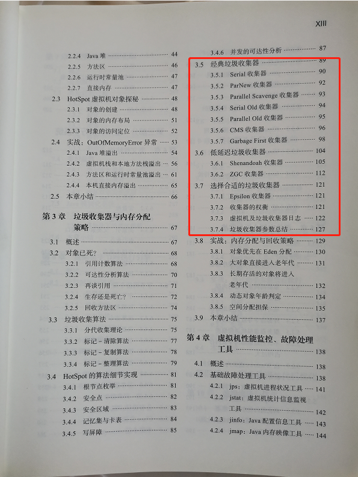
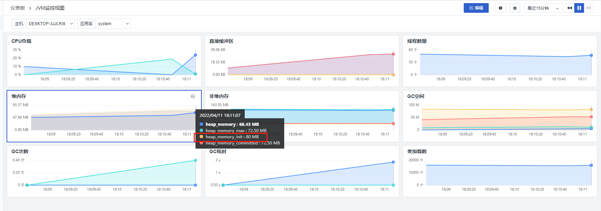
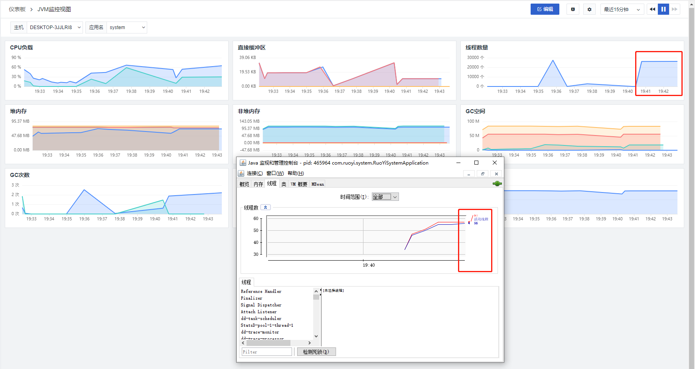
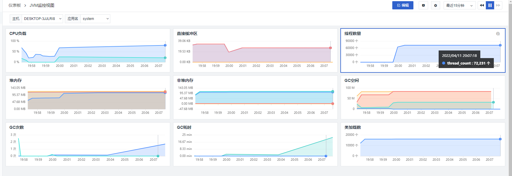
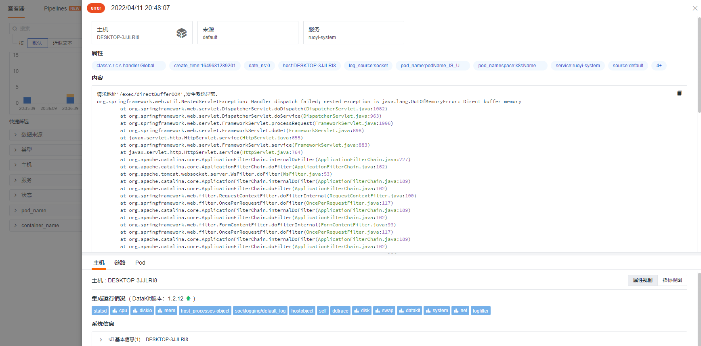
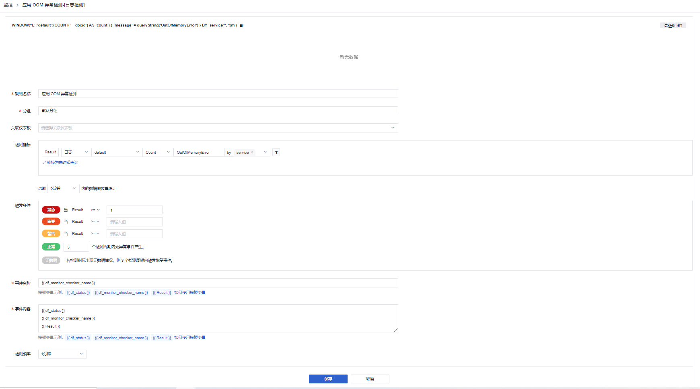
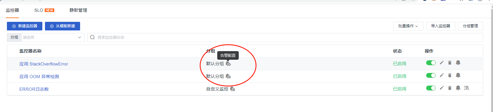
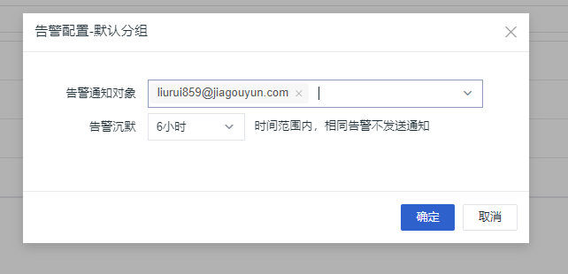
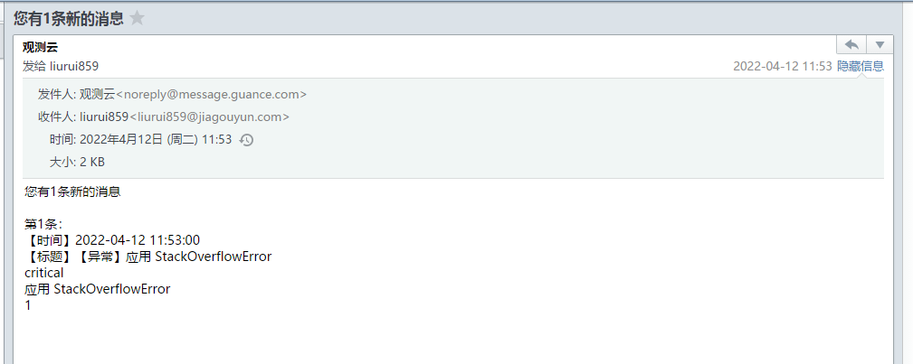

# JAVA OOM异常可观测最佳实践

---

## 我们常见 OOM 异常场景
> 1.  堆溢出-java.lang.OutOfMemoryError: Java heap space。 
> 1.  栈溢出-java.lang.OutOfMemorryError。 
> 1.  栈溢出-java.lang.StackOverFlowError。 
> 1.  元信息溢出-java.lang.OutOfMemoryError: Metaspace。 
> 1.  直接内存溢出-java.lang.OutOfMemoryError: Direct buffer memory。 
> 1.  GC超限-java.lang.OutOfMemoryError: GC overhead limit exceeded。 

## 垃圾回收器
> 垃圾回收器就是内存回收的实践者，不同的产商、不同版本的虚拟机所包含的垃圾收集器都可能会有很大的差别，不同的虚拟机一般也都会提供各种参数供用户根据自己的应用特点和要求组合出各个内存分代所使用的收集器 ——《深入理解JAVA虚拟机》

关于垃圾采集器（也叫垃圾回收器），在《深入理解JAVA虚拟机》第三版目录中，已经为我们罗列了大部分垃圾采集器。如下图所示：

### 查看本地 JVM 垃圾回收器
通过命令` java -XX:+PrintFlagsFinal -version |FINDSTR /i ":"`查看本地垃圾回收器为 `Parallel`。
```shell
C:\Users\lenovo>java -XX:+PrintFlagsFinal -version |FINDSTR /i ":"
     intx CICompilerCount                          := 4                                   {product}
    uintx InitialHeapSize                          := 266338304                           {product}
    uintx MaxHeapSize                              := 4257218560                          {product}
    uintx MaxNewSize                               := 1418723328                          {product}
    uintx MinHeapDeltaBytes                        := 524288                              {product}
    uintx NewSize                                  := 88604672                            {product}
    uintx OldSize                                  := 177733632                           {product}
     bool PrintFlagsFinal                          := true                                {product}
     bool UseCompressedClassPointers               := true                                {lp64_product}
     bool UseCompressedOops                        := true                                {lp64_product}
     bool UseLargePagesIndividualAllocation        := false                               {pd product}
     bool UseParallelGC                            := true                                {product}
java version "1.8.0_101"
Java(TM) SE Runtime Environment (build 1.8.0_101-b13)
Java HotSpot(TM) 64-Bit Server VM (build 25.101-b13, mixed mode)
```

### 查看 K8s 环境 JVM 垃圾回收器
在 K8s 环境中，一般使用 `openjdk:8-jdk-alpine`或者`openjdk:8u292`作为基础镜像，启动服务后，并没有发现开启垃圾回收器。
```shell
root@ruoyi-system-c9c54dbd5-ltcvf:/data/app# 
root@ruoyi-system-c9c54dbd5-ltcvf:/data/app# java -XX:+PrintCommandLineFlags -version
-XX:InitialHeapSize=8388608 -XX:MaxHeapSize=134217728 -XX:+PrintCommandLineFlags -XX:+UseCompressedClassPointers -XX:+UseCompressedOops 
openjdk version "1.8.0_292"
OpenJDK Runtime Environment (build 1.8.0_292-b10)
OpenJDK 64-Bit Server VM (build 25.292-b10, mixed mode)
root@ruoyi-system-c9c54dbd5-ltcvf:/data/app# 
```
## 前置条件
### 1、jdk 版本为 1.8 ，也称为 JDK8。

每个 jdk 垃圾回收机制均不太一样，同样内存结构也发生了很大的变化，尤其是 1.6、1.7、1.8 三个版本表现出比较明显，目前大部分企业用的是 jdk1.8 版本，本最佳实践也采用 jdk1.8 版本作为基础，如果是其他版本的jdk，可以借鉴思路。

### 2、接入JVM可观测。

请先接入 [JVM可观测]()，从<<< custom_key.brand_name >>>视图上我们可以看出初始堆内存为`80 M` ,与我们启动时指定参数一致。



### 3、接入日志可观测

**参考 **[**Kubernetes 集群中日志采集的几种玩法**](/best-practices/cloud-native/k8s-logs/)**，本次主要是采用 socket 方式，也可以用其他方式。**

## 堆溢出 -java.lang.OutOfMemoryError: Java heap space

堆溢出异常，相信大家很常见。即堆内对象不能进行回收了，堆内存持续增大，这样达到了堆内存的最大值，数据满了，所以就出来了。我们直接放溢出的代码样例。设置启动最大堆内存为`-Xmx80m`，这样我们设置为最大堆内存，这样运行起来就很快就出来错误了。

### 1、启动参数

> -Xmx80m
> -javaagent:C:/"Program Files"/datakit/data/dd-java-agent.jar
> -Ddd.service.name=system
> -Ddd.agent.port=9529

### 2、请求

浏览器请求 [http://localhost:9201/exec/heapOOM](http://localhost:9201/exec/heapOOM)，需要等一段时间才能看到异常输出。看到异常输出后，即可前往<<< custom_key.brand_name >>>查看对应的日志。

### 3、<<< custom_key.brand_name >>>查看日志


## 栈溢出 -java.lang.OutOfMemorryError

抛出来的异常如下，如果真的需要创建线程，我们需要调整帧栈的大小`-Xss512k`，默认帧栈大小为`1M`，如果设置小了，可以创建更多线程。如果帧栈不够用了，我们需要了解什么地方创建了很多线程，线上程序需要用`jstack` 命令，将当前线程的状态导出来放到文件里边，然后将文件上传到 fastthread.io 网站上进行分析。若代码确实需要这么多的线程，此时可以根据 【JVM总内存 - 堆 = n*Java虚拟机栈 】，来减小堆的内存或者Xss来解决增加可分配线程的数量。

### 1、启动参数
> -Xmx80m
> -javaagent:C:/"Program Files"/datakit/data/dd-java-agent.jar
> -Ddd.service.name=system
> -Ddd.agent.port=9529

### 2、请求

浏览器访问地址：[http://localhost:9201/exec/stackOOM](http://localhost:9201/exec/stackOOM)

### 3、<<< custom_key.brand_name >>>查看日志

瞬间创建线程，JVM 自带工具不在上报线程等相关监控指标，<<< custom_key.brand_name >>>仍然上报最新 JVM 监控指标。



一段时间后，JVM 自带工具出现异常。


随后系统就会出现假死现象。



## 栈溢出 -java.lang.StackOverFlowError

主要表现在递归调用、死循环上，无论是由于栈帧太大还是虚拟机栈容量太小，当新的栈帧内存无非分配的时候，HotSpot 虚拟机抛出的都是 StackOverFlowError 异常。程序每次递归的时候，程序会把数据结果压入栈，包括里边的指针等，这个时候就需要帧栈大一些才能承受住更多的递归调用。

### 1、启动参数
> -Xmx80m
> -javaagent:C:/"Program Files"/datakit/data/dd-java-agent.jar
> -Ddd.service.name=system
> -Ddd.agent.port=9529

### 2、请求
浏览器请求 [http://localhost:9201/exec/stackOFE](http://localhost:9201/exec/stackOFE)
### 3、<<< custom_key.brand_name >>>查看日志


## 元信息溢出 -java.lang.OutOfMemoryError: Metaspace
在 JDK 8 以后，永久代便完全退出历史舞台，元空间作为其替代者登场，元数据区域也成为方法区。在默认设置下，很难迫使虚拟机产生方法区（元数据区域）的溢出异常，存储着类的相关信息，常量池，方法描述符，字段描述符，运行时产生大量的类就会造成这个区域的溢出。启动的时候设置 `XX:MetaspaceSize`和`XX:MaxMetaspaceSize`过小时，直接启动报错。
### 1、启动参数
> -Xmx80m
> -XX:MetaspaceSize=30M
> -XX:MaxMetaspaceSize=90M
> -javaagent:C:/"Program Files"/datakit/data/dd-java-agent.jar
> -Ddd.service.name=system
> -Ddd.agent.port=9529

### 2、请求
浏览器输入 [http://localhost:9201/exec/metaspaceOOM](http://localhost:9201/exec/metaspaceOOM)。
3、查看日志
元数据溢出后，不会往再写入日志等相关操作。


## 直接内存溢出 -java.lang.OutOfMemoryError: Direct buffer memory
直接内存溢出，我们除了使用堆内存外，我们还可能用直接内存，即堆外内存。NIO 为了提高性能，避免在 Java Heap和native Heap中切换，所以使用直接内存，默认情况下，直接内存的大小和对内存大小一致。堆外内存不受JVM的限制，但是受制于机器整体内存的大小限制。如下代码设置堆最大内存为 80m，直接内存为 70m，然后我们每次分配1M放到list里边。这个时候，当输出 70 次（ Springboot 应用会小于 70次 ）的时候，下次再分配的时候会报 `nested exception is java.lang.OutOfMemoryError: Direct buffer memory`。
### 1、启动参数
> -Xmx80m
> -javaagent:C:/"Program Files"/datakit/data/dd-java-agent.jar
> -Ddd.service.name=system
> -Ddd.agent.port=9529

### 2、请求

浏览器输入 [http://localhost:9201/exec/directBufferOOM](http://localhost:9201/exec/directBufferOOM)。

### 3、<<< custom_key.brand_name >>>查看日志



## GC超限 -java.lang.OutOfMemoryError: GC overhead limit exceeded
前面三种都会引起 GC 超限。JDK1.6 之后新增了一个错误类型，如果堆内存太小的时候会报这个错误。如果 98% 的 GC 的时候回收不到 2% 的时候会报这个错误，也就是最小最大内存出现了问题的时候会报这个错误。

## <<< custom_key.brand_name >>>
无论是哪种异常，我们可以在<<< custom_key.brand_name >>> `JVM 监控视图`上找到一些线索，同时结合日志情况，对 JVM 参数进行调优。gc 次数过多过少、gc 时间过长、线程突然增多、堆内存突然增多等等，都需要引起我们关注。


### <<< custom_key.brand_name >>> OOM 日志告警

以上几种 OOM 异常场景也只是演示了如何产生异常以及在<<< custom_key.brand_name >>>上如何表现。实际生产过程中, OOM 异常会影响业务逻辑，更严重的会导致系统中断。可以借助<<< custom_key.brand_name >>>告警功能快速通知相关人员进行干预。

#### 配置 StackOverflowError 异常检测


#### 配置 OutOfMemoryError 异常检测




#### 配置告警通知

监控器列表 - 分组 ，点击告警通知按钮



配置通知对象，<<< custom_key.brand_name >>>支持多种通知对象，当前采用的是邮件通知。



触发异常后，可以收到邮件通知，内容如下：



## 演示代码
本程序代码是在若依微服务框架上进行演示的。
```java
package com.ruoyi.system.controller;

import com.ruoyi.common.core.domain.system.SysDept;
import com.ruoyi.common.core.web.domain.AjaxResult;
import org.springframework.cglib.proxy.Enhancer;
import org.springframework.cglib.proxy.MethodInterceptor;
import org.springframework.cglib.proxy.MethodProxy;
import org.springframework.web.bind.annotation.GetMapping;
import org.springframework.web.bind.annotation.RequestMapping;
import org.springframework.web.bind.annotation.RestController;

import java.lang.reflect.Method;
import java.nio.ByteBuffer;
import java.util.ArrayList;
import java.util.List;
import java.util.concurrent.TimeUnit;

/**
 * @author liurui
 * @date 2022/4/11 9:28
 */
@RequestMapping("/exec")
@RestController
public class ExceptionController {
    
    @GetMapping("/heapOOM")
    public AjaxResult heapOOM() {
        List<SysDept> list = new ArrayList<>();
        while (true) {
            try {
                TimeUnit.MILLISECONDS.sleep(1);
            } catch (InterruptedException e) {
                e.printStackTrace();
            }
            list.add(new SysDept());
        }
    }

    @GetMapping("/stackOOM")
    public AjaxResult stackOOM() {
        while (true) {
            Thread thread = new Thread(() -> {
                while (true) {
                    try {
                        TimeUnit.HOURS.sleep(1);
                    } catch (InterruptedException e) {
                        e.printStackTrace();
                    }
                }

            });
            thread.start();
        }
    }

    @GetMapping("/directBufferOOM")
    public AjaxResult directBufferOOM() {
        final int _1M = 1024 * 1024 * 1;
        List<ByteBuffer> buffers = new ArrayList<>();
        int count = 1;
        while (true) {
            ByteBuffer byteBuffer = ByteBuffer.allocateDirect(_1M);
            buffers.add(byteBuffer);
            System.out.println(count++);
        }
    }

    @GetMapping("/stackOFE")
    public AjaxResult StackOFE() {
        stackOverFlowErrorMethod();
        return AjaxResult.success();
    }

    public static void stackOverFlowErrorMethod() {
        stackOverFlowErrorMethod();
    }

    @GetMapping("/metaspaceOOM")
    public AjaxResult metaspaceOOM() {
        while (true) {
            Enhancer enhancer = new Enhancer();
            enhancer.setSuperclass(SysDept.class);
            enhancer.setUseCache(false);
            enhancer.setCallback(new MethodInterceptor() {
                @Override
                public Object intercept(Object obj, Method method,
                                        Object[] args, MethodProxy proxy) throws Throwable {
                    return proxy.invokeSuper(obj, args);
                }
            });
            enhancer.create();
        }
    }
}
```
