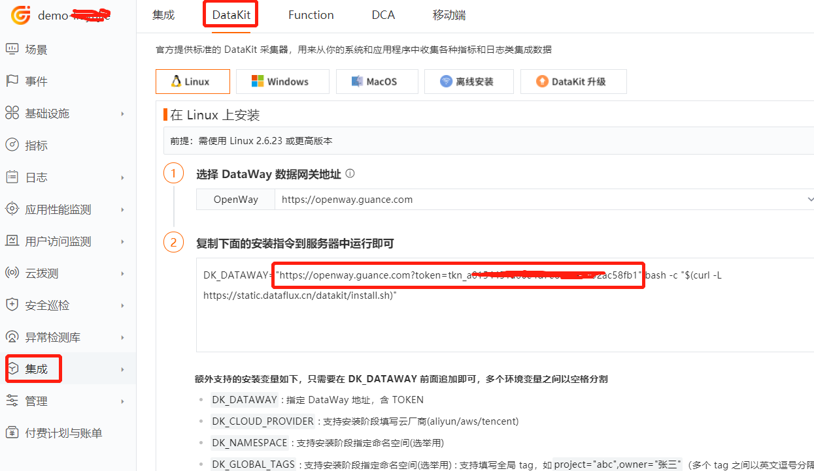

# Jenkins 可观测最佳实践
---

## 账号注册
前往官方网站 [https://<<< custom_key.brand_main_domain >>>/](https://auth.guance.com/) 注册账号，使用已注册的账号/密码登录。


---

## 安装 DataKit

### 获取 OpenWay 地址的 token 

点击『集成』模块，左上角『DataKit』，根据您的操作系统和系统类型选择合适的安装命令。


### 执行安装
复制 DataKit 安装命令在需要被监控的服务器上直接运行。

- 安装目录 /usr/local/datakit/

- 日志目录 /var/log/datakit/
- 主配置文件 /usr/local/datakit/conf.d/datakit.conf
- 插件配置目录 /usr/local/datakit/conf.d/

DataKit 安装完成后，已经默认开启 Linux 主机常用插件，可以在 DF ——基础设施——内置视图查看。

| 采集器名称 | 说明 |
| --- | --- |
| cpu | 采集主机的 CPU 使用情况 |
| disk | 采集磁盘占用情况 |
| diskio | 采集主机的磁盘 IO 情况 |
| mem | 采集主机的内存使用情况 |
| swap | 采集 Swap 内存使用情况 |
| system | 采集主机操作系统负载 |
| net | 采集主机网络流量情况 |
| host_process | 采集主机上常驻（存活 10min 以上）进程列表 |
| hostobject | 采集主机基础信息（如操作系统信息、硬件信息等） |
| docker | 采集主机上可能的容器对象以及容器日志 |

点击 [**基础设施**] 模块，查看所有已安装 DataKit 的主机列表以及基础信息，如主机名，CPU，内存等。


## 监控场景
### 新建场景

点击『场景』模块->『新建场景』


### 查看场景视图


## DataKit 开启 Jenkins 采集

### 获取 Jenkins 的 Access keys

『登录 Jenkins』->『系统管理』->『插件管理』->『可选插件』->输入 metrics，点击 Install without restart。

安装完成后，点击『系统管理』->『系统配置』->找到 Metrics，点击右边的『Generate...』，点击『保存』。


### 配置 DataKit
创建 jenkins.conf 文件，修改 url 为 jenkins 的 url，key 为 Metrics 的 key。
```
$ cd /usr/local/datakit/conf.d/jenkins
$ cp jenkins.conf.sample jenkins.conf
$ vim jenkins.conf
```

### 重启 DataKit

```
$ Datakit --restart
```

## Jenkins 相关介绍
### Jenkins 概述
Jenkins 是开源 CI&CD 软件领导者， 提供超过 1000 个插件来支持构建、部署、自动化， 满足任何项目的需要。
### Jenkins 性能指标

| 指标 | 描述 | 数据类型 | 单位 |
| --- | --- | --- | --- |
| executor_count | 有效构建数量 | int | count |
| executor_free_count | 空闲构建数量 | int | count |
| executor_in_use_count | 正在执行的构建数量 | int | count |
| node_offline_count | 离线的构建节点数量 | int | count |
| node_online_count | 在线的构建节点数量 | int | count |
| plugins_active | 启动成功的插件数量 | int | count |
| plugins_failed | 启动失败的插件数量 | int | count |
| project_count | 项目数量 | int | count |
| job_count | 作业数量 | int | count |
| queue_blocked | 阻塞作业数量 | int | count |
| queue_buildable | 可构建作业数量 | int | count |
| queue_pending | 待处理作业数量 | int | count |
| queue_size | 构建队列中的作业数量 | int | count |
| queue_stuck | 卡住作业数量 | int | count |
| system_cpu_load | Jenkins系统负载 | float | % |
| vm_blocked_count | Jenkins JVM 中阻塞线程数 | int | count |
| vm_count | Jenkins JVM 中线程总数 | int | count |
| vm_cpu_load | Jenkins的CPU使用率 | float | % |
| vm_memory_total_used | Jenkins使用的内存总量 | int | Byte |
