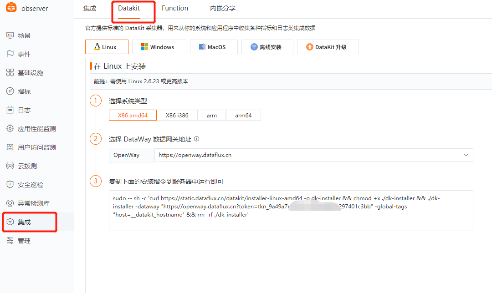
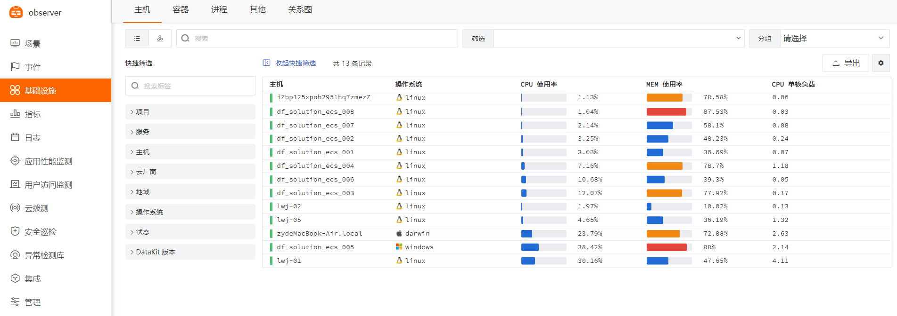
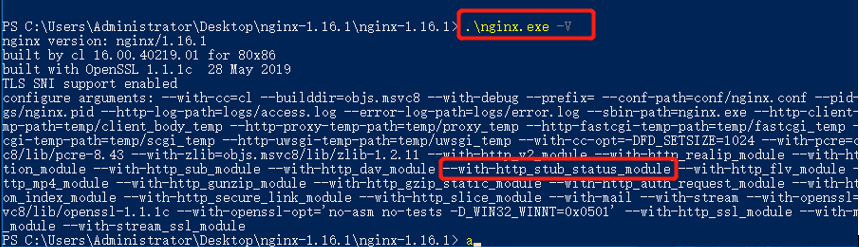
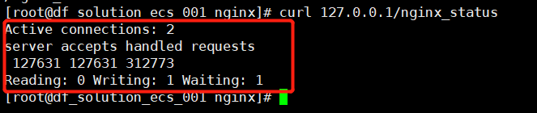
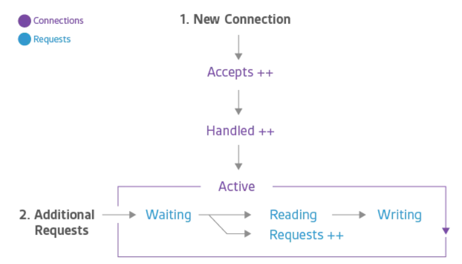
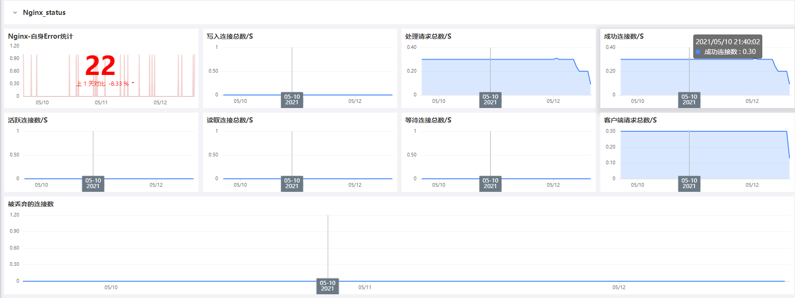
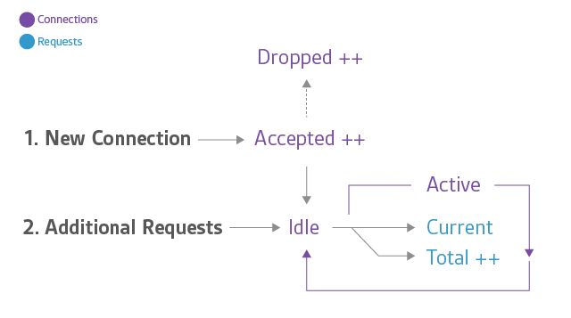
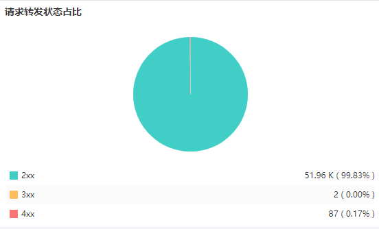

# Nginx 可观测最佳实践
---

## 背景介绍

Nginx  是一个开源、免费、高性能的 HTTP 和反向代理服务器，也可以用于 IMAP/POP3 代理服务器， Nginx  因其采用的异步非阻塞工作模型，使其具备高并发、低资源消耗的特性，高度模块化设计也使得  Nginx  具备很好的扩展性，在处理静态文件、反向代理请求等方面， Nginx  表现出了很大的优势，同时部署维护简单，因此绝大多数企业内部都会用到  Nginx ，当前  Nginx  最常用的几个场景如下：

- **WEB 服务器（静态资源服务器）**

- **负载均衡（流量分发负载）**
- **反向代理**
- **其他**

Nginx  虽然简单，但因为应用场景广泛，所以在企业内部相对来说还是很重要的，那如何保障  Nginx  的健康与稳定，也是企业内部的运维人员非常关心的一件事。 Nginx  自身自带的性能指标模块 **with-http_stub_status_module**就可以支持直接获取  Nginx  相关的数据，例如请求连接数，处理连接数等，同时  Nginx  日志（acces.log、error.log）可以用来进行具体的请求层面的分析，例如 PV 数量，UV 数量，请求错误统计等，这两方面的数据结合就可以快速了解  Nginx  自身的状态。

- ** Nginx （with-http_stub_status_module）**

- ** Nginx  日志：**

举例如下：


虽然说  Nginx  自身已经提供了足够多的数据源来反馈  Nginx  自身的状态，但文本类的数据格式或者说日志类的数据格式首先观看起来不方便也不美观，其次这些数据格式也不能实时反馈  Nginx  相关请求数或服务器请求状态的变化趋势，那有什么好用的可视化工具可以快速展现这方面的数据或指标呢？目前来说，企业内部往往会用到日志处理工具（ELK、Splunk）进行  Nginx  日志的处理跟展现， Nginx  的性能数据往往采用支持可视化的工具来进行数据展现，这两种方式相对来说会存在数据割裂，或者解决方案成本过高的问题，为了解决这个问题，DataKit 决定从源头进行处理，比如数据采集采用同一个配置项同时进行  Nginx  性能状态以及日志的采集，数据的展现也是在同一平台同一界面进行展现，从而提高使用人员的工作效率。

**DataKit 配置界面及最终监测效果展现：**


##  Nginx  监控接入<<< custom_key.brand_name >>>前置条件

### 账号注册

前往 [<<< custom_key.brand_name >>>](https://<<< custom_key.brand_main_domain >>>) 注册账号，使用已注册的账号/密码登录。

### 安装 Datakit

#### 获取命令

点击 [**集成**] 模块，右上角 [**快速获取 DataKit 安装命令**]，根据您的操作系统和系统类型选择合适的安装命令。



#### 执行安装

复制 DataKit 安装命令在需要被监控的服务器上直接运行。

- 安装目录 /usr/local/datakit/

- 日志目录 /var/log/datakit/
- 主配置文件 /usr/local/datakit/conf.d/datakit.conf
- 插件配置目录 /usr/local/datakit/conf.d/

DataKit 安装完成后，已经默认开启 Linux 主机常用插件，可以在基础设施-内置视图查看。

| 采集器名称 | 说明 |
| --- | --- |
| cpu | 采集主机的 CPU 使用情况 |
| disk | 采集磁盘占用情况 |
| diskio | 采集主机的磁盘 IO 情况 |
| mem | 采集主机的内存使用情况 |
| swap | 采集 Swap 内存使用情况 |
| system | 采集主机操作系统负载 |
| net | 采集主机网络流量情况 |
| host_process | 采集主机上常驻（存活 10min 以上）进程列表 |
| hostobject | 采集主机基础信息（如操作系统信息、硬件信息等） |
| docker | 采集主机上可能的容器对象以及容器日志 |

点击 [**基础设施**] 模块，查看所有已安装 Datakit 的主机列表以及基础信息，如主机名，CPU，内存等。



### 新建监控场景：

登录 [DataFlux](https://console.dataflux.cn/) 进入具体的项目空间，点击新建场景-新建空白场景-视图模板（建议直接选择 DF上系统视图中的 Nginx 视图模板）：


**监控视图如下：**


##  Nginx  采集相关配置开启步骤：

### 开启 datakit.inputs 中  Nginx .conf 前提条件：

验证是否开启  Nginx （**with-http_stub_status_module**）模块，如果未安装该模块，需要安装该模块。

#### Linux 环境：

yum 安装的  Nginx  可在控制台输入 **ngixn -V **查询是否开启 **with-http_stub_status_module **模块，如查询已存在该模块，可直接跳至 [**Datakit 开启 Nginx .inputs**](#datakit-nginx-inputs) 环节。

```shell
$ nginx -V
```


如果是自定义安装的  Nginx ，可通过在控制台输入 **/usr/local/ Nginx /sbin/ Nginx  -V** 查看，如查询已存在该模块，可直接跳至 [**Datakit 开启 Nginx .inputs**](#datakit-nginx-inputs) 环节。

```shell
$ /usr/local/nginx/sbin/nginx -V
```


#### Windows环境：

在 powershell 中执行 **.\ Nginx .exe -V **查看，如查询已存在该模块，可直接跳至 [**Datakit 开启 Nginx .inputs**](#datakit-nginx-inputs) 环节。

```shell
$  .\nginx.exe -V
```




#### 安装 with-http_stub_status_module 模块（Linux）：

**如已安装该模块，请直接跳过该步骤。**

开启该模块需要重新编译 Nginx ，具体命令如下：

**./configure --with-http_stub_status_module**

configure 文件位置的查询方式：**find /| grep configure |grep  Nginx**

```shell
$ find /| grep configure |grep nginx
$ cd /usr/local/src/nginx-1.20.0/
$ ./configure --with-http_stub_status_module
```


---

#### 在  Nginx .conf 中增添  Nginx _status 的 location 转发 (举例)

```

$ cd /etc/nginx   
   //nginx路径根据实际情况而定
$ vim nginx.conf

$  server{
     listen 80;   
     server_name localhost;
     //端口可自定义
     
      location /nginx_status {
          stub_status  on;
          allow 127.0.0.1;
          deny all;
                             }
                             
          }
```


**接下来执行  Nginx  -s reload 重新加载  Nginx**

检查该模块是否已正常开通：

linux 环境：**curl http://127.0.0.1/ Nginx _status**

windows 环境：**浏览器访问 http://127.0.0.1/ Nginx _status**

会出现如下数据：




### Datakit 中开启  Nginx .inputs：

#### Linux 环境：

```shell
$ cd /usr/local/datakit/conf.d/nginx/
$ cp nginx.conf.sample nginx.conf
$ vim  nginx.conf
```

修改如下内容

```toml
[[inputs.nginx]]
    url = http://localhost/nginx_status
[inputs.nginx.log]
    files = ["/var/log/nginx/access.log","/var/log/nginx/error.log"]
    
pipeline = "nginx.p"
# pipeline 文件负责对nginx日志进行切割处理，把完整的文本文件切割成 kwy value状态的键值对，方便在df平台上进行可视化展示
# pipeline 配置的nginx.p 默认会放置在/usr/local/datakit/pipeline/目录下，已内置access跟error类格式相关的切割语句

```

**保存  Nginx .conf 文件后重启 datakit**

**# 如需对 pipeline 进行定制化修改，可参考[ **[**文本处理（Pipeline）**](/logs/pipelines/text-processing/)**]**

#### Windows 环境：

**$ 进入 C:\Program Files\datakit\conf.d\ Nginx**

**$ 复制  Nginx .conf.sample 重命名为 Nginx .conf**

**$ 编辑  Nginx .conf 文件**

修改如下内容

```toml
[[inputs.nginx]]
    url = http://localhost/nginx_status
[inputs.nginx.log]
    files = ["/logs/access.log","/ logs/error.log"]
```
**保存  Nginx .conf 文件后重启 datakit**

##  Nginx  及相关指标介绍

### 什么是  Nginx  ？

Nginx （发音为“ engine X”）是一种常用的 HTTP 服务器和反向代理服务器。作为 HTTP 服务器， Nginx  使用较少的内存消耗就可以非常有效且可靠地提供静态内容。作为反向代理，它可以用作多个后端服务器或诸如缓存和负载均衡之类的其他应用程序的单个受控访问点。 Nginx  可下载开源版本进行使用，也可以通过功能更全的商业发行版本  Nginx  Plus 进行使用。 Nginx  也可以用作邮件代理和通用 TCP 代理，但是本文不会直接针对这些场景的监控进行讨论。

###  Nginx  关键指标

通过监控  Nginx ，您可以发现两类问题：1、 Nginx  本身资源问题，2、Web 基础结构中其他地方的开发问题。大多数  Nginx  用户将从监控中受益的一些指标包括 **requests per second**（每秒请求数），它提供了最终用户活动组合的高级视图； **server error rate**（服务器错误率），它指代您的服务器请求处理失败或失效在总请求中占的比率；和 **request processing time**（请求处理时间），它描述您的服务器处理客户端请求所花费的时间（这可能表明环境中请求速度变慢或其他问题）。<br />一般来说，至少要注意三个关键类别的指标：

- 基本活动指标

- 错误指标
- 性能指标

下面我们将分解每个类别中一些最重要的 Nginx 指标，以及一个值得特别提及的相当普遍的用例的指标：使用 Nginx  Plus 进行反向代理。我们还将介绍如何使用您选择的图形或监控工具监控所有这些指标。

### 基本活动指标

无论您使用哪种 Nginx 用例，您都将毫无疑问想要监控服务器正在接收多少个客户端请求以及如何处理这些请求。

Nginx  Plus 可以报告基本活动指标，就像开源 Nginx 一样，但是它还提供了一个辅助模块，报告的指标略有不同。我们首先讨论开源 Nginx ，然后再讨论 Nginx  Plus 提供的其他报告功能。

####  Nginx 

下图显示了一个客户端连接的生命周期，以及 Nginx 的开源版本如何在连接期间收集指标。    



Accepts（接受），Handled（处理）和 Requests（请求）会随着计数器不断增加。Active（活动），Waiting（等待），Reading（读）和 Writing（写）随请求量的变化而变化。

| **名称** | **描述** | **指标类型** |
| --- | --- | --- |
| Accepts（接受） |  Nginx 尝试的客户端连接计数 | Resource：利用率 |
| Handled（处理） | 成功的客户端连接数 | Resource：利用率 |
| Acctive（活跃） | 当前活动的客户端连接 | Resource：利用率 |
| Requests（请求） | 客户端请求数 | Work：吞吐量 |



当 Nginx 从操作系统获取一个连接请求时，计数器就会增加。如果工作程序无法获得该请求的连接（通过建立新连接或复用打开的连接），则该连接将被丢弃。通常，由于已达到资源限制（例如 Nginx 的worker_connections 限制），所以连接被丢弃。

- waiting（等待）：如果当前没有活动请求，则活动连接也可能处于 “waiting” 状态。新的连接可以绕过此状态并直接移动到 Reading，最常见的情况是使用“接受过滤器”或“延迟接受”，在这种情况下， Nginx 直到有足够的数据来开始响应时才会继续工作。如果将连接设置为 keep-alive，则连接在发送响应后，连接也将处于“等待”状态。

- reading（读取）：当接收到一个请求时，连接将退出等待状态，并且该请求本身将被视为正在读取。在这种状态下， Nginx 正在读取客户端请求标头。请求标头一般都是轻量级的，所以这通常是一个快速的操作。
- writing（写入)：在读取请求后，该请求将被视为正在写入，并保持该状态，直到将响应返回给客户端为止。这意味着当 Nginx 等待上游系统（ Nginx 后面的系统）的结果，而 Nginx 对响应进行操作时，请求正在写入。请求通常将大部分时间花费在写状态。

通常，一个连接一次仅支持一个请求。在这种情况下，活动连接数==等待连接+读取请求+写入请求。但是，HTTP / 2 允许通过连接多路复用多个并发请求/响应，因此Active可能小于 Waiting，Reading 和 Writing 的总和。

####  Nginx  Plus

如上所述， Nginx  Plus 中提供了所有开源 Nginx 所拥有的指标，但是 Nginx Plus 还可以展示其他指标。本节将介绍只能从 Nginx  Plus 可用的指标。



Accepted（接收）Dropped（丢弃），和 Total（总数）的计数器都是在不断的增加。Acctive（活跃），Idle（空闲）和 Current（当前）跟踪每个状态下的当前连接数或请求总数，因此它们随请求量的增加或减少而增加或减少。

| **名称** | **描述** | **指标类型** |
| --- | --- | --- |
| Accepted（接收） | 尝试进行 Nginx 请求的客户端连接数 | Resource：利用率 |
| Dropped（丢弃） | 断开连接数 | work：错误数量 |
| Acctive（活跃） | 当前活动的客户端连接 | Resource：利用率 |
| Idle（空闲） | 零电流请求的客户端连接 | Resource：利用率 |
| Total（总数） | 客户请求数 | Work：吞吐量 |
| _*严格来说，断开连接是资源饱和度的一个度量，但是由于饱和会导致 Nginx 停止为某些工作提供服务（而不是将其排队以等待以后），因此最好将“断开连接”视为重要指标。_ |  |  |


当 Nginx  Plus 工作者从操作系统 **Accepted**（接收）连接请求时，计数器将会增加。如果工作程序无法获得该请求的连接（通过建立新连接或复用已打开的连接），则该连接将被 **Dropped**（丢弃），并且丢弃将递增。通常由于已达到资源限制（例如 Nginx  Plus 的 worker_connections 限制），所以连接被丢弃。

** Active**（活跃）的和 **Idle**（空闲） 如上所述，它与开源 Nginx 中的 “active” 和 “waiting” 状态相同，但有一个关键的例外：在开源 Nginx 中，“waiting” 属于 “active” 范围，而在 Nginx  Plus 中，“idle” 连接为从 “active” 计数中排除。 **Current**（当前）与开源 Nginx 中合并的 “Reading+Writing” 状态相同。

Total（全部）是客户请求的累积计数。请注意，单个客户端连接可能涉及多个请求，因此该数量可能远大于连接的累积数量。实际上，（total / accepted）表示每个连接的平均请求数。

|  Nginx  (开源) |  Nginx  Plus |
| --- | --- |
| accepts | accepted |
| dropped（需要通过计算得出） | dropped（直接以指标形式报出） |
| reading + writing | current |
| waiting | idle |
| active (includes “waiting” states) | active (excludes “idle” states) |
| requests | total |


#### 告警指标：连接断开

已 Dropped（丢弃）的连接数等于accept（接收）和 handled（处理）之间的差值，或者直接可以用 Nginx  Plus提供的指标。在正常情况下，断开的连接应为零。如果您每单位时间断开连接的速率开始上升，请寻找导致资源饱和状态可能的因素。

#### 告警指标：每秒请求

以固定的时间间隔采样请求数据(** Nginx 开源版本的 Requests，或 Nginx  Plus中的 Total **)可以为您提供每单位时间内接收的请求数量——通常是分钟或秒。监控这个指标可以提醒你进入的网络流量的峰值，无论合法或恶意的，还是突然的下降，这通常代表欧着存在问题。每秒请求的剧烈变化可以提醒您环境中某个地方正在发生的问题，虽然它并不能确切地告诉您这些问题发生在哪里。注意，所有的请求都会被记数，不管它们的 url 是什么。

#### 收集活动指标
开源 Nginx 在一个简单的状态页面上公开了这些基本服务器指标。因为状态信息以标准化形式显示，因此几乎可以配置任何图形或监控工具来解析相关数据，以便进行分析，可视化或发出报警。 Nginx  Plus 提供了具有更丰富数据的 JSON feed。阅读有关[ Nginx 指标收集](../../integrations/nginx.md)的配套文章，以获取有关启用指标收集的说明。

### 错误指标

| **名称** | **描述** | **指标类型** | **Availability** |
| --- | --- | --- | --- |
| 4xx 码 | 客户端错误计数，例如“ 403 Forbidden”或“ 404 Not Found” | work：错误数量 |  Nginx 日志<br /> Nginx  Plus |
| 5xx 码 | 服务器错误计数，例如“ 500 Internal Server Error”或“ 502 Bad Gateway” | work：错误数量 |  Nginx 日志<br /> Nginx  Plus |



Nginx 错误度量标准告诉您服务器返回了错误而不是处理了有效的请求。客户端错误由 4xx 状态码表示，服务器错误由 5xx 状态码表示。

#### 告警指标：服务器错误率

您的服务器错误率等于每单位时间（通常为 1 到 5 分钟）的 5xx 错误数（例如“ 502 Bad Gateway”）除以请求总数（包含 1xx，2xx，3xx，4xx，5xx）。如果您的错误率随着时间而开始攀升，则可能需要进行调查。如果突然增加，则可能需要采取紧急措施，因为客户端可能会向最终用户报告错误。

关于客户端错误的注释：4xx 更多的代表客户端的错误，而且从 4xx 中获取的信息是有限的，因为它更多的代表客户端异常，并不能提供具体对特定 URL 的了解。换句话说，4xx 的变化可能是噪音，例如，Web 扫描程序盲目地寻找漏洞。

#### 收集错误指标

尽管开源 Nginx 不会直接提供可用于可观测性的错误率，但是至少有两种方法可以捕获该信息：

1. 使用商业支持的 Nginx  Plus 随附的扩展状态模块

1. 配置 Nginx 的日志模块，在访问日志中写入响应代码

阅读有关 Nginx 指标收集的配套文章，以获取有关这两种方法的详细说明。

### 性能指标

| **名称** | **描述** | **指标类型** | **Availability** |
| --- | --- | --- | --- |
| 请求时间 | 处理每个请求的时间，以秒为单位 | work：Performance |  Nginx 日志 |

#### 预警指标：请求处理时间

 Nginx 记录的请求时间度量记录了每个请求的处理时间，从读取第一个客户端字节到完成请求。较长的响应时间可能指向上游也就是服务器端的响应问题。

#### 收集处理时间指标

 Nginx 和 Nginx  Plus 用户可以通过将 $request_time 变量添加到访问日志格式来捕获处理时间的数据。有关配置日志以进行监控的更多详细信息，请参见我们有关[ Nginx 日志](../../integrations/nginx.md)配套文章。

### 反向代理指标

| **名称** | **描述** | **指标类型** | **Availability** |
| --- | --- | --- | --- |
| 上游服务器的活跃连接 | 当前活跃的客户端连接 | Resource：利用率 |  Nginx  Plus |
| 上游服务器产生的 5xx 状态码 | 服务器端错误 | Work：错误数量 |  Nginx  Plus |
| 每个上游可用的服务器组 | 通过健康检查的服务器 | Resource：Availability |  Nginx  Plus |


 Nginx 的最常见用法是作为反向代理。商业版本的 Nginx  Plus 公开了大量有关后端（或“上游”）服务器的指标，这些指标与反向代理设置有关。本节将重点介绍 Nginx  Plus 用户关注的一些关键上游指标。

 Nginx  Plus 首先按组细分上游的指标，然后按单个服务器细分。因此，例如您的反向代理将请求分配给五个上游 Web 服务器，则可以一眼看出这些单独的服务器中是否有服务器超负荷运转，以及上游服务器组中是否有足够多的健康服务器来确保良好的响应时间。
#### 活动指标

每个上游服务器的活动连接数可以帮助您验证反向代理是否在服务器组中正确的分配了工作。如果您将 Nginx 用作负载均衡，若任何一台服务器处理的连接数存在显著偏差，可能表明该服务器正在努力及时处理请求，或者您所配置的负载平衡方法(例如轮询或 IP 散列)对您的流量模式来说还存在优化空间。

#### 错误指标

回顾一下上面的错误指标部分，诸如“ 502 错误的网关”或“ 503服务暂时不可用”之类的 5xx（服务器错误）代码是一个值得监控的指标，尤其是在总响应代码中所占的比例。 Nginx  Plus 可以使您轻松获取每个上游服务器 5xx 状态码的数量，以及响应总数量，以确定具体服务器的错误率。

#### 可用性指标

对于 Web 服务器的运行状况的另一个视角， Nginx 还可以使您可以通过以下方式轻松地监控上游组的运行状况： 每个组中当前可用的服务器。在大型反向代理设置中，只要您的可用服务器池能够处理负载，您可能就不会非常在意单独一台服务器的运行状态。但是，监控每个上游组中处于运行状态的服务器总数可以非常全面地查看 Web 服务器的总体运行状况。

#### 收集上游指标

 Nginx  Plus 的上游指标公开在 Nginx  Plus监控仪表板上，也可以通过 JSON 接口提供指标到几乎任何外部监控平台。

## 结论

在本文中，我们触及了一些最具价值的指标，在这篇文章中，我们已经接触了一些最有用的指标，你可以在 Nginx 服务器上监控这些指标。如果你刚开始使用 Nginx ，监控下面列表中的大部分或所有指标将为你的网络基础设施的健康和活动水平提供良好的可视性:

- 连接断开

- 每秒请求
- 服务器错误率
- 要求处理时间

最终，您将认识到与您自己的基础设施和用例特别相关的其他更专业的指标。当然，您要监控的内容将取决于您拥有的工具和可用的指标。

## 更多请关注：

[如何利用 DataKit 采集 Nginx 指标](../../integrations/nginx.md)

