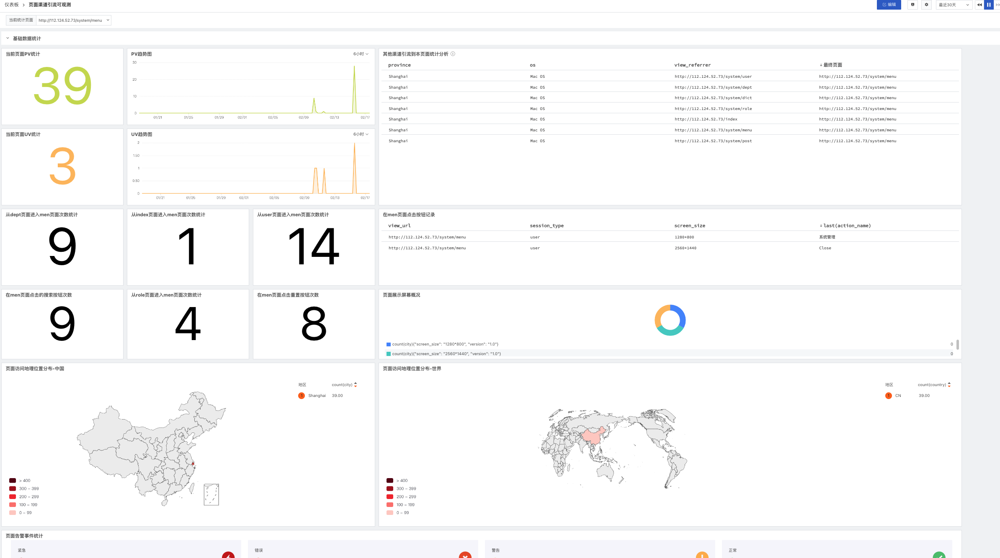
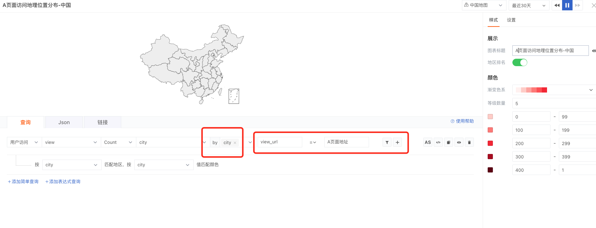

# 页面渠道引流可观测最佳实践

---

## 一：背景

对于市场营销来说，掌握多渠道活动落地页、注册页的引流情况非常关键。如何记录这个广告页面的上一个页面是什么？并且访问到这个页面的次数？如何记录某一个页面的按钮点击次数？

## 二：{{{ custom_key.brand_name }}}解决方案

### 1：如何统计页面来源分析

【View 属性】

| **字段** | **类型** | **描述** |
| --- | --- | --- |
| view_id | string | 每次访问页面时产生的唯一ID |
| is_active | boolean | 判断用户是否还在活跃状态，参考值: true &#124; false |
| view_loading_type | string | 页面加载类型， 参考值：initial_load &#124; route_change route_change为SPA页面加载模式 |
| view_referrer | string | 页面来源 |
| view_url | string | 页面URL |
| view_host | string | 页面URL域名部分 |
| view_path | string | 页面URL path部分 |
| view_path_group | string | 页面URL path分组 |
| view_url_query | string | 页面URL query部分 |

**由上图可看到，用户访问监测中，其实指标“view_referrer”页面来源已经被采集上来了，我们可以利用这一点进行页面分析**

### 2：如何统计页面按钮点击次数

【Action属性】

| **字段** | **类型** | **描述** |
| --- | --- | --- |
| action_id | string | 用户页面操作时产生的唯一ID |
| action_name | string | 操作名称 |
| action_type | string | 操作类型 |

**由上图可看到，用户访问监测中，其实指标“action_name”按钮名称已经被采集上来了，我们可以利用这一点进行按钮点击次数分析**

_**更多指标详见：**_[Web 应用数据采集](/real-user-monitoring/web/app-data-collection/)

## 三：最终效果图

## 四：实现步骤

### 1：集成rum，可根据自己真实情况接入

网站接入参考：[web-rum接入](/real-user-monitoring/web/app-access/)

APP接入参考：[iOS-rum接入](/real-user-monitoring/ios/app-access/) / [Android-rum接入](/real-user-monitoring/android/app-access/)

小程序接入参考：[小程序-rum接入](/real-user-monitoring/miniapp/app-access/)

### 2：场景中新建仪表板

####       a:新建图表，命名为从A页面到B页面的引流次数统计（这里B为活动页）

看图明意：记录从6中所填地址跳转到5中地址的次数

1：在列表中，选择“用户访问

2：在列表中，选择“view”

3：在列表中，选择“count”，此次记录为统计次数，所有要用count

4：在列表中，选择“view_referrer”，意思为统计页面来源

5：为判断条件之一，view_url 设置为B页面的地址，也就是被监测的活动页面访问地址

6：为判断条件之二，view_referrer  设置为A页面的地址，也就是来源地址。

_**备注：如果有多个页面如，C->B,等，只需要把****view_referrer页面地址换成C的地址即可，以此类推。**_

#### b:新建图表，命名为从A页面中按钮次数统计

看图明意：记录从A页面中按钮点击的次数

1：在列表中，选择“用户访问

2：在列表中，选择“action”

3：在列表中，选择“count”，此次记录为统计次数，所有要用count

4：在列表中，选择“action_name”，按钮名称

5：为判断条件之一，view_url 设置为A页面的地址，要监测这个页面的按钮

6：为判断条件之二，action_name  设置为在页面上显示的名称，如：管理、重置、+新增

_**备注：如果有多个按钮需要统计****，以此类推。**_

#### c:新建地图，A页面访问地理位置分布-中国

这里条件为A页面地址

_**备注：世界地图****和中国地图类似。**_
## 总结
接入web监测后，{{{ custom_key.brand_name }}}会把非常多的指标采集进来，我们可以通过这些指标完成监测，用最小工作量记录其来源（从哪个页面或者哪个按钮点击），用于做统计分析。
