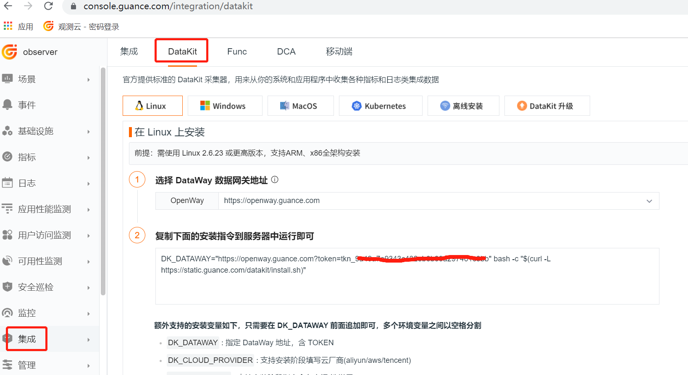
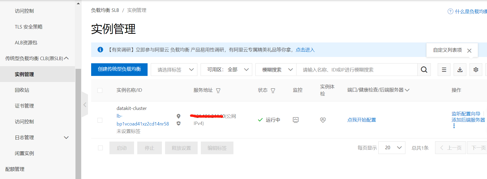
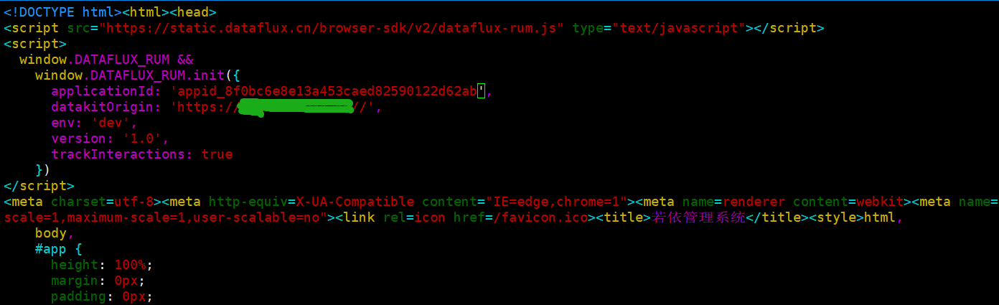
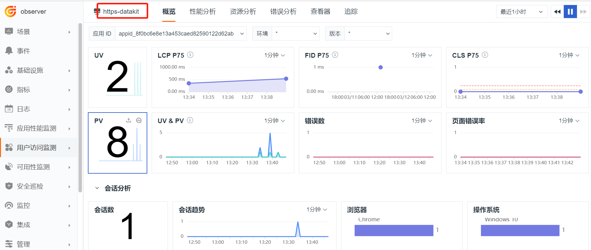

# RUM 数据上报 DataKit 集群最佳实践

---

## 简介

使用<<< custom_key.brand_name >>>进行真实用户访问监测（RUM）的时候，如果网站的访问量比较大，收集用户数据的 DataKit 性能消耗就会比较大，这时就需要使用 DataKit 集群来收集 RUM 数据，提升数据上报的性能。由于网站使用的是 HTTPS 协议，下面我们使用阿里云的负载均衡 SLB 来部署 HTTPS 协议的 DataKit 集群来上报数据。

## 1 部署 DataKit

### 1.1 Linux 部署 DataKit

登录『[<<< custom_key.brand_name >>>](https://console.guance.com/)』，点击『集成』模块，再点击左上角『DataKit』，选择『Linux』，复制下面的命令在 Linux 服务器上执行安装命令。



编辑 datakit.conf 文件，把 listen 的值修改成 "0.0.0.0:9529" ，开启远程访问功能

```
vi /usr/local/datakit/conf.d/datakit.conf
```


 
重启 DataKit 

```
systemctl restart datakit
```

### 1.2 Kubernetes 部署 DataKit

登录『[<<< custom_key.brand_name >>>](https://console.guance.com/)』，点击『集成』模块，再点击左上角『DataKit』，选择『Kubernetes』 ，请按照指引安装 DataKit 。

## 2 配置 SLB

### 2.1 创建 SLB

登录『[阿里云](https://ecs.console.aliyun.com/)』，进入『负载均衡 SLB』，新建传统型负载均衡 CLB，实例名 “datakit-cluster”。



### 2.2 创建 虚拟服务器组

进入刚创建的负载均衡，点击『创建虚拟服务器组』。


## 3 开通 RUM

登录『[<<< custom_key.brand_name >>>](https://console.guance.com/)』，点击『用户访问监测』模块，再点击『新建应用』https-datakit。


复制上述 JS，粘贴到网站的公共的 index.html 文件的 head 中，即确保每个界面都能加载这段 js，修改 datakitOrigin 为 SLB 配置证书时绑定的域名。



参数说明

- applicationId：应用 Id。

- datakitOrigin：DataKit 地址或域名。

- env：应用所属环境，必填。

- version：应用所属版本，必填。

- allowedTracingOrigins：RUM 与 APM 打通，配置后端服务器地址或域名。

   
## 4 用户访问监测

使用浏览器访问网站。然后登录『[<<< custom_key.brand_name >>>](https://console.guance.com/)』，点击『用户访问监测』模块，再点击 https-datakit 应用查看上报的数据。




     


