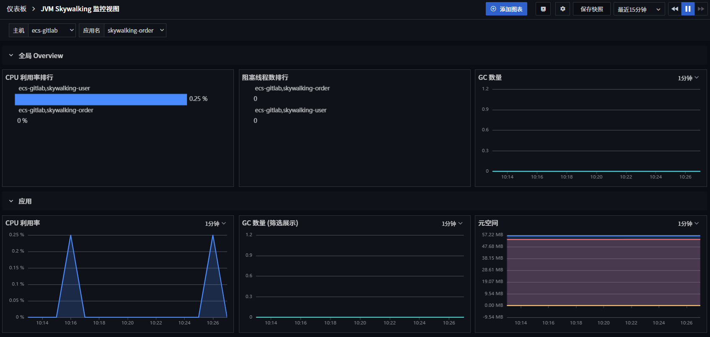

# SkyWalking 采集 JVM 可观测最佳实践

---

## 简介

JVM 是一种用于计算设备的规范，它是一个虚构出来的计算机，是 Java Virtual Machine 的简称。Java 是一门抽象程度特别高的语言，提供了自动内存管理等一系列特性，所以就有了 JVM 这个抽象层，JVM 运行在操作系统之上，用来执行 java 字节码，这样 Java 就可以实现跨平台了。

下面简要介绍一下 JVM 内存结构和线程，然后使用 SkyWalking 采集 JVM 指标数据并通过{{{ custom_key.brand_name }}}进行可观测。

### JVM 内存结构

Java 编译器只面向 JVM，生成 JVM 能理解的字节码文件，JVM 中的类加载器加载字节码，加载完成交给 JVM 执行引擎执行。在整个类的加载过程中，JVM 会用一段空间来存储数据和相关信息，这段空间就是我们常说的 JVM 内存。

根据 JVM 规范，JVM 内存共分为：

- 程序计数器<br/>
  用于记录下一条 JVM 指令的执行地址。

- 虚拟机栈<br/>
  每个栈由多个栈帧（Frame）组成，对应着每次方法调用时所占用的内存，用于存储局部变量表、操作数栈、常量池引用等信息。从方法调用到执行完成，对应一个栈帧在 Java 虚拟机栈中入栈和出栈的过程。可通过 -Xss 设置虚拟机栈内存大小。

- 本地方法栈<br/>
  功能和特点类似于虚拟机栈，不同的是，本地方法栈为本地方法服务。

- 方法区<br/>
  方法区是一个 JVM 规范，永久代与元空间都是其中一种实现方式，在 JDK8 之后，原来的永久代数据被分到了堆和元空间中。元空间存储类的元信息，静态变量和字符串常量池等放入堆中。

- 堆<br/>
  堆区由所有线程共享，主要是存放对象实例和数组。可以位于物理上不连续的空间，但是逻辑上要连续。<br />
  堆内存分为年轻代（Young Generation）、老年代（Old Generation）。年轻代又分为 Eden 和 Survivor 区。Survivor 区由 FromSpace 和 ToSpace 组成。Eden 区占大容量，Survivor 两个区占小容量，默认比例是 8:1:1。<br />
  如果在 Java 堆中没有内存完成实例分配，并且堆也无法再扩展时，Java 虚拟机将会抛出 OutOfMemoryError 异常。

- 运行时常量池<br/>
  运行时常量池是方法区的一部分，是一张表，虚拟机指令根据这种表找到要执行的类名、方法名、参数类型等信息。

- 直接内存<br/>
  直接内存并不是虚拟机运行时数据区的一部分，也不是 Java 虚拟机规范中定义的内存区域。不会受到 Java 堆大小的限制，受到本机总内存大小限制。直接内存也用 -XX:MaxDirectMemorySize 指定，直接内存申请空间耗费更高的性能，直接内存 IO 读写的性能要优于普通的堆内存，耗尽内存抛出 OutOfMemoryError 异常。

### Thread

Java 中有两类线程，用户线程(User Thread)和守护线程(Daemon Thread)。

- 用户线程可以理解为系统的工作线程，它会完成应用程序需要完成的业务操作。
- 守护线程是一种特殊的线程，会在后台默默地完成一些系统性的服务，比如垃圾回收线程。

线程在 JVM 中有以下几种状态：

- 新建状态(NEW)，没有开始执行的线程状态。
- 就绪状态(RUNNABLE)，执行中的线程状态。
- 阻塞状态(BLOCKED)，因等待监视器锁而处于等待的状态。
- 等待状态(WAITING)，无限期等待另一个线程执行某一个特定的操作。
- 有时限等待状态(TIMED_WAITING)，有时间限制的等待另一个线程执行某一个特定的操作。
- 终止状态(TERMINATED)，线程处于终止状态。

## 性能指标

| 指标                                                 | 描述                                                                                                                                                  | 数据类型 | 单位    |
| ---------------------------------------------------- | ----------------------------------------------------------------------------------------------------------------------------------------------------- | -------- | ------- |
| <div style="width: 250px">`class_loaded_count`</div> | loaded class count.                                                                                                                                   | int      | count   |
| `class_total_loaded_count`                           | total loaded class count.                                                                                                                             | int      | count   |
| `class_total_unloaded_class_count`                   | total unloaded class count.                                                                                                                           | int      | count   |
| `cpu_usage_percent`                                  | cpu usage percentile                                                                                                                                  | float    | percent |
| `gc_phrase_old/new_count`                            | gc old or new count.                                                                                                                                  | int      | count   |
| `heap/stack_committed`                               | heap or stack committed amount of memory.                                                                                                             | int      | count   |
| `heap/stack_init`                                    | heap or stack initialized amount of memory.                                                                                                           | int      | count   |
| `heap/stack_max`                                     | heap or stack max amount of memory.                                                                                                                   | int      | count   |
| `heap/stack_used`                                    | heap or stack used amount of memory.                                                                                                                  | int      | count   |
| `pool_*_committed`                                   | committed amount of memory in variety of pool<br />(code_cache_usage,newgen_usage,oldgen_usage,<br />survivor_usage,permgen_usage,metaspace_usage).   | int      | count   |
| `pool_*_init`                                        | initialized amount of memory in variety of pool<br />(code_cache_usage,newgen_usage,oldgen_usage,<br />survivor_usage,permgen_usage,metaspace_usage). | int      | count   |
| `pool_*_max`                                         | max amount of memory in variety of pool<br />(code_cache_usage,newgen_usage,oldgen_usage,<br />survivor_usage,permgen_usage,metaspace_usage).         | int      | count   |
| `pool_*_used`                                        | used amount of memory in variety of pool<br />(code_cache_usage,newgen_usage,oldgen_usage,<br />survivor_usage,permgen_usage,metaspace_usage).        | int      | count   |
| `thread_blocked_state_count`                         | blocked state thread count                                                                                                                            | int      | count   |
| `thread_daemon_count`                                | thread daemon count.                                                                                                                                  | int      | count   |
| `thread_live_count`                                  | thread live count.                                                                                                                                    | int      | count   |
| `thread_peak_count`                                  | thread peak count.                                                                                                                                    | int      | count   |
| `thread_runnable_state_count`                        | runnable state thread count.                                                                                                                          | int      | count   |
| `thread_time_waiting_state_count`                    | time waiting state thread count.                                                                                                                      | int      | count   |
| `thread_waiting_state_count`                         | waiting state thread count.                                                                                                                           | int      | count   |

## 前置条件

- 安装 DataKit 1.4.17+

## 操作步骤

### 1 开启采集器

进入安装 DataKit 的主机，复制 sample 文件。

```bash
cd /usr/local/datakit/conf.d/skywalking
cp skywalking.conf.sample skywalking.conf
```

如果部署的 DataKit 与待采集 JVM 的 Jar **不在一个主机上**，需要修改 `skywalking.conf` 的 `address = "localhost:11800"`  中的 `localhost` 为 Jar 所在主机的 IP。

本次使用的 Jar 和 DataKit 在同一个主机上，通过 localhost 即可上报到 JVM 指标，所以不用修改 sample 文件。

### 2 部署应用

下载[skywalking-demo](https://github.com/stevenliu2020/skywalking-demo)项目，用 Idea 打开，点击「package」，即可生成 `skywalking-user-service.jar` 文件。<br/>
下载 [Skywalking ](https://archive.apache.org/dist/skywalking/8.7.0/apache-skywalking-apm-8.7.0.tar.gz)，解压把 agent 目录复制到主机上与 `skywalking-user-service.jar` 存放到相同目录。

执行下面命令，启动应用。

```bash
java  -javaagent:agent/skywalking-agent.jar \
-Dskywalking.agent.service_name=skywalking-user  \
-Dskywalking.collector.backend_service=localhost:11800 \
-jar skywalking-user-service.jar
```

### 3 JVM 可观测

登录「 [{{{ custom_key.brand_name }}}](https://console.guance.com/)」 - 「场景」，输入“JVM”，选择「JVM Skywalking 监控视图」，点击「确定」。

再点击新建的「JVM Skywalking 监控视图」，即可进行观测。




