# 从 0 到 1 利用<<< custom_key.brand_name >>>构建 Springcloud 服务的可观测性

---

## 本项目业务系统简介：

**本案例采用系统为模拟企业内部使用的办公系统，从 0 到 1 利用<<< custom_key.brand_name >>>构建系统的可观测性**  

**本次构建可观测性选择的是单机 jar 包版应用**  

**项目开源地址：[https://gitee.com/y_project/RuoYi-Cloud](https://gitee.com/y_project/RuoYi-Cloud)**  

**项目演示地址：[http://demo.ruoyi.vip/login](http://demo.ruoyi.vip/login)**  

**系统介绍**：

该系统是一套开源的后台管理系统，同时也是一个 Java EE 企业级快速开发平台，基于诸多经典技术组合（Spring Boot、Apache Shiro、MyBatis、Thymeleaf， Bootstrap 等）。  
内置模块诸多如：部门管理、角色用户、菜单及按钮授权、数据权限、系统参数、日志管理、通知公告等，主要目的让开发者注重专注业务，降低技术难度，从而节省人力成本，缩短项目周期，提高软件安全质量。  
该项目可以用于所有的Web应用程序，如网站管理后台，网站会员中心，CMS，CRM，OA等等，同时支持自定义深度定制，企业可以做出更强大的系统，所有前端后台代码封装过后十分精简易上手，出错概率低。  
同时已支持移动客户端访问。


**项目功能模块：**

- 用户管理：用户是系统操作者，该功能主要完成系统用户配置。
- 部门管理：配置系统组织机构（公司、部门、小组），树结构展现支持数据权限。
- 岗位管理：配置系统用户所属担任职务。
- 菜单管理：配置系统菜单，操作权限，按钮权限标识等。
- 角色管理：角色菜单权限分配、设置角色按机构进行数据范围权限划分。
- 字典管理：对系统中经常使用的一些较为固定的数据进行维护。
- 参数管理：对系统动态配置常用参数。
- 通知公告：系统通知公告信息发布维护。
- 操作日志：系统正常操作日志记录和查询；系统异常信息日志记录和查询。
- 登录日志：系统登录日志记录查询包含登录异常。
- 在线用户：当前系统中活跃用户状态监控。
- 定时任务：在线（添加、修改、删除)任务调度包含执行结果日志。
- 代码生成：前后端代码的生成（java、html、xml、sql) 支持 CRUD 下载 。
- 系统接口：根据业务代码自动生成相关的api接口文档。
- 服务监控：监视当前系统 CPU、内存、磁盘、堆栈等相关信息。
- 缓存监控：对系统的缓存查询，查看、清理等操作。
- 在线构建器：拖动表单元素生成相应的 HTML 代码。


**办公系统中涉及的技术栈：**

| 技术                | 版本              | 需开启<<< custom_key.brand_name >>>可观测性inputs                 |
| ------------------- | ----------------- | ------------------------------------------ |
| SpringBoot          | 2.3.7.RELEASE     | ddtrace                                    |
| SpringCloud         | Hoxton.SR9        | ddtrace                                    |
| SpringCloud Alibaba | 2.2.5.RELEASE     | ddtrace                                    |
| Nginx               | 1.16.1            | nginx                                      |
| Mysql               | 5.7.17            | mysql                                      |
| Redis               | 3.2.12            | redis                                      |
| Vue                 | 2.6.0             | rum                                        |
| Java                | OpenJDK 1.8.0_292 | Statsd或 jolokia<br />（本示例使用statsd） |


**办公系统架构：**

- web 页面：放置在 Nginx 中
- 注册中心：Nacos
- 网关：Gateway
- 服务模块：Auth、System
- 数据库：Mysql
- 缓存：Redis

*备注：此demo将所有服务模块都部署在同一台服务器上，利用不同端口进行服务的访问。*


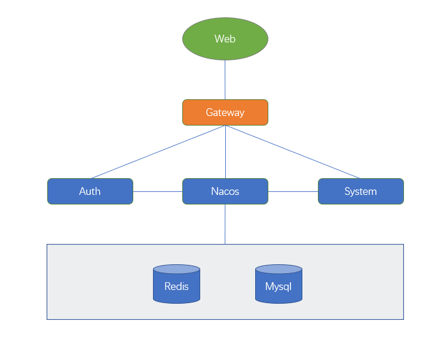	

## <<< custom_key.brand_name >>>简介：

**简介：**[<<< custom_key.brand_name >>>官方简介]

<<< custom_key.brand_name >>>是一款旨在解决云计算，以及云原生时代系统为每一个完整的应用构建**全链路的可观测性**的云服务平台，与传统的监控系统有着本质的区别。

传统的监控系统往往都是单一领域的监控系统，就好比企业内部建立的诸多烟囱，例如 APM、RUM、日志、NPM、zabbix 等都是单一且割裂的监控体系，有应用的、日志的、基础设施的等等，现象就是烟囱林立，而且监控系统的割裂也带来监控数据的割裂，也造成了企业内部的数据孤岛，往往在企业内部进行问题排查时，通常要跨部门，跨平台，耗费大量人力物力进行异常定位。

而**可观测性**的概念是通过一套完整的体系对承载业务系统的IT体系进行可观测性，包含指标、日志、链路追踪三大组件，实现统一数据采集，统一存储，统一查询，统一展现，并且将指标、链路、日志所有的可观测数据关联起来，实现IT体系完整的可观测性。

<<< custom_key.brand_name >>>就是基于这个理念研发出来的可观测性解决方案，致力于提升企业内部IT服务的质量，提升最终用户体验。

**<<< custom_key.brand_name >>>数据流向：**

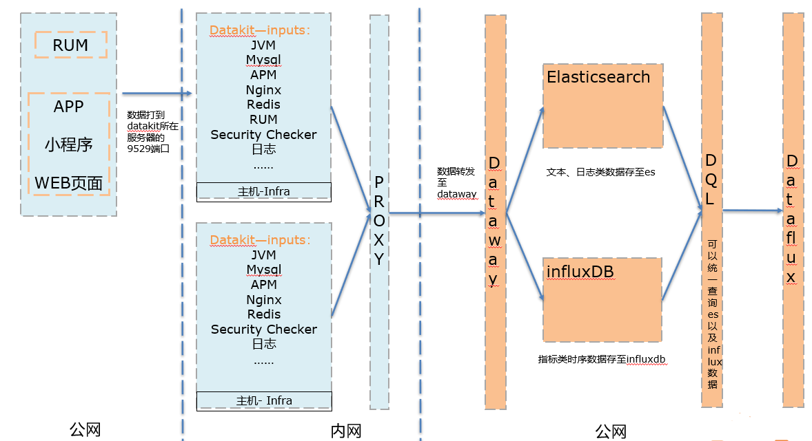

*备注：DQL 为 dataflux专门开发的 QL 语言，用以关联查询 es 以及 influxdb 的数据。*

## 安装 Datakit：

1、 登录 console.guance.com

2、 新建工作空间

3、 选择集成——datakit——选择适合自己环境额安装指令并复制

4、 在服务器上安装 datakit

5、 执行 service datakit status （或者 systemctl status datakit）查询 datakit 状态
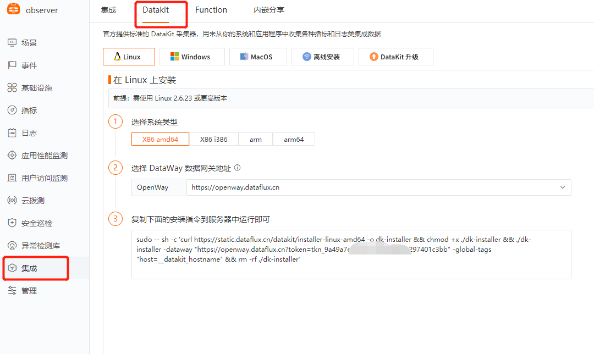

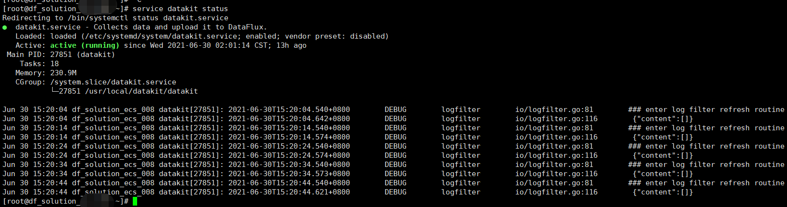

**Datakit 安装好后，默认会对如下内容进行采集，可直接在 Dataflux——基础设施——主机查看相关数据**

**选择不同的集成 inputs 名称，就可以查看对应的监控视图，监控视图下方还可以查看其它数据，例如日志、进程、容器等信息。**

| 采集器名称   | 说明                                                 |
| ------------ | ---------------------------------------------------- |
| cpu          | 采集主机的 CPU 使用情况                              |
| disk         | 采集磁盘占用情况                                     |
| diskio       | 采集主机的磁盘 IO 情况                               |
| mem          | 采集主机的内存使用情况                               |
| swap         | 采集 Swap 内存使用情况                               |
| system       | 采集主机操作系统负载                                 |
| net          | 采集主机网络流量情况                                 |
| host_process | 采集主机上常驻<br />（存活 10min 以上）进程列表      |
| hostobject   | 采集主机基础信息<br />（如操作系统信息、硬件信息等） |
| docker       | 采集主机上可能的容器对象以及容器日志                 |


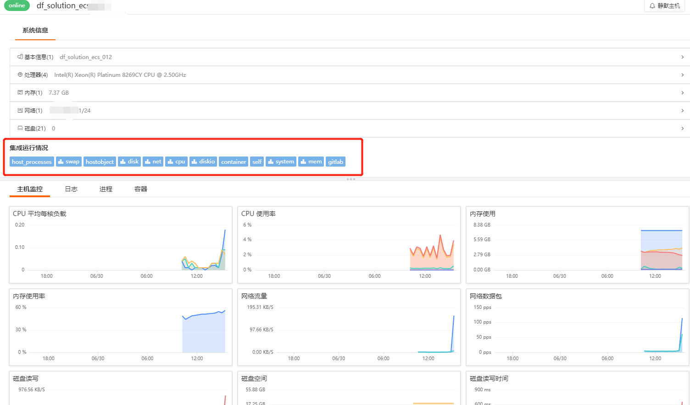

## 开启具体的 inputs：

| 涉及组件 | 需开启inputs | inputs所在目录                     | 相关指标                                   |
| -------- | ------------ | ---------------------------------- | ------------------------------------------ |
| Nginx    | √            | •/usr/local/datakit/conf.d/nginx   | 请求信息，日志，请求耗时等                 |
| Mysql    | √            | •/usr/local/datakit/conf.d/db      | 连接数、QPS、读写情况、慢查询              |
| Redis    | √            | •/usr/local/datakit/conf.d/db      | 连接数、CPU 消耗、内存消耗、命中率、丢失率 |
| JVM      | √            | •/usr/local/datakit/conf.d/statsd  | 堆内存、GC次 数、GC耗时                    |
| APM      | √            | •/usr/local/datakit/conf.d/ddtrace | 响应时间、错误次数、错误率                 |
| RUM      | 默认已开启   | ——                                 | uv/pv、LCP、FID、CLS、js错误               |

**备注：**

| RUM指标说明                   | 说明                                                            | 目标值    |
| ----------------------------- | --------------------------------------------------------------- | --------- |
| LCP(Largest Contentful Paint) | 计算网页可视范围内最大的内容元件需花多少时间载入                | 小于2.5s  |
| FID(First Input Delay)        | 计算用户首次与网页互动时的延迟时间                              | 小于100ms |
| CLS(Cumulative Layout Shift)  | 计算网页载入时的内容是否会因动态加载而页面移动，0表示没有变化。 | 小于0.1   |

### Nginx：

详细步骤参见文档 <[ Nginx 可观测最佳实践](../../best-practices/monitoring/nginx.md)>
<br />前提条件：需先查看 nginx 的 **http_stub_status_module** 模块是否已打开，**如已安装该模块，请直接跳过第1步。**

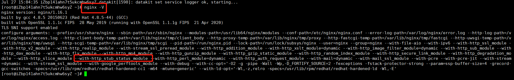

1、 安装 with-http_stub_status_module 模块（linux）：  
开启该模块需要重新编译 nginx，具体命令如下：  
**`./configure --with-http_stub_status_module`**  
configure 文件位置的查询方式：  
**`find /| grep configure |grep nginx`**      

```shell
$ find /| grep configure |grep nginx
  
$ cd /usr/local/src/nginx-1.20.0/
$ ./configure --with-http_stub_status_module
```  

  

2、 在 Nginx.conf 中增添 nginx_status 的 location 转发  

```shell
$ cd /etc/nginx   
   ## nginx 路径根据实际情况而定
$ vim nginx.conf
```

```toml
$  server{
     listen 80;   
     server_name localhost;
     ##端口可自定义
     
      location /nginx_status {
          stub_status  on;
          allow 127.0.0.1;
          deny all;
                             }
                             
          }
```

3、 在 Datakit 中修改 nginx 的 inputs  

```shell
$ cd /usr/local/datakit/conf.d/nginx/
$ cp nginx.conf.sample nginx.conf
$ vim  nginx.conf

```

```toml
#修改如下内容
[[inputs.nginx]]
        url = http://localhost/nginx_status
[inputs.nginx.log]
        files = ["/var/log/nginx/access.log","/var/log/nginx /error.log"]

#保存文件后重启 datakit    
$ service datakit restart
```  

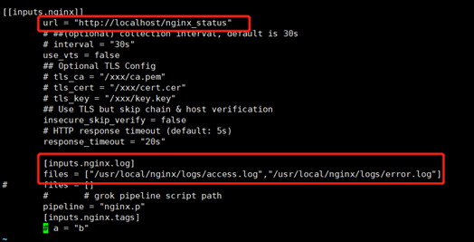  

**验证数据：`curl 127.0.0.1/nginx_status`**  

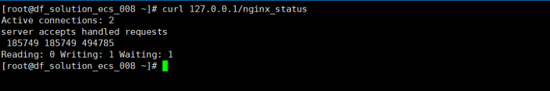

4、 在<<< custom_key.brand_name >>>平台创建 Nginx 视图并查看数据  
**创建步骤参考[**[**创建场景及视图**](#IVN7h)**]**  
**步骤：场景 —> 新建场景 —> 新建空白场景 —> 系统视图（创建 Nginx ）**  
**视图示例（通过该视图即可快速查看 Nginx 相关的指标及日志信息，从而断定 Nginx 的健康状态）:**  

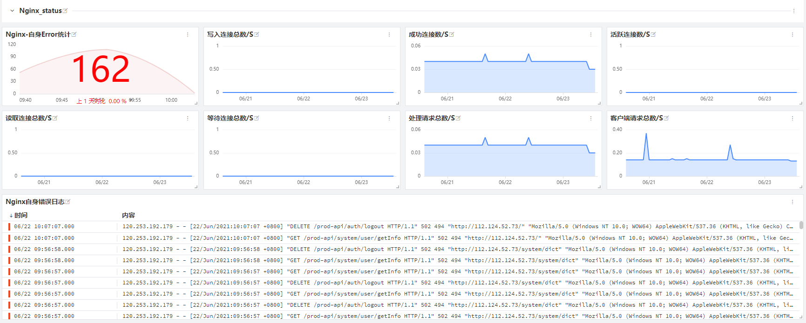


### Mysql：

详细步骤参见文档 <[Mysql DataKit 接入](../../integrations/mysql.md)>

```shell
# 登录 mysql 
$ mysql -uroot -p  
# 输入密码：Solution****

# 创建监控账号
$ CREATE USER 'datakit'@'localhost' IDENTIFIED BY 'Datakit_1234';

# 授权监控账号
$ grant process,select,replication client on *.* to 'datakit'@'%' identified by 'Datakit_1234';

# 刷新授权
flush privileges;
```

##### 1、在 Datakit 中修改 mysql 的 inputs

```shell
$ cd /usr/local/datakit/conf.d/db/
$ cp mysql.conf.sample mysql.conf
$ vim mysql.conf

# 修改如下内容 
## 建议自定义创建一个 mysql 的只读账号
[[inputs.mysql]]
     user ="datakit"
     pass ="Datakit_1234“

#保存文件后重启 datakit    
$ service datakit restart
```


##### 2、在<<< custom_key.brand_name >>>平台创建 Mysql 视图并查看数据

**创建步骤参考[**[**创建场景及视图**](#IVN7h)**]**
**步骤：场景——新建场景——新建空白场景——系统视图（创建 Mysql）**
**视图示例（通过该视图即可快速查看 Mysql 相关的指标及日志信息，从而断定 Mysql 的健康状态）:**

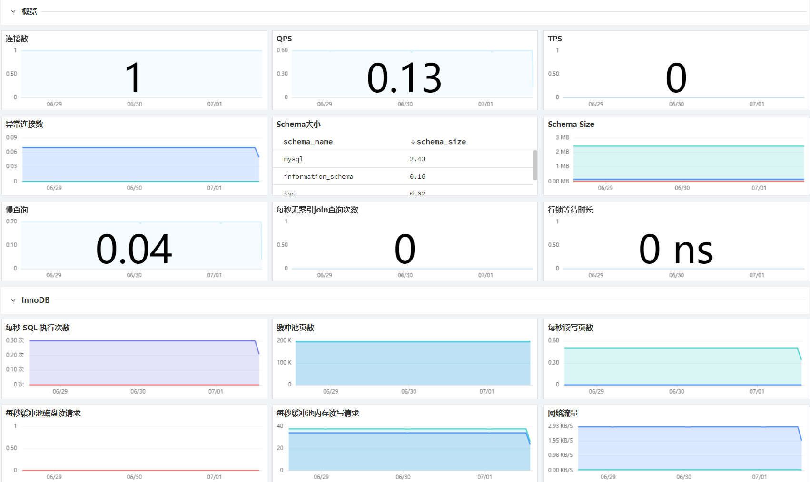

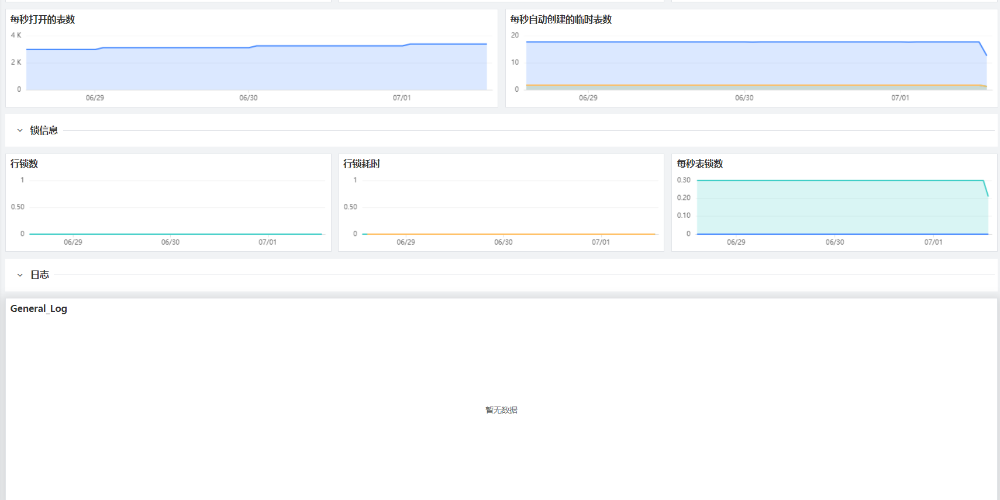

### Redis：

详细步骤参见文档 <[Redis DataKit 接入](../../integrations/redis.md)>

##### 1、在 Datakit 中修改 redis 的 inputs

```shell
$ cd /usr/local/datakit/conf.d/db/
$ cp redis.conf.sample redis.conf
$ vim redis.conf

#修改如下内容
## 建议自定义创建一个 redis 的只读账号
[[inputs.redis]]
     pass ="Solution******“
#注意放开 pass 之前的注释符号 #
[inputs.redis.log]
    files = ["/var/log/redis/redis.log"]

#保存文件后重启 datakit    
$ service datakit restart
```

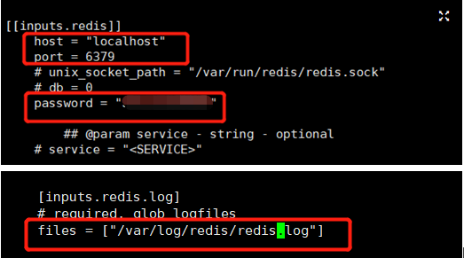

##### 2、在<<< custom_key.brand_name >>>平台创建 Redis 视图并查看数据

**创建步骤参考[**[**创建场景及视图**](#IVN7h)**]**
**步骤：场景——新建场景——新建空白场景——系统视图（创建 Redis）**
**视图示例（通过该视图即可快速查看 Redis 相关的指标及日志信息，从而断定 Redis 的健康状态）:**


### JVM：

详细步骤参见文档 <[jvm DataKit 接入](../../integrations/jvm.md)>

##### 1、在 Datakit 中修改 jvm 的 inputs

**默认不需要修改 jvm 的 inputs，仅需复制生成 conf 文件即可**

```shell
$ cd /usr/local/datakit/conf.d/statsd/
$ cp statsd.conf.sample ddtrace-jvm-statsd.conf 
$ vim ddtrace-jvm-statsd.conf

# 默认不需要修改
```

##### 2、修改 java 应用启动脚本

**### 因 JVM 跟 APM 都是借由 ddtrace-agent 实现数据采集，应用启动脚本参见 APM 相关内容 [APM] ###**

##### 3、在<<< custom_key.brand_name >>>平台创建 JVM 视图并查看数据

**创建步骤参考[**[**创建场景及视图**](#IVN7h)**]**
**步骤：场景——新建场景——新建空白场景——系统视图（创建 JVM）**
**视图示例（通过该视图即可快速查看 JVM 相关的指标及日志信息，从而断定 JVM 的健康状态）:**


### APM（application performance monitoring）：

详细步骤参见文档 [分布式链路追踪(APM)最佳实践](../../best-practices/monitoring/apm.md)  
**<<< custom_key.brand_name >>>支持的 APM 接入方式包含 ddtrace、skywalking、zipkin、jaejer 等多种支持 opentracing 协议的 APM工具，此处示例采用 ddtrace 实现 APM 方面的可观测性。**

##### 1、在 Datakit 中修改 APM（ddtrace）的 inputs

  **默认不需要修改 jvm 的 inputs，仅需复制生成 conf 文件即可**

```shell
$ cd /usr/local/datakit/conf.d/ddtrace/
$ cp ddtrace.conf.sample ddtrace.conf
$ vim ddtrace.conf

# 默认不需要修改
```

##### 2、修改 java 应用启动脚本

APM 可观测性，需要在 java 应用中添加一个 agent，该 agent 在伴随应用启动时，会通过字节码注入的技术实现对应用内部方法层层调用、sql 调用、外部系统调用等相关性能数据的采集，从而实现对应用系统代码质量的可观测性。

```shell
#原应用启动脚本
$ cd /usr/local/ruoyi/
$ nohup java -Dfile.encoding=utf-8   -jar ruoyi-gateway.jar > logs/gateway.log  2>&1 & 
$ nohup java -Dfile.encoding=utf-8   -jar ruoyi-auth.jar > logs/auth.log  2>&1 & 
$ nohup java -Dfile.encoding=utf-8   -jar ruoyi-modules-system.jar > logs/system.log  2>&1 &
```

需 kill 掉原有应用启动进程，添加 ddtrace 参数后，重启应用，具体查杀方法见下图：


```shell
#添加 ddtrace-agent 后的应用启动脚本

$ cd /usr/local/ruoyi/

$ nohup java -Dfile.encoding=utf-8 -javaagent:dd-java-agent-0.80.0.jar -XX:FlightRecorderOptions=stackdepth=256 -Ddd.logs.injection=true -Ddd.service.name=ruoyi-gateway -Ddd.service.mapping=redis:redis_ruoyi -Ddd.agent.port=9529 -Ddd.jmxfetch.enabled=true -Ddd.jmxfetch.check-period=1000  -Ddd.jmxfetch.statsd.port=8125 -Ddd.version=1.0 -jar ruoyi-gateway.jar > logs/gateway.log  2>&1 &

$ nohup java -Dfile.encoding=utf-8 -javaagent:dd-java-agent-0.80.0.jar  -XX:FlightRecorderOptions=stackdepth=256 -Ddd.logs.injection=true -Ddd.service.name=ruoyi-auth -Ddd.service.mapping=redis:redis_ruoyi -Ddd.env=staging -Ddd.agent.port=9529 -Ddd.jmxfetch.enabled=true -Ddd.jmxfetch.check-period=1000 -Ddd.jmxfetch.statsd.port=8125 -Ddd.version=1.0 -jar ruoyi-auth.jar > logs/auth.log  2>&1 & 

$ nohup java -Dfile.encoding=utf-8 -javaagent:dd-java-agent-0.80.0.jar -XX:FlightRecorderOptions=stackdepth=256 -Ddd.logs.injection=true -Ddd.service.name=ruoyi-modules-system -Ddd.service.mapping=redis:redis_ruoyi,mysql:mysql_ruoyi -Ddd.env=dev -Ddd.agent.port=9529 -Ddd.jmxfetch.enabled=true -Ddd.jmxfetch.check-period=1000 -Ddd.jmxfetch.statsd.port=8125 -Ddd.version=1.0 -jar ruoyi-modules-system.jar > logs/system.log  2>&1 & 
```

**！若果在<<< custom_key.brand_name >>>平台未看到 APM 相关数据，请查看 datakit 日志**
**cat /var/log/datakit/gin.log**  
正常日志：

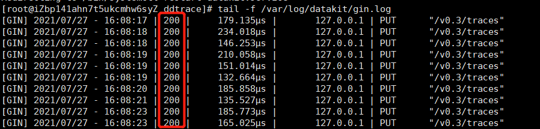

错误日志：

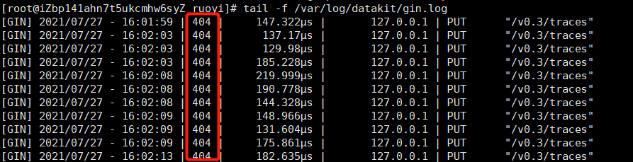

**此种错误需修改** /usr/local/datakit/con.d/ddtrace/ddtrace.conf 修改成如下图片  
**需保证 ddtrace.conf 配置中的 path 路径与 datakit/gin.log 日志中的路径保持一致**

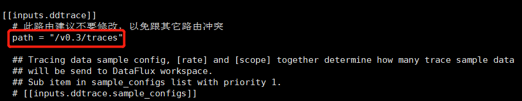

**ddtrace 相关环境变量（启动参数）释义：**

- Ddd.env：自定义环境类型，可选项。
- Ddd.tags：自定义应用标签 ，可选项。
- Ddd.service.name: 自定义应用名称 ，必填项。
- Ddd.agent.port：数据上传端口（默认9529 ），必填项。
- Ddd.version:应用版本，可选项。
- Ddd.trace.sample.rate：设置采样率（默认是全采），可选项，如需采样，可设置 0~1 之间的数，例如 0.6，即采样 60%。
- Ddd.service.mapping：当前应用调用到的 redis、mysql 等，可通过此参数添加别名，用以和其他应用调用到的 redis、mysql 进行区分，可选项，应用场景：例如项目 A 项目 B 都调用了 mysql，且分别调用的 mysql-a，mysql-b，如没有添加 mapping 配置项，在<<< custom_key.brand_name >>>平台上会展现项目 A 项目 B 调用了同一个名为 mysql 的数据库，如果添加了 mapping 配置项，配置为 mysql-a，mysql-b，则在<<< custom_key.brand_name >>>平台上会展现项目A调用 mysql-a，项目 B 调用 mysql-b。
- Ddd.agent.host：数据传输目标 IP，默认为本机 localhost，可选项。

##### 3、在<<< custom_key.brand_name >>>平台查看 APM 数据

**APM（应用性能检测）是<<< custom_key.brand_name >>>默认内置的模块，无需创建场景或视图即可进行查看。**  
**路径：<<< custom_key.brand_name >>>平台——应用性能检测**  
**视图示例:（通过该视图即可快速查看应用调用情况、拓扑图、异常数据等其他 APM 相关数据）**

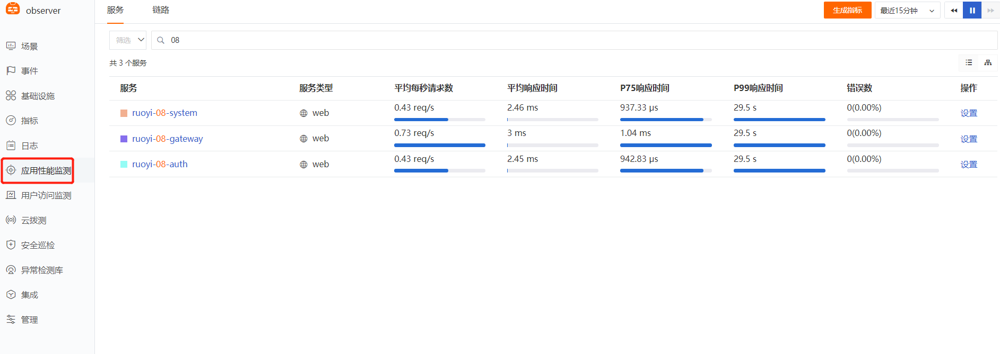

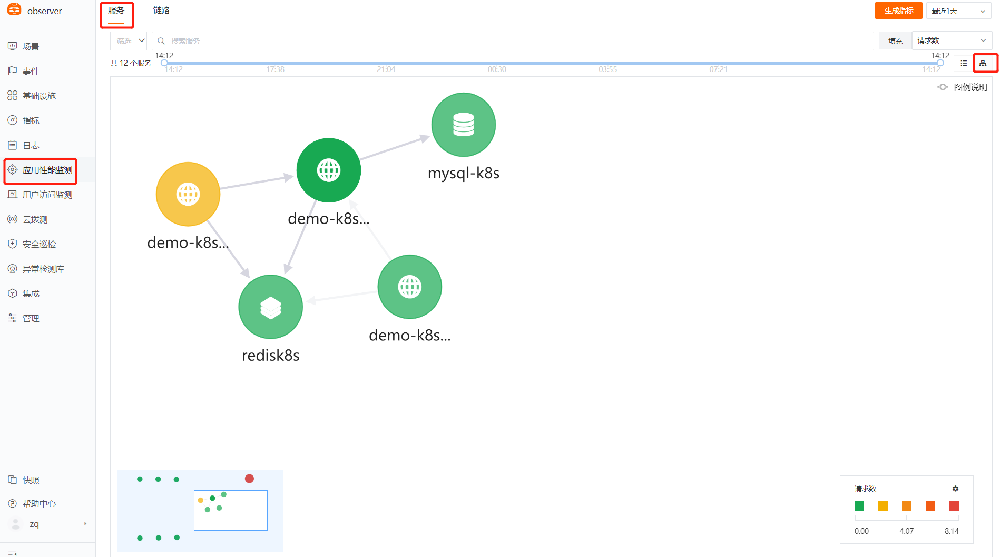

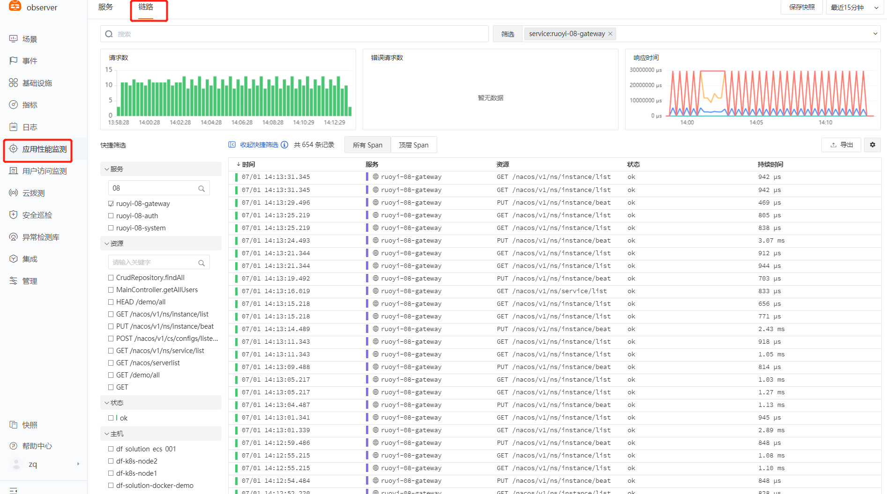

### RUM（real user moitoring）：

详细步骤参见文档[[用户访问（RUM）可观测性最佳实践](web.md)]

##### 1、登录 Dataflux 平台

##### 2、选择用户访问监测——新建应用——选择 web 类型——同步载入


##### 3、在前端页面 index.html 中接入<<< custom_key.brand_name >>> rum 可观测性 js 文件

```shell
$ cd /usr/local/ruoyi/dist/

// 记得备份
$ cp index.html index.html.bkd

// 在 index.html 中添加 df-js
// 复制 DF 平台上的 js 内容，放至 index.html 内的 </head> 之前，然后保存文件,示例如下

$ vim index.html
```

```javascript
<script src="https://static.<<< custom_key.brand_main_domain >>>/browser-sdk/v2/dataflux-rum.js" type="text/javascript"></script>
<script>
  window.DATAFLUX_RUM &&
    window.DATAFLUX_RUM.init({
      applicationId: 'xxxxxxxxxxxxxxxxxxxxxxxxxx',
      datakitOrigin: 'xxx.xxx.xxx.xxx:9529',
      env: 'test',
      version: '1.0.0',
      trackInteractions: true,
      allowedTracingOrigins:["xxx.xxx.xxx.xxx"]
      })
</script></head> 

# xxx 均需要根据实际情况进行更改，详细更改内容请参考如下：
```

> **datakitOrigin**：datakit 地址（datakit 所在服务器的 ip 或域名），<<< custom_key.brand_name >>>中 rum 数据流向为：rum.js 文件——>datakit——>dataway——><<< custom_key.brand_name >>>平台，如若是生产环境，需将该 IP 设置为域名或 slb 地址，测试环境需填写内网IP，对应 datakit 的服务器 9529 端口
>    
> **trackInteractions**：用户行为采集配置项，可实现页面端用户操作行为统计
> 
> **allowedTracingOrigins**：前后端（rum 与 apm）打通的配置项，可按需进行设置，需在此处填写与前端页面有交互关系的后端服务器所对应的域名或IP。


**注意事项：**

- **datakitOrigin**：数据传输地址，生产环境如若配置的是域名，可将域名请求转发至具体任意一台安装有datakit-9529 端口的服务器，如若前端访问量过大，可在域名与 datakit 所在服务器中间加一层 slb，前端 js 将数据发送 至slb，slb 也需要开放 **9529** 端口，slb 将请求转发至多台安装 datakit-**9529** 所在的服务器。多台datakit 承接 rum 数据，因前端请求复用因素，session 数据不会中断，对 rum 数据展现也无影响。

举例：


- **allowedTracingOrigins**：实现前后端（APM 与 RUM）打通，该场景只有在前端部署 RUM，后端部署APM 的情况才会生效，需在此处填写与前端页面有交互关系的后端应用服务器所对应的域名（生产环境）或 IP（测试环境）。**应用场景**：前端用户访问出现慢，是由后端代码逻辑异常导致，可通过前端 RUM 慢请求数据直接跳转至 APM 数据查看当次后端代码调用情况，判定慢的根因。**实现原理**：用户访问前端应用，前端应用进行资源及请求调用，触发 rum-js 性能数据采集，rum-js 会生成 trace-id 写在请求的 request_header 里，请求到达后端，后端的 ddtrace 会读取到该 trace_id 并记录在自己的 trace 数据里，从而实现通过相同的 trace_id 来实现应用性能监测和用户访问监测数据联动
- **env**：必填，应用所属环境，是 test 或 product 或其他字段。
- **version**：必填，应用所属版本号。
- **trackInteractions**：用户行为统计，例如点击按钮，提交信息等动作。


##### 4、保存、验证并发布页面

打开浏览器访问目标页面，通过f12检查者模式查看页面网络请求中是否有 rum 相关的请求，状态码是否是 200。


**注意！！**：如若f12检查者模式发现数据无法上报，显示端口 refused，可 telnet IP:9529 验证端口是否通畅，不通的话，需要修改 /usr/local/datakit/conf.d/datakit.conf 修改 http_listen 的 localhost 为 0.0.0.0。


##### 5、在用户访问监测查看 rum 相关数据


##### 6、RUM 跟 APM 打通数据演示

配置方式：[[java示例](web.md#fpjkl)]

应用场景：前后端关联，前端请求与后端方法执行性能数据进行一对一绑定，从而更方便定位前后端关联的问题，例如前端用户访问缓慢，是因为后端服务调用异常导致的，可以迅速跨团队跨部门进行问题定位，示例如下：

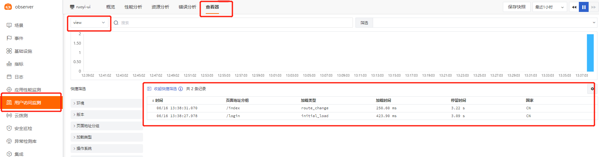


### Security Checker（安全巡检）：

**Security Checker简介**：[**[**<<< custom_key.brand_name >>>官方简介**](/scheck)**]

注意：目前仅支持 **linux**
详细步骤参见文档 [[Security Checker 安装和配置](/scheck/scheck-install/)]

##### 1、安装 Security Checker

```shell
##  安装
$ bash -c "$(curl https://static.<<< custom_key.brand_main_domain >>>/security-checker/install.sh)"
## 或者执行   sudo datakit --install scheck
## 更新
$ bash -c "$(curl https://static.<<< custom_key.brand_main_domain >>>/security-checker/install.sh) --upgrade"
## 启停命令
$ systemctl start/stop/restart/status scheck
## 或者
$ service scheck start/stop/restart/status
## 安装目录  /usr/local/scheck
```

##### 2、Security Checker 连接 Datakit

将 Security Checker 数据打至 datakit，然后再转发至 dataflux 平台。

```shell
$ cd /usr/local/scheck/
$ vim scheck.conf
 
 
    # ##(required) directory contains script
    rule_dir='/usr/local/scheck/rules.d'

    # ##(required) output of the check result, support local file or remote http server
    # ##localfile: file:///your/file/path
    # ##remote:  http(s)://your.url
    output='http://127.0.0.1:9529/v1/write/security'


    # ##(optional)global cron, default is every 10 seconds
    #cron='*/10 * * * *'

    log='/usr/local/scheck/log'
    log_level='info'
    #disable_log=false

```

##### 3、查看 Security Checker 相关数据

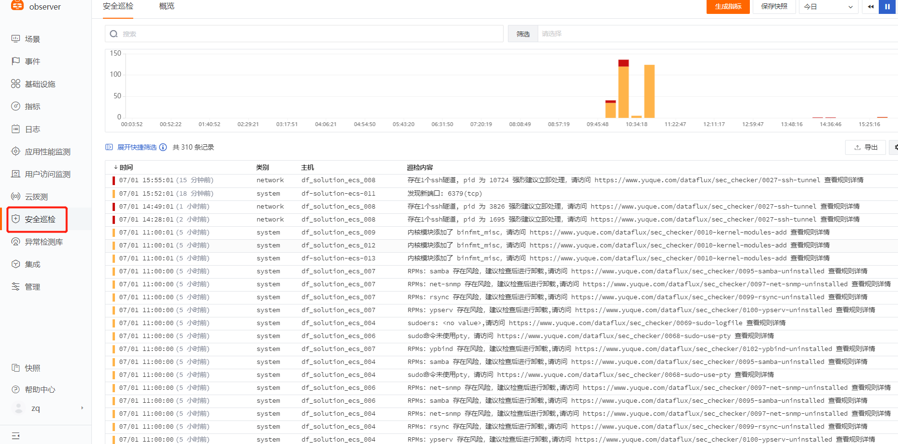

### 日志：

详细步骤参见文档 [日志采集](../../integrations/logging.md)

##### 1、标准日志采集（Nginx、Mysql、Redis 等）

通过开启 DataKit 内置的各种 inputs，直接开启相关的日志采集，例如 [Ngnix](../../integrations/nginx.md)、[Redis](../../integrations/datastorage/redis.md)、[容器](../../integrations/container/index.md)、[ES](../../integrations/datastorage/elasticsearch.md) 等；

**示例：Nginx**

```toml
$ cd /usr/local/datakit/conf.d/nginx/
$ cp nginx.conf.sample nginx.conf
$ vim nginx.conf

## 修改 log 路径为正确的 nginx 路径
$ [inputs.nginx.log]
$     files = ["/usr/local/nginx/logs/access.log","/usr/local/nginx/logs/error.log"]
$     pipeline = "nginx.p"

## pipeline 即为 grok 语句，主要用来进行文本日志切割，datakit 已内置多种 pipeline，包括nginx、mysql 等，pipelin e默认目录为 /usr/local/datakit/pipeline/ ，此处无需修改 pipeline 路径，datakit 默认会自动读取。
```


**视图展示：**

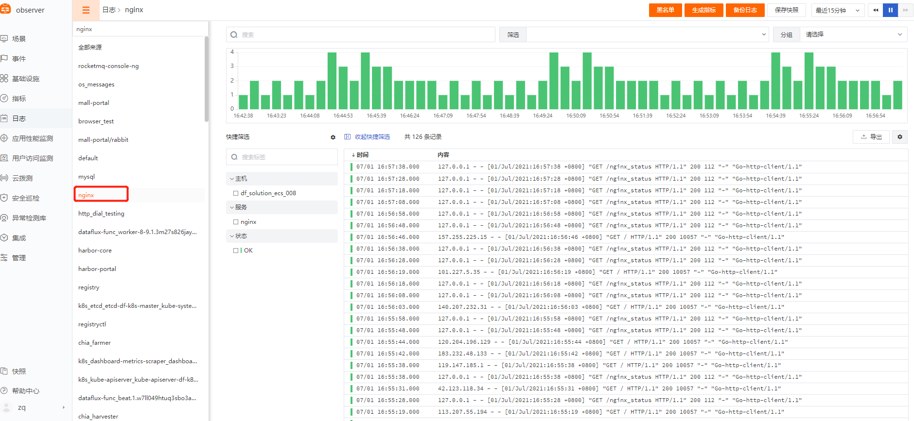


##### 2、自定义日志采集（应用日志、业务日志等）

**示例：应用日志**

pipeline（日志grok切割）[**[**<<< custom_key.brand_name >>>官方文档**](/datakit/pipeline/)**]

```shell
$ cd /usr/local/datakit/conf.d/log/
$ cp logging.conf.sample logging.conf
$ vim logging.conf

## 修改 log 路径为正确的应用日志的路径

## source 与 service 为必填字段，可以直接用应用名称，用以区分不同的日志名称

$  [inputs.nginx.log]
$    logfiles = [
      "/usr/local/ruoyi/logs/ruoyi-system/error.log",
      "/usr/local/ruoyi/logs/ruoyi-system/info.log",]
$    source = "ruoyi-system"
$    service = "ruoyi-system"
#    pipeline = "ruoyi-system.p"

## pipeline 即为 grok 语句，主要用来进行文本日志切割，如果该配置不放开，默认 df 平台上展示日志原始文本内容，如若填写，会对对应日志进行 grok 切割，此处填写的 .p 文件 需要自己手动编写
```

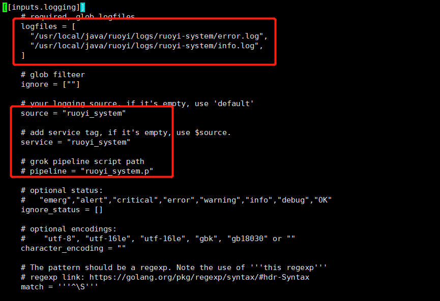

```shell
$ cd /usr/local/datakit/pipeline/
$ vim ruoyi_system.p

##示例：
#日志样式 
#2021-06-25 14:27:51.952 [http-nio-9201-exec-7] INFO  c.r.s.c.SysUserController - [list,70] ruoyi-08-system 5430221015886118174 6503455222153372731 - 查询用户

##示例 grok，复制如下内容至 ruoyi_system.p 中

grok(_, "%{TIMESTAMP_ISO8601:time} %{NOTSPACE:thread_name} %{LOGLEVEL:level} \\s+%{NOTSPACE:class_name} - \\[%{NOTSPACE:method_name},%{NUMBER:line}\\] %{DATA:service} %{DATA:trace_id} %{DATA:span_id} - %{GREEDYDATA:msg}")

default_time(time)
```

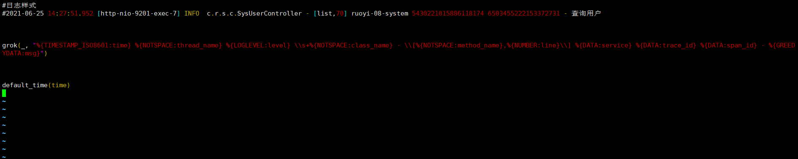

**视图展示：**

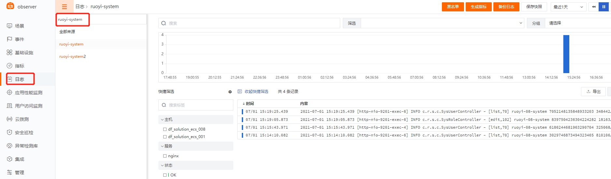


### 创建 Nginx 日志异常检测：

1. 打开<<< custom_key.brand_name >>>平台—>异常检测库—>新建检测库—>自定义监控
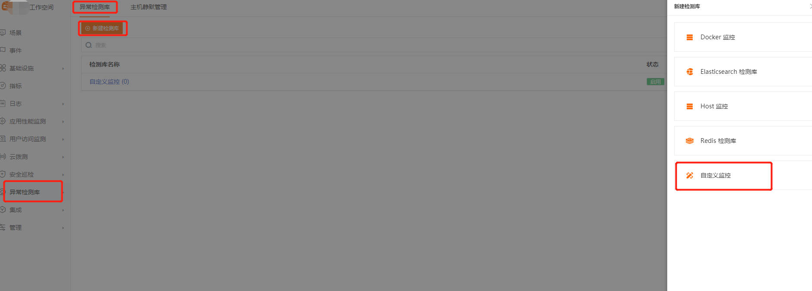

2. 点击新创建的检测库名称—>新建检测规则—>新建日志检测
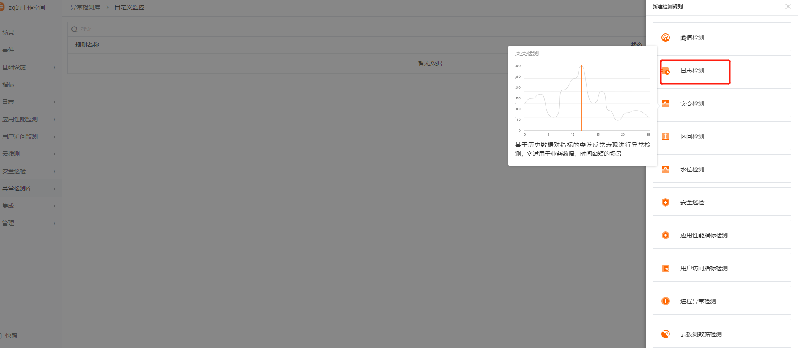

3. 填写具体检测规则内容并保存  
**规则名称**： Nginx 日志 ERROR 次数过多异常检测  
**检测指标**： 见图示  
**触发条件**： Result>=5  
**事件名称**： Nginx 日志 ERROR 次数过多异常告警  
**事件内容**：
> 等级：{{status}}  
> 主机：{{host}}  
> 内容：日志ERROR次数过多，错误数为 {{ Result }}
> 建议：日志ERROR次数过多，应用可能存在异常，建议对应用健康度进行检查。  
> **检测频率**：1分钟

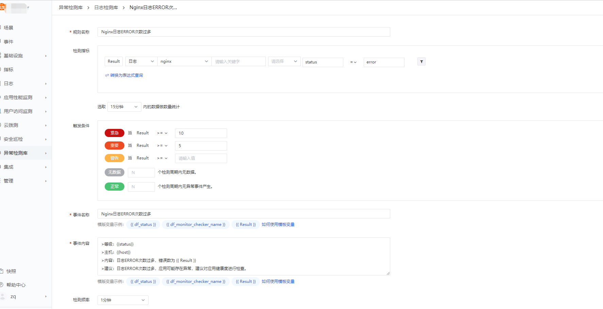

### 验证异常检测机制：

1. 服务器上查询 ruoyi-gateway 相关进程并kill掉
2. 
```shell
$ ps -ef|grep ruoyi-gateway
$ kill -9 xxxxx
```

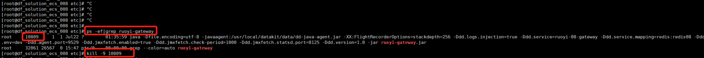

2. 访问 ruoyi 网站（可以多刷新几次，至少5次以上）


3. 查看<<< custom_key.brand_name >>>平台事件相关内容

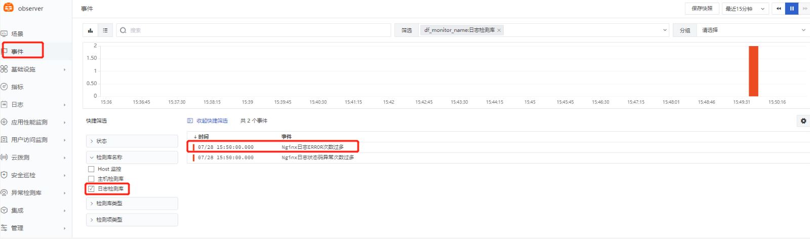

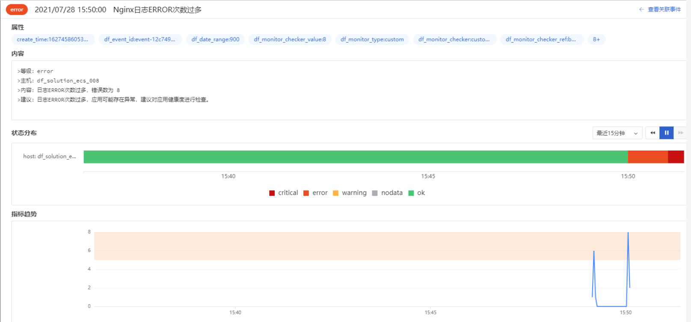

4. 查看 nginx 日志相关内容及相关视图


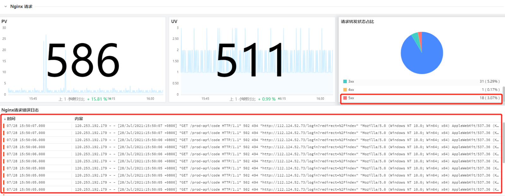

### 开启 inputs 过程中问题排查方式：

1、 查看 inputs 报错信息  
<<< custom_key.brand_name >>>已默认将inputs的状态信息以一定的频率上传至<<< custom_key.brand_name >>>平台，可以直接在基础设施——具体主机内查看集成情况。  
**示例：apache 服务宕机，inputs 显示报错**

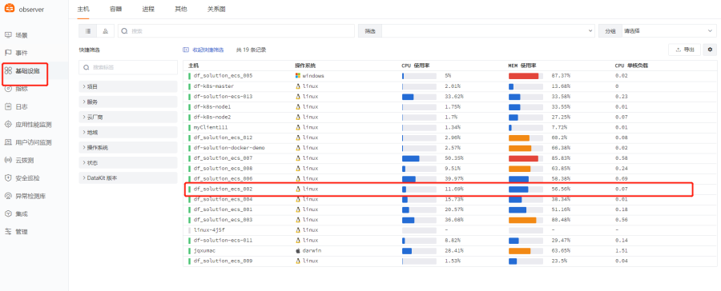
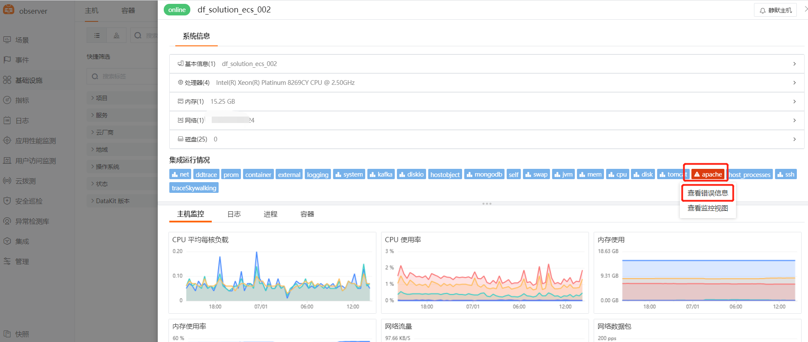
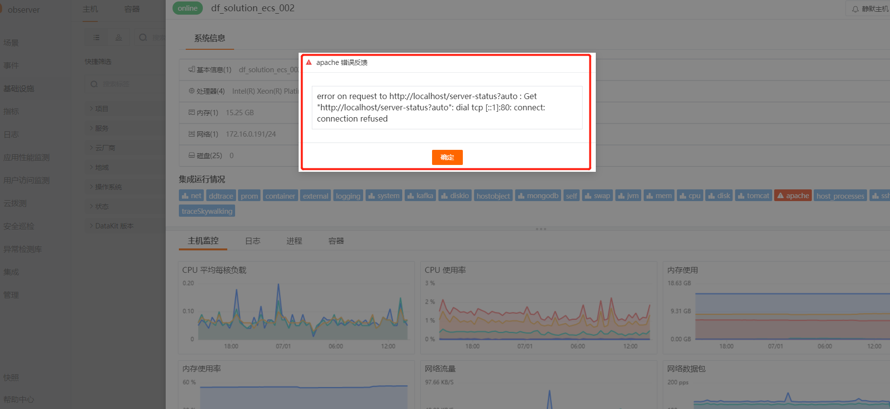

2、 查看数据上报信息  

**方式1：**  
**浏览器或者控制台输入 `curl 127.0.0.1:9529/monitor` 查看**
  
**方式2：**  
**浏览器或者控制台输入 `curl 127.0.0.1:9529/stats` 查看**
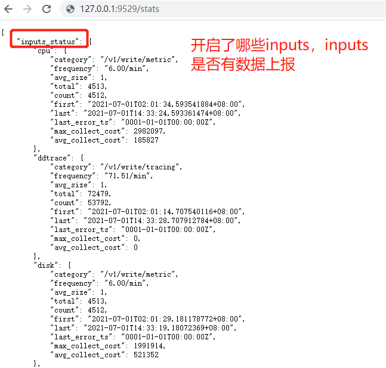

3、 查看 datakit 日志  

**datakit 日志目录：cd /var/log/datakit**


### 创建场景及视图：

#### 利用系统视图模板创建 (以 Nginx 为例) ###

1、 **场景 —— 新建场景**


2、 **新建空白场景**

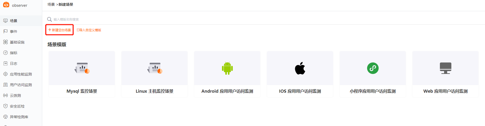

3、 **输入场景名称——确定**

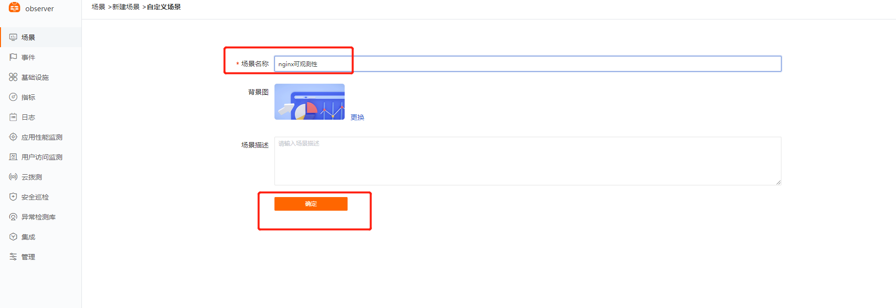

4、 **系统视图 —— Nginx视图（创建）**

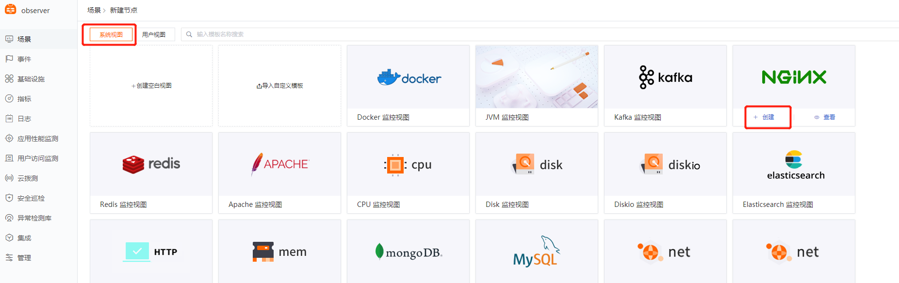

5、 **查看 Nginx 视图**


6、 **其他**

  *其他视图创建方法类似，如有自定义视图内容及布局需求，可以创建空白视图自己进行搭建。*


## 总结：

如此，便对此次 demo 办公系统的链路、指标、日志、基础设施等进行了全方位的可观测性。

<<< custom_key.brand_name >>>整体试用下来配置便捷，管理方便，同时还提供了统一的查看视图，所有的指标，链路，日志都通过同一 tag(host) 实现数据关联，很方便就可在平台上实现级联，从而实现 IT 系统的整体可观测性。

最后再结合异常检测即可实现系统一体化的管理，进而提升运维研发效率，提升 IT 决策能力！

该产品还在不断的完善，未来功能会越来越强大，越来越易用，UI 也会越来越美观。

<<< custom_key.brand_name >>>，要做可观测性的代言人！
