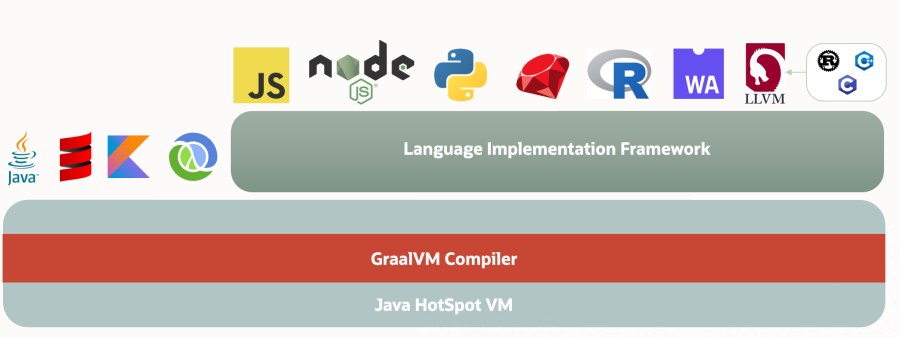
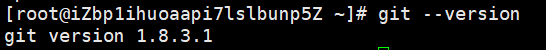
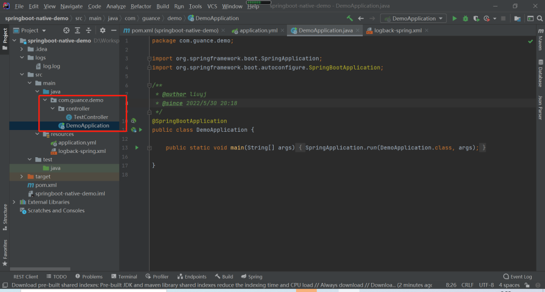
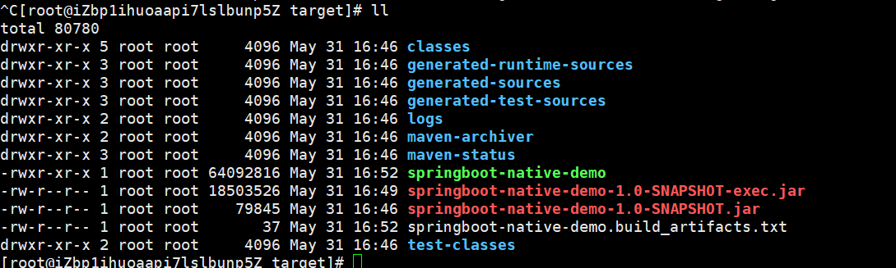
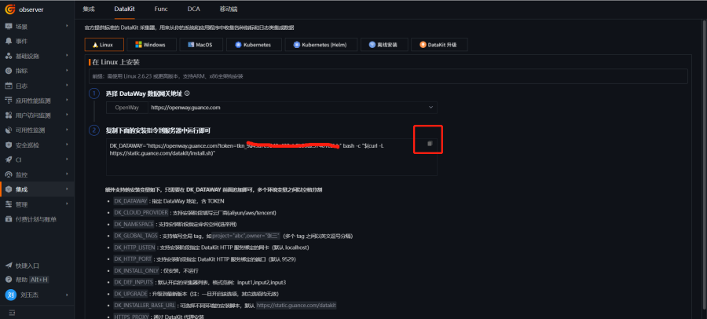
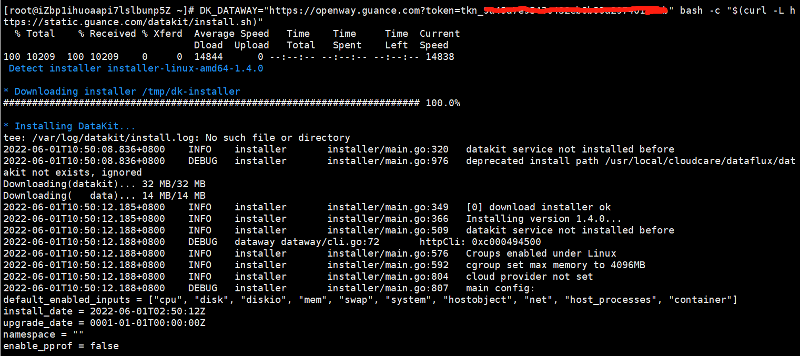
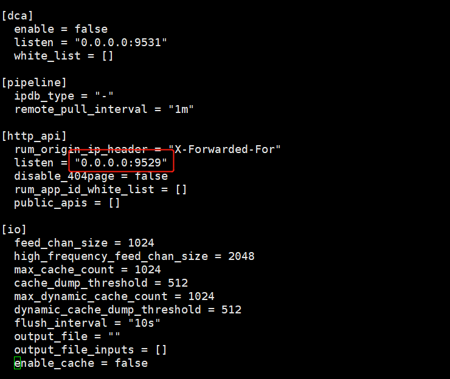
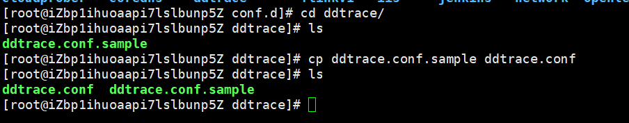
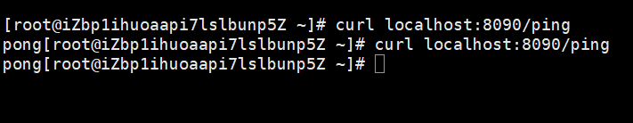
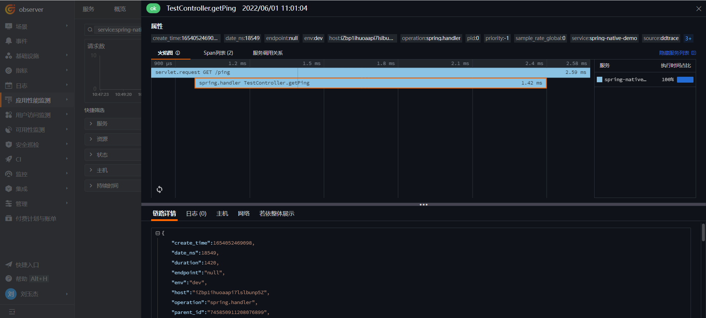

# GraalVM 与 Spring Native 项目实现链路可观测

---

## 简介

GraalVM 是高性能、云原生、多语言的 JDK 发行版，旨在加速用 Java 和其他 JVM 语言编写的应用程序的执行，同时还为 JavaScript、Python 和许多其他流行语言提供运行时。



GraalVM 作为一个运行时环境是独一无二的，它提供了多种操作模式：JVM 运行时模式、Native Image、Truffle 上的 Java（相同的 Java 应用程序可以在任何一种上运行）。

#### JVM 运行时模式

在 HotSpot JVM 上运行程序时，GraalVM 默认使用[GraalVM 编译器](https://www.graalvm.org/22.1/reference-manual/java/compiler/)作为顶级 JIT 编译器。在运行时，应用程序在 JVM 上正常加载和执行。JVM 将 Java 或任何其他 JVM 原生语言的字节码传递给编译器，编译器将其编译为机器代码并将其返回给 JVM。[在 Truffle 框架](https://www.graalvm.org/22.1/graalvm-as-a-platform/language-implementation-framework/)之上编写的受支持语言的解释器本身就是在 JVM 上运行的 Java 程序。

#### Native Image

[Native Image](https://www.graalvm.org/22.1/reference-manual/native-image/)是一项创新技术，可将 Java 代码编译成独立的二进制可执行文件或本机共享库。在本机映像构建期间处理的 Java 字节码包括所有应用程序类、依赖项、第三方依赖库以及所需的任何 JDK 类。生成的自包含本机可执行文件特定于不需要 JVM 的每个单独的操作系统和机器架构。

Spring Native 为使用 GraalVM 原生镜像编译器编译 Spring 应用为本地可执行文件提供支持。本文使用 JVM 运行时模式，使用 ddtrace 实现链路接入<<< custom_key.brand_name >>>。

## 操作步骤

???+ warning

    本次示例所使用的版本信息如下：DataKit `1.4.0`、CentOS `7.9`、云服务器 `4核 8G`、Git `1.8.3.1`、Maven `3.8.5`、OpenJDK `17.0.3`、GraalVM CE `22.1.0`
### 1 部署 Git

```shell
yum install -y git
git --version
```



### 2 部署 GraalVM

```shell
cd /usr/local/df-demo
wget https://github.com/graalvm/graalvm-ce-builds/releases/download/vm-22.1.0/graalvm-ce-java17-linux-amd64-22.1.0.tar.gz
tar -zxvf  graalvm-ce-java17-linux-amd64-22.1.0.tar.gz
```

编辑 `/etc/profile` ，增加下面内容。

```shell
export JAVA_HOME=/usr/local/df-demo/graalvm-ce-java17-22.1.0
export CLASSPATH=$JAVA_HOME/lib:$CLASSPATH
export PATH=$JAVA_HOME/bin:$PATH
```

native-image 安装配置。

```shell
gu install native-image
yum install zlib-devel -y
```

### 3 部署 Maven

```shell
cd /usr/local/df-demo
wget https://mirrors.bfsu.edu.cn/apache/maven/maven-3/3.8.5/binaries/apache-maven-3.8.5-bin.tar.gz
tar -zxvf  apache-maven-3.8.5-bin.tar.gz
```

编辑 `/etc/profile` ，增加下面内容。

```shell
 export MAVEN_HOME=/usr/local/df-demo/apache-maven-3.8.5
 export PATH=$PATH:$MAVEN_HOME/bin:$JAVA_HOME/bin   # 修改
```

```shell
source /etc/profile
```

```shell
cd /usr/local/df-demo/apache-maven-3.8.5/conf
```

编辑 `settings.xml` ，增加如下内容。

```xml
   <mirrors>
       <mirror>
            <id>alimaven</id>
            <name>aliyun maven</name>
            <url>http://maven.aliyun.com/nexus/content/groups/public/</url>
            <mirrorOf>central</mirrorOf>
        </mirror>
        <mirror>
            <id>alimaven</id>
            <mirrorOf>central</mirrorOf>
            <name>aliyun maven</name>
            <url>http://maven.aliyun.com/nexus/content/repositories/central/</url>
        </mirror>
    </mirrors>
```

### 4 创建 Spring Boot 项目

进入 [spring.io](https://start.spring.io/)，选择 「Spring Native」 和 「Spring Web」，Project 选 「Maven Project」，Language 选择 「Java」，Project Name 可以自己定义，点击「GENERATE」。


增加 Application 和 Controller，如示例项目 [springboot-native-demo](https://github.com/stevenliu2020/springboot-native-demo)。



### 5 项目打包

上传项目到云服务的 `/usr/local/df-demo` 目录，执行打包命令。

```shell
cd /usr/local/df-demo/springboot-native-demo
mvn -Pnative -DskipTests clean package
```


查看 target 目录，有二进制文件 `springboot-native-demo` 和 `springboot-native-demo-1.0-SNAPSHOT-exec.jar` 文件。



### 6 链路接入

#### 6.1 安装 DataKit

登录「[<<< custom_key.brand_name >>>](https://<<< custom_key.studio_main_site >>>/)」，依次进入「集成」 - 「DataKit」 - 「Linux」，点击「复制图标」复制安装命令。



登录 Linux 服务器，执行复制的命令。



#### 6.2 开通采集器

开通 RUM，需要让用户远程访问到 DataKit 的 9529 端口，编辑下面文件。

```bash
/usr/local/datakit/conf.d/datakit.conf
```

修改 listen 的值是 `0.0.0.0:9529` 



开通 ddtrace 采集器。

```shell
cd /usr/local/datakit/conf.d/ddtrace
cp ddtrace.conf.sample ddtrace.conf
```



#### 6.3 重启 DataKit

```shell
systemctl restart datakit
```

#### 6.4 启动应用

```shell
cd /usr/local/df-demo/springboot-native-demo/target
 java  -DspringAot=true -javaagent:/usr/local/datakit/data/dd-java-agent.jar  -Ddd.service.name=spring-native-demo    -Ddd.env=dev  -Ddd.agent.port=9529  -jar springboot-native-demo-1.0-SNAPSHOT-exec.jar
```


#### 6.5 链路上报

访问应用的接口 `curl localhost:8090/ping`，上报链路数据。



登录「[<<< custom_key.brand_name >>>](https://<<< custom_key.studio_main_site >>>/)」 - 「应用性能监测」，可看到 spring-native-demo 服务。


在「链路」界面中，可以查看到链路详情、火焰图等。



