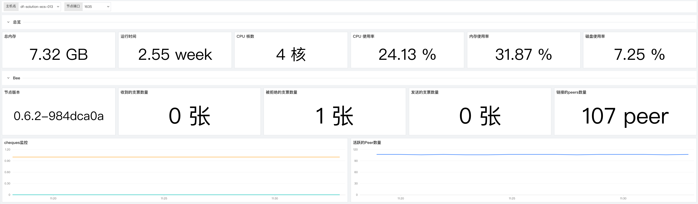
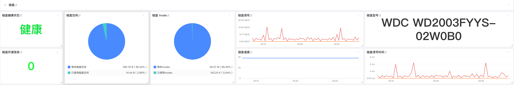
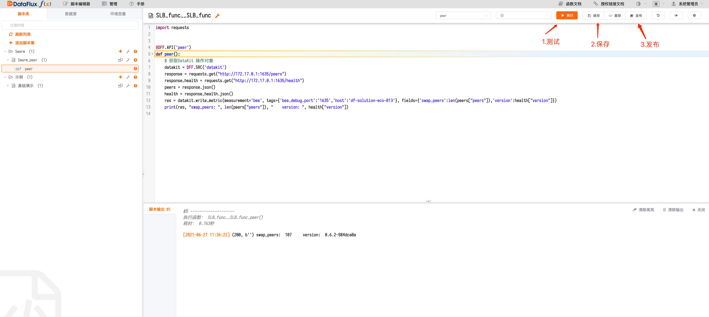
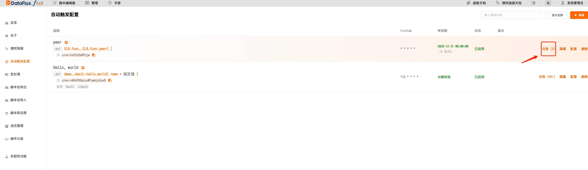
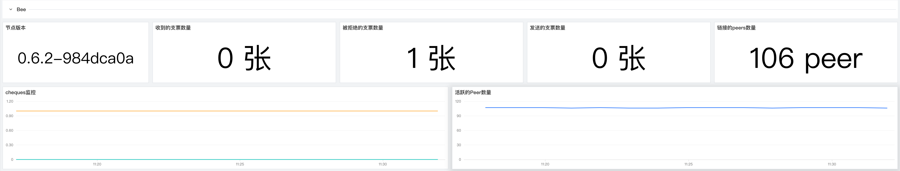
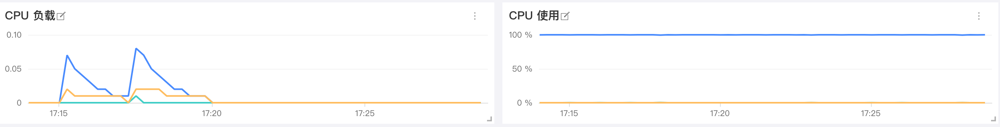
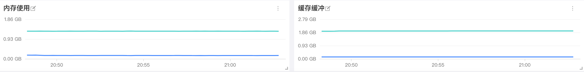
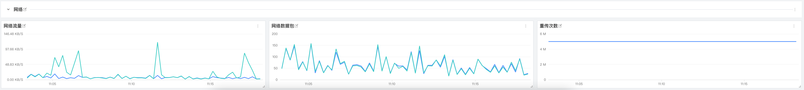

# Swarm Bee 可观测性最佳实践
---

## 简介

Swarm 是以太坊项目官方的一部分，主要是由基金会开发，允许矿池存储、带宽和算力资源来支持基于以太坊网络的应用。团队试图创建一个不停机、零故障和防审查的点对点存储和服务解决方案。在 Swarm 内创建一个经济激励的系统将促进资源交换价值的支付和转移，使用了以太坊区块链中不同的协议和技术。Swarm 去中心化的内容存储和分发服务，可以将它视为 CDN，通过互联网在计算机上分发。可以像运行以太坊节点一样，运行 Swarm 节点并连接到 Swarm 网络上。这与 BitTorrent 相似，也可以类比 IPFS，用 ETH 作为报酬激励。文件被分解成块，分配并被参与的志愿者们储存。那些为存储并为块提供服务的节点，从那些需要储存和检索数据服务的节点得到 ETH 作为补偿。Swarm 采用的不是挖矿的模式，因此没有出块奖励，而是通过和其他节点之间交互后获得奖励，交互后可以获得支票，支票可以用以兑换 BZZ，所以针对于 BZZ 集群的网络环境和节点状态尤其重要。

- **Bee**

- **CPU**
- **内存**
- **磁盘**
- **网络**

## 场景视图



## 内置视图

### 磁盘



## 前置条件

已安装 DataKit ( [DataKit 安装文档](/datakit/datakit-install/))

已安装 Docker 并初始化 Docker Swarm（ [Docker 安装参考](https://docs.docker.com/engine/install/)）

## 配置

### 配置 Prom Exporter

进入 DataKit 安装目录下的 `conf.d/prom` 目录，复制 `prom.conf.sample` 并命名为 `prom.conf `。示例如下:

```yaml
 ## Exporter 地址
  url = "http://127.0.0.1:1635/metrics"

  ## 指标类型过滤, 可选值为 counter, gauge, histogram, summary
  # 默认只采集 counter 和 gauge 类型的指标
  # 如果为空，则不进行过滤
  metric_types = ["counter", "gauge"]

  ## 指标名称过滤
  # 支持正则，可以配置多个，即满足其中之一即可
  # 如果为空，则不进行过滤
  # metric_name_filter = ["cpu"]

  ## 指标集名称前缀
  # 配置此项，可以给指标集名称添加前缀
  #  measurement_prefix = "prom_"

  ## 指标集名称
  # 默认会将指标名称以下划线"_"进行切割，切割后的第一个字段作为指标集名称，剩下字段作为当前指标名称
  # 如果配置 measurement_name, 则不进行指标名称的切割
  # 最终的指标集名称会添加上measurement_prefix前缀
  # measurement_name = "prom"

  ## 采集间隔 "ns", "us" (or "µs"), "ms", "s", "m", "h"
  interval = "10s"

  ## TLS 配置
  tls_open = false
  # tls_ca = "/tmp/ca.crt"
  # tls_cert = "/tmp/peer.crt"
  # tls_key = "/tmp/peer.key"

  ## 自定义指标集名称
  # 可以将包含前缀prefix的指标归为一类指标集
  # 自定义指标集名称配置优先measurement_name配置项
  #[[inputs.prom.measurements]]
  #  prefix = "cpu_"
  #  name = "cpu"

  # [[inputs.prom.measurements]]
  # prefix = "mem_"
  # name = "mem"

  ## 自定义Tags
  [inputs.prom.tags]
  bee_debug_port = "1635"
  # more_tag = "some_other_value"
```
### 配置 Swarm API 服务采集器

### 安装 Dataflux Func

#### 更改 DataKit 

进入datakit安装目录下的`conf.d`目录，更改`datakit.conf`文件中的`http_listen`。示例如下：
```yaml
http_listen = "0.0.0.0:9529"
log = "/var/log/datakit/log"
log_level = "debug"
log_rotate = 32
gin_log = "/var/log/datakit/gin.log"
protect_mode = true
interval = "10s"
output_file = ""
default_enabled_inputs = ["cpu", "disk", "diskio", "mem", "swap", "system", "hostobject", "net", "host_processes", "docker", "container"]
install_date = 2021-05-14T05:03:35Z
enable_election = false
disable_404page = false

[dataway]
  urls = ["https://openway.dataflux.cn?token=tkn_9a49a7e9343c432eb0b99a297401c3bb"]
  timeout = "5s"
  http_proxy = ""

[http_api]
  rum_origin_ip_header = "X-Forward-For"

[global_tags]
  cluster = ""
  host = "df_solution_ecs_004"
  project = ""
  site = ""

[[black_lists]]
  hosts = []
  inputs = []

[[white_lists]]
  hosts = []
  inputs = []
```
保存重启 DataKit
```bash
datakit --restart
```
#### 安装 Func
下载 DataFlux Func 依赖文件
```yaml
/bin/bash -c "$(curl -fsSL https://t.dataflux.cn/func-portable-download)"
```
命令执行完成后，所有所需文件都保存在当前目录下新创建的`dataflux-func-portable`目录下。

在已经下载的`dataflux-func-portable`目录下，运行以下命令，即可自动配置并最终启动整个 DataFlux Func：
```yaml
sudo /bin/bash run-portable.sh
```
安装成功
```systemverilog
Please wait for the container to run, wait 30 seconds...
CONTAINER ID   IMAGE     COMMAND   CREATED   STATUS    PORTS     NAMES


Installed dir:
    /usr/local/dataflux-func
To shutdown:
    sudo docker stack remove dataflux-func
To start:
    sudo docker stack deploy dataflux-func -c /usr/local/dataflux-func/docker-stack.yaml
To uninstall:
    sudo docker stack remove dataflux-func
    sudo rm -rf /usr/local/dataflux-func
    sudo rm -f /etc/logrotate.d/dataflux-func

Now open http://<IP or Hostname>:8088/ and have fun!
```
进入 ` http://<IP or Hostname>:8088` 可以看见如下界面


#### 配置 DataKit 数据源进行数据上报


#### 编写脚本进行 peer 数据收集


```python
import requests


@DFF.API('peer')
def peer():
    # 获取DataKit 操作对象
    datakit = DFF.SRC('datakit')
    response = requests.get("http://172.17.0.1:1635/peers")
    response_health = requests.get("http://172.17.0.1:1635/health")
    peers = response.json()
    health = response_health.json()
    res = datakit.write_metric(measurement='bee', tags={'bee_debug_port':'1635','host':'df-solution-ecs-013'}, fields={'swap_peers':len(peers["peers"]),'version':health["version"]})
    print(res, "swap_peers: ", len(peers["peers"]), "    version: ", health["version"])

```
> 由于 DataFlux Func 通过 Docker Stack 方式运行并桥接到宿主机`docker0`，与宿主机本地网络并不直接连通。因此，即使DataFlux Func 和DataFlux DataKit 安装在同一台服务器，也不能简单将 DataFlux DataKit 监听端口绑定到本地网络（`127.0.0.1`）。
> 
> 此时，应当修改配置，将监听端口绑定到`docker0`（`172.17.0.1`）或`0.0.0.0`
> 此时注意要更改swarm bee配置将本地监听端口 `:1635` 前加 `0.0.0.0`

将通过API请求的得到的数据插入到对应 measurement 中加入适当的 tags 便于在 studio 中进行展示。
#### 在管理中新建自动触发执行进行函数调度


选择刚刚编写好的执行函数设置定时任务，添加有效期有点击保存即可

> 定时任务最短 1 分钟触发一次，如果有特殊需求可以使用 while + sleep 的方式来提高数据采集频率

#### 通过自动触发配置查看函数运行状态


如果显示已成功，那么恭喜您可以去 studio 中查看您上报的指标了

## 监控指标说明

### 1 Bee

对多个主机的 Harvesters 进行全实时监测，细致的分析了不同的 Harvesters 的可用性、状态和收益，不断提升 Chia 用户对 Harvesters 的掌控力.



| **指标描述** | **名称** | **度量标准** |
| --- | --- | --- |
| 收到的支票数量 | `bee.swap_cheques_received` | 收益指标 |
| 被拒绝的支票数量 | `bee.swap_cheques_rejected` | 收益指标 |
| 发送的支票数量 | `bee.swap_cheques_sent` | 收益指标 |
| 链接的peers数量 | `bee.swap_peers` | 性能指标 |

#### 被拒绝的支票数量

为保障您的每日稳定收益，请务必时刻关注被拒绝的支票数量这个指标当被拒绝的支票数量数量快速上升事，请及时排查 bee 节点和网络的状态，来保障您的每日稳定收益。
#### 链接的 peers 数量

为了保障您的收益和网络稳定请链接的 peers 数量进行监控，正常来说当网络状态和节点状态是健康的状态时链接的 peers 数量会保持稳定在一个区间内不会有剧烈波动，当您发现链接的 peers 数量发生了剧烈波动的时候请及时排查 bee 节点和网络的状态来保障您的收益稳定。
### 2 CPU 监控

CPU 监控可以帮助分析 CPU 负载峰值，并识别过度活动的 CPU 使用情况。可以通过 CPU 监控指标改进 CPU 能力或减少负载、查找潜在的问题并避免由于不必要的升级而产生的过高成本。CPU 监视指标还可以帮助您识别正在运行的不必要的后台进程，并找出进程或应用程序的资源利用率及其对整个网络的影响。



| **指标描述** | **名称** | **度量标准** |
| --- | --- | --- |
| CPU 负载 | `system.load1`<br />`systeml.load5`<br />`system.load15` | 资源利用率 |
| CPU 使用率 | `cpu.usage_idle`<br />`cpu.usage_user`<br />`cpu.usage_system` | 资源利用率 |


#### CPU 使用率

CPU使用率可分为：`User Time`(执行用户进程时间百分比)；`System Time`(执行内核进程和中断的时间百分比)；`Idle Time`(CPU处于 Idle 状态的时间百分比)。对 CPU 的性能来讲首先对于每一个 CPU 来说运行队列不要超过 3，其次如果 CPU 处于满负荷状态`User Time`应处于 65%~70%，`System Time`应处于 30%~35%，`Idle Time`应处于 0%~5%
### 3 内存监控
内存是影响 Linux 性能的主要因素之一，内存资源的充足与否直接影响应用系统的使用性能。



| **指标描述** | **名称** | **度量标准** |
| --- | --- | --- |
| 内存使用率 | `mem.used_percent` | 资源利用率 |
| 内存使用 | mem.free<br />`mem.used` | 资源利用率 |
| 内存缓存 | `mem.buffered` | 资源利用率 |
| 内存缓冲 | `mem.cached` | 资源利用率 |

#### 内存使用率
密切关注可用内存的用量是很重要的，因为对 RAM 的争用将不可避免地导致分页和性能下降。要保持机器正常运行，请确保它有足够的 RAM 来满足您的工作负载。持续的低内存可用性会导致分段错误和其他严重的问题。如有发生补救措施包括增加系统中物理内存的容量，如果可以启用内存页合并。

### 4 磁盘监控


| **指标描述** | **名称** | **度量标准** |
| --- | --- | --- |
| 磁盘健康状态 | `disk.health`<br />`disk.pre_fail` | 可用性 |
| 磁盘空间 | `disk.free`<br />`disk.used` | 资源利用率 |
| 磁盘 Inode | `disk.inodes_free`<br />`disk.inodes_used` | 资源利用率 |
| 磁盘读写 | `diskio.read_bytes`<br />`diskio.write_bytes` | 资源利用率 |
| 磁盘温度 | `disk.temperature` | 可用性 |
| 磁盘型号 | `disk.device_model` | 基础 |
| 磁盘读写时间 | `diskio.read_time`<br />`disk.io.write_time` | 资源利用率 |

#### 磁盘空间
对于任何操作系统来说，保持足够的空闲磁盘空间都是必要的。除了需要磁盘的常规进程外，核心系统进程还在磁盘上存储日志和其他类型的数据。可以配置告警当您的可用磁盘空间下降到 15% 以下时进行提醒，来保证业务的持续性。
#### 磁盘读写时间
这对指标跟踪磁盘读/写操作所花费的平均时间。可以设置预警大于 50 毫秒的值则表示相对较高的延迟(一般以少于 10 毫秒为最佳)，通常建议将业务作业通过转移到更快的磁盘来减少延迟。您可以根据服务器的角色设置不同的预警值，不同的角色可接受的阈值都是不同的。
#### 磁盘读写
如果您的服务器托管要求很高的应用程序，您将希望监控磁盘 I/O 速率。磁盘读写指标是由磁盘标记的读(`diskio.read_bytes`)和写(`diskio.write_bytes`)活动的聚合。持续的高磁盘活动可能会导致服务退化和系统不稳定，特别是当同时使用高 RAM 和页面文件时。当进行高磁盘活动时建议增加正在使用的磁盘数量(特别是当您看到队列中有大量操作时)，使用更快的磁盘，增加为文件系统缓存预留的 RAM，如果可能的话可以将工作负载分配到更多的机器上。
#### 磁盘温度
对于您的业务对于磁盘的可用性要求十分高的化，可以设置预警时刻对磁盘工作温度进行监控，当温度大于65℃ (SSD75℃ 以上)以上就值得注意了，如果您的硬盘过热保护或者温控机制的话就要注意了，如果硬盘温度继续升高的话可能会损坏硬盘导致业务数据丢失。
### 5 网络监控
您的应用程序和基础架构组件以越来越复杂的架构相互依赖，无论您运行的是整体应用程序还是微服务，是否部署到云基础架构，私有数据中心，或两者都部署。虚拟化基础架构使开发人员能够响应任意规模，并创建与传统网络监视工具不太匹配的动态网络模式。为了提供对环境中每个组件以及它们之间所有连接的可见性，Datadog 引入了针对云时代的网络性能监控。



| **指标描述** | **名称** | **度量标准** |
| --- | --- | --- |
| 网络流量 | `net.bytes_recv`<br />`net.bytes_sent` | 资源利用率 |
| 网络数据包 | `net.packets_recv`<br />`net.packets_sent` | 资源利用率 |
| 重传次数 | `net.tcp_retranssegs` | 可用性 |

#### 网络流量
这两个指标合在一起可衡量给定网络接口的总网络吞吐量。对于大多数消费类硬件，其 NIC 的传输速度为每秒 1 GB 或更高，除了最极端的情况以外，在所有情况下，网络都不太可能成为瓶颈。可以设置预警当占用接口带宽的 80％ 以上时进行提醒防止发生网络饱和(对于 1 Gbps 链路而言，每秒达到 100 兆字节)。
#### 重传次数
TCP 重传经常发生但不是错误，尽管它们的存在可能是问题的征兆。重传通常是网络拥塞的结果并且通常与高带宽消耗相关。您应该监视此指标，因为过多的重传可能会导致应用程序大量延迟。如果重发的发送者未收到已发送的数据包的确认，它将推迟发送更多的数据包（通常持续约 1 秒钟），从而增加延迟与拥塞相关的速度。

如果不是由网络拥塞引起的，则重传的来源可能是网络硬件出现故障。丢弃的数据包数量少，重传速率高，可能会导致过多的缓冲。无论是什么原因，您都应该跟踪此指标，以了解网络应用程序响应时间中看似随机的波动。

## 结论

在本文中，我们提到了一些最有用的指标，您可以对其进行监控以在挖矿时保留标签。 如果您正在进行挖矿作业，那么监视下面的列表中的指标将使您可以很好地了解矿场的运行状况和可用性：

- **磁盘读写延时**

- **磁盘温度**
- **网络流量**
- **每日期望收益**
- **Harvester 初筛通过率**
- **进程**

最终，您将认识到与您自己的用例特别相关的其他指标。 当然您也可以通过 [<<< custom_key.brand_name >>>](http://guance.com) 了解更多内容。
