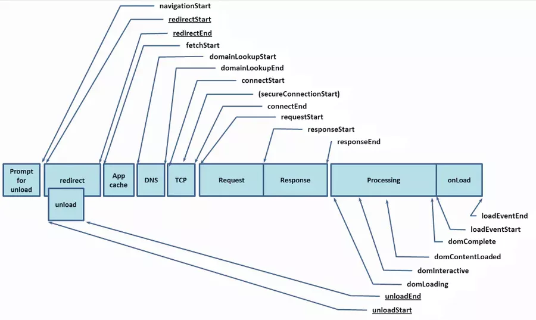
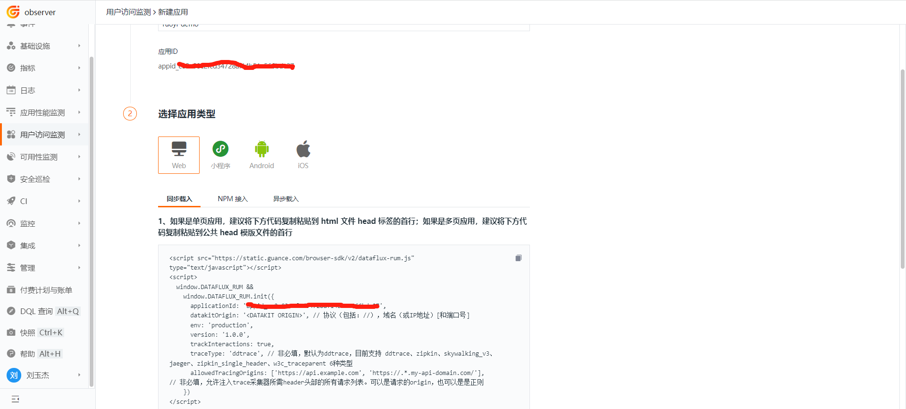
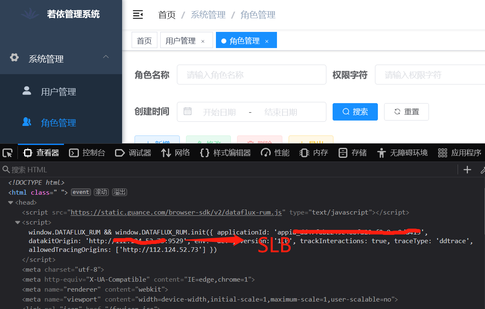
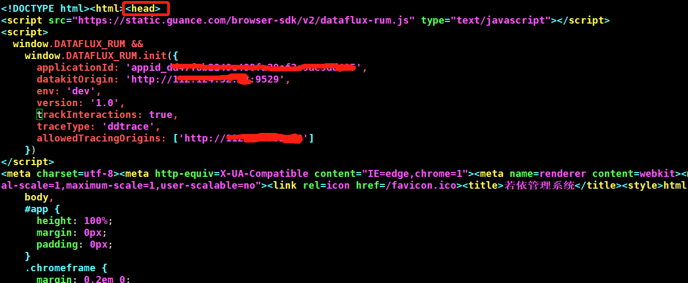
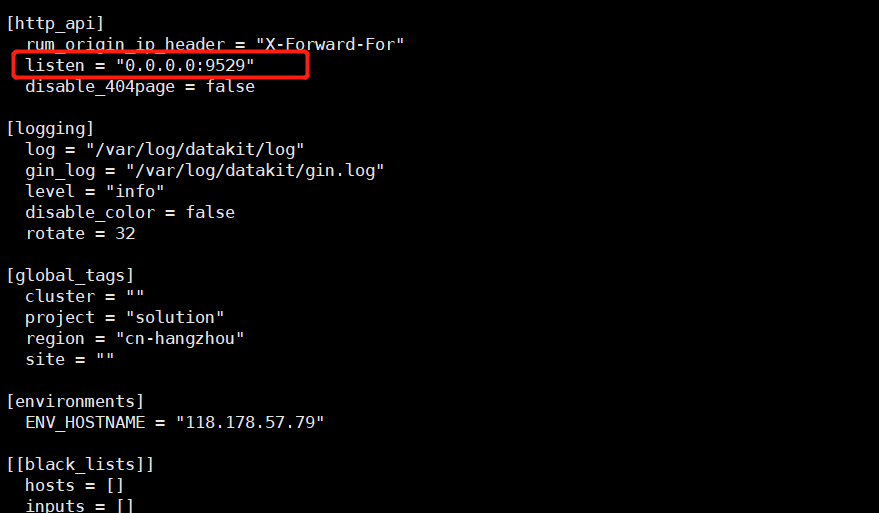
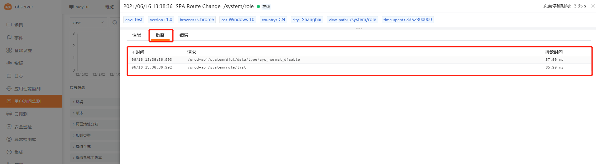
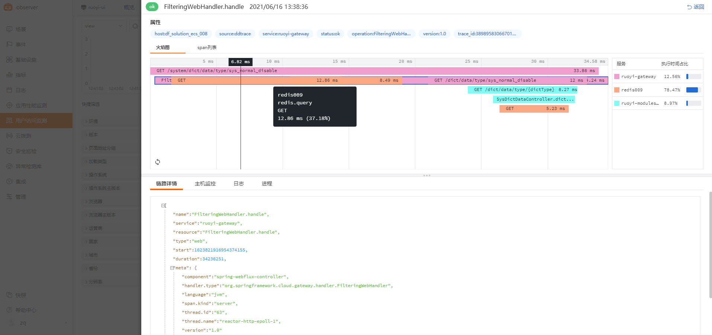
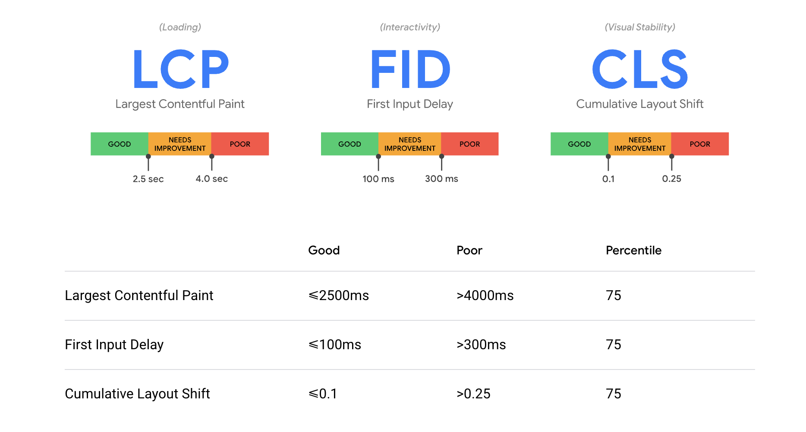

# web 应用监控（RUM）最佳实践

---

## 前置条件

- 进入[<<< custom_key.brand_name >>>官网](https://www.guance.cn/) 注册账号，使用已注册的账号/密码登录。
- 服务器<[安装 DataKit](../../datakit/datakit-install.md)>

## Web 应用监控（RUM）介绍：

**RUM**全称为 **_Real user monitor（真实用户体验管理）_**，随着移动互联网的发展，越来越多的企业，最终的业务表现形式都汇聚在了终端用户侧，也就是RUM端，具体形式有 Mobile-APP、web页面、小程序（微信、支付宝、头条等）。伴随着互联网行业发展，各行各业也都开始了近似于白热化的竞争，真实用户的终端体验，会直接影响终端用户的新增、留存、企业形象甚至企业的营收，那如何提升终端用户的使用体验，就成为了互联网行业乃至正在或即将进行数字化转型的传统企业必须要考虑的一个问题。

---

### RUM 原理简介：

**原理介绍：**RUM采集数据方式的变更经过了好几代更迭，目前市面上常见的是基于 W3C（万维网联盟）定义的[[navigation-timing](https://www.w3.org/TR/navigation-timing/)] 标准（见下图），该标准详细定义了各种浏览器事件，通过浏览器事件的简单计算就可以算出来前端页面的首屏、白屏、DOM 加载、HTML 加载等时长，相较于测试环境的 F12 检查者模式，能有更效的收集生产环境真实用户的前端体验，因此在当前 H5 应用场景越来越多的情况下极为流行，国内的商业软件（听云、博睿、云智慧、oneapm）均是依赖此标准定制的web监测体系，该标准适用于大多数 H5 场景。



随着浏览器（尤其是 chrome）以及前端技术的发展，navigation-timing 的局限性越来越明显，例如前后端分离下单页面越来越多，在这种场景下，基于 navigation-timing 进行数据采集会比较繁琐，因此，W3C 又推出了一个新的标准 [[PaintTiming-github](https://github.com/w3c/paint-timing/)] [[PaintTiming-api](https://developer.mozilla.org/en-US/docs/Web/API/PerformancePaintTiming)] ，该标准新提出的指标包括首次绘制（First Paint）、首次内容绘制（First Contentful Paint）等，更符合真实用户在访问WEB页面时的真实体验，DF-RUM 采用的即为支持PaingTiming 规范的数据采集，对该规范感兴趣的可以进一步阅读[[使用 Paint Timing API 提高性能](https://zhuanlan.zhihu.com/p/30389490)]    [[使用 painttiming](https://www.w3cplus.com/performance/paint-timing-api.html)]。

---

DF 官方目前支持的 RUM 监控方式有如下几种：
**WEB 应用**：[[Web 应用接入 DF 监控](../../real-user-monitoring/web/app-access.md)]  [Web应用监控最佳实践]<br />**APP（Android & iOS）**：[ [Android 接入 DF 监控](../../mobile/index.md)] [ [iOS 接入 DF 监控](../../mobile/index.md)] [APP监控最佳实践-待补充][]<br />**小程序（微信）**：[f] [小程序监控最佳实践-待补充]

---

### Web 页面接入 RUM 相关步骤：

##### 1、登录<<< custom_key.brand_name >>>

##### 2、选择用户访问监测——新建应用——选择 web 类型——同步载入



**备注：此处选择 CDN 同步载入**<br />•修改前端 index.html 页面（记得cp备份）<br />在       **</head>**   之前添加复制到的那一段 js 文件:

| 接入方式     | 简介                                                                                                                                                             |
| ------------ | ---------------------------------------------------------------------------------------------------------------------------------------------------------------- |
| NPM          | 通过把 SDK 代码一起打包到你的前端项目中，此方式可以确保对前端页面的性能不会有任何影响，不过可能会错过 SDK 初始化之前的的请求、错误的收集。                       |
| CDN 异步加载 | 通过 CDN 加速缓存，以异步脚本引入的方式，引入 SDK 脚本，此方式可以确保 SDK 脚本的下载不会影响页面的加载性能，不过可能会错过 SDK 初始化之前的的请求、错误的收集。 |
| CDN 同步加载 | 通过 CDN 加速缓存，以同步脚本引入的方式，引入 SDK 脚本，此方式可以确保能够收集到所有的错误，资源，请求，性能指标。不过可能会影响页面的加载性能。                 |

##### 3、在前端页面 index.html 中接入 rum 可观测性 js 文件

```
$ cd /usr/local/ruoyi/dist/index.html

// 记得备份
$ cp index.html index.html.bkd

// 在index.html中添加df-js
// 复制 DF 平台上的 js 内容，放至 index.html 内的 </head> 之前，然后保存文件,示例如下
// datakitOrigin：datakit 地址，df 中 rum 数据流向为：rum.js 文件——datakit——dataway——DF平台
   如若是生产环境，需将该 IP 设置为域名，测试环境需填写内网 IP，对应有 datakit 的服务器 9529 端口
// trackInteractions：用户行为采集配置项，可实现页面端用户操作行为统计
// allowedTracingOrigins：前后端（rum 与 apm）打通的配置项，可按需进行设置，需在此处填写与前端页面有交互关系的后端服务器所对应的域名或IP，127.0.0.1 仅为示例。

$ vim index.html

<head> 
<script src="https://static.<<< custom_key.brand_main_domain >>>/browser-sdk/v2/dataflux-rum.js" type="text/javascript"></script>
<script>
  window.DATAFLUX_RUM &&
    window.DATAFLUX_RUM.init({
      applicationId: 'xxxxxxxxxxxxxxxxxxxxxxxxxx',
      datakitOrigin: 'http://127.0.0.1:9529', 
      env: 'test',
      version: '1.0.0',
      trackInteractions: true,
      traceType: 'ddtrace', 
      allowedTracingOrigins: ['http://127.0.0.1']
    })
</script>
</head> 
```

**注意事项：**

- **datakitOrigin**：数据传输地址，生产环境如若配置的是域名，可将域名请求转发至具体任意一台安装有datakit-9529 端口的服务器，如若前端访问量过大，可在域名与 datakit 所在服务器中间加一层 slb，前端 js 将数据发送至 slb，slb 将请求转发至多台安装 datakit-9529 所在的服务器。多台 datakit 承接 rum 数据，因前端请求复用因素，session 数据不会中断，对 rum 数据展现也无影响。

举例：




- **allowedTracingOrigins**：实现前后端（APM 与 RUM）打通，该场景只有在前端部署 RUM，后端部署APM的情况才会生效，需在此处填写与前端页面有交互关系的后端应用服务器所对应的域名（生产环境）或IP（测试环境）。**应用场景**：前端用户访问出现慢，是由后端代码逻辑异常导致，可通过前端RUM慢请求数据直接跳转至APM数据查看当次后端代码调用情况，判定慢的根因。**实现原理**：用户访问前端应用，前端应用进行资源及请求调用，触发rum-js性能数据采集，rum-js 会生成 trace-id 写在请求的 request_header 里，请求到达后端，后端的 ddtrace 会读取到该 trace_id 并记录在自己的 trace 数据里，从而实现通过相同的 trace_id 来实现应用性能监测和用户访问监测数据联动
- **env**：必填，应用所属环境，是test或product或其他字段。
- **version**：必填，应用所属版本号。
- **trackInteractions**：用户行为统计，例如点击按钮，提交信息等动作。
- **traceType：**非必填，默认为ddtrace，目前支持 ddtrace、zipkin、skywalking_v3、jaeger、zipkin_single_header、w3c_traceparent 6种类型。



##### 4、保存、验证并发布页面

打开浏览器访问目标页面，通过 F12 检查者模式查看页面网络请求中是否有 rum 相关的请求，状态码是否是 200。


**注意事项**：如果在 F12 中发现 rum 相关的请求状态码是非 200 的，或者是 connection refused，可以 telnet IP:9529 验证端口是否通畅，不通的话，需要修改 /usr/local/datakit/conf.d/datakit.conf  http_listen 的 localhost为0.0.0.0（此配置用于控制当前服务器的 9529 端口是否可被外网请求访问，如果设置的是 127.0.0.1 或者localhost，就只允许本地或内网访问当前服务器的 9529 端口，设置为 0.0.0.0 后，当前服务器的内外网 9529 端口都可以被访问，rum 大多为外网数据，所以需要开通外网到 datakit 所在服务器的 9529 端口），例如：



---

### RUM 与 APM 数据打通（前后端通过traceid关联）：

**前置条件**：后端应用服务器必须安装apm监控，即 ddtrace（dd-agent），详见 [分布式链路追踪(APM)最佳实践](../apm)，前端添加 df-rum 监控。<br />**配置方式**：需要在前端 html 中已添加的 df-rum-js 中添加 **allowedTracingOrigins**标签，并填写前端对应的后端域名，例如 dataflux.cn 添加 rum 监控，需要在 allowedTracingOrigins 里配 https://www.dataflux.cn/ ，如若存在多个域名，需配置多个，用逗号隔开，第三方域名可以不配置。


打通后的效果示例：






---

## DF-WEB应用监控（RUM）应用分析：

**相关参数介绍：**

| 参数                           | 类型    | 是否必须 | 默认值  | 描述                                                                                                                                                                                                                                                       |
| ------------------------------ | ------- | -------- | ------- | ---------------------------------------------------------------------------------------------------------------------------------------------------------------------------------------------------------------------------------------------------------- |
| `applicationId`                | String  | 是       |         | 从 dataflux 创建的应用 ID                                                                                                                                                                                                                                  |
| `datakitOrigin`                | String  | 是       |         | datakit 数据上报 Origin 注释: <br />`协议（包括：//），域名（或IP地址）[和端口号]`<br /> 例如：<br />[https://www.datakit.com](https://www.datakit.com), <br />[http://100.20.34.3:8088](http://100.20.34.3:8088)                                          |
| `env`                          | String  | 否       |         | web 应用当前环境， 如 prod：线上环境；gray：灰度环境；pre：预发布环境 common：日常环境；local：本地环境；                                                                                                                                                  |
| `version`                      | String  | 否       |         | web 应用的版本号                                                                                                                                                                                                                                           |
| `resourceSampleRate`           | Number  | 否       | `100`   | 资源指标数据收集百分比: <br />`100`<br />表示全收集，<br />`0`<br />表示不收集                                                                                                                                                                             |
| `sampleRate`                   | Number  | 否       | `100`   | 指标数据收集百分比: <br />`100`<br />表示全收集，<br />`0`<br />表示不收集                                                                                                                                                                                 |
| `trackSessionAcrossSubdomains` | Boolean | 否       | `false` | 同一个域名下面的子域名共享缓存                                                                                                                                                                                                                             |
| `allowedTracingOrigins`      | Array   | 否       | `[]`    | 允许注入<br />`ddtrace`<br /> 采集器所需header头部的所有请求列表。可以是请求的origin，也可以是是正则，origin: <br />`协议（包括：//），域名（或IP地址）[和端口号]`<br /> 例如：<br />`["https://api.example.com", /https:\\/\\/.*\\.my-api-domain\\.com/]` |
| `trackInteractions`<br />      | Boolean | 否       | `false` | 是否开启用户行为采集                                                                                                                                                                                                                                       |


### 网站核心指标

DataFlux 的 Web 应用分析，接入谷歌网站核心指标（LCP、FID、CLS）来衡量网站的载入速度、互动性和页面稳定性。

| 指标                          | 说明                                                            | 目标值    |
| ----------------------------- | --------------------------------------------------------------- | --------- |
| LCP(Largest Contentful Paint) | 计算网页可视范围内最大的内容元件需花多少时间载入                | 小于2.5s  |
| FID(First Input Delay)        | 计算用户首次与网页互动时的延迟时间                              | 小于100ms |
| CLS(Cumulative Layout Shift)  | 计算网页载入时的内容是否会因动态加载而页面移动，0表示没有变化。 | 小于0.1   |



### 场景分析

DataFlux 提供可视化的 Web 应用分析，内置多维度 Web 应用监测数据场景，包括概览、页面性能分析、资源加载分析、JS 错误分析。

#### 概览

Web 应用的概览场景统计页面访问的错误数、错误率、会话数、会话分布、浏览器、操作系统、最受欢迎页面、资源错误排行等内容，可视化的展示用户访问 Web 页面的数据统计，快速定位用户访问 Web 应用的问题，提高用户访问性能。可通过环境、版本筛选查看已经接入的 Web 应用。


#### 性能分析

Web 应用的页面性能分析，通过统计PV数、页面加载时间、网站核心指标、最受关注页面会话数、页面长任务分析、XHR & Fetch 分析、资源分析等指标，可视化的实时查看整体的 Web 应用页面性能情况，更精准的定位需要优化的页面，可通过环境、版本等筛选查看已经接入的 Web 应用。


#### 资源分析

Web 应用的资源分析，通过统计资源分类、XHR & Fetch 分析、资源耗时分析等指标，可视化的实时查看整体的Web 应用资源情况；通过统计资源请求排行，更精准的定位需要优化的资源；可通过环境、版本等筛选查看已经接入的 Web 应用。


#### 错误分析

Web 应用的 JS 错误分析，通过统计错误率、错误分类、错误版本、网络错误状态分布等指标，可视化的实时查看整体的 Web 应用错误情况；通过受影响的资源错误统计，可快速定位资源错误；可通过环境、版本等筛选查看已经接入的 Web 应用。


