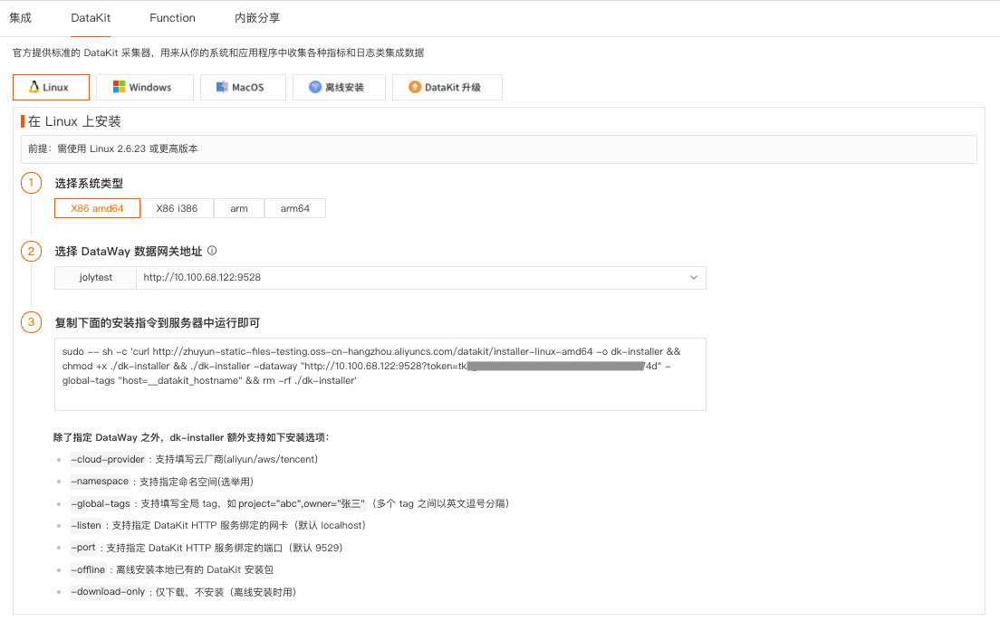
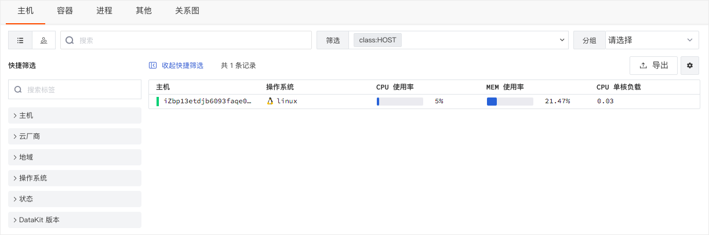
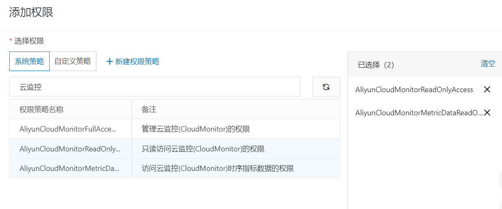
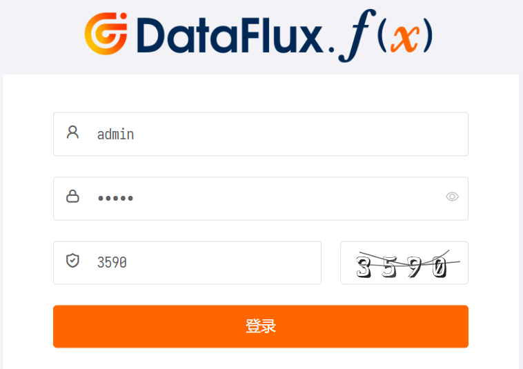
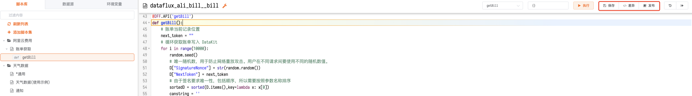
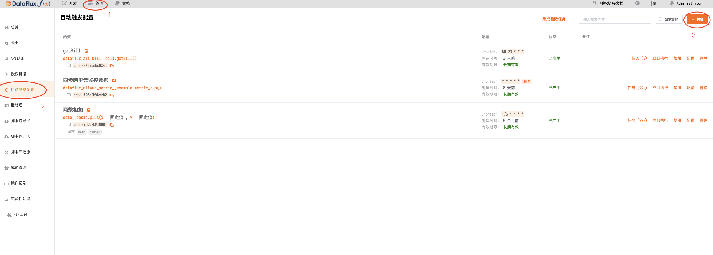
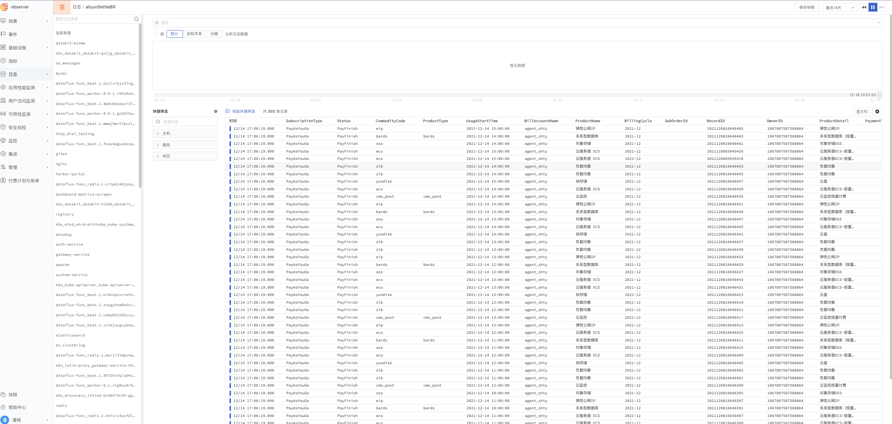

# 解决阿里云 API 签名问题实现账单分析

---

购买多个公有云资源和采购私有主机相比，在成本方面的意识是大相径庭的。采购私有主机，是一次性投入，购买后用还是不用，用的好还是不好，都不会对你后续的投入产生持续性影响；而购买公有云资源，则需要时刻提醒自己： 虽然初期投入较少，但每过一天，就会产生一天的费用。因此，我们迫切的需要方法，能够帮助我们一目了然的查看在多个云资源上的成本支出的明细和账单分析。
## 采集阿里云费用 API

首先以阿里云账单为例，我们想采集阿里云的费用账单信息分析，就需要对交易与账单管理的 API 足够了解，那么在调用阿里云 API 的时候，最让人头疼的就是 API 的签名（ Signature ）机制，阿里云在通用文档中也有[专项说明](https://help.aliyun.com/document_detail/87971.html)，但是仅仅只有说明签名机制说明文档，这让一些经验不足的开发人员就很头疼，那么基于这不全的说明文档我们该如何去做账单费用采集呢。

### API 请求原理

简单来说调用阿里云 API 就是一个 Http 请求（大多数为 GET, 这里也是基于 GET 请求），只是后面要跟一堆参数，例如一个查看快照的请求为：

```html
http://ecs.aliyuncs.com/?SignatureVersion=1.0&Format=JSON&Timestamp=2017-08-07T05%3A50%3A57Z&RegionId=cn-hongkong&AccessKeyId=xxxxxxxxx&SignatureMethod=HMAC-SHA1&Version=2017-12-14&Signature=%2FeGgFfxxxxxtZ2w1FLt8%3D&Action=DescribeSnapshots&SignatureNonce=b5046ef2-7b2b-11e7-a3c5-00163e001831&ZoneId=cn-hongkong-b
```

请求中所需要的公共参数（就是调用 API 都需要用到的参数）为：

```html
SignatureVersion # 签名算法版本，目前为 1.0 
Format # 返回消息的格式化方式，JSON or XML 默认值为 XML
Timestamp # 请求的时间戳，UTC时间，例如: 2021-12-16T12:00:00Z 
AccessKeyId # 账号密钥 ID
SignatureMethod # 签名方式，目前为 HMAC-SHA1
Version # 版本号，为日期形式，例如: 2017-12-14 每个产品不同
Signature # 最难搞定的签名
SignatureNonce # 唯一随机数，防止网络攻击。不同请求间使用不同的随机数。
```

除了 `Signature `之外，其它的参数都比较容易获得，有些甚至是固定的值，具体可以参考[阿里云文档](https://help.aliyun.com/document_detail/87969.html)<br />除了公共参数之外，还需要具体接口（ Action ）的请求参数，每个 `Action` 接口的参数可以参考对应产品的接口文档，例如 [QuerySettleBill](https://help.aliyun.com/document_detail/173110.html)<br />而 `Signature `是基于公共参数和接口参数的，所以比较复杂。

### 构造规范化的请求字符串 

- 构造 dict<br />Python 中体现参数一一对应的就是 dict , 创建一个 dict , 把请求参数些进去

```python
D = {
    'BillingCycle':str(time.strftime("%Y-%m", time.gmtime())),
    'Action':'QuerySettleBill',
    # 'PageNum':'5',
    'Format':'JSON',
    'Version':'2017-12-14',
    'AccessKeyId':'LTAI5tLumx55Vui4WJwZJneK',
    'SignatureMethod':'HMAC-SHA1',
    'MaxResults' : '300',
    # 'NextToken':"", #?
    'Timestamp':str(time.strftime("%Y-%m-%dT%H:%M:%SZ", time.gmtime())),
    'SignatureVersion':'1.0'
    # 'SignatureNonce':str_seed
}
```

- 排序<br />由于签名要求唯一性，包括顺序，所以需要按照参数名称排序

```python
  # 由于签名要求唯一性，包括顺序，所以需要按照参数名称排序
        sortedD = sorted(D.items(),key=lambda x: x[0])
```

- URL 编码<br />由于在标准请求字符串中需要使用 UTF-8 字符集，对请求参数名称和值中有些不符合规范的字符要进行 Url 编码，具体规则为：

> 字符 AZ、az、0~9 以及字符“-”、“_”、“.”、“~”不编码；<br />其它字符编码成 %XY 的格式，其中 XY 是字符对应 ASCII 码的 16 进制表示。比如英文的双引号（”）对应的编码为 %22；<br />对于扩展的 UTF-8 字符，编码成 %XY%ZA… 的格式；<br />英文空格（ ）要编码成 %20，而不是加号（+）。

> 注意：一般支持URL编码的库（比如 Java 中的 java.net.URLEncoder）都是按照 “application/x-www-form-urlencoded”的 MIME 类型的规则进行编码的。实现时可以直接使用这类方式进行编码，把编码后的字符串中加号（+）替换成 %20、星号（*）替换成 %2A、%7E 替换回波浪号（~），即可得到上述规则描述的编码字符串。

这里使用 Python 中的 `urllib` 库来进行编码：

```python
# 使用 python 中的 urllib 库来进行编码
def percentEncode(str):
	res = urllib.parse.quote(str.encode('utf8'), '')
	res = res.replace('+', '%20')
	res = res.replace('*', '%2A')
	res = res.replace('%7E', '~')
	return res
```

- 生成标准化请求字符串

```python
# 生成标准化请求字符串
canstring = ''
for k,v in sortedD:
    canstring += '&' + percentEncode(k) + '=' + percentEncode(v)
```

### 构造被签名字符串 StringToSign

规则为：

> StringToSign=<br />HTTPMethod + “&” +<br />percentEncode(“/”) + ”&” +<br />percentEncode(CanonicalizedQueryString)

所以在这个实例中：

```python
        # 生成标准化请求字符串
        stringToSign = 'GET&%2F&' + percentEncode(canstring[1:])
```
### 计算 HMAC 值

```python
# access_key_secret
access_key_secret = '<access_key_secret>'
# 计算 HMAC 值
h = hmac.new((access_key_secret + "&").encode('utf8'), stringToSign.encode('utf8'), sha1)
```

### 计算签名值

```python
# 计算签名值生成 signature 签名
signature = base64.encodestring(h.digest()).strip()
```
到此生成了 `signature` 签名

### 添加签名

```python
# 添加签名
D['Signature'] = signature
```

所以在这个实例中，最终请求的 Url 为

```python
# 最终调用 API
url = 'http://business.aliyuncs.com/?' + urllib.parse.urlencode(D)
http://business.aliyuncs.com/?BillingCycle=2021-12&Action=QuerySettleBill&Format=JSON&Version=2017-12-14&AccessKeyId=LTAI5tLumx55Vui4WJwZJneK&SignatureMethod=HMAC-SHA1&MaxResults=300&Timestamp=2021-12-16T12%3A27%3A58Z&SignatureVersion=1.0&SignatureNonce=0.30196531140307337&NextToken=&Signature=zFb4631sSGONvAeWD3xCIovMeoM%3D
```

拿到浏览器直接访问即可，得到结果为：


### 完整示例

```python
import sys, datetime
import time
import json
import urllib
import hmac
from hashlib import sha1
import base64
import random
import requests


# 请求中所需要的公共参数（就是调用 API 都需要用到的参数）
D = {
    'BillingCycle':str(time.strftime("%Y-%m", time.gmtime())),
    'Action':'QuerySettleBill',
    # 'PageNum':'5',
    'Format':'JSON',
    'Version':'2017-12-14',
    'AccessKeyId':'<AccessKeyId>',
    'SignatureMethod':'HMAC-SHA1',
    'MaxResults' : '300',
    # 'NextToken':"", #?
    'Timestamp':str(time.strftime("%Y-%m-%dT%H:%M:%SZ", time.gmtime())),
    'SignatureVersion':'1.0'
    # 'SignatureNonce':str_seed
}
#当前时间
now_time = str(time.strftime("%Y-%m-%d", time.gmtime()))

#链接本地 Datakit
datakit = DFF.SRC('datakit')

# 使用 python 中的 urllib 库来进行编码
def percentEncode(str):
        res = urllib.parse.quote(str.encode('utf8'), '')
        res = res.replace('+', '%20')
        res = res.replace('*', '%2A')
        res = res.replace('%7E', '~')
        return res


#获取账单
def getBill():
    # 账单当前记录位置
    next_token = ""
    # 循环获取账单写入 DataKit
    for i in range(10000):
        random.seed()
        # 唯一随机数，用于防止网络重放攻击。用户在不同请求间要使用不同的随机数值。
        D["SignatureNonce"] = str(random.random())
        D["NextToken"] = next_token
        # 由于签名要求唯一性，包括顺序，所以需要按照参数名称排序
        sortedD = sorted(D.items(),key=lambda x: x[0])
        # 生成标准化请求字符串
        canstring = ''
        for k,v in sortedD:
            canstring += '&' + percentEncode(k) + '=' + percentEncode(v)
        # 生成标准化请求字符串
        stringToSign = 'GET&%2F&' + percentEncode(canstring[1:])
        # access_key_secret
        access_key_secret = '<access_key_secret>'
        # 计算 HMAC 值
        h = hmac.new((access_key_secret + "&").encode('utf8'), stringToSign.encode('utf8'), sha1)
        # 计算签名值生成 signature 签名
        signature = base64.encodestring(h.digest()).strip()
        # 添加签名
        D['Signature'] = signature
        # 最终调用 API
        url = 'http://business.aliyuncs.com/?' + urllib.parse.urlencode(D)
        # 请求阿里云账单费用
        print(url)
```

## 展示技术路线选择

### 架构设想


采用以 Crontab 定时调度 Python 脚本的方式定时获取阿里云账单数据写入 MySQL 存储引擎中通过 Grafana 展示账单分析数据，可以通过 Grafana Dashboards 获取相应的Bills 模板达到简化操作的目的，下面以该架构设想展开技术调研。

### 技术调研

在现在的开源可视化领域中，比较流行的而且可视化模板较多的当属 Grafana 最受欢迎。而 Kibana 也是个不错的可视化平台相比于 Grafana 来说 Kibana 更适合 ELK 架构使用，基于我们的需求使用 Kibana 就不是那么契合了，而 Grafana 也是一个开源可视化工具，可以在各种不同的数据存储上使用，而且是 Graphite-web 的一个功能丰富的替代品，可帮助我们轻松创建和编辑仪表板。它包含一个独特的 Graphite 目标解析器，可以轻松进行度量和功能编辑。用户可以使用智能轴格式（例如线条和点）创建全面的图表，另外 Grafana 附带内置告警引擎，允许我们将条件规则附加到仪表板面板将触发的告警发送到选择的通知端点（例如，电子邮件，Slack，PagerDuty，自定义的 Webhooks ）等，这也刚好满足了对于阿里云费用的预警需求，但是 Grafana 旨在分析和可视化系统 CPU，内存，磁盘和 I/O 利用率等指标。Grafana 不允许全文数据查询这让使用体验变得不那么友好了，通过一番寻找在浏览开源社区是发现“[<<< custom_key.brand_name >>>](https://www.guance.com/)”这个产品也刚好满足需求不仅涵盖了Grafana 和 Kibana 的全部优点更有许多独特的功能，而且还拥有 Serverless 在线编程调度的功能，刚好解决了我们使用 Python 脚本获取阿里云账单数据调度无法管理的痛点，另外作为开源的商业化产品其UI的美观程度上甩了 Grafana 不知几条街，而且其提供的免费额度刚好可以满足我们的需求，而且再有使用问题时还能获得官方的产品支持。

### 技术对比

|  |  Grafana | <<< custom_key.brand_name >>> |
| --- | --- | --- |
| 使用复杂度 | 安装配置比较繁琐，还需要搭配额外的存储引擎 | 一条命令完成安装，30分钟开箱即用 |
| 文档完善度 | Grafana官网上有完善的文档，但是中文文档比较少，这对于英文菜鸡来说是一件比较头痛的问题。 | 有非常完善的中文文档和大量使用案例指导课程。 |
| 社区活跃度 | 社区活跃，开发和维护团队强大，版本升级迭代快。 | 商业化产品，社区非常活跃，开发和维护团队强大，解决问题快，版本升级迭代快。 |
| 功能完整度 | 拥有 54 个数据源，173+ Dashboards，具有丰富的仪表盘插件，比如热图、折线图、图表等多种展示方式等，支持简单的告警等 | 拥有 200+ 数据源接入，200+ Dashboards，多种操作系统支持，提供标准的统⼀的DQL查询多种数据类型，将指标数据，日志数据，APM层的数据，基础设施，容器，中间件，网络性能均包含统一管理，支持异常检测功能强大并且拥有高阶权限功能等，支持复杂的告警规则配置等 |
| 发展趋势 | 市场占有率是程上升的趋势，并且自身在快速发展完善。 | 作为成熟的商业化产品，可观测领域的领跑者，市场占有率是程上升的趋势，并且自身在快速发展完善。 |
| 性能 | 资源占用较低 | 统一管理，资源占用低，数据是二进制文件，传输效率高，带宽占用低。 |
| Serverless编程 | 无 | 基于 Python3.x 的沙箱环境 |
| 费用 | 免费 | 免费 |
| 服务 | 社区求助 | 提供专业技术团队支持 |

### 需求配对

通过以上的对比，我们发现使用“<<< custom_key.brand_name >>>”可以大大降低使用成本，安装配置管理十分便捷，相比于 Grafana 仅作为展示平台还需要依赖外部存储引擎作为数据源而言，“<<< custom_key.brand_name >>>”则作为指标数据，日志数据，APM 层的数据，基础设施，容器，中间件，网络性能等多种数据统一收集统一管理就显得方便很多，减少了存储引擎的安装维护等繁琐的步骤，而 Grafana 没有完善的中文文档，相对于英文不是很好的同学可能会比较头疼，反观<<< custom_key.brand_name >>>拥有完善的中文文档和大量的使用案例指导的视频可以让我们更加轻松的上手产品使用，将关注点放在需求本身，“<<< custom_key.brand_name >>>”作为商业化产品即使是免费使用也可以得到专业的技术团队支持而且拥有庞大的社区，可以和众多的产品使用者交流使用上的心得，功能上更是比 Grafana 多出了异常检测功能强大并且拥有高阶权限功能和支持复杂的告警规则配置等对于费用分析外的需求也可以很好的实现，而且“<<< custom_key.brand_name >>>”可以通过可视化的方式对组件进行统一管理，资源占用低，数据是二进制文件，传输效率高并且带宽占用低。另外对于颜控来说“<<< custom_key.brand_name >>>”的产品 UI 设计更是拥有让人眼前一亮的极简风格，所以针对于我们的需求肯定是选择通过“<<< custom_key.brand_name >>>”来进行构建。

## <<< custom_key.brand_name >>>实现费用管理

### 部署说明

示例 Linux 版本为：CentOS Linux release 7.8.2003 (Core)

通过一台服务器采集所有阿里云账单费用数据

### 前置条件

#### 安装 DataKit

在开始使用“<<< custom_key.brand_name >>>”监控主机之前，需要先安装 DataKit 。DataKit 是官方发布的数据采集应用，支持上百种数据的采集。通过配置采集源，可实时采集如主机、进程、容器、日志、应用性能、用户访问等多种数据。

在开始安装 DataKit 之前，需要先注册一个 [“<<< custom_key.brand_name >>>”账号](https://www.guance.com/) ，注册完成后登录到“<<< custom_key.brand_name >>>”工作空间，即可获取DataKit 安装指令，部署第一个 DataKit。

##### 获取安装指令

你可以登录到“<<< custom_key.brand_name >>>”工作空间，依次点击「集成」-「DataKit」，选择 DataKit 安装方式，见如下信息，然后复制「安装指令」在主机执行。

- 安装系统：Linux

- 系统类型：X86 amd64

- DataWay 地址：OpenWay



##### 在主机上执行安装指令

打开命令行终端工具，登录到服务器，执行复制的「安装指令」，安装完成后会提示`Install Success`，就可以通过 DataKit 安装结果提供的链接查看 DataKit 的安装状态、手册和更新记录。


##### 开始使用“<<< custom_key.brand_name >>>”

DataKit 成功安装完成后，主机对象采集器`hostobject`已经默认开启，就可以直接在“<<< custom_key.brand_name >>>”工作空间的「基础设施」-「主机」下查看刚才安装 DataKit 的主机，包括主机状态、主机名、操作系统、CPU 使用率、MEM 使用率、CPU 单核负载等，也可以点击主机查看主机的更多详情。



#### 安装 Func 携带版

##### 系统及环境要求

运行 DataFlux Func 的主机需要满足以下条件：

- CPU 核心数 >= 2

- 内存容量 >= 4GB

- 磁盘空间 >= 20GB

- 网络带宽 >= 10 Mbps

- 操作系统为 Ubuntu 16.04 LTS/CentOS 7.2 以上

- 纯净系统（安装完操作系统后，除了配置网络外没有进行过其他操作）

- 开放`8088`端口（本系统默认使用`8088`端口，请确保防火墙、安全组等配置允许`8088`入方向访问）

- 使用外部 MySQL 时，MySQL 版本必须为 5.7 以上

- 使用外部 Redis 时，Redis 版本必须为 4.0 以上

> _注意：DataFlux Func 不支持 MacOS、Windows，您可以选择在虚拟机、云主机中安装 DataFlux Func_

> _注意：DataFlux Func 不支持集群版Redis，有高可用需要请选择主从版_

> _注意：如果在阿里云 ECS 上安装 DataFlux Func，并且开启了阿里云盾插件。由于云盾本身占用资源较多，所以系统配置应适当提高_

##### 携带版下载命令

```shell
/bin/bash -c "$(curl -fsSL https://t.guance.com/func-portable-download)"
```

> _注意：本文所有涉及到的shell命令，在root用户下可直接运行，非root用户下需要添加sudo运行_
> 
> _注意：本文仅提供最常见的操作步骤，详细安装部署请参考「维护手册」_

##### 使用自动安装脚本执行安装

在已经下载的`dataflux-func-portable`目录下，<br />运行以下命令，即可自动配置并最终启动整个 DataFlux Func：

> _注意：安装前请确认系统要求和服务器配置_
>
> _注意：DataFlux Func 不支持 Mac，请拷贝到 Linux 系统下再运行安装_

```shell
sudo /bin/bash run-portable.sh
```

使用自动安装脚本可以实现几分钟内快速安装运行，自动配置的内容如下：

- 运行 MySQL、Redis、DataFlux Func（包含Server，Worker，Beat）

- 自动创建并将所有数据保存于`/usr/local/dataflux-func/`目录下（包括 MySQL 数据、Redis 数据、DataFlux Func 配置、日志等文件）

- 随机生成 MySQL `root`用户密码、系统 Secret，并保存于 DataFlux Func 配置文件中

- Redis 不设密码

- MySQL、Redis 不提供外部访问

执行完成后，可以使用浏览器访问`http://{服务器IP地址/域名}:8088`进行初始化操作界面。

> _注意：如果运行环境性能较差，应当使用_`_docker ps_`_命令确认所有组件成功启动后，方可访问（见以下列表）_

1. `dataflux-func_mysql`

1. `dataflux-func_redis`

1. `dataflux-func_server`

1. `dataflux-func_worker-0`

1. `dataflux-func_worker-1-6`

1. `dataflux-func_worker-7`

1. `dataflux-func_worker-8-9`

1. `dataflux-func_beat`

#### 获取 RAM 访问控制

1. 登录 RAM 控制台 [https://ram.console.aliyun.com/users](https://ram.console.aliyun.com/users)

1. 新建用户：人员管理 - 用户 - 创建用户


1. 保存或下载 **AccessKeyID** 和 **AccessKey Secret** 的 CSV 文件 (配置文件会用到)

1. 用户授权（账单权限）


### 配置实施

#### 登录 DataFlux Function

登录 Func，地址 `http://ip:8088`（默认 admin/admin）



#### 创建脚本集

输入标题/描述信息


#### 编辑脚本

编写脚本，将账单数据写入 DataKit 为创建报表做准备。

完整脚本如下：

```python
import sys, datetime
import time
import json
import urllib
import hmac
from hashlib import sha1
import base64
import random
import requests


# 请求中所需要的公共参数（就是调用 API 都需要用到的参数）
D = {
    'BillingCycle':str(time.strftime("%Y-%m", time.gmtime())),
    'Action':'QuerySettleBill',
    # 'PageNum':'5',
    'Format':'JSON',
    'Version':'2017-12-14',
    'AccessKeyId':'<AccessKeyId>',
    'SignatureMethod':'HMAC-SHA1',
    'MaxResults' : '300',
    # 'NextToken':"", #?
    'Timestamp':str(time.strftime("%Y-%m-%dT%H:%M:%SZ", time.gmtime())),
    'SignatureVersion':'1.0'
    # 'SignatureNonce':str_seed
}
#当前时间
now_time = str(time.strftime("%Y-%m-%d", time.gmtime()))

#链接本地 Datakit
datakit = DFF.SRC('datakit')

# 使用 python 中的 urllib 库来进行编码
def percentEncode(str):
        res = urllib.parse.quote(str.encode('utf8'), '')
        res = res.replace('+', '%20')
        res = res.replace('*', '%2A')
        res = res.replace('%7E', '~')
        return res


#获取账单
@DFF.API('getBill')
def getBill():
    # 账单当前记录位置
    next_token = ""
    # 循环获取账单写入 DataKit
    for i in range(10000):
        random.seed()
        # 唯一随机数，用于防止网络重放攻击。用户在不同请求间要使用不同的随机数值。
        D["SignatureNonce"] = str(random.random())
        D["NextToken"] = next_token
        # 由于签名要求唯一性，包括顺序，所以需要按照参数名称排序
        sortedD = sorted(D.items(),key=lambda x: x[0])
        canstring = ''
        for k,v in sortedD:
            canstring += '&' + percentEncode(k) + '=' + percentEncode(v)
        # 生成标准化请求字符串
        stringToSign = 'GET&%2F&' + percentEncode(canstring[1:])
        # access_key_secret
        access_key_secret = '<access_key_secret>'
        # 计算 HMAC 值
        h = hmac.new((access_key_secret + "&").encode('utf8'), stringToSign.encode('utf8'), sha1)
        # 计算签名值生成 signature 签名
        signature = base64.encodestring(h.digest()).strip()
        # 添加签名
        D['Signature'] = signature
        # 最终调用 API
        url = 'http://business.aliyuncs.com/?' + urllib.parse.urlencode(D)
        # 请求阿里云账单费用
        response = requests.get(url)
        billing_cycle = response.json()["Data"]["BillingCycle"]
        account_id = response.json()["Data"]["AccountID"]
        next_token = response.json()["Data"]["NextToken"]
        if next_token is not None:
            bill = response.json()["Data"]["Items"]["Item"]
            print(bill)
            # 写入当天账单到<<< custom_key.brand_name >>>
            for i in bill:
                print(i["UsageEndTime"])
                time = i["UsageEndTime"].split(" ")[0]
                print(time,now_time)
                if time == now_time:
                    measurement = "aliyunSettleBill"
                    tags = {
                        "BillingCycle":billing_cycle,
                        "AccountID":account_id
                    }
                    fields = {
                        "ProductName":i["ProductName"],
                        "SubOrderId":i["SubOrderId"],
                        "BillAccountID":i["BillAccountID"],
                        "DeductedByCashCoupons":i["DeductedByCashCoupons"],
                        "PaymentTime":i["PaymentTime"],
                        "PaymentAmount":i["PaymentAmount"],
                        "DeductedByPrepaidCard":i["DeductedByPrepaidCard"],
                        "InvoiceDiscount":i["InvoiceDiscount"],
                        "UsageEndTime":i["UsageEndTime"],
                        "Item":i["Item"],
                        "SubscriptionType":i["SubscriptionType"],
                        "PretaxGrossAmount":i["PretaxGrossAmount"],
                        "Currency":i["Currency"],
                        "CommodityCode":i["CommodityCode"],
                        "UsageStartTime":i["UsageStartTime"],
                        "AdjustAmount":i["AdjustAmount"],
                        "Status":i["Status"],
                        "DeductedByCoupons":i["DeductedByCoupons"],
                        "RoundDownDiscount":i["RoundDownDiscount"],
                        "ProductDetail":i["ProductDetail"],
                        "ProductCode":i["ProductCode"],
                        "ProductType":i["ProductType"],
                        "OutstandingAmount":i["OutstandingAmount"],
                        "BizType":i["BizType"], 
                        "PipCode":i["PipCode"],
                        "PretaxAmount":i["PretaxAmount"],
                        "OwnerID":i["OwnerID"],
                        "BillAccountName":i["BillAccountName"],
                        "RecordID":i["RecordID"],
                        "CashAmount":i["CashAmount"],
                    }
                    try:
                        status_code, result = datakit.write_logging(measurement=measurement, tags=tags, fields=fields)
                        print(status_code,result)
                    except:
                        print("插入失败！")
                else:
                    break
            else:
                continue
            break
        else:
            break


```

#### 发布脚本

**保存 **配置并 **发布**



#### 创建定时任务

添加自动触发任务，管理 - 自动触发配置 - 新建任务，由于账单为每日账单，所以采集频率设置每天一次就可以了



#### 查看上报数据

日志预览



#### 创建查看器

导入查看器


