# Rancher 部署 DataKit 最佳实践

---

> _作者： 刘玉杰_

## 简介

Rancher 是一款开源的企业级管理 Kubernetes 集群的平台，为了简化 DataKit 在 Kubernetes 集群中的部署，DataKit 支持在 Rancher 平台的应用市场中部署，另外 DataKit 也提供了使用 Git 仓库管理采集器配置文件的功能。

使用 Rancher 部署 DataKit 并结合 Git 管理采集器配置，是 Kubernetes 集群部署 DataKit 的一个最佳部署方式。通过 DaemonSet 方式部署 DataKit，默认已经开通了 Container 采集器，为了更灵活的配置 Container 采集器，本文采用自定义的方式开通 Container 采集器，即把 container.conf 文件通过 Git 仓库来管理，然后通过 Rancher 的应用市场来部署 DataKit，最后查看采集的指标来验证 Git 仓库中的采集器配置是否生效。

## 前置条件

- 安装 [Kubernetes](https://kubernetes.io/docs/setup/production-environment/tools/) 1.18+
- 安装 [Rancher](https://rancher.com/docs/rancher/v2.6/en/installation/)，并有操作 Kubernetes 集群的权限
- 安装 [Gitlab](https://about.gitlab.com/)
- 安装 [Helm](https://github.com/helm/helm) 3.0+

## 操作步骤

???+ warning

    本文示例所使用的版本信息如下：DataKit `1.4.5`、Kubernetes `1.22.6`、Rancher `2.6.3`、Gitlab `14.9.4`

### 步骤 1：创建 dk-config 代码仓库

登录「Gitlab」，点击「Create blank project」

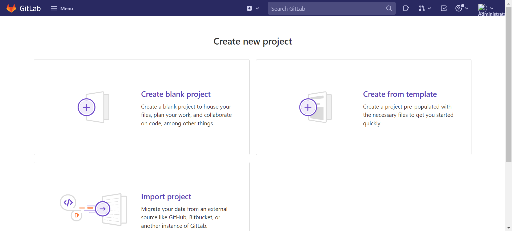

Project name 输入 `datakit-conf`，点击「Create Project」。


进入 dk-config 项目，新建 `container.conf` 文件，内容如下。container 开启了指标采集，关闭所有镜像的 stdout 日志采集。

??? quote "`container.conf`"

    ```toml
    [inputs.container]
      docker_endpoint = "unix:///var/run/docker.sock"
      containerd_address = "/var/run/containerd/containerd.sock"

      enable_container_metric = true
      enable_k8s_metric = true
      enable_pod_metric = true

      ## Containers logs to include and exclude, default collect all containers. Globs accepted.
      container_include_log = []
      container_exclude_log = ["image:*"]

      exclude_pause_container = true

      ## Removes ANSI escape codes from text strings
      logging_remove_ansi_escape_codes = false

      kubernetes_url = "https://kubernetes.default:443"

      ## Authorization level:
      ##   bearer_token -> bearer_token_string -> TLS
      ## Use bearer token for authorization. ('bearer_token' takes priority)
      ## linux at:   /run/secrets/kubernetes.io/serviceaccount/token
      ## windows at: C:\var\run\secrets\kubernetes.io\serviceaccount\token
      bearer_token = "/run/secrets/kubernetes.io/serviceaccount/token"
      # bearer_token_string = "<your-token-string>"

      [inputs.container.tags]
        # some_tag = "some_value"
        # more_tag = "some_other_value"

    ```


然后点击 「Clone」 - 「Clone with HTTP」，获取 git 地址是 [http://120.26.37.252/root/dk-config.git](http://120.26.37.252/root/dk-config.git)。

### 步骤 2：创建命名空间

为方便管理，DataKit 安装到 datakit 命名空间。<br/>
登录「Rancher」 - 「集群」 - 「项目/命名空间」，点击「创建命名空间」。

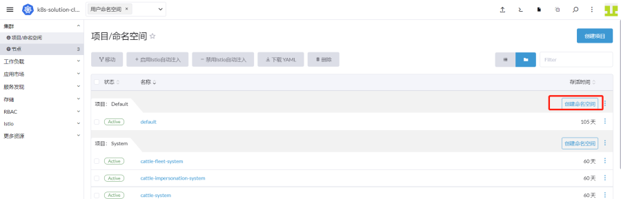

名称输入「datakit」，点击「创建」。


### 步骤 3：添加 Chart 仓库

登录「Rancher」 - 「集群」 - 「应用市场」 - 「Chart 仓库」，点击「创建」。名称输入 **datakit**，URL 输入 [https://pubrepo.guance.com/chartrepo/datakit](https://pubrepo.guance.com/chartrepo/datakit)，点击「创建」。

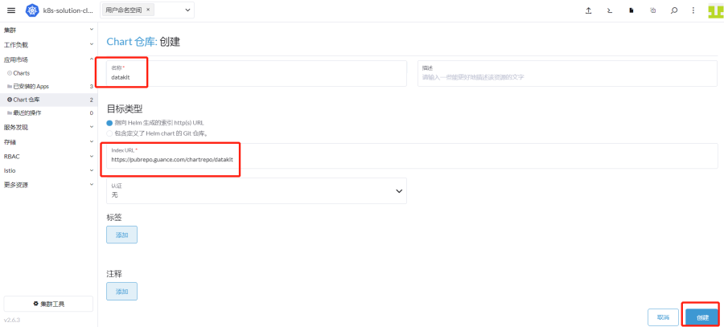

### 步骤 4：部署 DataKit

登录「Rancher」 - 「集群」 - 「应用市场」 - 「Charts」，选择「datakit」，出现下图带 **DataKit** 的图标，点击进去。


点击「安装」。

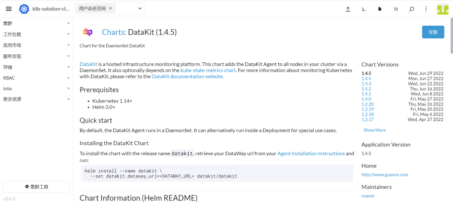

命名空间选择「datakit」，点击「下一步」。

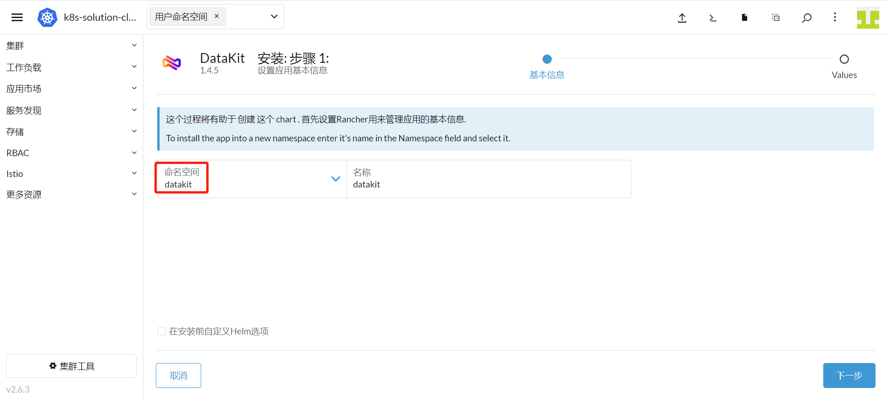

点击「Datakit Configuration」，把 `<your-token>` 替换成<<< custom_key.brand_name >>>的 token。由于本次使用自定义 container 采集器配置，所以把 `Enable the default Inputs` 中的 `container` 去掉。

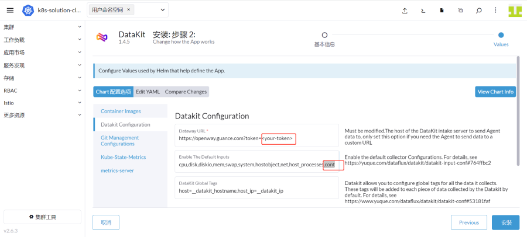

点击「Git Management Configurations」来设置 git 仓库信息，如下图所示。

- 选中「Enable Use Git Management Configurations」
- 「The Git Hub Url」 填 dk-config 的 git 地址 [http://120.26.37.252/root/dk-config.git](http://120.26.37.252/root/dk-config.git)，并把 git 的用户名 root、密码 xxxxxx 放到 `http://` 后面。
- 「The Git Branch」填分支 main。

然后点击「安装」

> **注意：**如果选中「Enable git SSH key」，即是通过 SSH 方式来拉取 Git 仓库中的配置。

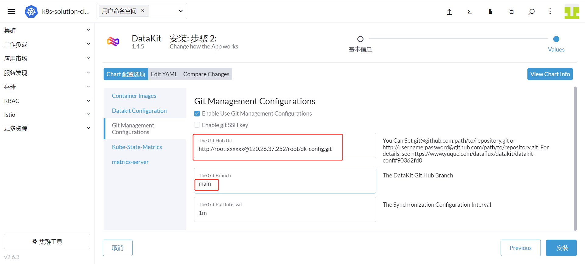

点击「Kube-State-Metrics」，选中「Deployment KubeState Metrics Deployment」，即会安装 `kube-state-metrics` 组件；如不需要可以不选。

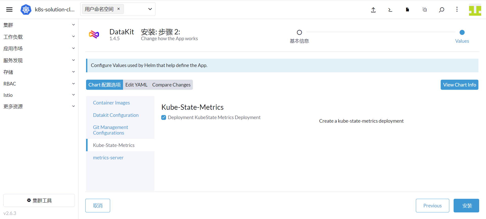

点击「metrics-server」，选中 「Deployment kubeState Metrics Server Deployment」，即会安装 `metrics-server` 组件；如不需要可以不选。

最后点击「安装」


### 步骤 5：资源限额

为了限制 DataKit 使用的 CPU 和内存，可以通过 Rancher 限制 DataKit 的资源使用。

进入「集群」 - 「工作负载」 - 「DaemonSets」，点击 datakit 行的右边，选择「编辑配置」，进入后点击「资源限制和预留」，根据服务器的资源进行合理分配，然后点击「保存」。


### 步骤 6：验证指标采集

登录「Rancher」，点击右上方的命令行图标，执行如下命令进入 datakit。<br/>
查看 gitrepos 目录下有 `container.conf` 文件即表示能正常拉取 git 仓库配置了。

```shell
 kubectl get pods -n datakit
 kubectl exec -it datakit-qc58m -n datakit bash
 cd gitrepos/
 ls
```

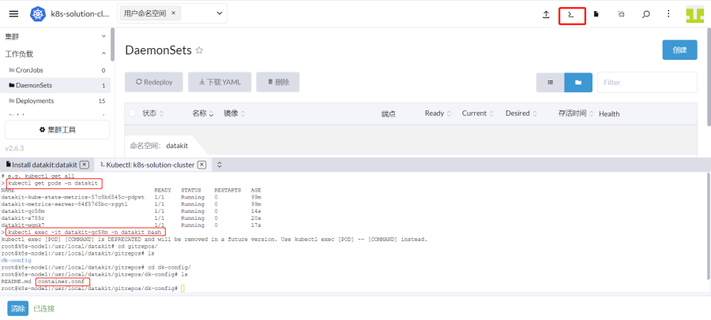

登录「[<<< custom_key.brand_name >>>](https://<<< custom_key.studio_main_site >>>/)」 - 「指标」，选中 「kubernetes」指标集，查看指标有数据，即表示指标采集正常。

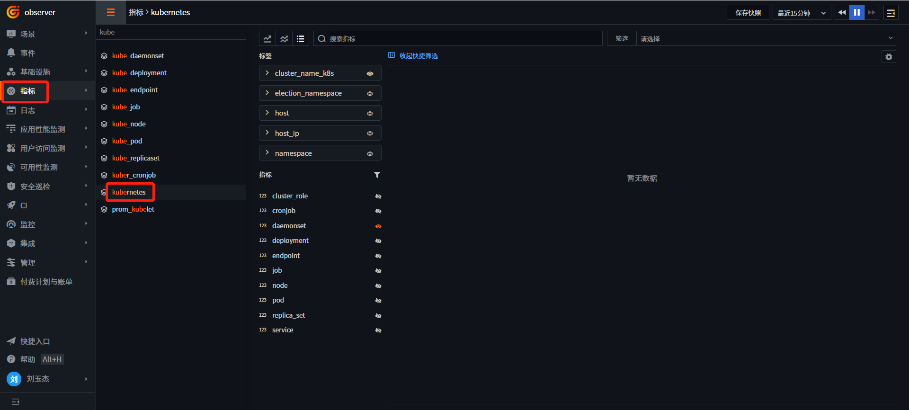

### 步骤 7：升级

当 DataKit 有版本升级时，Rancher UI 上可看到可以升级的版本。

进入 Rancher「集群」 - 「应用市场」 - 「已安装的 Apps」，在 datakit 行的「升级」列，有待升级的版本 `1.4.6` ，点击后进入升级界面。


选择版本 `1.4.6` ，点击「下一步」。

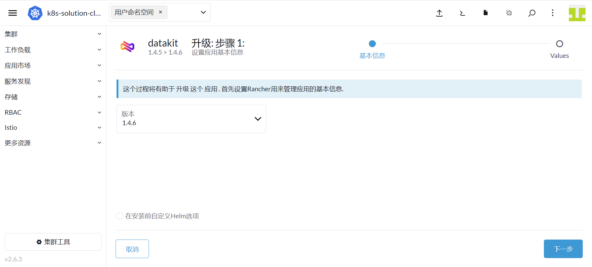

点击「升级」。

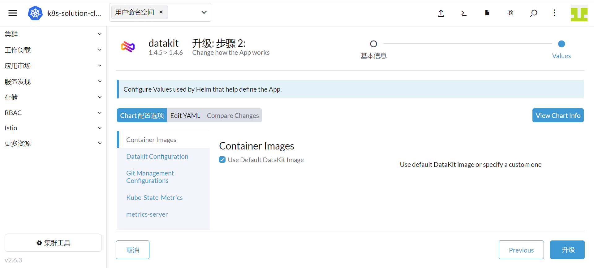

升级完成后，可以看到 DataKit 版本已经是 `1.4.6`。

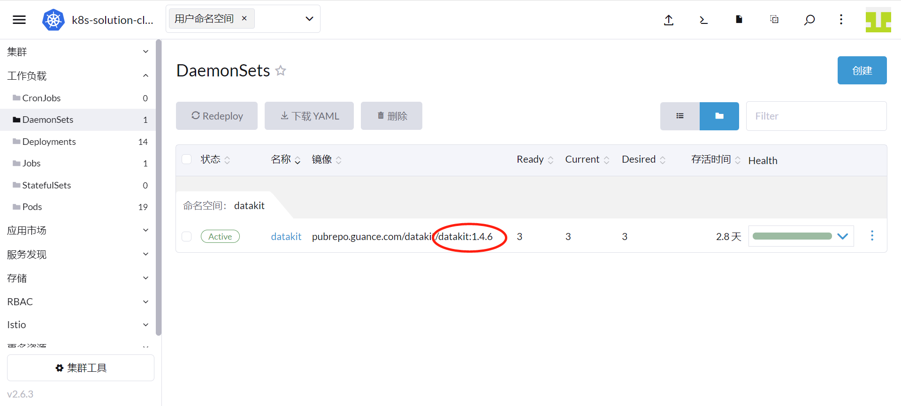
