# 使用 Rancher 部署和管理 DataKit，快速构建 Kubernetes 生态的可观测

---

## 简介

企业有一定规模后，服务器、Kubernetes 环境、微服务应用会越来越多，如何高效地对这些资源进行可观测，节省人力、资源成本是企业面临的问题。通过一键部署 Rancher 应用商店内的 Datakit，观测云对 Rancher 管控的 K8s 集群，提供了大量开箱即用的可观测功能。

本文通过一个耳熟能详的 service mesh 微服务架构 Bookinfo 案例，详细解释下如何利用观测云一键提升 K8s、istio、持续集成、金丝雀发布等微服务端到端全链路的可观测性。

观测云是一家致力于云原生领域可观测的头部企业，使用一个平台、部署 DataKit Agent 即可把主机、应用的指标、链路、日志串联起来。用户登录观测云，即可实时主动观测自己的 K8s 运行时与微服务应用健康状态。

## 案例假设

假设一公司拥有若干台云服务器，两套 Kubernetes 集群，一套生产环境、一套测试环境，测试环境有一台 Master 节点，两台 Node 节点。在云服务器上部署了 Harbor、Gitlab、在 Kubernetes 测试环境部署了 Istio 项目 bookinfo。

现在使用观测云进行主机、Kubernetes 集群、Gitlab CI、金丝雀发布、RUM、APM、Istio 等做可观测。

## 前置条件

- 安装 [Kubernetes](https://kubernetes.io/docs/setup/production-environment/tools/) 1.18+。
- 安装 [Rancher](https://rancher.com/docs/rancher/v2.6/en/installation/)，并有操作 Kubernetes 集群的权限。
- 安装 [Gitlab](https://about.gitlab.com/)。
- 安装 [Helm](https://github.com/helm/helm) 3.0+。
- 部署 harbor 仓库或其它镜像仓库。

## 操作步骤

???+ warning

    本次示例使用版本信息如下：DataKit `1.4.0`、Kubernetes 1`.22.6`、Rancher `2.6.3`、Gitlab `14.9.4`、Istio `1.13.2`。版本不同，配置可能存在差异。

### 步骤 1 使用 Rancher 安装 DataKit

为方便管理，DataKit 安装到 datakit 命名空间。 <br/>
登录「Rancher」 - 「集群」 - 「项目/命名空间」，点击「创建命名空间」。


名称输入「datakit」，点击「创建」。
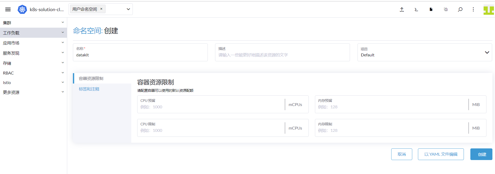

「集群」 - 「应用市场」 - 「Chart 仓库」，点击「创建」。<br/>
名称输入 「datakit」，URL 输入 `[https://pubrepo.guance.com/chartrepo/datakit](https://pubrepo.guance.com/chartrepo/datakit)`，点击「创建」。
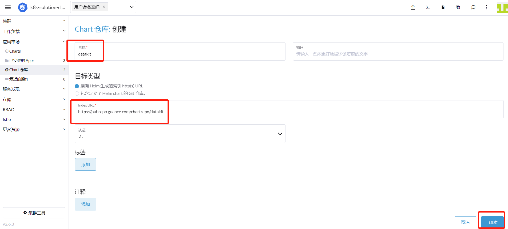

「集群」 - 「应用市场」 - 「Charts」，选择「datakit」，出现下图带 **DataKit** 的图表，点击进去。


点击「安装」。


命名空间选择「datakit」，点击「下一步」。
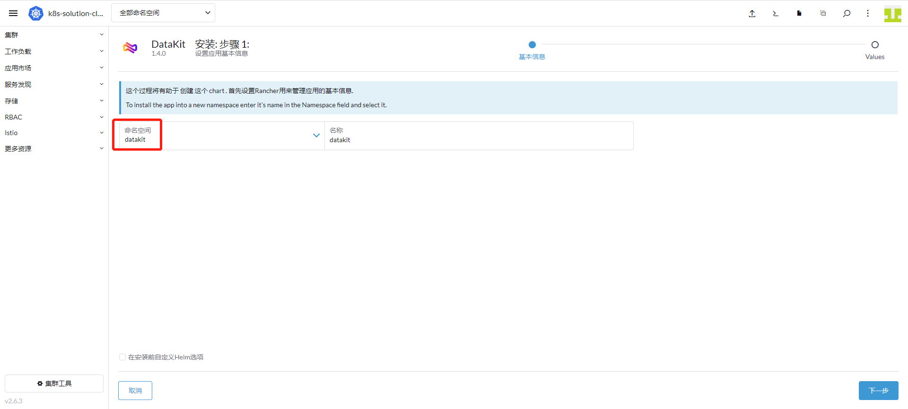

登录「[观测云](https://console.guance.com/)」，进入「管理」模块，找到下图中 `token`，点击旁边的「复制图标」。
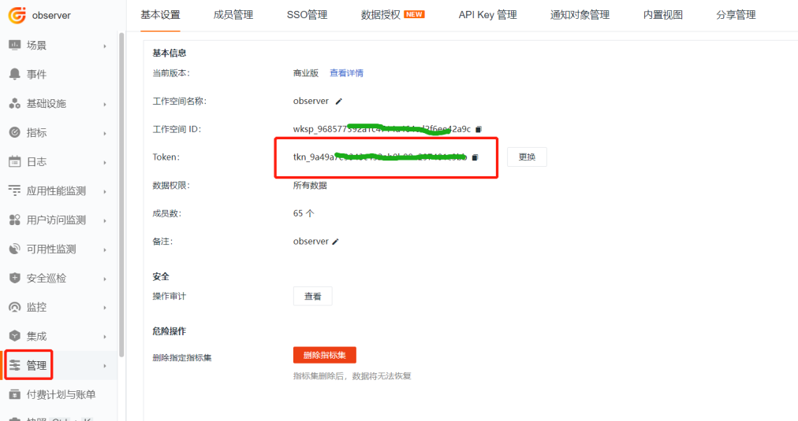

切换到 Rancher 界面：

- 替换下图中的 token 为刚刚复制的 token
- 「Enable The Default Inputs」增加「ebpf 采集器」，即在最后增加 “`,ebpf`”（**注意是以逗号做分割**）
- 「DataKit Global Tags」最后增加 “`,cluster_name_k8s=k8s-prod`”。（其中 k8s-prod 为您的集群名称，可以自己定义，为集群采集到的指标设置全局 tag。）


点击「Kube-State-Metrics」，选择「安装」。


点击「metrics-server」，选择「安装」，点击下发「安装」按钮。
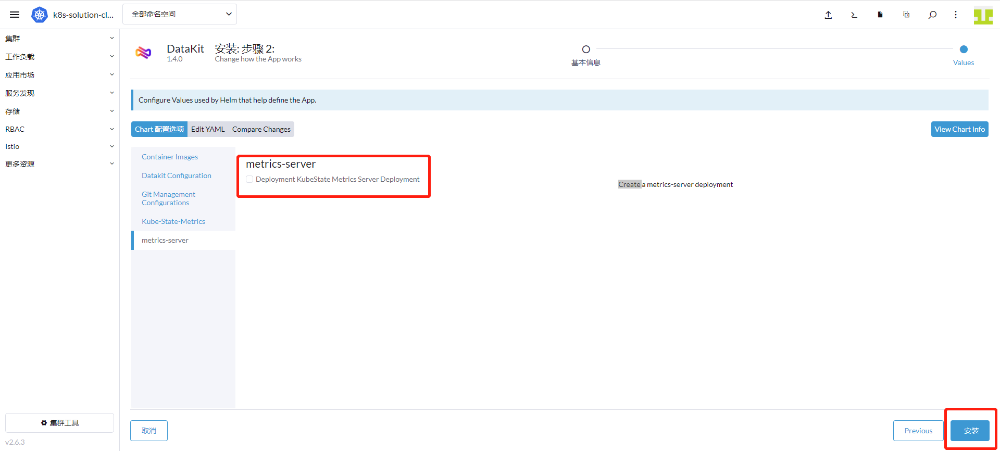

进入「集群」 - 「应用市场」 - 「已安装的 Apps」，查看到 DataKit 已经安装成功。
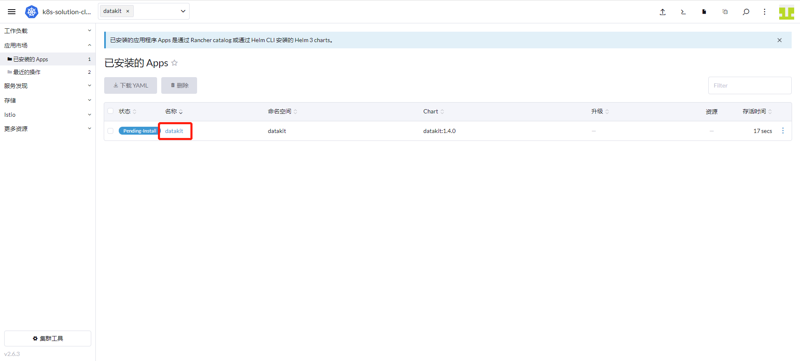

进入「集群」 - 「工作负载」 - 「Pods」，可以查看到 datakit 命名空间已经运行了 3 个 Datakit 、1 个 kube-state-metrics 和 1 个 metrics-server。
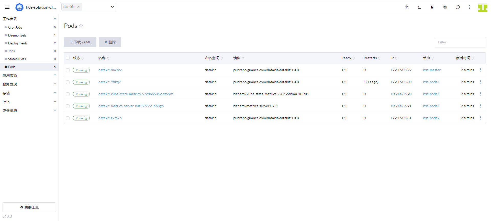

由于公司有多个集群，需要增加 `ENV_NAMESPACE` 环境变量，这个环境变量是为了区分不同集群的选举，多个集群 value 值不能相同。<br/>
进入「集群」 - 「工作负载」 - 「DaemonSets」，点击 datakit 行的右边，选择「编辑配置」。


这里变量名输入 `ENV_NAMESPACE` ，值是 `guance-k8s` ，点击「保存」。
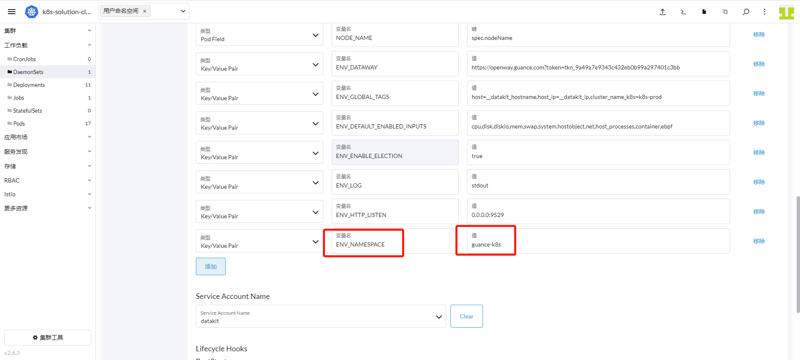

### 步骤 2 开启 Kubernetes 可观测

#### 2.1 ebpf 可观测

1、 开启采集器

在部署 DataKit 时已经开启了 **ebpf 采集器**

2、 ebpf 视图

登录「[观测云](https://console.guance.com/)」 - 「基础设施」，点击「k8s-node1」。


点击 「网络」，查看 ebpf 的监控视图。

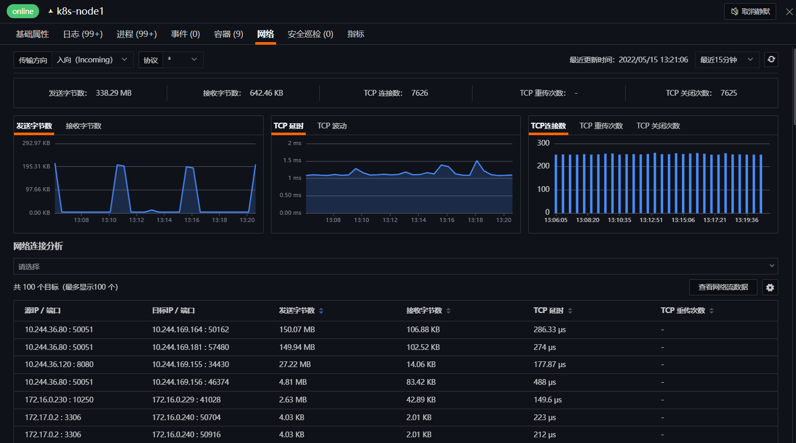


#### 2.2 容器可观测

1、 开启采集器

DataKit 默认已开启 Container 采集器，这里介绍一下自定义采集器配置。

登录「Rancher」 - 「集群」 - 「存储」 - 「ConfigMaps」，点击「创建」。

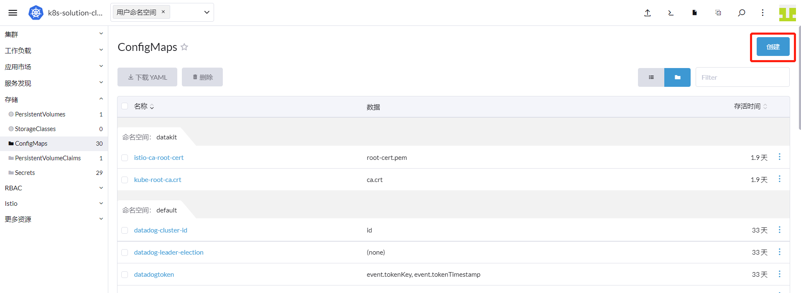

命名空间输入「datakit」，名称输入「datakit-conf」，键输入「container.conf」，值输入如下内容。

> **注意：**生产环境建议设置 `container_include_log = []` 且 `container_exclude_log = ["image:*"]`，然后在需要采集 log 的 Pod 上增加 annotations 来采集指定 container 的日志。

```toml
      [inputs.container]
        docker_endpoint = "unix:///var/run/docker.sock"
        containerd_address = "/var/run/containerd/containerd.sock"

        enable_container_metric = true
        enable_k8s_metric = true
        enable_pod_metric = true

        ## Containers logs to include and exclude, default collect all containers. Globs accepted.
        container_include_log = []
        container_exclude_log = ["image:pubrepo.jiagouyun.com/datakit/logfwd*", "image:pubrepo.jiagouyun.com/datakit/datakit*"]

        exclude_pause_container = true

        ## Removes ANSI escape codes from text strings
        logging_remove_ansi_escape_codes = false

        kubernetes_url = "https://kubernetes.default:443"

        ## Authorization level:
        ##   bearer_token  - bearer_token_string  - TLS
        ## Use bearer token for authorization. ('bearer_token' takes priority)
        ## linux at:   /run/secrets/kubernetes.io/serviceaccount/token
        ## windows at: C:\var\run\secrets\kubernetes.io\serviceaccount\token
        bearer_token = "/run/secrets/kubernetes.io/serviceaccount/token"
        # bearer_token_string = "<your-token-string>"

        [inputs.container.tags]
          # some_tag = "some_value"
          # more_tag = "some_other_value"
```

填写内容如下图，点击「创建」。


「集群」 - 「工作负载」 - 「DaemonSets」，找到 datakit，点击「编辑配置」。

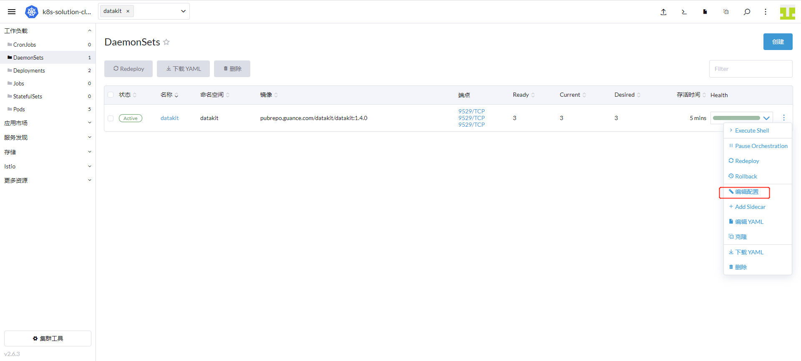

点击「存储」。

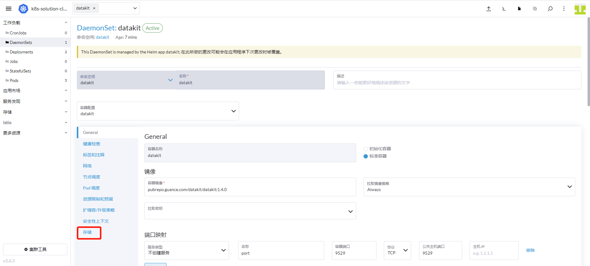

点击「添加卷」 - 「配置映射」。

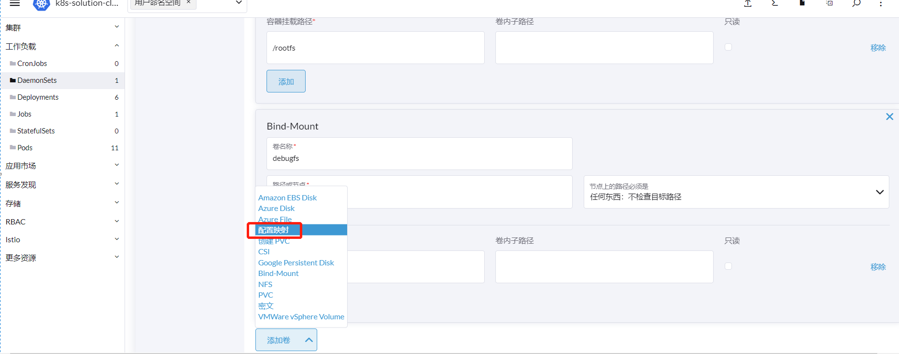

卷名称这里输入「datakit-conf」，配置映射选择「`datakit.conf`」，卷内子路径输入「`container.conf`」，容器挂载路径输入 `/usr/local/datakit/conf.d/container/container.conf` ，点击「保存」。

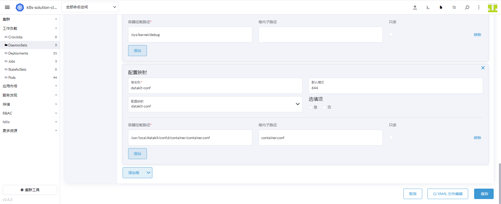

2、 Container 监控视图

登录「[观测云](https://console.guance.com/)」 - 「基础设施」 - 「容器」，输入「`host:k8s-node1`」 ，显示 k8s-node1 节点的容器，点击「ingress」。


点击「指标」，查看 DataKit Container 的监控视图。
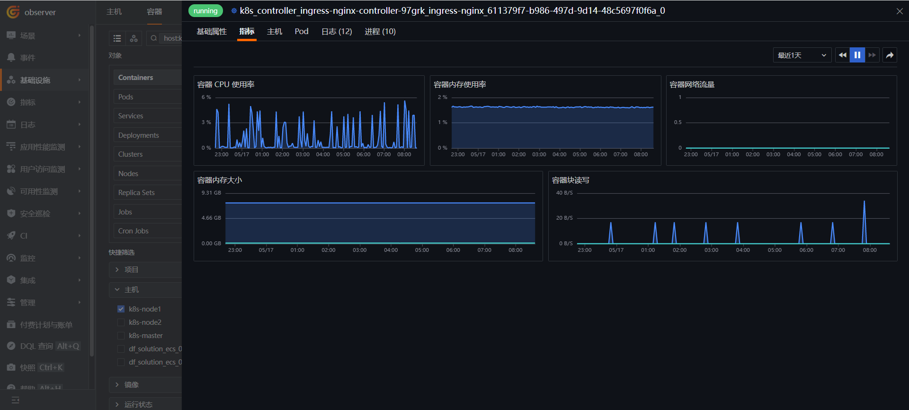

#### 2.3 Kubernetes 监控视图

1、 部署采集器

在安装 DataKit 时已经安装了 metric-server 和 Kube-State-Metrics。

2、 部署 Kubernetes 监控视图

登录「[观测云](https://console.guance.com/)」，进入「场景」模块，点击「新建仪表板」，输入「kubernetes 监控」，选择 「Kubernetes 监控视图」，点击「确定」。
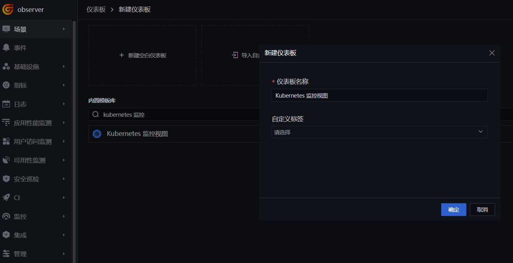

点击新建的「Kubernetes 监控视图」，查看集群信息。

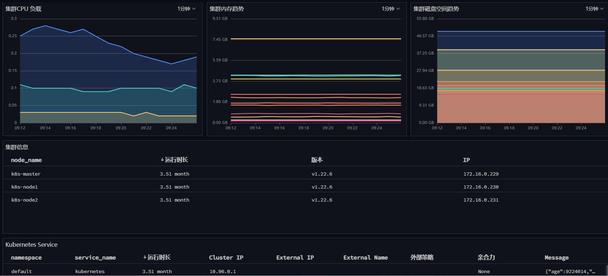

#### 2.4 Kubernetes Overview with Kube State Metrics 监控视图

1、 开启采集器

登录「Rancher」 - 「集群」 - 「存储」 - 「ConfigMaps」，找到 datakit-conf，点击「编辑配置」。
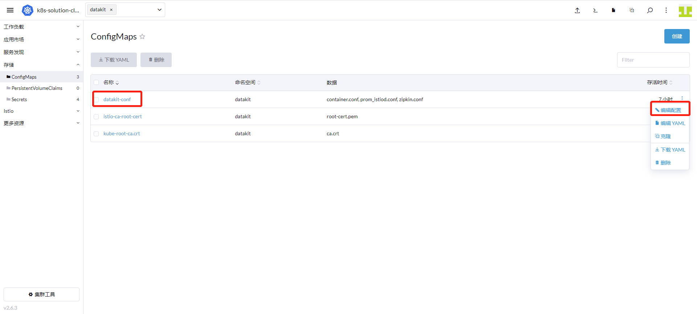

点击「添加」，键输入「`kube-state-metrics.conf`」，值输入如下内容，点击「保存」。

```toml
          [[inputs.prom]]
            urls = ["http://datakit-kube-state-metrics.datakit.svc.cluster.local:8080/metrics","http://datakit-kube-state-metrics.datakit.svc.cluster.local:8081/metrics"]
            source = "prom_state_metrics"
            metric_types = ["counter", "gauge"]
            interval = "60s"
            tags_ignore = ["access_mode","branch","claim_namespace","cluster_ip","condition","configmap","container","container_id","container_runtime_version","created_by_kind","created_by_name","effect","endpoint","external_name","goversion","host_network","image","image_id","image_spec","ingress","ingressclass","internal_ip","job_name","kernel_version","key","kubelet_version","kubeproxy_version","lease","mutatingwebhookconfiguration","name","networkpolicy","node","node_name","os_image","owner_is_controller","owner_kind","owner_name","path","persistentvolume","persistentvolumeclaim","pod_cidr","pod_ip","poddisruptionbudget","port_name","port_number","port_protocol","priority_class","reason","resource","result","revision","role","secret","service","service_name","service_port","shard_ordinal","status","storageclass","system_uuid","type","uid","unit","version","volume","volumename"]
            metric_name_filter = ["kube_pod_status_phase","kube_pod_container_status_restarts_total","kube_daemonset_status_desired_number_scheduled","kube_daemonset_status_number_ready","kube_deployment_spec_replicas","kube_deployment_status_replicas_available","kube_deployment_status_replicas_unavailable","kube_replicaset_status_ready_replicas","kube_replicaset_spec_replicas","kube_pod_container_status_running","kube_pod_container_status_waiting","kube_pod_container_status_terminated","kube_pod_container_status_ready"]
            #measurement_prefix = ""
            measurement_name = "prom_state_metrics"
            #[[inputs.prom.measurements]]
            # prefix = "cpu_"
            # name = "cpu"
            [inputs.prom.tags]
            namespace = "$NAMESPACE"
            pod_name = "$PODNAME"
```

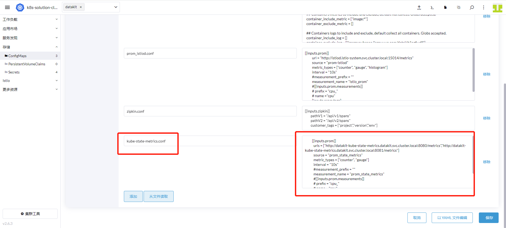

进入「集群」 - 「工作负载」 - 「DaemonSets」，点击 datakit 行的右边，选择「编辑配置」。 <br/>
点击「存储」，找到卷名称是「datakit-conf」的配置映射，点击「添加」，容器挂载路径填「`/usr/local/datakit/conf.d/prom/kube-state-metrics.conf`」，卷内子路径输入「`kube-state-metrics.conf`」，点击「保存」。


2、 Kubernetes Overview with Kube State Metrics 监控视图

登录「[观测云](https://console.guance.com/)」，进入「场景」模块，点击「新建仪表板」，输入「kubernetes Overview」，选择 「Kubernetes Overview with Kube State Metrics 监控视图」，点击「确定」。

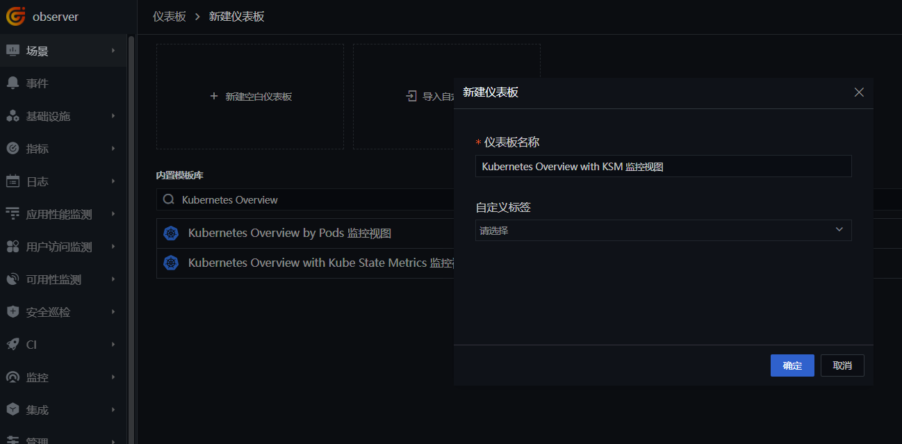

点击新建的「Kubernetes Overview with KSM 监控视图」，查看集群信息。
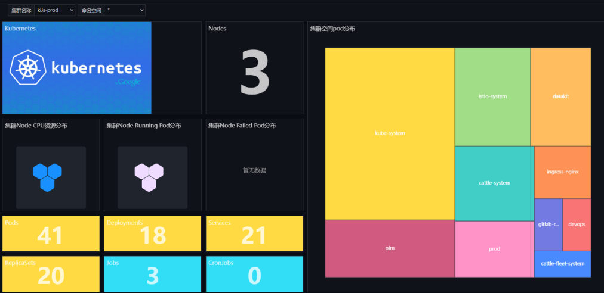

#### 2.5 Kubernetes Overview by Pods 监控视图

登录「[观测云](https://console.guance.com/)」，进入「场景」模块，点击「新建仪表板」，输入「kubernetes Overview by」，选择 「Kubernetes Overview by Pods 监控视图」，点击「确定」。
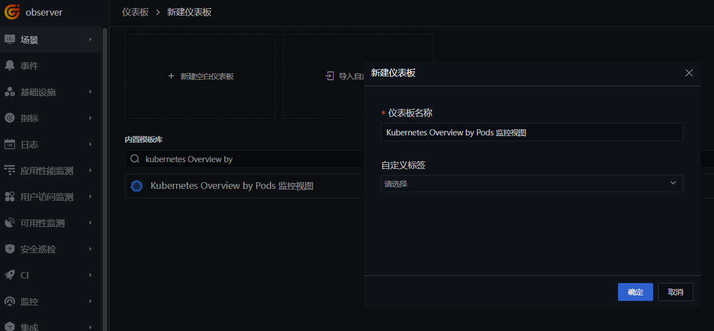

点击新建的「Kubernetes Overview by Pods 监控视图」，查看集群信息。
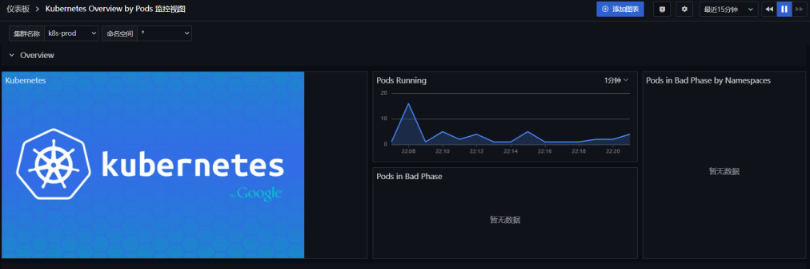


#### 2.6 Kubernetes Services 监控视图

登录「[观测云](https://console.guance.com/)」，进入「场景」模块，点击「新建仪表板」，输入「kubernetes Services」，选择 「Kubernetes Services 监控视图」，点击「确定」。
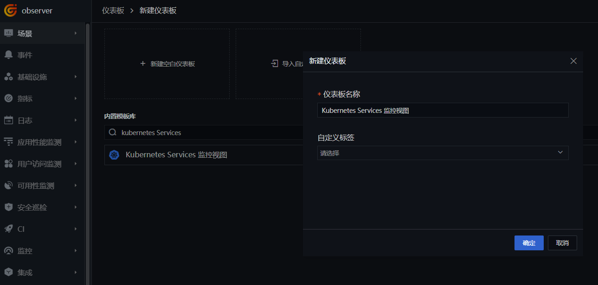

点击新建的「Kubernetes Services 监控视图」，查看集群信息。
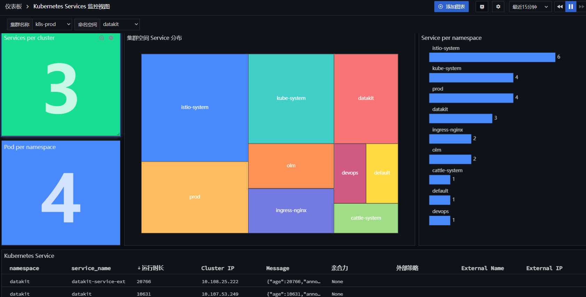

### 步骤 3 部署 Istio 及应用

#### 3.1 部署 Istio

登录「Rancher」 - 「应用市场」 - 「Charts」，选择 Istio 进行安装。


#### 3.2 开通 Sidecar 注入

新建 prod 命名空间，开启该空间下创建 Pod 时自动注入 Sidecar，让 Pod 的出入流量都转由 Sidecar 进行处理。

登录「Rancher」 - 「集群」 - 「项目/命名空间」，点击「创建命名空间」。


名称输入「prod」，点击「创建」。
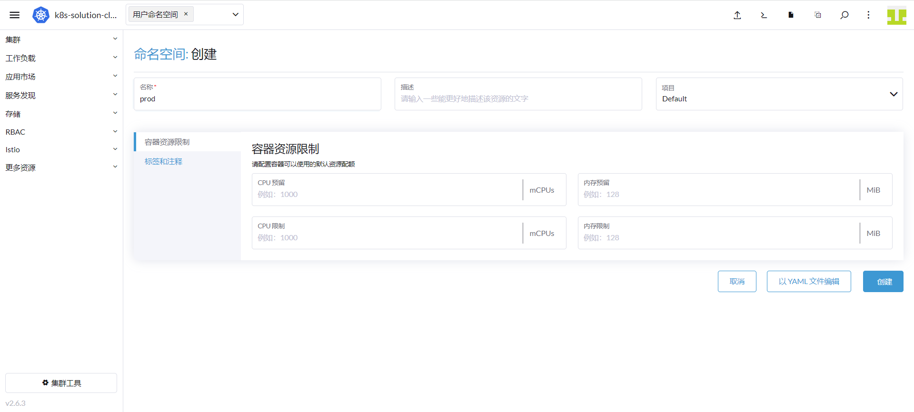

点击 Rancher 上方的「命令行」图标，输入「`kubectl label namespace prod istio-injection=enabled`」，回车。
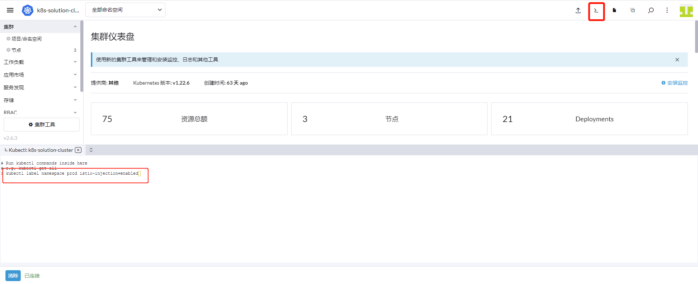

#### 3.3 开启 Istiod 采集器

登录「Rancher」 - 「集群」 - 「服务发现」 - 「Service」，查看 Service 名称是 istiod，空间是 istio-system。
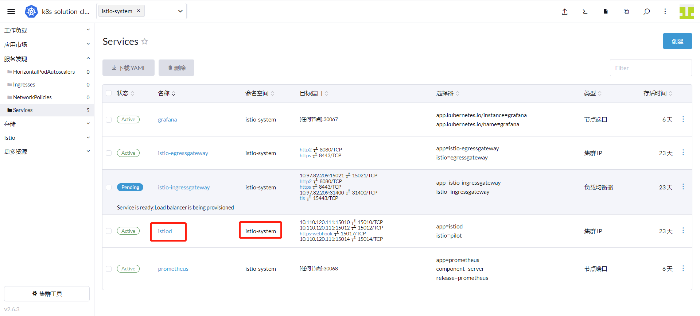

登录「Rancher」 - 「集群」 - 「存储」 - 「ConfigMaps」，找到 datakit-conf，点击「编辑配置」。


点击「添加」，键输入「`prom-istiod.conf`」，值输入如下内容。点击「保存」。

```toml
        [[inputs.prom]]
          url = "http://istiod.istio-system.svc.cluster.local:15014/metrics"
          source = "prom-istiod"
          metric_types = ["counter", "gauge"]
          interval = "60s"
          tags_ignore = ["cache","cluster_type","component","destination_app","destination_canonical_revision","destination_canonical_service","destination_cluster","destination_principal","group","grpc_code","grpc_method","grpc_service","grpc_type","reason","request_protocol","request_type","resource","responce_code_class","response_flags","source_app","source_canonical_revision","source_canonical-service","source_cluster","source_principal","source_version","wasm_filter"]
          #measurement_prefix = ""
          metric_name_filter = ["istio_requests_total","pilot_k8s_cfg_events","istio_build","process_virtual_memory_bytes","process_resident_memory_bytes","process_cpu_seconds_total","envoy_cluster_assignment_stale","go_goroutines","pilot_xds_pushes","pilot_proxy_convergence_time_bucket","citadel_server_root_cert_expiry_timestamp","pilot_conflict_inbound_listener","pilot_conflict_outbound_listener_http_over_current_tcp","pilot_conflict_outbound_listener_tcp_over_current_tcp","pilot_conflict_outbound_listener_tcp_over_current_http","pilot_virt_services","galley_validation_failed","pilot_services","envoy_cluster_upstream_cx_total","envoy_cluster_upstream_cx_connect_fail","envoy_cluster_upstream_cx_active","envoy_cluster_upstream_cx_rx_bytes_total","envoy_cluster_upstream_cx_tx_bytes_total","istio_request_duration_milliseconds_bucket","istio_request_duration_seconds_bucket","istio_request_bytes_bucket","istio_response_bytes_bucket"]
          measurement_name = "istio_prom"
          #[[inputs.prom.measurements]]
          # prefix = "cpu_"
          # name ="cpu"
          [inputs.prom.tags]
            app_id="istiod"
```

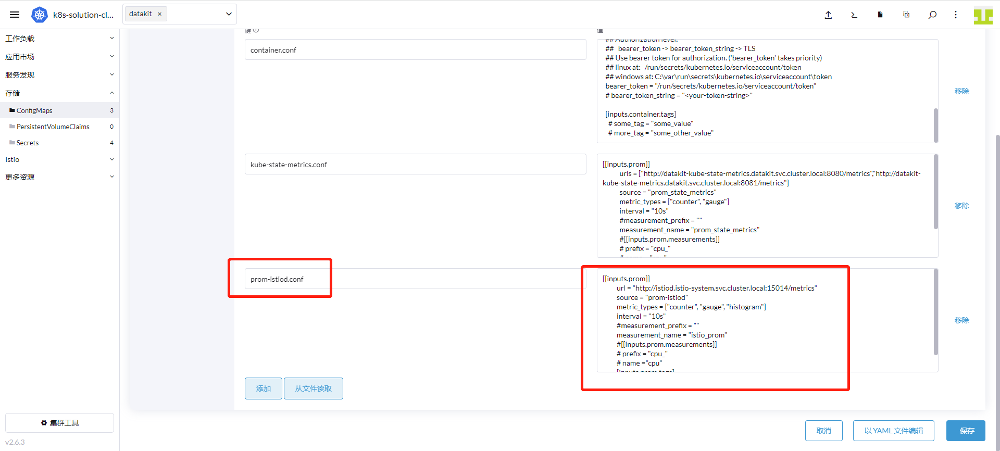

进入「集群」 - 「工作负载」 - 「DaemonSets」，点击 datakit 行的右边，选择「编辑配置」。<br/>
点击「存储」，找到卷名称是“datakit-conf”的配置映射，点击「添加」。输入以下内容后，点击「保存」：

- 容器挂载路径填 `/usr/local/datakit/conf.d/prom/prom-istiod.conf`
- 卷内子路径输入 `prom-istiod.conf`


#### 3.4 开启 ingressgateway 和 egressgateway 采集器

采集 ingressgateway 和 egressgateway 使用 Service 来访问 15020 端口，所以需要新建 ingressgateway 和 egressgateway 的 Service。 

登录「Rancher」 - 「集群」，点击上方的「导入 YAML」图标，输入下面的内容，点击「导入」即完成 Service 的创建。

```yaml
apiVersion: v1
kind: Service
metadata:
  name: istio-ingressgateway-ext
  namespace: istio-system
spec:
  ports:
    - name: http-monitoring
      port: 15020
      protocol: TCP
      targetPort: 15020
  selector:
    app: istio-ingressgateway
    istio: ingressgateway
  type: ClusterIP

---
apiVersion: v1
kind: Service
metadata:
  name: istio-egressgateway-ext
  namespace: istio-system
spec:
  ports:
    - name: http-monitoring
      port: 15020
      protocol: TCP
      targetPort: 15020
  selector:
    app: istio-egressgateway
    istio: egressgateway
  type: ClusterIP
```

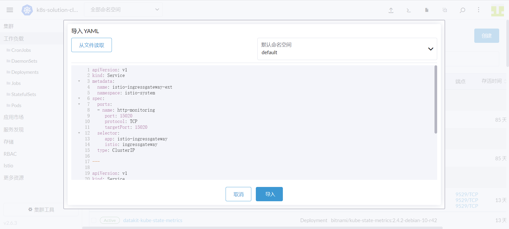

登录「Rancher」 - 「集群」 - 「存储」 - 「ConfigMaps」，找到 datakit-conf，点击「编辑配置」。<br/>
点击「添加」，键分别输入「`prom-ingressgateway.conf`」和 「`prom-egressgateway.conf`」，值参考如下内容。点击「保存」。

```yaml
#### ingressgateway
prom-ingressgateway.conf: |-
  [[inputs.prom]] 
    url = "http://istio-ingressgateway-ext.istio-system.svc.cluster.local:15020/stats/prometheus"
    source = "prom-ingressgateway"
    metric_types = ["counter", "gauge"]
    interval = "60s"
    tags_ignore = ["cache","cluster_type","component","destination_app","destination_canonical_revision","destination_canonical_service","destination_cluster","destination_principal","group","grpc_code","grpc_method","grpc_service","grpc_type","reason","request_protocol","request_type","resource","responce_code_class","response_flags","source_app","source_canonical_revision","source_canonical-service","source_cluster","source_principal","source_version","wasm_filter"]
    metric_name_filter = ["istio_requests_total","pilot_k8s_cfg_events","istio_build","process_virtual_memory_bytes","process_resident_memory_bytes","process_cpu_seconds_total","envoy_cluster_assignment_stale","go_goroutines","pilot_xds_pushes","pilot_proxy_convergence_time_bucket","citadel_server_root_cert_expiry_timestamp","pilot_conflict_inbound_listener","pilot_conflict_outbound_listener_http_over_current_tcp","pilot_conflict_outbound_listener_tcp_over_current_tcp","pilot_conflict_outbound_listener_tcp_over_current_http","pilot_virt_services","galley_validation_failed","pilot_services","envoy_cluster_upstream_cx_total","envoy_cluster_upstream_cx_connect_fail","envoy_cluster_upstream_cx_active","envoy_cluster_upstream_cx_rx_bytes_total","envoy_cluster_upstream_cx_tx_bytes_total","istio_request_duration_milliseconds_bucket","istio_request_duration_seconds_bucket","istio_request_bytes_bucket","istio_response_bytes_bucket"]
    #measurement_prefix = ""
    measurement_name = "istio_prom"
    #[[inputs.prom.measurements]]
    # prefix = "cpu_"
    # name ="cpu"
#### egressgateway
prom-egressgateway.conf: |-
  [[inputs.prom]] 
    url = "http://istio-egressgateway-ext.istio-system.svc.cluster.local:15020/stats/prometheus"
    source = "prom-egressgateway"
    metric_types = ["counter", "gauge"]
    interval = "60s"
    tags_ignore = ["cache","cluster_type","component","destination_app","destination_canonical_revision","destination_canonical_service","destination_cluster","destination_principal","group","grpc_code","grpc_method","grpc_service","grpc_type","reason","request_protocol","request_type","resource","responce_code_class","response_flags","source_app","source_canonical_revision","source_canonical-service","source_cluster","source_principal","source_version","wasm_filter"]
    metric_name_filter = ["istio_requests_total","pilot_k8s_cfg_events","istio_build","process_virtual_memory_bytes","process_resident_memory_bytes","process_cpu_seconds_total","envoy_cluster_assignment_stale","go_goroutines","pilot_xds_pushes","pilot_proxy_convergence_time_bucket","citadel_server_root_cert_expiry_timestamp","pilot_conflict_inbound_listener","pilot_conflict_outbound_listener_http_over_current_tcp","pilot_conflict_outbound_listener_tcp_over_current_tcp","pilot_conflict_outbound_listener_tcp_over_current_http","pilot_virt_services","galley_validation_failed","pilot_services","envoy_cluster_upstream_cx_total","envoy_cluster_upstream_cx_connect_fail","envoy_cluster_upstream_cx_active","envoy_cluster_upstream_cx_rx_bytes_total","envoy_cluster_upstream_cx_tx_bytes_total","istio_request_duration_milliseconds_bucket","istio_request_duration_seconds_bucket","istio_request_bytes_bucket","istio_response_bytes_bucket"]
    #measurement_prefix = ""
    measurement_name = "istio_prom"
    #[[inputs.prom.measurements]]
    # prefix = "cpu_"
    # name ="cpu"
```

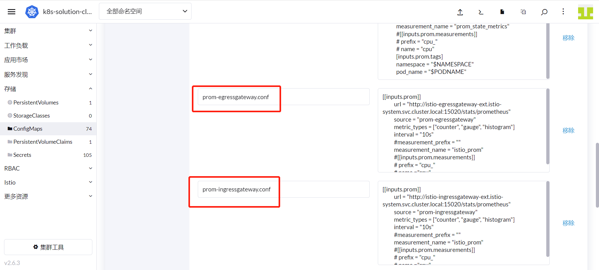

进入「集群」 - 「工作负载」 - 「DaemonSets」，点击 datakit 行的右边，选择「编辑配置」。<br/>
点击「存储」，找到卷名称是“datakit-conf”的配置映射，添加2次内容并保存：<br/>
第1次点击「添加」，输入以下内容后，点击「保存」：

- 容器挂载路径填 `/usr/local/datakit/conf.d/prom/prom-ingressgateway.conf` 
- 卷内子路径输入`prom-ingressgateway.conf`

第2次点击「添加」，输入以下内容后，点击「保存」：

- 容器挂载路径填 `/usr/local/datakit/conf.d/prom/prom-egressgateway.conf`
- 卷内子路径输入 `prom-egressgateway.conf`


#### 3.5 开启 Zipkin 采集器

登录「Rancher」 - 「集群」 - 「存储」 - 「ConfigMaps」，找到 datakit-conf，点击「编辑配置」。


点击「添加」，键输入「`zipkin.conf`」，值输入如下内容。点击「保存」。

```toml
      [[inputs.zipkin]]
        pathV1 = "/api/v1/spans"
        pathV2 = "/api/v2/spans"
        customer_tags = ["project","version","env"]
```


进入「集群」 - 「工作负载」 - 「DaemonSets」，点击 datakit 行的右边，选择「编辑配置」。 点击「存储」，找到卷名称是“datakit-conf”的配置映射，点击「添加」，输入以下内容后，点击「保存」：

- 容器挂载路径填 `/usr/local/datakit/conf.d/zipkin/zipkin.conf`
- 卷内子路径输入 `zipkin.conf`


#### 3.6 映射 DataKit 服务

在 Kubernets 集群中，以 DaemonSet 方式部署 DataKit 后，如果存在部署的某一应用以前是推送链路数据到 istio-system 名称空间的 zipkin 服务，端口是 9411，即访问地址是 `zipkin.istio-system.svc.cluster.local:9411`，这时就需要用到了 Kubernetes 的 ExternalName 服务类型。

先定义一个 ClusterIP 的 服务类型，把 9529 端口转成 9411，然后使用 ExternalName 的服务将 ClusterIP 的服务映射成 DNS 的名称。通过这两步转换，应用就可以与 DataKit 打通了。

1、 定义 Cluster IP 服务

登录「Rancher」 - 「集群」 - 「服务发现」 - 「Service」，点击「创建」- 选择「集群 IP」。
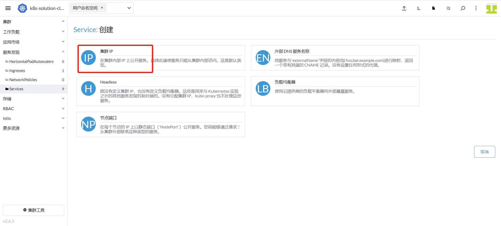

命名空间输入「`datakit`」，名称输入「`datakit-service-ext`」，监听端口输入「`9411`」，目标端口输入「`9529`」。
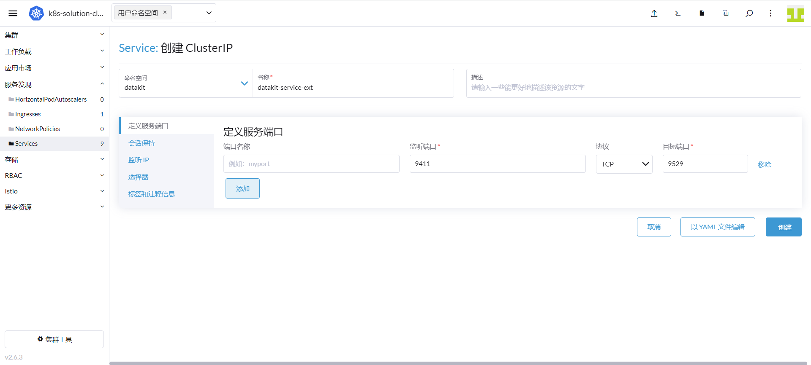

点击「选择器」，键输入「app」，值输入「datakit」，点击「保存」。
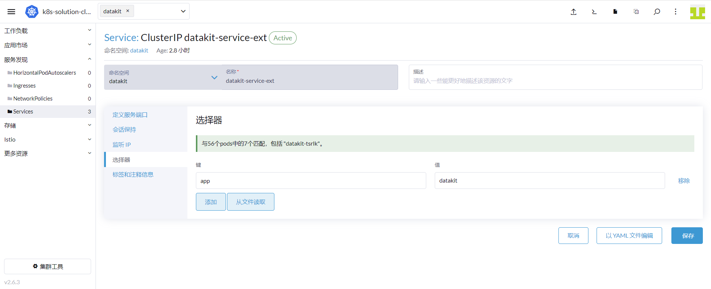

2、 定义 ExternalName 的服务

「集群」 - 「服务发现」 - 「Service」，点击「创建」- 选择「外部 DNS 服务名称」。
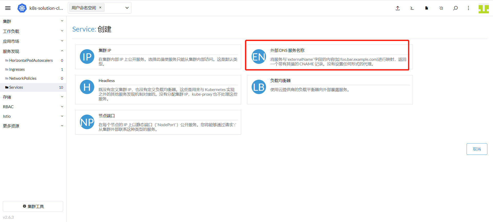

名称空间输入「istio-system」，名称输入「zipkin」，DNS 名称输入「datakit-service-ext.datakit.svc.cluster.local」，点击「创建」。


#### 3.7 创建 Gateway 资源

登录「Rancher」 - 「集群」 - 「Istio」 - 「Gateways」，点击上方的「导入 YAML」图标。
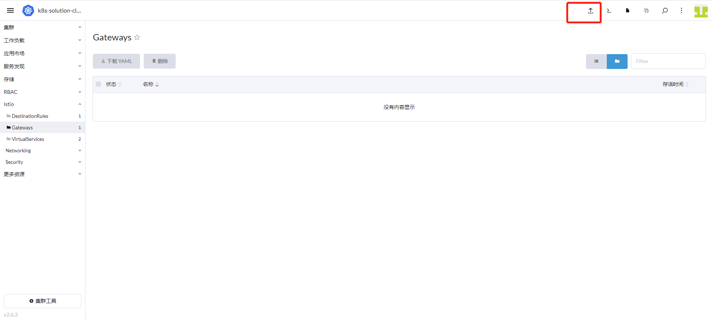

命名空间输入「prod」，输入如下内容，点击「导入」。

```yaml
apiVersion: networking.istio.io/v1alpha3
kind: Gateway
metadata:
  name: bookinfo-gateway
  namespace: prod
spec:
  selector:
    istio: ingressgateway # use istio default controller
  servers:
    - port:
        number: 80
        name: http
        protocol: HTTP
      hosts:
        - "*"
```

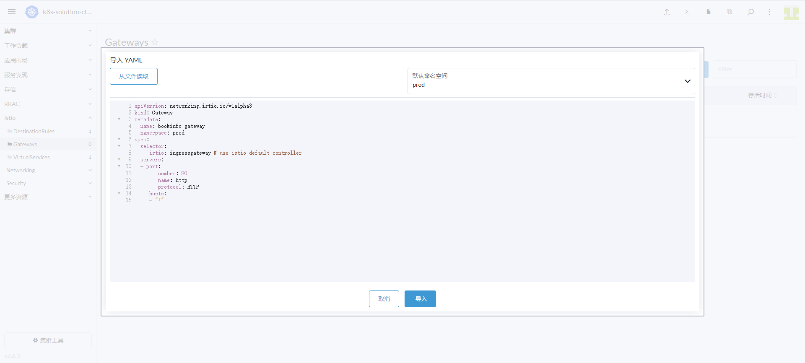

#### 3.8 创建虚拟服务

登录「Rancher」 - 「集群」 - 「Istio」 - 「VirtualServices」，点击上方的「导入 YAML」图标。<br/>
命名空间输入「prod」，输入如下内容，点击「导入」。

```yaml
apiVersion: networking.istio.io/v1alpha3
kind: VirtualService
metadata:
  name: bookinfo
  namespace: prod
spec:
  hosts:
    - "*"
  gateways:
    - bookinfo-gateway
  http:
    - match:
        - uri:
            exact: /productpage
        - uri:
            prefix: /static
        - uri:
            exact: /login
        - uri:
            exact: /logout
        - uri:
            prefix: /api/v1/products
      route:
        - destination:
            host: productpage
            port:
              number: 9080
```


#### 3.9 创建 productpage、details、ratings

这里使用为 Pod 增加 annotations 来采集 Pod 的指标，增加的内容如下所示。

```yaml
annotations:
  datakit/prom.instances: |
    [[inputs.prom]]
      url = "http://$IP:15020/stats/prometheus"
      source = "bookinfo-istio-product"
      metric_types = ["counter", "gauge"]
      interval = "60s"
      tags_ignore = ["cache","cluster_type","component","destination_app","destination_canonical_revision","destination_canonical_service","destination_cluster","destination_principal","group","grpc_code","grpc_method","grpc_service","grpc_type","reason","request_protocol","request_type","resource","responce_code_class","response_flags","source_app","source_canonical_revision","source_canonical-service","source_cluster","source_principal","source_version","wasm_filter"]
      metric_name_filter = ["istio_requests_total","pilot_k8s_cfg_events","istio_build","process_virtual_memory_bytes","process_resident_memory_bytes","process_cpu_seconds_total","envoy_cluster_assignment_stale","go_goroutines","pilot_xds_pushes","pilot_proxy_convergence_time_bucket","citadel_server_root_cert_expiry_timestamp","pilot_conflict_inbound_listener","pilot_conflict_outbound_listener_http_over_current_tcp","pilot_conflict_outbound_listener_tcp_over_current_tcp","pilot_conflict_outbound_listener_tcp_over_current_http","pilot_virt_services","galley_validation_failed","pilot_services","envoy_cluster_upstream_cx_total","envoy_cluster_upstream_cx_connect_fail","envoy_cluster_upstream_cx_active","envoy_cluster_upstream_cx_rx_bytes_total","envoy_cluster_upstream_cx_tx_bytes_total","istio_request_duration_milliseconds_bucket","istio_request_duration_seconds_bucket","istio_request_bytes_bucket","istio_response_bytes_bucket"]
      #measurement_prefix = ""
      measurement_name = "istio_prom"
      #[[inputs.prom.measurements]]
      # prefix = "cpu_"
      # name = "cpu"         
      [inputs.prom.tags]
      namespace = "$NAMESPACE"
  proxy.istio.io/config: |
    tracing:
      zipkin:
        address: zipkin.istio-system:9411
      custom_tags:
        project:
          literal:
            value: "productpage"
        version:
          literal:
            value: "v1"
        env:
          literal:
            value: "test"
```

参数说明

- url：Exporter 地址
- source：采集器名称
- metric_types：指标类型过滤
- measurement_name：采集后的指标集名称
- interval：采集指标频率，s 秒
- $IP：通配 Pod 的内网 IP
- $NAMESPACE：Pod 所在命名空间
- tags_ignore: 忽略的 tag。

下面是 productpage、details、ratings 的完整部署文件。

??? quote "完整部署文件"

    ```yaml
    ##################################################################################################
    # Details service
    ##################################################################################################
    apiVersion: v1
    kind: Service
    metadata:
      name: details
      namespace: prod
      labels:
        app: details
        service: details
    spec:
      ports:
      - port: 9080
        name: http
      selector:
        app: details
    ---
    apiVersion: v1
    kind: ServiceAccount
    metadata:
      name: bookinfo-details
      namespace: prod
      labels:
        account: details
    ---
    apiVersion: apps/v1
    kind: Deployment
    metadata:
      name: details-v1
      namespace: prod
      labels:
        app: details
        version: v1
    spec:
      replicas: 1
      selector:
        matchLabels:
          app: details
          version: v1
      template:
        metadata:
          labels:
            app: details
            version: v1
          annotations:
            datakit/prom.instances: |
              [[inputs.prom]]
                url = "http://$IP:15020/stats/prometheus"
                source = "bookinfo-istio-details"
                metric_types = ["counter", "gauge"]
                interval = "60s"
          tags_ignore = ["cache","cluster_type","component","destination_app","destination_canonical_revision","destination_canonical_service","destination_cluster","destination_principal","group","grpc_code","grpc_method","grpc_service","grpc_type","reason","request_protocol","request_type","resource","responce_code_class","response_flags","source_app","source_canonical_revision","source_canonical-service","source_cluster","source_principal","source_version","wasm_filter"]
                metric_name_filter = ["istio_requests_total","pilot_k8s_cfg_events","istio_build","process_virtual_memory_bytes","process_resident_memory_bytes","process_cpu_seconds_total","envoy_cluster_assignment_stale","go_goroutines","pilot_xds_pushes","pilot_proxy_convergence_time_bucket","citadel_server_root_cert_expiry_timestamp","pilot_conflict_inbound_listener","pilot_conflict_outbound_listener_http_over_current_tcp","pilot_conflict_outbound_listener_tcp_over_current_tcp","pilot_conflict_outbound_listener_tcp_over_current_http","pilot_virt_services","galley_validation_failed","pilot_services","envoy_cluster_upstream_cx_total","envoy_cluster_upstream_cx_connect_fail","envoy_cluster_upstream_cx_active","envoy_cluster_upstream_cx_rx_bytes_total","envoy_cluster_upstream_cx_tx_bytes_total","istio_request_duration_milliseconds_bucket","istio_request_duration_seconds_bucket","istio_request_bytes_bucket","istio_response_bytes_bucket"]
                #measurement_prefix = ""
                measurement_name = "istio_prom"
                #[[inputs.prom.measurements]]
                # prefix = "cpu_"
                # name = "cpu"
                [inputs.prom.tags]
                namespace = "$NAMESPACE"
            proxy.istio.io/config: |
              tracing:
                zipkin:
                  address: zipkin.istio-system:9411
                custom_tags:
                  project:
                    literal:
                      value: "details"
                  version:
                    literal:
                      value: "v1"
                  env:
                    literal:
                      value: "test"
        spec:
          serviceAccountName: bookinfo-details
          containers:
          - name: details
            image: docker.io/istio/examples-bookinfo-details-v1:1.16.2
            imagePullPolicy: IfNotPresent
            ports:
            - containerPort: 9080
            securityContext:
              runAsUser: 1000
    ---
    ##################################################################################################
    # Ratings service
    ##################################################################################################
    apiVersion: v1
    kind: Service
    metadata:
      name: ratings
      namespace: prod
      labels:
        app: ratings
        service: ratings
    spec:
      ports:
      - port: 9080
        name: http
      selector:
        app: ratings
    ---
    apiVersion: v1
    kind: ServiceAccount
    metadata:
      name: bookinfo-ratings
      namespace: prod
      labels:
        account: ratings
    ---
    apiVersion: apps/v1
    kind: Deployment
    metadata:
      name: ratings-v1
      namespace: prod
      labels:
        app: ratings
        version: v1
    spec:
      replicas: 1
      selector:
        matchLabels:
          app: ratings
          version: v1
      template:
        metadata:
          labels:
            app: ratings
            version: v1
          annotations:
            datakit/prom.instances: |
              [[inputs.prom]]
                url = "http://$IP:15020/stats/prometheus"
                source = "bookinfo-istio-ratings"
                metric_types = ["counter", "gauge"]
                interval = "60s"
          tags_ignore = ["cache","cluster_type","component","destination_app","destination_canonical_revision","destination_canonical_service","destination_cluster","destination_principal","group","grpc_code","grpc_method","grpc_service","grpc_type","reason","request_protocol","request_type","resource","responce_code_class","response_flags","source_app","source_canonical_revision","source_canonical-service","source_cluster","source_principal","source_version","wasm_filter"]
                metric_name_filter = ["istio_requests_total","pilot_k8s_cfg_events","istio_build","process_virtual_memory_bytes","process_resident_memory_bytes","process_cpu_seconds_total","envoy_cluster_assignment_stale","go_goroutines","pilot_xds_pushes","pilot_proxy_convergence_time_bucket","citadel_server_root_cert_expiry_timestamp","pilot_conflict_inbound_listener","pilot_conflict_outbound_listener_http_over_current_tcp","pilot_conflict_outbound_listener_tcp_over_current_tcp","pilot_conflict_outbound_listener_tcp_over_current_http","pilot_virt_services","galley_validation_failed","pilot_services","envoy_cluster_upstream_cx_total","envoy_cluster_upstream_cx_connect_fail","envoy_cluster_upstream_cx_active","envoy_cluster_upstream_cx_rx_bytes_total","envoy_cluster_upstream_cx_tx_bytes_total","istio_request_duration_milliseconds_bucket","istio_request_duration_seconds_bucket","istio_request_bytes_bucket","istio_response_bytes_bucket"]
                #measurement_prefix = ""
                measurement_name = "istio_prom"
                #[[inputs.prom.measurements]]
                # prefix = "cpu_"
                # name = "cpu"
                [inputs.prom.tags]
                namespace = "$NAMESPACE"
            proxy.istio.io/config: |
              tracing:
                zipkin:
                  address: zipkin.istio-system:9411
                custom_tags:
                  project:
                    literal:
                      value: "ratings"
                  version:
                    literal:
                      value: "v1"
                  env:
                    literal:
                      value: "test"
        spec:
          serviceAccountName: bookinfo-ratings
          containers:
          - name: ratings
            image: docker.io/istio/examples-bookinfo-ratings-v1:1.16.2
            imagePullPolicy: IfNotPresent
            ports:
            - containerPort: 9080
            securityContext:
              runAsUser: 1000
    ---
    ##################################################################################################
    # Productpage services
    ##################################################################################################
    apiVersion: v1
    kind: Service
    metadata:
      name: productpage
      namespace: prod
      labels:
        app: productpage
        service: productpage
    spec:
      ports:
      - port: 9080
        name: http
      selector:
        app: productpage
    ---
    apiVersion: v1
    kind: ServiceAccount
    metadata:
      name: bookinfo-productpage
      namespace: prod
      labels:
        account: productpage
    ---
    apiVersion: apps/v1
    kind: Deployment
    metadata:
      name: productpage-v1
      namespace: prod
      labels:
        app: productpage
        version: v1
    spec:
      replicas: 1
      selector:
        matchLabels:
          app: productpage
          version: v1
      template:
        metadata:
          labels:
            app: productpage
            version: v1
          annotations:
            datakit/prom.instances: |
              [[inputs.prom]]
                url = "http://$IP:15020/stats/prometheus"
                source = "bookinfo-istio-product"
                metric_types = ["counter", "gauge"]
                interval = "60s"
          tags_ignore = ["cache","cluster_type","component","destination_app","destination_canonical_revision","destination_canonical_service","destination_cluster","destination_principal","group","grpc_code","grpc_method","grpc_service","grpc_type","reason","request_protocol","request_type","resource","responce_code_class","response_flags","source_app","source_canonical_revision","source_canonical-service","source_cluster","source_principal","source_version","wasm_filter"]
                metric_name_filter = ["istio_requests_total","pilot_k8s_cfg_events","istio_build","process_virtual_memory_bytes","process_resident_memory_bytes","process_cpu_seconds_total","envoy_cluster_assignment_stale","go_goroutines","pilot_xds_pushes","pilot_proxy_convergence_time_bucket","citadel_server_root_cert_expiry_timestamp","pilot_conflict_inbound_listener","pilot_conflict_outbound_listener_http_over_current_tcp","pilot_conflict_outbound_listener_tcp_over_current_tcp","pilot_conflict_outbound_listener_tcp_over_current_http","pilot_virt_services","galley_validation_failed","pilot_services","envoy_cluster_upstream_cx_total","envoy_cluster_upstream_cx_connect_fail","envoy_cluster_upstream_cx_active","envoy_cluster_upstream_cx_rx_bytes_total","envoy_cluster_upstream_cx_tx_bytes_total","istio_request_duration_milliseconds_bucket","istio_request_duration_seconds_bucket","istio_request_bytes_bucket","istio_response_bytes_bucket"]
                #measurement_prefix = ""
                measurement_name = "istio_prom"
                #[[inputs.prom.measurements]]
                # prefix = "cpu_"
                # name = "cpu"
                [inputs.prom.tags]
                namespace = "$NAMESPACE"
            proxy.istio.io/config: |
              tracing:
                zipkin:
                  address: zipkin.istio-system:9411
                custom_tags:
                  project:
                    literal:
                      value: "productpage"
                  version:
                    literal:
                      value: "v1"
                  env:
                    literal:
                      value: "test"
        spec:
          serviceAccountName: bookinfo-productpage
          containers:
          - name: productpage
            image: docker.io/istio/examples-bookinfo-productpage-v1:1.16.2
            imagePullPolicy: IfNotPresent
            ports:
            - containerPort: 9080
            volumeMounts:
            - name: tmp
              mountPath: /tmp
            securityContext:
              runAsUser: 1000
          volumes:
          - name: tmp
            emptyDir: {}

    ```

点击上方的「导入 YAML」图标。命名空间输入「prod」，输入上面的内容，点击「导入」。

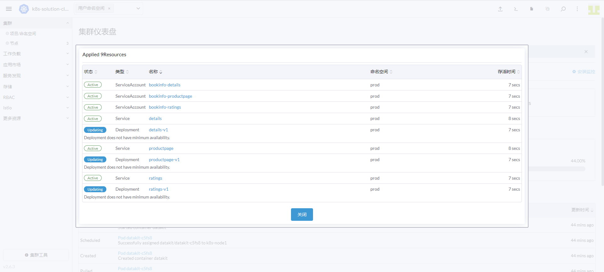

#### 3.10 部署 reviews 流水线

登录 Gitlab，创建 bookinfo-views 项目。


请参考 [gitlab 集成文档](../../integrations/cicd/gitlab.md) 打通 Gitlab 和 DataKit，这里只配置 Gitlab CI。

登录「Gitlab」，进入「bookinfo-views」 - 「Settings」 - 「Webhooks」，在 URL 中输入 DataKit 所在的`主机 IP` 和 DataKit 的 `9529` 端口，再加 `/v1/gitlab`。如下图：


选中 Job events 和 Pipeline events，点击 Add webhook。


点击刚才创建的 Webhooks 右边的 Test，选择 「Pipeline events」，出现下图的 HTTP 200 说明配置成功。


进入「bookinfo-views」项目，根目录新建 `deployment.yaml` 和 `.gitlab-ci.yml` 文件。在 annotations 定义了 project、env、version 标签，用于不同项目、不同版本的区分。

??? quote "配置文件"

    ```yaml
    apiVersion: v1
    kind: Service
    metadata:
      name: reviews
      namespace: prod
      labels:
        app: reviews
        service: reviews
    spec:
      ports:
        - port: 9080
          name: http
      selector:
        app: reviews
    ---
    apiVersion: v1
    kind: ServiceAccount
    metadata:
      name: bookinfo-reviews
      namespace: prod
      labels:
        account: reviews
    ---
    apiVersion: apps/v1
    kind: Deployment
    metadata:
      name: reviews-__version__
      namespace: prod
      labels:
        app: reviews
        version: __version__
    spec:
      replicas: 1
      selector:
        matchLabels:
          app: reviews
          version: __version__
      template:
        metadata:
          labels:
            app: reviews
            version: __version__
          annotations:
            datakit/prom.instances: |
              [[inputs.prom]]
                url = "http://$IP:15020/stats/prometheus"
                source = "bookinfo-istio-review"
                metric_types = ["counter", "gauge"]
                interval = "60s"
                tags_ignore = ["cache","cluster_type","component","destination_app","destination_canonical_revision","destination_canonical_service","destination_cluster","destination_principal","group","grpc_code","grpc_method","grpc_service","grpc_type","reason","request_protocol","request_type","resource","responce_code_class","response_flags","source_app","source_canonical_revision","source_canonical-service","source_cluster","source_principal","source_version","wasm_filter"]
                metric_name_filter = ["istio_requests_total","pilot_k8s_cfg_events","istio_build","process_virtual_memory_bytes","process_resident_memory_bytes","process_cpu_seconds_total","envoy_cluster_assignment_stale","go_goroutines","pilot_xds_pushes","pilot_proxy_convergence_time_bucket","citadel_server_root_cert_expiry_timestamp","pilot_conflict_inbound_listener","pilot_conflict_outbound_listener_http_over_current_tcp","pilot_conflict_outbound_listener_tcp_over_current_tcp","pilot_conflict_outbound_listener_tcp_over_current_http","pilot_virt_services","galley_validation_failed","pilot_services","envoy_cluster_upstream_cx_total","envoy_cluster_upstream_cx_connect_fail","envoy_cluster_upstream_cx_active","envoy_cluster_upstream_cx_rx_bytes_total","envoy_cluster_upstream_cx_tx_bytes_total","istio_request_duration_milliseconds_bucket","istio_request_duration_seconds_bucket","istio_request_bytes_bucket","istio_response_bytes_bucket"]
                #measurement_prefix = ""
                measurement_name = "istio_prom"
                #[[inputs.prom.measurements]]
                # prefix = "cpu_"
                # name = "cpu"
                [inputs.prom.tags]
                namespace = "$NAMESPACE"
            proxy.istio.io/config: |
              tracing:
                zipkin:
                  address: zipkin.istio-system:9411
                custom_tags:
                  project:
                    literal:
                      value: "reviews"
                  version:
                    literal:
                      value: __version__
                  env:
                    literal:
                      value: "test"
        spec:
          serviceAccountName: bookinfo-reviews
          containers:
            - name: reviews
              image: docker.io/istio/examples-bookinfo-reviews-__version__:1.16.2
              imagePullPolicy: IfNotPresent
              env:
                - name: LOG_DIR
                  value: "/tmp/logs"
              ports:
                - containerPort: 9080
              volumeMounts:
                - name: tmp
                  mountPath: /tmp
                - name: wlp-output
                  mountPath: /opt/ibm/wlp/output
              securityContext:
                runAsUser: 1000
          volumes:
            - name: wlp-output
              emptyDir: {}
            - name: tmp
              emptyDir: {}
    ```

```yaml
variables:
  APP_VERSION: "v1"

stages:
  - deploy

deploy_k8s:
  image: bitnami/kubectl:1.22.7
  stage: deploy
  tags:
    - kubernetes-runner
  script:
    - echo "执行deploy"
    - ls
    - sed -i "s#__version__#${APP_VERSION}#g" deployment.yaml
    - cat deployment.yaml
    - kubectl apply -f deployment.yaml
  after_script:
    - sleep 10
    - kubectl get pod  -n prod
```

         修改 .gitlab-ci.yml 文件中的 APP_VERSION 的值为 "v1"，提交一次代码，修改成 "v2"，提交一次代码。

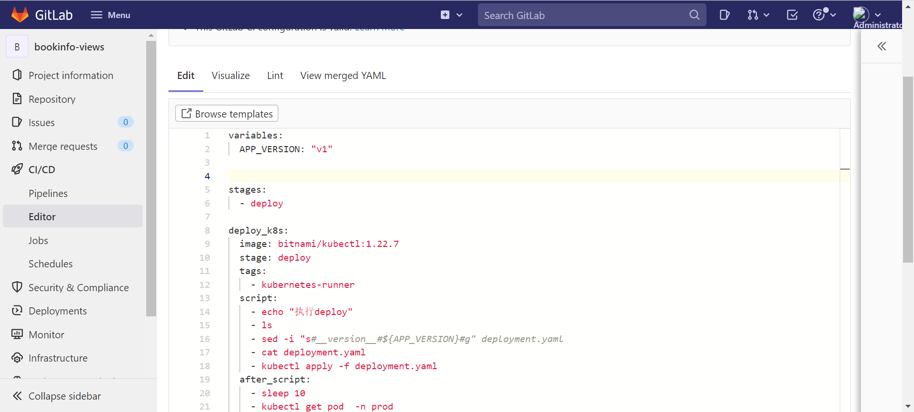


#### 3.11 访问 productpage

点击 Rancher 上方的「命令行」图标，输入「kubectl get svc -n istio-system」回车。


上图可以看到端口是 31409，根据服务器 IP 得到 productpage 访问路径是 [http://8.136.193.105:31409/productpage](http://8.136.193.105:31409/productpage)。


### 步骤 4 Istio 可观测

上述的步骤中，已经对 Istiod 及 bookinfo 应用做了指标采集，观测云默认提供了四个监控视图来观测 Istio 的运行情况。

##### 4.1 Istio Workload 监控视图

登录「[观测云](https://console.guance.com/)」，进入「场景」模块，点击「新建仪表板」，输入「Istio」，选择 「Istio Workload 监控视图」，点击「确定」。再点击新建的「Istio Workload 监控视图」进行观测。
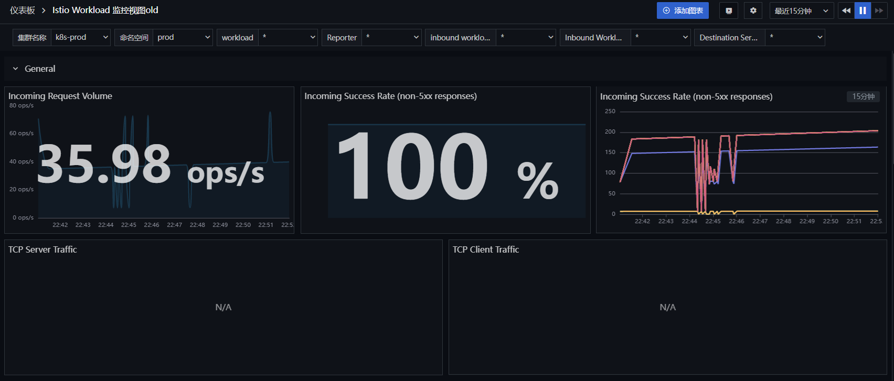
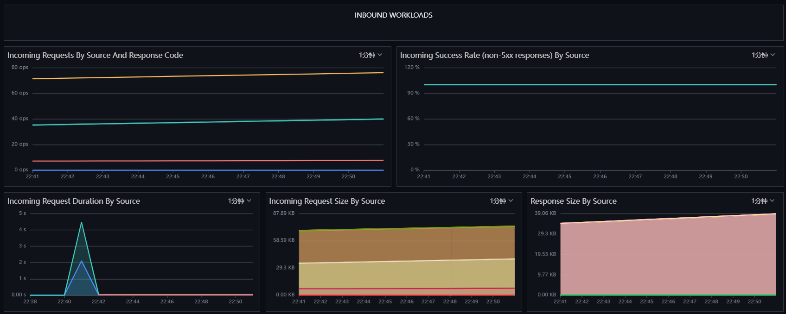


##### 4.2 Istio Control Plane 监控视图

登录「[观测云](https://console.guance.com/)」，进入「场景」模块，点击「新建仪表板」，输入「Istio」，选择「Istio Control Plane 监控视图」，点击「确定」。再点击新建的「Istio Control Plane 监控视图」进行观测 。

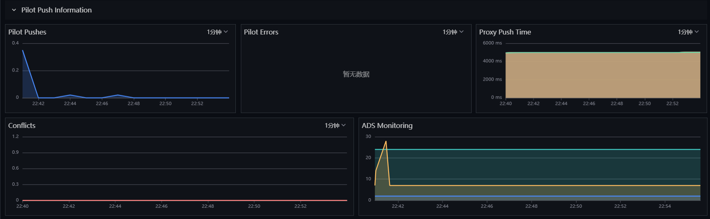


##### 4.3 Istio Service 监控视图

登录「[观测云](https://console.guance.com/)」，进入「场景」模块，点击「新建仪表板」，输入「Istio」，选择「Istio Service 监控视图」，点击「确定」。再点击新建的「Istio Service 监控视图」进行观测 。


##### 4.4 Istio Mesh 监控视图

登录「[观测云](https://console.guance.com/)」，进入「场景」模块，点击「新建仪表板」，输入「Istio」，选择「Istio Mesh 监控视图」，点击「确定」。再点击新建的「Istio Mesh 监控视图」进行观测 。


### 步骤 5 RUM 可观测

##### 5.1 新建用户访问监测

登录「 [观测云](https://console.guance.com/)」，进入「用户访问监测」，新建应用 **devops-bookinfo** ，复制下方 JS。
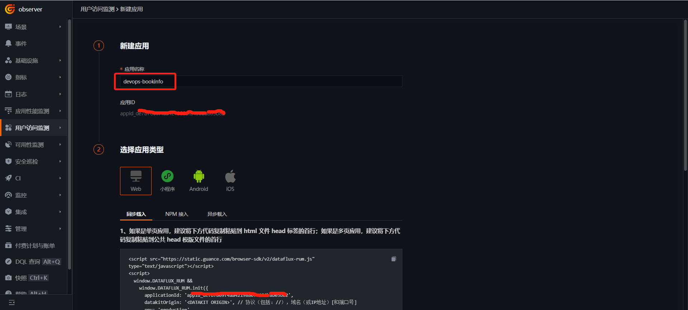


##### 5.2 制作 productpage 镜像

下载 [istio-1.13.2-linux-amd64.tar.gz](https://github.com/istio/istio/releases/download/1.13.2/istio-1.13.2-linux-amd64.tar.gz)，解压文件。上述的 JS 需要放置到 productpage 项目所有界面都能访问到的地方，本项目把上面的 JS 复制到 `istio-1.13.2\samples\bookinfo\src\productpage\templates\productpage.html` 文件中，其中 datakitOrigin 值是 DataKit 的地址。


参数说明

- datakitOrigin：数据传输地址，这里是 datakit 的域名或 IP，必填。
- env：应用所属环境，必填。
- version：应用所属版本，必填。
- trackInteractions：是否开启用户行为统计，例如点击按钮、提交信息等动作，必填。
- traceType：trace 类型，默认为 ddtrace，非必填。
- allowedTracingOrigins：实现 APM 与 RUM 链路打通，填写后端服务的域名或 IP ，非必填。

制作镜像，并上传到镜像仓库。

```shell
cd istio-1.13.2\samples\bookinfo\src\productpage
docker build -t 172.16.0.238/df-demo/product-page:v1  .
docker push 172.16.0.238/df-demo/product-page:v1
```

##### 5.3 替换 productpage 镜像

进入「集群」 - 「工作负载」->「Deployments」，找到「productpage-v1」点击「编辑配置」。


把镜像 `image: docker.io/istio/examples-bookinfo-productpage-v1:1.16.2` 替换成下面镜像<br />`image: 172.16.0.238/df-demo/product-page:v1`，点击「保存」。
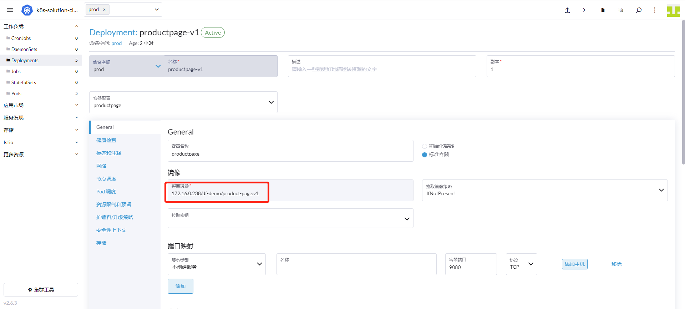

##### 5.4 用户访问监测

登录「 [观测云](https://console.guance.com/)」，进入「用户访问监测」，找到 **devops-bookinfo **应用，点击进入，查看 UV、PV、会话数、访问的页面等信息。


性能分析 


资源分析 
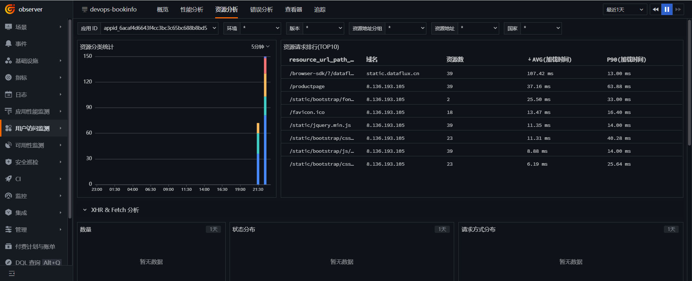

### 步骤 6 日志可观测

根据部署 datakit 时的配置，默认采集输出到 /dev/stdout 的日志。 登录「 [观测云](https://console.guance.com/)」，进入「日志」，查看日志信息。此外观测云还提供了 RUM、APM 和日志直接的联动功能，请参考官方文档做相应的配置。


### 步骤 7 Gitlab CI 可观测

登录「[观测云](https://console.guance.com/)」，进入「CI」，点击「概览」选择 bookinfo-views 项目，查看 Pipeline 和 Job 的执行情况。


进入「CI」,点击「查看器」，选择 gitlab_pipeline。


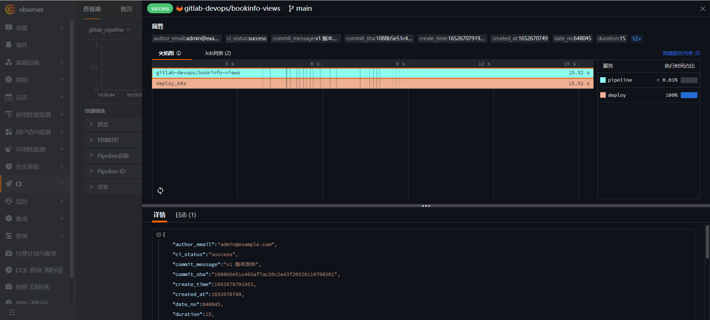

进入「CI」,点击「查看器」，选择 gitlab_job。


### 步骤 8： 金丝雀发布可观测

操作步骤是先创建 DestinationRule 和 VirtualService，把流量只流向 reviews-v1 版本，发布 reviews-v2，切 10% 流量到 reviews-v2，通过观测云验证通过后，把流量完全切到 reviews-v2，下线 reviews-v1。

##### 8.1 创建 DestinationRule

登录「Rancher」 - 「集群」 - 「Istio」 - 「DestinationRule」，点击「创建」。<br/>
命名空间天「prod」，名称填「reviews」，Input a host 填「reviews」，添加 「Subset v1」 和 「Subset v2」，详细信息如下图，最后点击「创建」。


##### 8.2 创建 VirtualService

登录「Rancher」 - 「集群」 - 「Istio」 - 「VirtualServices」，点击上方的「导入 YAML」图标，输入如下内容后，点击「导入」。

```yaml
apiVersion: networking.istio.io/v1alpha3
kind: VirtualService
metadata:
  name: reviews
  namespace: prod
spec:
  hosts:
    - reviews
  http:
    - route:
        - destination:
            host: reviews
            subset: v1
```

##### 8.3 发布 reviews-v2 版本

登录「gitlab」，找到 bookinfo-views 项目， 修改 `.gitlab-ci.yml` 文件中的 `APP_VERSION` 的值为 `v2`，提交一次代码。


登录「[观测云](https://console.guance.com/)」，进入「CI」->「查看器」，可以看到 v2 版本已发布。


##### 8.4 切换流量到 reviews-v2 版本

「Rancher」 - 「集群」 - 「Istio」 - 「VirtualServices」，点击 reviews 右边的「编辑 YAML」。
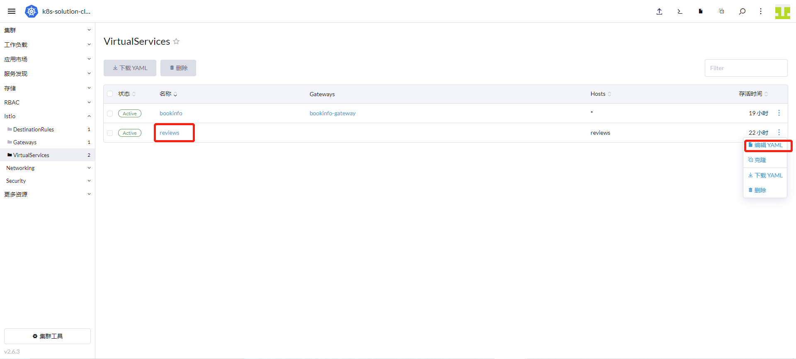

        增加 v1 的权重是 90，v2 的权重是 10，最后点击“保存”。

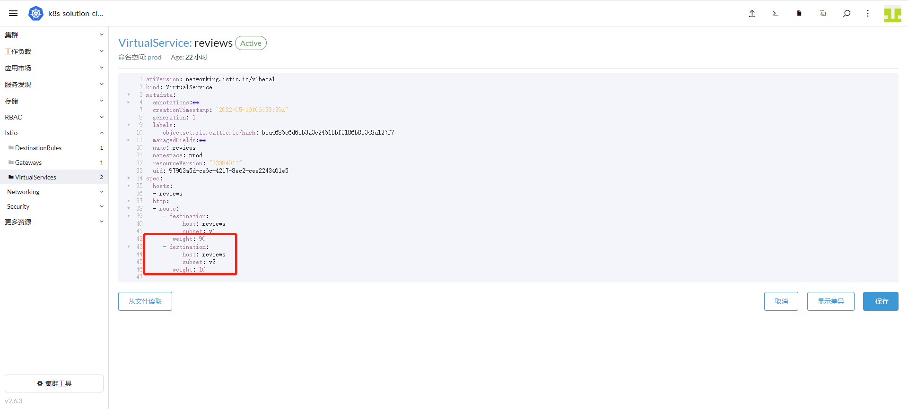

##### 8.5 观测 reviews-v2 运行情况

登录「[观测云](https://console.guance.com/)」，进入「应用性能监测」模块，点击右上方的图标。


打开「区分环境和版本」，查看 bookinfo 的调用拓扑图。<br />
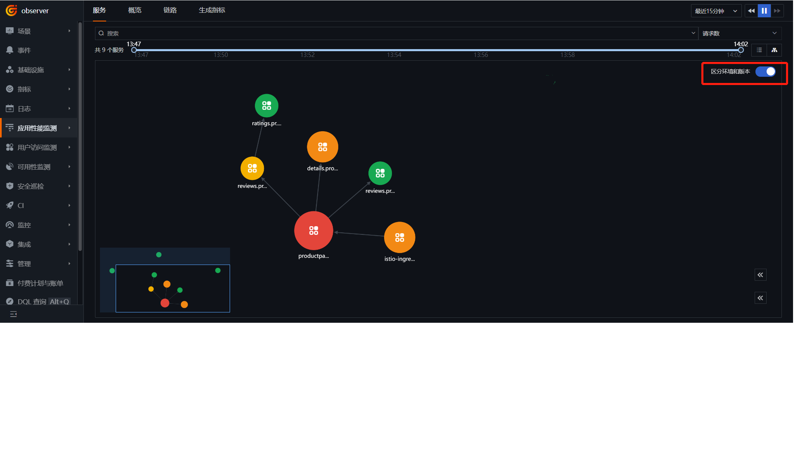

鼠标点击 reviews-v2 上，可以看到是 v2 在连 ratings，而 reviews-v1 并不调用 ratings。


点击「链路」，选择「reviews.prod」服务，点击进入一个带“v2”版本的链路。


查看火焰图。


查看 Span 列表。


查看服务调用关系。
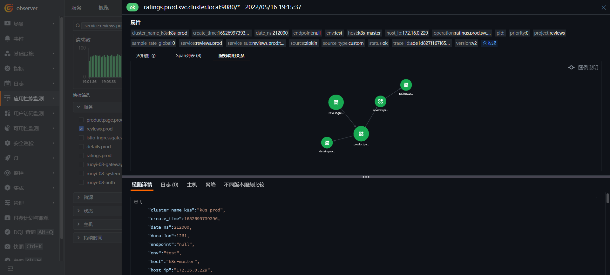

在 Istio Mesh 监控视图里面也可以看到服务的调用情况，v1、v2 版本的流量基本是 9:1。
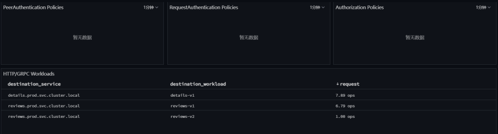

##### 8.6 完成发布

通过在观测云的操作，本次发布符合预期。「Rancher」 - 「集群」 - 「Istio」 - 「VirtualServices」，点击 reviews 右边的「编辑 YAML」，把“v2”权重设置成 100，“v1”去掉，点击「保存」。


进入「集群」 - 「工作负载」->「Deployments」，找到 “reviews-v1” 点击「删除」。

