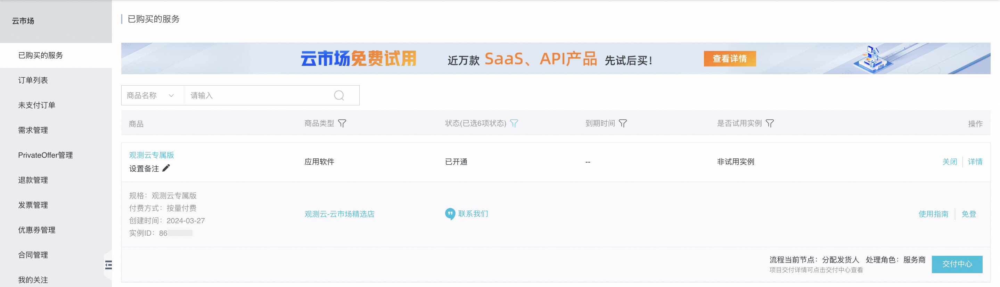
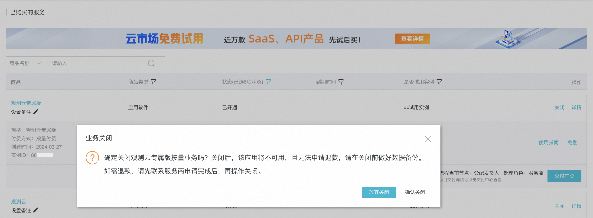

# 阿里云账号结算
---

即直接通过阿里云账号进行充值结算，一个阿里云账号支持关联多个工作空间、多个站点的工作空间进行费用结算。

## 首次购买<<< custom_key.brand_name >>>商业版时选择

1. [进入注册流程](../../plans/commercial-register.md)；
2. 在第三步，选择开通方式时，选定[阿里云市场开通](#purchase)；
3. 输入工作空间名称，选择工作空间语言；
4. 填入账号 ID 与商品实例 ID；
5. 勾选同意协议；
6. 点击开通。

在该步骤中，系统会同步为您创建费用中心账号。后续您可以通过注册时使用的账号密码（即注册<<< custom_key.brand_name >>>账号时在第一步使用的用户名/密码）登录进入费用中心平台查看账单明细等信息。

### 在阿里云云市场开通 {#purchase}

登录[阿里云心选平台](https://market.aliyun.com/products/56838014/cmgj00053362.html?spm=5176.19720258.J_3207526240.210.62c176f4i6AFbF)，点击**立即开通**。

提示**开通按量服务**，同意协议，点击**开通**。

显示**开通申请已提交**。

点击**确认**即跳转至云市场页面，可以查看到开通订阅的<<< custom_key.brand_name >>>实例。

点击**立即开通**。

## 在费用中心平台更改结算

1. 登录进入<<< custom_key.brand_name >>>[费用中心](https://<<< custom_key.boss_domain >>>)；
2. 进入工作空间管理；
3. 选择工作空间，点击右侧的更改按钮；
4. 选择**阿里云账号结算**；
5. 首先[前往阿里云开通](#purchase)<<< custom_key.brand_name >>>服务；
6. 购买完成后获取[账号 ID](#id) 和[商品实例 ID](#entity-id)；
7. 点击确定。

### 如何获取账号 ID {#uid}

#### 阿里云主账号

通过主账号登录[阿里云](https://www.aliyun.com)，进入阿里云控制台，点击右上角账号头像，即可找到账号 ID。

<!--

### 阿里云 RAM 子账号

通过 RAM 方式登录[阿里云](https://www.aliyun.com)，进入阿里云控制台，点击右上角账号头像，即可找到 RAM 账号中@后面的主账号 UID。

-->

## 如何获取商品实例 ID {#entity-id}

<<< custom_key.brand_name >>>在阿里云心选确认开通申请后，直接跳转到阿里云已购买的服务列表，在已购买的<<< custom_key.brand_name >>>服务下方，可以查看到商品的**实例 ID**，复制此**实例 ID**，填入到更改结算方式对话框的**商品实例 ID**。

## 在阿里云取消订阅<<< custom_key.brand_name >>> {#cancel}

1. 在阿里云控制台，点击进入**云市场 > 已购买的服务**；
2. 在**已购买的服务**可以查看到开通订阅的<<< custom_key.brand_name >>>实例，点击该实例右上角的**关闭**；
3. 在弹出的**业务关闭**对话框，点击**确认**后，可以看到该实例已经是**已关闭**的状态，说明已经在阿里云取消订阅<<< custom_key.brand_name >>>。

**注意**：取消订阅<<< custom_key.brand_name >>>服务后，<<< custom_key.brand_name >>>费用中心将解除与该账号绑定的所有工作空间的关联，并修改为采用<<< custom_key.brand_name >>>费用中心账号的结算方式。同时，您会收到关于这一变更的邮件通知。

