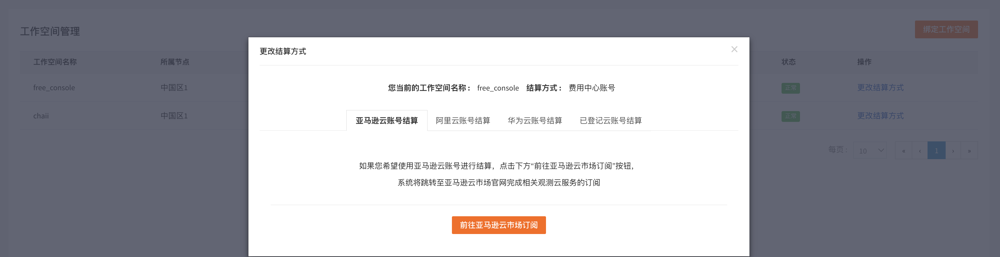
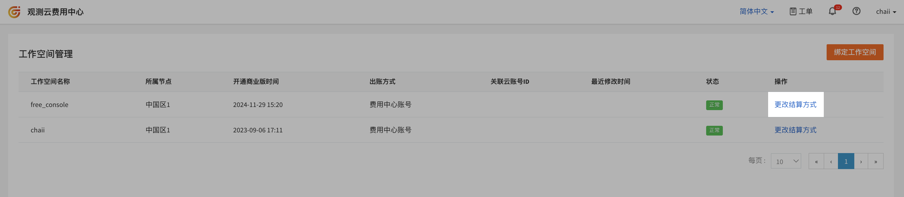
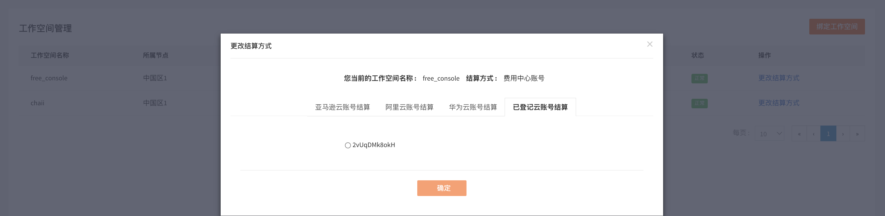
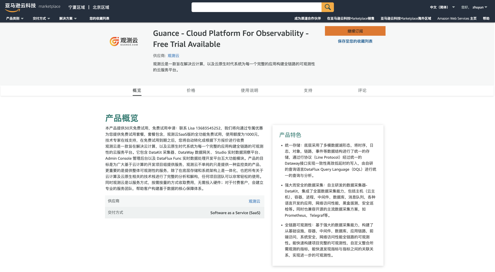
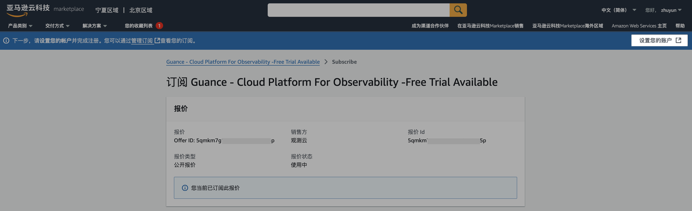
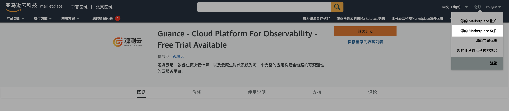
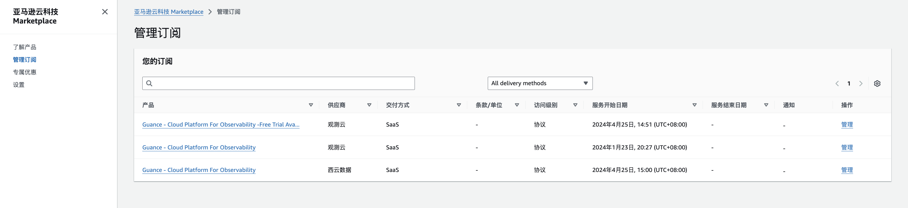
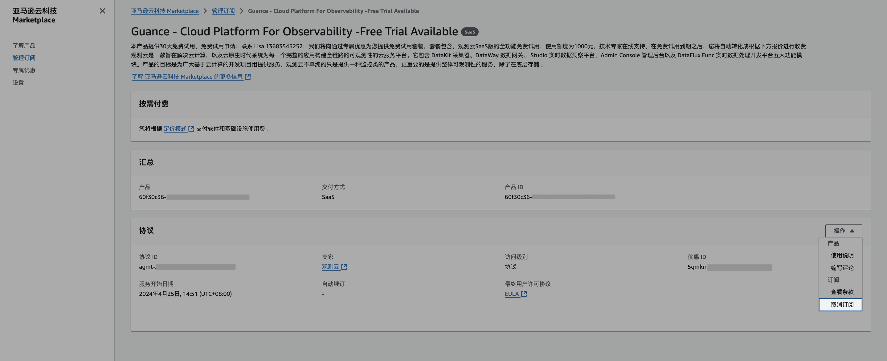
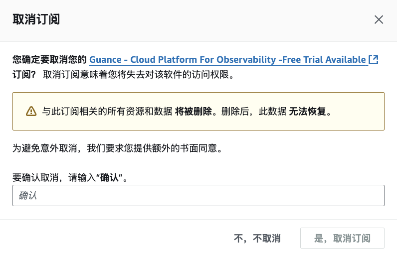

# AWS 账号结算
---

AWS 账号结算是指直接通过 AWS 账号进行充值结算，一个 AWS 账号支持关联多个工作空间、多个站点的工作空间进行费用结算。本文将介绍<u>观测云商业版如何开通 AWS 账号结算</u>。

> 关于如何开通商业版，可参考文档 [注册商业版](../../plans/commercial-register.md)。

选择 AWS 账号结算有两种方式：

- 方法一：在费用中心的工作空间管理更改结算方式为 AWS 账号结算；   
- 方法二：在注册商业版的开通方式，选择 AWS 账号结算。

## 在费用中心选择 AWS 账号结算方式

=== "绑定第一个 AWS 账号结算工作空间"

    若您的工作空间还未绑定 AWS 账号结算，可通过 [观测云费用中心](https://boss.guance.com/#/signin) 更改费用结算方式为 AWS 账号。

    您也可以在观测云工作空间**付费计划与账单**，点击**费用中心 > 工作空间管理**，选择需要更改为AWS账号结算的工作空间，点击**更改结算方式**，完成更换流程。

    

    在弹出的对话框，选择**AWS 账号结算**，并点击**前往亚马逊云市场订阅**。

    

    订阅成后，会自动跳转到观测云费用中心，选择工作空间后，点击**确认提交**。

    

    选好工作空间，确认提交后，在观测云费用中心**账户管理 > 云账号**可查看已经订阅的云账号及关联结算的工作空间。

    

    也可在管理工作空间查看已经更新的结算方式。

    

=== "绑定第二个 AWS 账号结算工作空间"

    若您需要在同一个 AWS 账号绑定多个工作空间进行结算，您可以在 **[观测云费用中心](https://boss.guance.com/#/signin) > 工作空间管理** ，点击**更改结算方式**，在**已登记云账号结算**，选择需要绑定的 AWS 账号即可。

    

    绑定完成后，可以看到多个工作空间绑定了同一个 AWS 账号结算。

    

## 在注册观测云商业版时选择 AWS 账号结算 {#register}

### 在亚马逊云市场订阅观测云 {#subscribe}

在注册或者升级观测云商业版时，您可以点击**前往亚马逊云市场订阅**，在亚马逊云市场订阅观测云商品。

进入观测云在亚马逊云的主页，点击**继续订阅**。

在亚马逊云输入账户、用户名和密码进行登录。

登录后在观测云所属亚马逊云的页面点击**订阅**。

在弹出的对话框中，点击**建立您的账户**。

### 开通 AWS 账号结算

点击**建立您的账户**以后，需要通过以下两个步骤完成开通 AWS 账号结算。

#### 第一步：开通观测云商业版

建立账户后，返回观测云，点击**确认**。

输入工作空间名称、选择工作空间语言，点击**确认**。

**注意**：工作空间语言选项会影响工作空间内事件、告警、短信等模板。若选择英文，上述对应模板将默认使用英文模板，一旦创建，此工作空间的模版语言不可修改，请谨慎选择。

提示成功开通观测云商业版。

#### 第二步：在费用中心绑定工作空间

开通商业版以后，在当前浏览器切换回到观测云费用中心账号登录页面，输入注册的用户名账号及密码，完成开通 AWS 账号结算。

登录到观测云费用中心，选择工作空间后，点击**确认提交**。

在观测云费用中心**账户管理 > 云账号**可查看已经订阅的云账号及关联结算的工作空间。

也可在管理工作空间查看关联的结算方式。

## 在 AWS 取消订阅观测云 {#cancel}

1、登录到亚马逊云，在右上角账号选择**您的 Marketplace 软件**。

2、在管理订阅找到订阅的观测云服务，点击**管理**。

3、进入观测云服务管理页面，点击**操作 > 取消订阅**。

4、在弹出的对话框中，点击**是，取消订阅**。

5、取消订阅成功后，在亚马逊云管理订阅中取消了观测云服务。

在亚马逊云取消订阅观测云服务后，在观测云费用中心绑定该账号结算的所有工作空间，将删除关联的云账号，并对所有关联工作空间进行锁定操作，您可以在**费用中心 > 工作空间管理**解锁工作空间。

> 更多详情可参考 [工作空间锁定](../cost-center/workspace-management.md#lock)。

