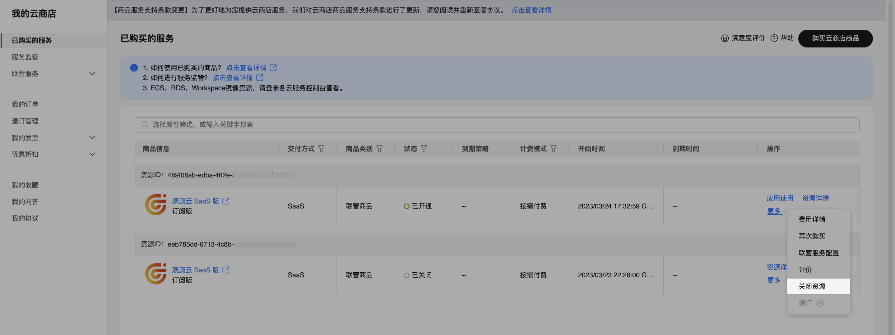
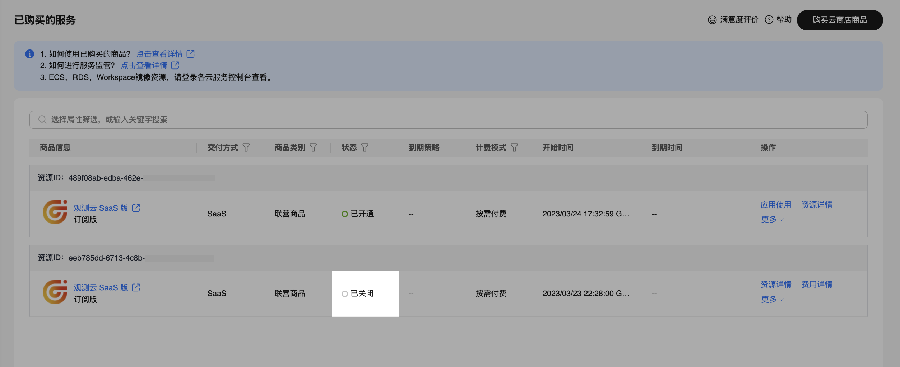

# 华为云账号结算
---

即直接通过华为云账号进行充值结算，一个华为云账号支持关联多个工作空间、多个站点的工作空间进行费用结算。

## 首次注册观测云商业版时选择

1. [进入注册流程](../../plans/commercial-register.md)；
2. 在第三步，选择开通方式时，选定[华为云商店开通](#market)；
3. 输入工作空间名称，选择工作空间语言；
4. 填入账号 ID；
5. 勾选同意协议；
6. 点击开通。

在该步骤中，系统会同步为您创建费用中心账号。后续您可以通过注册时使用的账号密码（即注册观测云账号时在第一步使用的用户名/密码）登录进入费用中心平台查看账单明细等信息。

### 在华为云云商店开通 {#market}

登录进入[华为云云商店 > 观测云 SaaS 版](https://marketplace.huaweicloud.com/contents/8990a122-f456-43a4-892c-a458be31e336#productid=OFFI845592654693900288)商品购买页面。

点击**立即开通**，提示**购买观测云 SaaS 版**，同意协议后，点击**立即开通**。

提示**开通 SaaS 任务提交成功**，点击**返回到我的云商店**。

返回华为云**已购买的服务列表**查看购买的观测云服务，若还未有购买的商品，可刷新页面。

## 在费用中心平台更改结算

1. 登录进入观测云[费用中心](https://boss.guance.com)；
2. 进入工作空间管理；
3. 选择工作空间，点击右侧的更改按钮；
4. 选择**华为云账号结算**；
5. 首先[前往华为云开通](#market)观测云服务；
6. 购买完成后获取华为云[账号 ID](#id) 和[商品实例 ID](#instanceid)；
7. 点击确定。

## 在华为云取消订阅观测云 {#cancel}

1. 登录进入华为云商店 > 已购买的服务；
2. 点击该资源右侧**更多 > 关闭资源**；
3. 继续点击**关闭资源**；
4. 刷新当前页面，可看到该资源已经是**已关闭**的状态，说明已经在华为云取消订阅观测云。

**注意**：在华为云取消订阅观测云服务后，在观测云费用中心绑定该账号结算的所有工作空间，将删除关联的云账号，并锁定对应的工作空间，您可以解锁工作空间，工作空间解锁后，默认为观测云费用中心账号结算。

## 如何获取华为云账号 ID {#id}

1. 通过账号登录到[华为云](https://www.huaweicloud.com)控制台；
2. 点击右上角账号头像；
3. 在下拉列表中点击进入**我的凭证**；
4. 在 API 凭证页面，即可查看**帐号 ID**。

## 如何获取华为云实例 ID {#instanceid}

在华为云云商店，进入**我的云商店 > 已购买的服务**。进入商品详情页，在当前服务的**应用信息**，即可查看华为云实例 ID。

<!--
## 如何获取订单编号 {#order-id}

在 [华为云市场](https://marketplace.huaweicloud.com/contents/181f3d92-f40b-48d7-8ad5-420df0a682d2) 购买观测云预购卡后，您可以在我的订单查看购买的预购卡订单号，如下图所示。复制该订单号，填入观测云费用中购买预购卡对话框的**订单编号**。

-->