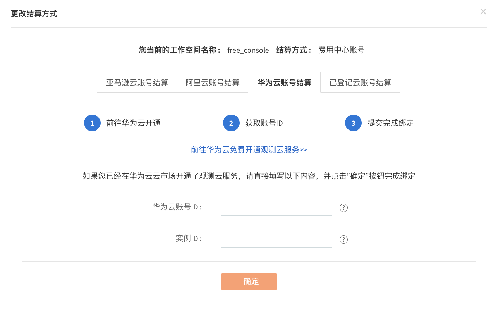

# 华为云账号结算
---

华为云账号结算是指直接通过华为云账号进行充值结算，一个华为云账号支持关联多个工作空间、多个站点的工作空间进行费用结算。本文将介绍<u>观测云商业版如何开通华为云账号结算</u>。

## 首次注册观测云商业版时选择华为云云账号结算

1、[基本信息](../commercial-register.md#info)；

2、[企业信息](../commercial-register.md#corporate)；

3、在[选择开通方式](../commercial-register.md#methods)页面，选择[华为云云商店开通](#market)；

4、[开通成功](../commercial-register.md#success)。

> 更多详情，可参考文档 [注册商业版](../../plans/commercial-register.md)。

## 在[费用中心](https://boss.guance.com/#/signin)更换华为云账号结算

### 第一步：在费用中心选择华为云账号结算

进入[费用中心](https://boss.guance.com/#/signin) > **工作空间管理**，点击**更改结算方式**，在弹出的对话框，选择**华为云账号结算**。

**注意**：如果您想更换华为云账号结算，需先在华为云云商店购买观测云产品服务，购买完成后**获取[华为云账号 ID](#id)**。

点击前往**华为云免费开通观测云服务**，即可跳转至[华为云云商店](https://marketplace.huaweicloud.com/)完成接下来的操作。

### 第二步：在华为云云商店开通观测云 {#market}

在当前[华为云云商店](https://marketplace.huaweicloud.com/)页面，先注册或登录华为云账号。搜索进入[观测云 SaaS 版](https://marketplace.huaweicloud.com/contents/8990a122-f456-43a4-892c-a458be31e336#productid=OFFI845592654693900288) 商品购买页面。

点击**立即开通**，提示**购买观测云 SaaS 版**，同意协议后，点击**立即开通**。

提示**开通 SaaS 任务提交成功**，点击**返回到我的云商店**。

返回华为云**已购买的服务列表**查看购买的观测云服务，若还未有购买的商品，可刷新页面。

**注意**：华为云账号需要实名认证后才能购买观测云服务。

### 第三步：在费用中心绑定华为云账号结算

返回观测云费用中心，点击**确定**。

输入 [华为云账号 ID](#id)和[实例 ID](#instanceid)，点击**确定**。

在观测云费用中心工作空间管理，即可查看绑定华为云账号结算的工作空间。

## 在华为云取消订阅观测云 {#cancel}

1、登录到华为云商店，进入**已购买的服务**，点击该资源右侧**更多**下的**关闭资源**。

2、在弹出的**关闭资源**对话框，点击**关闭资源**。

3、刷新当前页面，可看到该资源已经是**已关闭**的状态，说明已经在华为云取消订阅观测云。

**注意**：在华为云取消订阅观测云服务后，在观测云费用中心绑定该账号结算的所有工作空间，将删除关联的云账号，并锁定对应的工作空间，您可以解锁工作空间，工作空间解锁后，默认为观测云费用中心账号结算。

## 如何获取华为云账号 ID {#id}

通过账号登录到 [华为云](https://www.huaweicloud.com) 控制台，把鼠标悬停在右上角账号头像上，在下拉列表中点击**我的凭证**。

进入到**我的凭证**，在 API 凭证页面，点击复制**帐号 ID**，填入观测云费用中心购买预购卡对话框的**华为云账号 ID**。

## 如何获取华为云实例 ID {#instanceid}

在华为云云商店，进入**我的云商店 > 已购买的服务**。进入商品详情页，在当前服务的**应用信息**，即可查看华为云实例 ID。

<!--
## 如何获取订单编号 {#order-id}

在 [华为云市场](https://marketplace.huaweicloud.com/contents/181f3d92-f40b-48d7-8ad5-420df0a682d2) 购买观测云预购卡后，您可以在我的订单查看购买的预购卡订单号，如下图所示。复制该订单号，填入观测云费用中购买预购卡对话框的**订单编号**。

-->