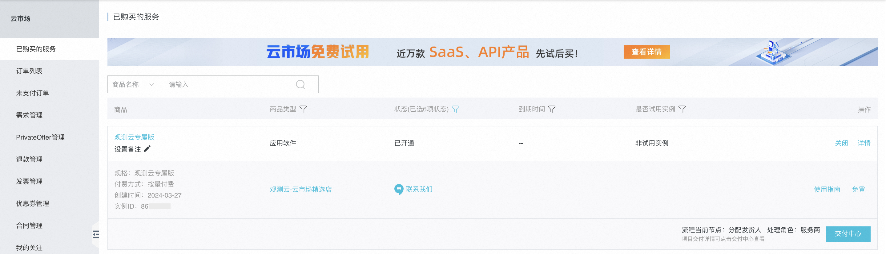

# 阿里云市场开通观测云商业版
---

本文将介绍在阿里云市场购买观测云服务以后，如何开通观测云商业版。关于直接注册商业版，可参考文档 [注册商业版](../billing/commercial-register.md) 。

> 注意：若您需要在观测云开通 SLS 存储，您可以前往 [阿里云市场开通观测云专属版](../billing/commercial-aliyun-sls.md)。

## 购买观测云 

打开 [阿里云市场观测云](https://market.aliyun.com/products/56838014/cmgj00053362.html?spm=5176.19720258.J_3207526240.210.62c176f4i6AFbF)，点击“立即开通”。

提示“开通按量服务”，同意协议后，点击“开通”。

显示“开通申请已提交”。

点击“确定”即跳转至云市场页面，可以查看到开通订阅的观测云实例。

## 开通观测云商业版

在“已购买的服务”可以查看到开通订阅的观测云实例，点击该实例右侧的“免登”。

在弹出的对话框，点击“确定”后，提示“立即注册观测云商业版”和“已有企业账号，去绑定”。

### 注册观测云商业版

若还未有观测云账号，可以点击“注册观测云商业版”。关于如何注册商业版，可参考文档 [注册商业版](../billing/commercial-register.md) 。

### 绑定观测云工作空间

若已经有观测云账号，可以点击“已有企业账号，去绑定”，提示“如何快速绑定阿里云账号结算”。

点击“知道了”，开始绑定观测云工作空间，在绑定工作空间之前需要先绑定观测云的企业账号。

#### 绑定观测云企业账号

##### 已有企业账号

若您已经有观测云企业账号，输入观测云企业账号“用户名”，通过邮箱验证进行绑定。

##### 尚无企业账号

如果您还未有观测云企业账号，可点击“注册”，注册新的观测云企业账号。

绑定成功后进入绑定观测云工作空间页面。

#### 绑定工作空间

##### 绑定已有工作空间

如果您在该观测云企业账号下存在观测云关联工作空间，则直接绑定即可。

选择工作空间并点击右侧的“绑定”，在弹出的对话框中输入邮箱和验证码。

点击“确认”，跳转至“绑定观测云工作空间”页面，提示已绑定。

点击“确定”，显示开通成功。

##### 创建工作空间

如果您已经注册过观测云账号，但还未创建工作空间，请先点击“创建工作空间”。

输入工作空间名称、选择工作空间语言、输入注册观测云账号时使用的邮箱，通过邮箱验证进行创建。

> 工作空间语言选项会影响工作空间内事件、告警、短信等模板。若选择英文，上述对应模板将默认使用英文模板，一旦创建，此工作空间的模版语言不可修改，请谨慎选择。

工作空间创建成功后，自动跳转至“绑定观测云工作空间”页面

点击“确定”，跳转至“成功绑定以下观测云工作空间”页面。

##### 注册观测云账号

如果您之前未使用过观测云服务，请先注册观测云账号并创建工作空间。

点击“注册观测云账号”，输入相关信息，通过邮箱验证进行注册。

> - 工作空间语言：工作空间语言选项会影响工作空间内事件、告警、短信等模板。若选择英文，上述对应模板将默认使用英文模板，一旦创建，此工作空间的模版语言不可修改，请谨慎选择。
> - 用户名：用于注册「[观测云控制台账号](https://auth.guance.com/businessRegister)」，同时会为您自动注册相同「用户名」的 「[观测云费用中心账号](https://boss.guance.com/)」，从而进行后续的费用结算流程，费用中心的用户名账号会检查唯一性，一旦注册不能修改；支持绑定费用中心用户名账号，绑定完成后用户名不能再修改，请谨慎操作。

## 开始使用观测云

注册完成后，可观看观测云介绍小视频，或者您可以点击“从安装 DataKit 开始”即可安装配置第一个 DataKit 。

