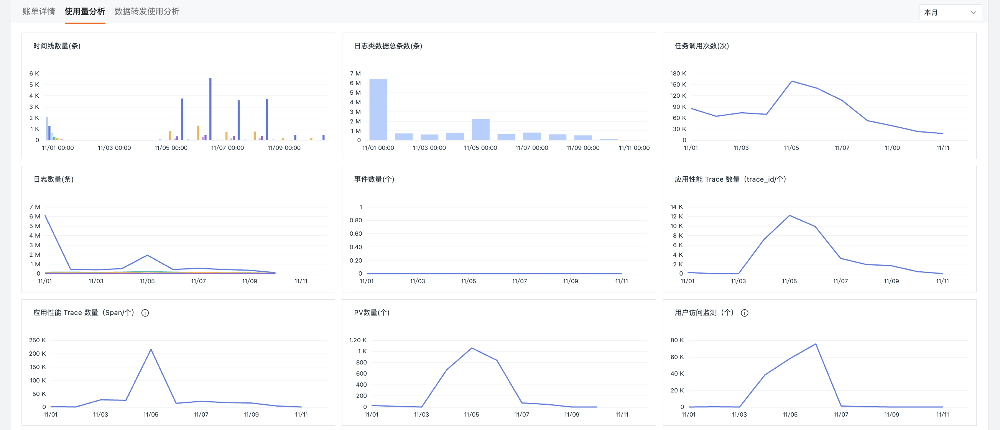
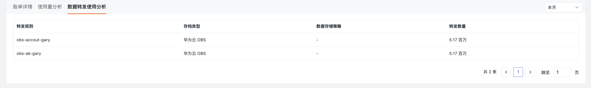

# 付费计划与账单
---

## 版本说明

<<< custom_key.brand_name >>>现有体验版、商业版、私有云部署版三种版本。

- 公有云提供的体验版、商业版，均采用**按量付费**的计费方式，在核心功能上并无差异。

    - [体验版的可接入数据量规模](../plans/trail.md#trail-vs-commercial)存在限制，<u>商业版用户支持接入更大规模的数据量，及更灵活的数据存储时效</u>。

- 私有云部署版，也提供了社区版（即体验版）、商业版。

    - 商业版可灵活选择<u>按量付费、订阅制、许可证制</u>多种计费方式。

### 查看版本

- 所有成员角色：在<<< custom_key.brand_name >>>控制台**管理 > 空间设置 > 基本信息 > 当前版本**中查看；

- 拥有者、管理员：在<<< custom_key.brand_name >>>控制台[**付费计划与账单**](#billing)中查看。

## 付费计划与账单 {#billing}

<<< custom_key.brand_name >>>公有云版秉承按需购买、按量付费的原则。

在付费计划与账单，您可以查看当前结算账户的现金余额、代金券余额等，并分析包括时间线、日志、网络、应用性能 Trace、应用性能 Profile、用户访问 PV、任务调用、会话重放等计费项的统计数据。此外，您还可以从账单详情、使用量、数据转发使用三个方面进行费用分析。

### 结算账户总览 {#account}

查看结算账号名称、现金账户余额、代金券余额、预购卡余额，并对账户进行高消费预警设置，或直接前往[费用中心](../billing-center/index.md)。

#### 设置高消费预警 {#alert}

**注意**：仅 Owner 和 Administrator 有权限进行该操作。

- 总阈值预警：即为当前工作空间设定一个总体消费阈值。一旦工作空间内所有计费项的总消费金额**超过**这个阈值，<<< custom_key.brand_name >>>将自动向该成员发送邮件预警。

- 单个计费项预警：即针对单个计费项设置预警。当某个计费项的**日账单金额超过设定的预警阈值**时，<<< custom_key.brand_name >>>将自动向该成员发送邮件预警。

1. 按需填写总预警阈值；
2. 选择[计费项](../billing-method/billing-item.md#item)并输入**预警阈值**；
3. 选择通知成员，无论总阈值还是单一计费项的实际账单金额超出设定的预警阈值时，都会向成员发送预警邮件；
4. 点击**确定**。

**注意**：Owner 角色不受通知对象选择的限制。即无论是否选择 Owner 为通知对象，<<< custom_key.brand_name >>>都会在触发预警条件时向 Owner 发送邮件通知。

### 使用统计

查看各计费项**截止当前**和**截止昨日**的统计数据，包含：活跃 DataKit、网络（主机）、时间线、日志类数据、备份日志数据容量、应用性能 Trace、应用性能 Profile、用户访问 PV、API 拨测、任务调用、短信、会话重放、定时报告、日志写入流量、敏感数据扫描、中心 Pipeline 处理流量。

### 账单详情

按照出账模式、使用量、应付金额、欠费金额等维度查看各产品明细的消费数据，同时可按不同月份查看费用统计。

### 使用量分析

通过可视化的方式查看各个计费项目的使用情况。

### 数据转发使用分析 {#transmit}

查看当前工作空间所有数据转发规则的数据转发数量。同时可按今日、昨日、本周、上周、本月、上月、今年七大时间维度查看数量统计。

**注意**：

- 若转发规则保存到<<< custom_key.brand_name >>>的备份日志，则显示对应的数据保存策略，若保存到外部存储，则展示为 `-`。
- 此处仅列出工作空间内存在的数据转发规则且转发数量 > 0 的列表。

## [费用中心](../billing-center/index.md)

???- warning "工作空间角色差异说明"

    - 拥有者：有**费用中心**按钮；   
    - 管理员：无上述按钮；  
    - 其他成员：无**付费计划与账单**模块，即没有查看费用情况的权限。

<<< custom_key.brand_name >>>现有两套独立运行、统计数据量相关连的账号体系，共同为**商业版用户**实现用量计费与费用结算流程：

- [<<< custom_key.brand_name >>>控制台](https://console.guance.com/)账号，可统计当前工作空间的数据量接入规模、账单明细等，同步到指定的费用中心账号。
- [<<< custom_key.brand_name >>>费用中心](https://boss.guance.com/)账号，可通过 `工作空间 ID` 进行绑定，实现**工作空间级别的统一费用管理**，并提供了多种费用结算方式供您选择。

## 用量计费方式

<<< custom_key.brand_name >>>商业版采用**按量付费**的[计费方式](../billing-method/index.md)，通过计费周期、计费项、计费价格、计费模式等不同的纬度，综合计算出当前的费用情况。

## 费用结算方式

<<< custom_key.brand_name >>>计算出当前工作空间的账单详情后，会同步推送到所绑定的<<< custom_key.brand_name >>>费用中心账号，进行后续费用结算流程。

现支持<<< custom_key.brand_name >>>费用中心账号、云账号等多种[结算方式](./billing-account/index.md)，后者包括阿里云、AWS、华为云、微软云账号结算。在云账号结算模式下支持多个站点的云账单合并到一个云账号下进行结算。
