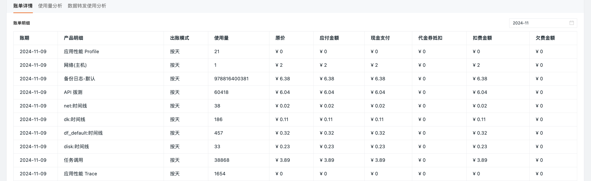

# 付费计划与账单
---
## 版本说明

观测云现有体验版、商业版、私有云部署版三种版本。

- 公有云提供的体验版、商业版，均采用**按量付费**的计费方式，在核心功能上并无差异。

    - [体验版的可接入数据量规模](../plans/trail.md#trail-vs-commercial)存在限制，<u>商业版用户支持接入更大规模的数据量，及更灵活的数据存储时效</u>。

- 私有云部署版，也提供了社区版（即体验版）、商业版。

    - 商业版可灵活选择<u>按量付费、订阅制、许可证制</u>多种计费方式。

???+ abstract "当前工作空间版本的查看方式"

    - 所有成员角色：可以在观测云控制台**管理 > 设置 > 基本信息 > 当前版本**中查看；
    - 拥有者、管理员：还可以在观测云控制台**付费计划与账单**中查看。

- [ :fontawesome-solid-arrow-up-right-from-square: &nbsp; 公有云商业版](../plans/commercial.md)

- [ :fontawesome-solid-arrow-up-right-from-square: &nbsp; 公有云体验版](../plans/trail.md)

- [ :fontawesome-solid-arrow-up-right-from-square: &nbsp; 私有云部署版](../deployment/deployment-description.md#_4)

## 费用中心

现有两套独立运行、统计数据量相关连的账号体系，共同为**商业版用户**实现用量计费与费用结算流程：

- [观测云控制台](https://console.guance.com/)账号，可统计当前工作空间的数据量接入规模、账单明细等，同步到指定的费用中心账号。
- [观测云费用中心](https://boss.guance.com/)账号，可通过 `工作空间 ID` 进行绑定，实现**工作空间级别的统一费用管理**，并提供了多种费用结算方式供您选择。

- [ :fontawesome-solid-arrow-up-right-from-square: &nbsp; 费用中心](./cost-center/index.md)

 

查看费用情况的方法：

- 在控制台[**付费计划与账单**](#billing)模块，查看结算账户总览、使用统计、账单详情、使用量分析、数据转发使用分析等信息；  
- 登录[观测云费用中心](https://boss.guance.com/)，可查看更多详情信息。

???- warning "工作空间角色差异说明"

    - 拥有者：在**付费计划与账单**，有**充值**、**费用中心**、**结算方式**、**更换绑定**按钮；   
    - 管理员：在**付费计划与账单**，无上述按钮；  
    - 其他成员：无**付费计划与账单**模块，即没有查看费用情况的权限。

## 付费计划与账单 {#billing}

### 结算账户总览 {#account}

在结算账户总览，可以查看结算账号名称、现金账户余额、代金券余额、预购卡余额，并对账户进行充值等操作。

- 充值：点击即可为账户进行充值；
- 费用中心：点击即可跳转打开观测云费用中心；
- 结算方式：点击即可更改结算方式，包括[观测云费用中心账号结算](../billing/billing-account/enterprise-account.md)、[亚马逊云账号结算](../billing/billing-account/aws-account.md)、[阿里云账号结算](../billing/billing-account/aliyun-account.md)和[华为云账号结算](../billing/billing-account/huawei-account.md)；
- 更换绑定：点击即可更换工作空间的观测云计费账号，<u>前提是当前账户与新账户必须隶属于同一企业，即在观测云费用中心两个账号的企业认证需为同一个</u>。
- 设置高消费预警：设置预警后，当计费项<u>日账单大于预警阈值</u>时，会向 Owner 和 Administrator 发送邮件通知。

    - 选择[计费项](./billing-method/index.md#item)，并选定**预警阈值**，点击**确定**，添加完成后，您将收到**观测云高消费预警通知**的邮件通知；计费项预警通知不会重复发送。

    

???+ warning "操作权限"

    - **充值**、**费用中心**、**结算方式**、**更换绑定**按钮仅支持当前工作空间 Owner 查看并操作；  
    - **设置高消费预警**支持 Owner 和 Administrator 操作。

### 使用统计

可查看计费项截止当前和截止昨日的统计数据，包含： DataKit、网络（主机）、时间线、日志类数据、备份日志数据容量、应用性能 Trace、应用性能 Profile、用户访问 PV、拨测次数、任务调度、短信以及中心 Pipeline 处理流量。

### 账单详情

在**账单详情**中：可查看**累计消费金额**以及各计费项的的消费金额，同时可按今日、昨日、本周、上周、本月、上月、今年查看费用统计。

> 更多计费项的收费方式，可参考 [计费方式](billing-method/index.md)。

### 使用量分析

在**使用量分析**中，可通过可视化的方式查看各个计费项目的使用情况。

### 数据转发使用分析 {#transmit}

在**数据转发使用分析**模块，可查看当前工作空间所有数据转发规则的数据转发数量。同时可按今日、昨日、本周、上周、本月、上月、今年查看转发数量统计。

**注意**：

- 若转发规则是保存到观测云备份日志模块，显示对应的数据保存策略，其他的展示为 `-`。
- 此处仅列出工作空间内存在的数据转发规则且转发数量 > 0 的列表。

## 用量计费方式

观测云工作空间的商业版用户，采用的是**按量付费**的计费方式，通过计费周期、计费项、计费价格、计费模式等不同的纬度，综合计算出当前的费用情况。

工作空间的拥有者、管理员，可以在观测云控制台**付费计划与账单**模块，查看该工作空间的数据量接入情况及对应的账单明细；其他成员角色，暂不开放**付费计划与账单**模块。

- [ :fontawesome-solid-arrow-up-right-from-square: &nbsp; 用量计费方式](./billing-method/index.md)

 

## 费用结算方式

观测云控制台计算出当前工作空间的账单详情后，会同步推送到所绑定的观测云费用中心账号，进行后续费用结算流程。

现支持观测云费用中心账号、云账号等多种结算方式，云账号结算包括阿里云账号、AWS 账号结算和华为云账号结算，在云账号结算模式下支持多个站点的云账单合并到一个云账号下进行结算。

- [ :fontawesome-solid-arrow-up-right-from-square: &nbsp; 费用结算方式](./billing-account/index.md)

 

