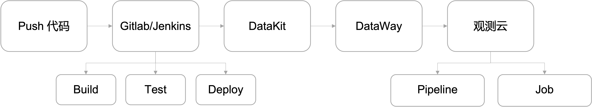

# 数据采集
---

## 简介

{{{ custom_key.brand_name }}}支持上报 Gitlab/Jenkins 内置的 CI 的过程和结果到{{{ custom_key.brand_name }}}进行可视化。您可以通过安装 DataKit ，开启 Gitlab/Jenkins 采集器，将整个 CI 过程（如 Build、Test、Deploy ）产生的结果上报到 DataKit，通过 DataWay 数据网关处理后再上报到{{{ custom_key.brand_name }}}进行查看和分析。

## 前提条件

您需要创建一个 [{{{ custom_key.brand_name }}}账号](https://auth.guance.com/register?channel=帮助文档)，并在您的主机上 [安装 DataKit](../datakit/datakit-install.md)。

## 数据采集

DataKit 安装完成后，您可以在 DataKit 安装目录开启 [Gitlab](../integrations/gitlab.md)  / [Jenkins](../integrations/jenkins.md) 采集器，重启 DataKit 以后，即可获取 CI 相关数据。

## 更多参考

- [Gitlab-CI 可观测最佳实践](../best-practices/monitoring/gitlab-ci.md)

- [Jenkins 可观测最佳实践](../best-practices/monitoring/jenkins.md)
