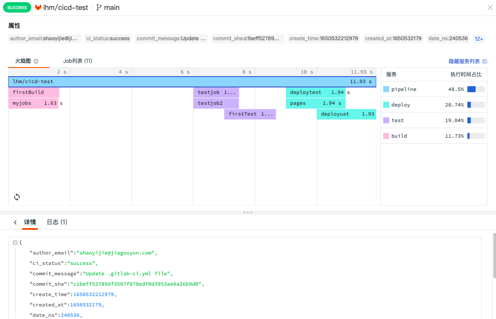
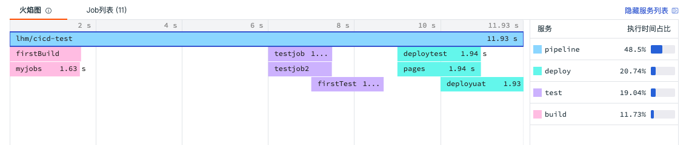
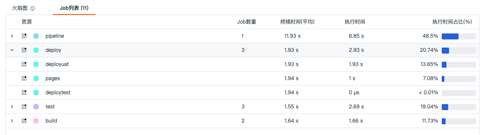
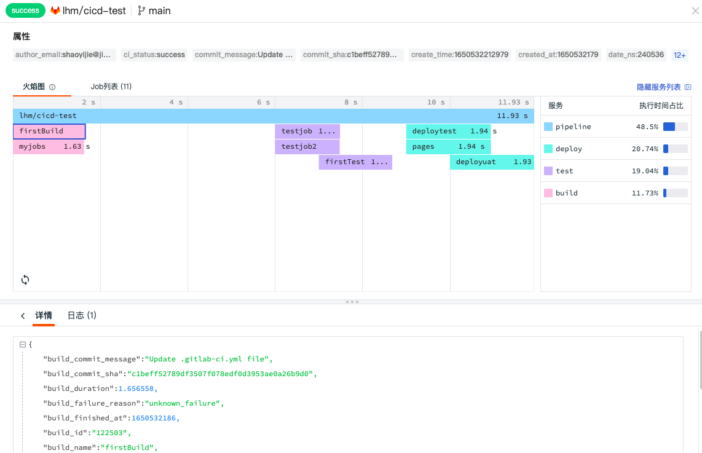

# CI 查看器
---

## 简介

<<< custom_key.brand_name >>>支持为 Gitlab/Jenkins 内置的 CI 的过程和结果进行可视化，您可以通过<<< custom_key.brand_name >>>的 CI 可视化功能直接查看在 Gitlab/Jenkins 的 CI 结果，实时了解您的 CI 性能、执行时间趋势、失败原因；通过 CI 火焰图，实时查看 CI 过程中 Pipeline 整条链路的健康状况，帮助您提供代码更新保障。

## 数据查询和分析

CI 的过程和结果数据上报到<<< custom_key.brand_name >>>工作空间以后，您可以在 CI 查看器通过选择时间范围、搜索关键字，筛选等方式查询和分析 Pipeline 和 Job 成功率、失败原因、具体失败环节等。

### 时间控件

CI 查看器默认展示最近 15 分钟的数据，通过右上角的「时间控件」，您可以选择数据展示的时间范围。更多详情可参考文档 [时间控件说明](../getting-started/function-details/explorer-analysis.md#time)。
### 搜索与筛选

在 CI 查看器搜索栏，支持关键字搜索、通配符搜索、关联搜索、JSON 搜索等多种搜索方式，支持通过 `标签/属性` 进行值的筛选，包括正向筛选、反向筛选、模糊匹配、反向模糊匹配、存在和不存在等多种筛选方式。更多搜索与筛选可参考文档 [查看器的搜索和筛选](../getting-started/function-details/explorer-search.md)。

### 分析模式

在 CI 查看器分析栏，支持基于 **1-3 个标签**进行多维度分析统计，以反映出数据在不同的维度下，不同时间的分布特征与趋势。<<< custom_key.brand_name >>>支持多种数据图表分析方式，包括时序图、排行榜、饼图和矩形树图。更多详情可参考文档 [查看器的分析模式](../getting-started/function-details/explorer-analysis.md)。

### 快捷筛选

在 CI 查看器快捷筛选，支持编辑“快捷筛选”，添加新的筛选字段。添加完成后，可以选择其字段值进行快捷筛选。

**注意：**

- 快捷筛选的「持续时间」默认进度条最小值、最大值为链路数据列表里最小和最大的持续时间
- 支持拖动进度条调整最大/最小值，输入框中的值同步变化
- 支持手动输入最大/最小值，"按回车键"或"点击输入框外"进行过滤搜索
- 输入不规范时输入框变红，不进行搜索，正确格式：纯“数字”或“数字+ns/μs/ms/s/min”
- 若没有输入单位进行搜索，默认直接在输入的数字后面填入"s"然后进行过滤搜索
- 若手动输入单位，则直接进行搜索

更多快捷筛选可参考文档 [快捷筛选](../getting-started/function-details/explorer-filter.md#quick-filter)。

### 自定义显示列

在查看器列表，可通过「显示列」自定义添加、编辑、删除、拖动显示列。当鼠标放在查看器显示列上时，点击「设置」按钮，支持对显示列进行升序、降序、向左移动列、向右移动列、向左添加列、向右添加列、替换列、添加到快捷筛选、添加到分组、移除列等操作。更多自定义显示列可参考文档 [显示列说明](../getting-started/function-details/explorer-analysis.md#columns)。

### 数据导出

在查看器列表，您可以先筛选出想要的数据导出后进行查看和分析，支持点击「设置」小图标导出到 CSV 文件、仪表板和笔记。

## Gitlab

### Pipeline 查看器

在查看器左上角，您可以切换至「Gitlab Pipeline」查看器对 CI Pipeline 的过程进行查询和分析，包括 Pipeline ID、名称、持续时长、提交内容、提交时间等等。

#### Pipeline 详情页

点击 Pipeline 列表中的您需要查看的数据，在划出详情页中显示 Pipeline  和 Job  的详情，包括属性、火焰图、Job列表、内容详情、以及关联日志等。

当鼠标点击属性字段，支持“筛选字段值”、“反向筛选字段值”、“添加到显示列”和“复制”进行快速筛选查看。

- “筛选字段值”，即添加该字段至查看器，查看与该字段相关的全部数据
- “反向筛选字段值”，即添加该字段至查看器，查看除了该字段以外的其他数据
- “添加到显示列”，即添加该字段到查看器列表进行查看
- “复制”，即复制该字段至剪贴板 

##### 火焰图

火焰图可清晰展示 CI 过程中 Pipeline 整条链路中每个 Job 的流转和执行时间。你可以在火焰图右侧查看对应的服务列表及执行时间占比。点击火焰图的 pipeline 和 job ，在「详情」可查看对应的 Json 内容。

##### 火焰图说明

CI 可视化主要采集的是 CI 过程中 Pipeline 和 Job 的数据，Pipeline 的整个过程分成 Build、Test、Deploy 三个阶段（stage），每个阶段会有不同的任务（Job）。

- 当每个阶段的任务都正常完成，那这个 Pipeline 就成功执行完成，在火焰图上会列出整个 Pipeline 的执行时间和每个 Job 的执行时间。
- 当第一个阶段 Build 的任务执行发生错误，则会提示任务失败及错误原因。

为了方便理解，下图是 Gitlab CI 的 Pipeline 过程示例，对照以上火焰图，我们可以清楚的看到每个 Job 的执行时间，整个 Pipeline 完成的执行时间。

##### Job列表

展示 Pipeline 整条链路中所有的阶段及其 Job 数量，包括“资源名”、“ Job 数量” 、“执行时间”以及“执行时间占比”。点击任一 Job ，可在「详情」可查看对应的Json内容，若有错误，在 Job 的前显示错误提示。

### Job 查看器

在查看器左上角，您可以切换至「Gitlab Job」对 CI Pipeline 的 Job 过程进行查询和分析，包括 Pipeline ID、Job 名称、持续时长、提交内容、提交时间等等。

#### Job 详情页

点击 Job 列表中的您需要查看的数据，在划出详情页中显示 Pipeline 和 Job 的详情，包括属性、火焰图、Job列表、内容详情、以及关联日志等。

## Jenkins

### Pipeline 查看器

在查看器左上角，您可以切换至「Jenkins Pipeline」查看器对CI Pipeline 的过程进行查询和分析，包括 Pipeline ID、名称、持续时长、提交内容、提交时间等等。

#### Pipeline 详情页

点击 Pipeline 列表中的您需要查看的数据，在划出详情页中显示 Pipeline 和 Job 的详情，包括属性、火焰图、Job列表、内容详情、以及关联日志等。

### Job 查看器

通过左上角的数据类型筛选栏，您可以切换至「jenkins_job」查看器对 CI Pipeline 的 Job 过程进行查询和分析，包括 Pipeline ID、Job 名称、持续时长、提交内容、提交时间等等。

#### Job 详情页

点击 Job 列表中的您需要查看的数据，在划出详情页中显示 Pipeline 和 Job 的详情，包括属性、火焰图、Job列表、内容详情、以及关联日志等。

