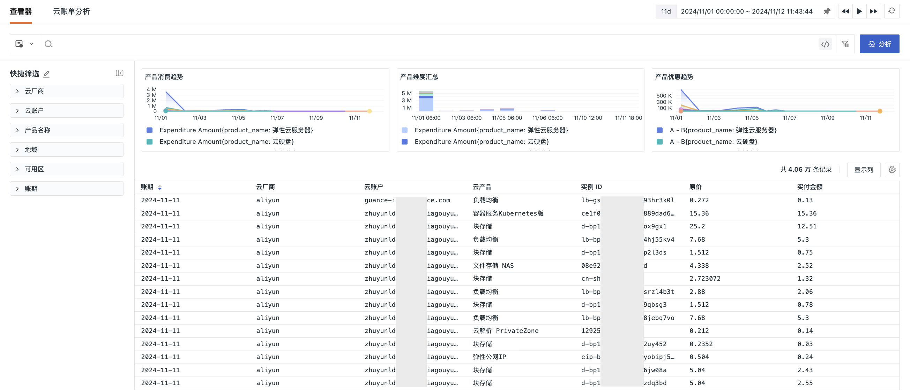

# 云账单
---

{{{ custom_key.brand_name }}}的云账单功能是一套综合的云成本管理和分析解决方案，它整合了数据采集、多维度分析和实时监控等多项功能，旨在帮助企业优化云资源的使用并控制成本。通过 DataFlux Func 高效采集云账单数据，确保了数据的准确性和实时性。

您可以利用云账单查看器，便捷地浏览和筛选来自不同云服务提供商的费用信息，从而实现对云资源消费的全面掌握。

此外，{{{ custom_key.brand_name }}}通过场景视图功能，允许深入分析云资源的消费情况，覆盖从产品、地域到实例级别的各个层面。这使得您能够识别资源消耗的热点和低效区域，并预测未来的资源需求和成本变化趋势，为制定长期的云成本规划提供数据支持。

最后，云账单智能监控系统为您提供了实时追踪服务消费和自动检测异常费用的能力，及时发出预警，有效避免不必要的开支。通过这些功能的有效联动，{{{ custom_key.brand_name }}}的云账单功能形成了一套强大的成本和消费分析系统，帮助企业实现云资源的精细化管理和成本优化。

## 前提 {#precondition}

在开始使用云账单分析功能前，并最终实现采集数据进行上报，需先前往 DataFlux Func 开启如下采集器：

- 采集器——[阿里云-云账单（实例维度）](https://func.guance.com/doc/script-market-guance-aliyun-billing-by-instance/)
- 采集器——[腾讯云-云账单（实例维度）](https://func.guance.com/doc/script-market-guance-tencentcloud-billing-by-instance/)
- 采集器——[华为云-云账单（实例维度）](https://func.guance.com/doc/script-market-guance-huaweicloud-billing-by-instance/)
- 采集器——[AWS-云账单（实例维度）](https://func.guance.com/doc/script-market-guance-aws-billing-by-instance/)
- 采集器——[微软云-云账单（实例维度）](https://func.guance.com/doc/script-market-guance-azure-billing-by-instance/)
- 采集器——[火山引擎-云账单（实例维度）](https://func.guance.com/doc/script-market-guance-volcengine-billing-by-instance/)

## 查看器

## 云账单分析

## 云账单智能监控

通过智能算法自动[检测](../monitoring/intelligent-monitoring/cloud-bill-detection.md)不同云厂商中的账号账单费用异常。

