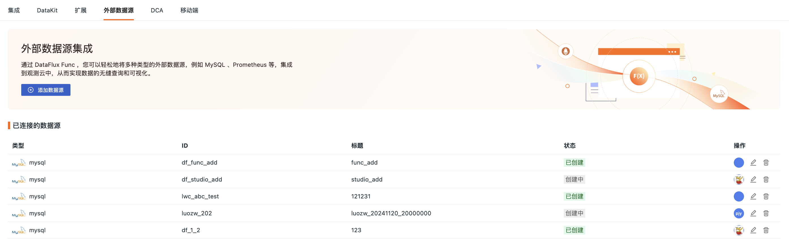

# 外部数据源
---

使用 DataFlux Func，可以将 MySQL 等多种数据源集成至{{{ custom_key.brand_name }}}，实现数据查询和可视化的无缝对接。

## 功能特点

- 原生查询：直接在图表中使用数据源的原生查询语句，无需任何额外转换；
- 数据保护：基于数据安全和隐私的考虑，所有数据源信息仅保存在您的本地 Func 中，不存储于平台，确保信息安全，防止数据泄露；
- 自定义管理：依据实际需求，轻松添加和管理各种外部数据源；
- 实时数据：直接连接外部数据源，实时获取数据，即时响应并作出决策。


## 前提条件

需选择下载对应安装包，[快速开始](https://func.guance.com/doc/quick-start/)部署 Func 平台。

部署完成后，等待初始化完成，登录进入平台。

## 关联 Func 与{{{ custom_key.brand_name }}} {#start}

通过连接器，可以帮助开发者连接{{{ custom_key.brand_name }}}系统。

进入开发 > 连接器 > 添加连接器页面：


1. 选择连接器类型；
2. 自定义该连接器的 [ID](https://func.guance.com/doc/development-guide-basic-conception/#2)，如 `guance_test`；
3. 添加标题。该标题将同步展示在{{{ custom_key.brand_name }}}工作空间内；
4. 按需输入该连接器的描述；
5. 选择{{{ custom_key.brand_name }}}[节点](https://func.guance.com/doc/ui-guide-development-module-guance-node/)；
6. 添加 [API Key ID 和 API Key](#api-key-how_to_get_api_key)；
7. 按需测试连通性；
8. 点击保存。

### 如何获取 API Key {#how_to_get_api_key}

1. 进入{{{ custom_key.brand_name }}}工作空间 > 管理 > API Key 管理；
2. 点击页面右侧**新建 Key**。
3. 输入名称；
4. 点击确定。系统此时将会为您自动创建一个 API Key，您可在 API Key 中查看。


> 更多详情，可参考 [API Key 管理](../management/api-key/index.md)。

## 使用 Func 查询外部数据源

**注意**：此处所指的“外部数据源”具有广泛的定义，既包括常见的外部数据存储系统（如 MySQL、Redis 等数据库），也涵盖第三方系统（例如{{{ custom_key.brand_name }}}控制台）。


### 使用连接器

正常添加连接器后，即可在脚本中使用连接器 ID 获取对应连接器的操作对象。

以上文 ID 为 `guance_test` 的连接器为例，获取该连接器操作对象的代码为：

```
mysql = DFF.CONN('mysql')
```


### 自行编写脚本

除了使用连接器以外，您还可以自行编写函数进行数据的查询。

假设用户已经正确创建了一个 MySQL 连接器（定义 ID 为 `mysql`），且此 MySQL 中存在一张名为 `my_table` 的表，并包含如下数据：


| `id`     | `userId`       | `username`|  `reqMethod` | `reqRoute`  |  `reqCost`   | `createTime` | 
| ------ | ----- |----- |----- |----- |----- |----- |
| 1 | u-001 | admin | POST | /api/v1/scripts/:id/do/modify | 23 | 1730840906 |
| 2 | u-002| admin  | POST | /api/v1/scripts/:id/do/publish | 99 | 1730840906 |
| 3 | u-003 | zhang3 | POST | /api/v1/scripts/:id/do/publish | 3941 | 1730863223 |
| 4 | u-004 | zhang3 | POST | 	/api/v1/scripts/:id/do/publish	 | 159 | 1730863244 |
| 5 | u-005 | li4 | POST | 	/api/v1/scripts/:id/do/publish	 | 44 | 1730863335 |
| ... |       | | | | | |

假设此时需要通过**数据查询函数**查询此表数据，且字段提取规则如下：

| 原始字段	     | 提取为    |
| ------------ | ---------- |
| `createTime`	     | 时间 `time`    |
| `reqCost`	     | 列 `req_cost`   |
| `reqMethod`	     | 列 `req_method`   |
| `reqRoute`		     | 列 `req_route`    |
| `userId`		     | 标签 `user_id`    |
| `username`	     | 标签 `username`    |

那么，完整参考代码如下：

- 数据查询函数示例

```
import json

@DFF.API('查询来自 my_table 数据', category='guance.dataQueryFunc')
def query_from_my_table(time_range):
    # 获取连接器操作对象
    mysql = DFF.CONN('mysql')

    # MySQL 查询语句
    sql = '''
      SELECT
        createTime, userId, username, reqMethod, reqRoute, reqCost
      FROM
        my_table
      WHERE
        createTime     > ?
        AND createTime < ?
      LIMIT 5
    '''

    # 由于传入的 time_range 单位为毫秒
    # 但 MySQL 中 createTime 字段单位为秒，需要转换
    sql_params = [
      int(time_range[0] / 1000),
      int(time_range[1] / 1000),
    ]

    # 执行查询
    db_res = mysql.query(sql, sql_params)

    # 转换为类 DQL 返回结果

    # 根据标签不同，可能需要生成多条数据序列
    # 使用数据序列标签作为 Key 制作映射表
    series_map = {}

    # 遍历原始数据，转换结构后存入映射表
    for d in db_res:
        # 搜集标签
        tags = {
            'user_id' : d.get('userId'),
            'username': d.get('username'),
        }

        # 将标签序列化（tag key 需要排序，保证输出一致）
        tags_dump = json.dumps(tags, sort_keys=True, ensure_ascii=True)

        # 如果此标签的数据系列尚未建立，则建立一个
        if tags_dump not in series_map:
            # 数据系列 series 基础结构
            series_map[tags_dump] = {
                'columns': [ 'time', 'req_cost', 'req_method', 'req_route' ], # 列（第 1 列固定为 time ）
                'tags'   : tags,                                              # 标签
                'values' : [],                                                # 值列表
            }

        # 提取时间、列，并追加 value
        series = series_map[tags_dump]
        value = [
            d.get('createTime') * 1000, # 时间 time（输出单位需要毫秒，此处需要根据实际进行转换）
            d.get('reqCost'),           # 列 req_cost
            d.get('reqMethod'),         # 列 req_method
            d.get('reqRoute'),          # 列 req_route
        ]
        series['values'].append(value)

    # 添加 DQL 外层结构
    dql_like_res = {
        # 数据系列
        'series': [ list(series_map.values()) ] # 注意这里要多套一层数组
    }
    return dql_like_res
```

如果您只想了解数据转换处理，不关心查询过程（或者暂时没有实际的数据库可查），可以参考以下代码：

- 数据查询函数示例（不含 MySQL 查询部分）

```
import json

@DFF.API('查询来自某处的数据', category='guance.dataQueryFunc')
def query_from_somewhere(time_range):
    # 假设已经通过某种方式获取到了原始数据
    db_res = [
        {'createTime': 1730840906, 'reqCost': 23,   'reqMethod': 'POST', 'reqRoute': '/api/v1/scripts/:id/do/modify',  'username': 'admin',  'userId': 'u-001'},
        {'createTime': 1730840906, 'reqCost': 99,   'reqMethod': 'POST', 'reqRoute': '/api/v1/scripts/:id/do/publish', 'username': 'admin',  'userId': 'u-001'},
        {'createTime': 1730863223, 'reqCost': 3941, 'reqMethod': 'POST', 'reqRoute': '/api/v1/scripts/:id/do/publish', 'username': 'zhang3', 'userId': 'u-002'},
        {'createTime': 1730863244, 'reqCost': 159,  'reqMethod': 'POST', 'reqRoute': '/api/v1/scripts/:id/do/publish', 'username': 'zhang3', 'userId': 'u-002'},
        {'createTime': 1730863335, 'reqCost': 44,   'reqMethod': 'POST', 'reqRoute': '/api/v1/scripts/:id/do/publish', 'username': 'li4',    'userId': 'u-003'}
    ]

    # 转换为类 DQL 返回结果

    # 根据标签不同，可能需要生成多条数据序列
    # 使用数据序列标签作为 Key 制作映射表
    series_map = {}

    # 遍历原始数据，转换结构后存入映射表
    for d in db_res:
        # 搜集标签
        tags = {
            'user_id' : d.get('userId'),
            'username': d.get('username'),
        }

        # 将标签序列化（tag key 需要排序，保证输出一致）
        tags_dump = json.dumps(tags, sort_keys=True, ensure_ascii=True)

        # 如果此标签的数据系列尚未建立，则建立一个
        if tags_dump not in series_map:
            # 数据系列 series 基础结构
            series_map[tags_dump] = {
                'columns': [ 'time', 'req_cost', 'req_method', 'req_route' ], # 列（第 1 列固定为 time ）
                'tags'   : tags,                                              # 标签
                'values' : [],                                                # 值列表
            }

        # 提取时间、列，并追加 value
        series = series_map[tags_dump]
        value = [
            d.get('createTime') * 1000, # 时间 time（输出单位需要毫秒，此处需要根据实际进行转换）
            d.get('reqCost'),           # 列 req_cost
            d.get('reqMethod'),         # 列 req_method
            d.get('reqRoute'),          # 列 req_route
        ]
        series['values'].append(value)

    # 添加 DQL 外层结构
    dql_like_res = {
        # 数据系列
        'series': [ list(series_map.values()) ] # 注意这里要多套一层数组
    }
    return dql_like_res
```

- 返回结果示例

```
{
  "series": [
    [
      {
        "columns": ["time", "req_cost", "req_method", "req_route"],
        "tags": {"user_id": "u-001", "username": "admin"},
        "values": [
          [1730840906000, 23, "POST", "/api/v1/scripts/:id/do/modify" ],
          [1730840906000, 99, "POST", "/api/v1/scripts/:id/do/publish"]
        ]
      },
      {
        "columns": ["time", "req_cost", "req_method", "req_route"],
        "tags": {"user_id": "u-002", "username": "zhang3"},
        "values": [
          [1730863223000, 3941, "POST", "/api/v1/scripts/:id/do/publish"],
          [1730863244000,  159, "POST", "/api/v1/scripts/:id/do/publish"]
        ]
      },
      {
        "columns": ["time", "req_cost", "req_method", "req_route"],
        "tags": {"user_id": "u-003", "username": "li4"},
        "values": [
          [1730863335000, 44, "POST", "/api/v1/scripts/:id/do/publish"]
        ]
      }
    ]
  ]
}
```

#### 图表数据返回

在{{{ custom_key.brand_name }}}中，使用外部数据源进行查询的一个典型场景是[图表](../scene/visual-chart/index.md)。


|        不同图表的数据返回          |               |                  |
| :---------------------: | :----------------: | :--------------: |
| [折线图](./chart_line.md) | [饼图](./chart_pie.md) | [表格图](./chart_table.md) |

## 在{{{ custom_key.brand_name }}}侧添加数据源

即直接在**扩展**中添加或查看所有接入的 DataFlux Func 列表，并进一步管理所有已接入的外部数据源。

1. 下拉选择 DataFlux Func；
2. 选择支持的数据源类型；
3. 定义连接属性，包括 ID、数据源标题、关联的主机、端口、数据库、用户、密码。
4. 按需测试连接；
5. 点击保存即可添加成功。


### 管理列表

所有已连接的数据源均可在**集成 > 外部数据源 > 已连接的数据源**可见。



在列表，您可进行以下操作：

1. 查看数据源的类型、ID、状态、创建信息与更新信息等；
2. 编辑某条数据源，针对除 DataFlux Func、数据源类型与 ID 以外的配置进行修改；
3. 删除某条数据源。

