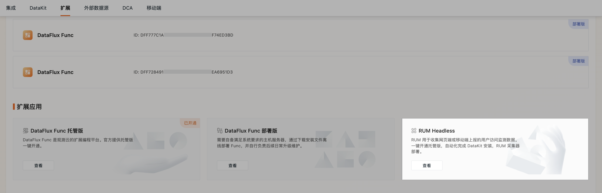

# RUM Headless

RUM 用于收集网页端或移动端上报的用户访问监测数据。观测云提供 RUM 一键开通服务。开通后即可自动化安装部署在观测云的云主机中，自动完成 DataKit 安装，RUM 采集器部署等一系列操作。

## 一键开通

在**集成 > RUM Headless**，或**集成 > 扩展 > RUM Headless**，点击进入开通流程：

???+ attention "权限与收费"

    - 一个工作空间只能开通一次，仅 **Owner** 有开通权限和配置权限；  
    - RUM Headless<u>按月收费</u>，在开通成功后一次性扣除一个月的费用，在到期日前一天自动扣除下月费用（如：04/13 开通，则 04/12 扣费，05/12 扣费，以此类推...）。

1、点击**开通**，填写 HTTP 服务地址、选择应用所需规格：

2、填写完相关信息后，点击**立即开通**；

3、自动化部署过程预计需要 10-15 分钟。开通完成后，点击**确定**。您可以在**集成 > Func > 扩展**应用直接进入控制台。点击**配置 > 概览**，即可查看 RUM Headless 的相关信息。

## 相关配置

当 RUM Headless 开通完成后，若您需要修改配置信息，可参考以下内容：

### 修改服务地址

点击**修改**，完成**身份验证**，即可修改当前 HTTP 服务地址。

### 修改规格

点击**修改**，完成**身份验证**，即可修改当前规格。

**注意：**规格修改后当日立即生效，并按照新规格开始扣费，旧规格将直接弃用，且不会退费。

### Sourcemap 配置

Sourcemap（源代码映射）用于将生产环境中的压缩代码映射回原始的源代码。

上传文件时，选择应用类型，[配置打包完成 Sourcemap 后](/datakit/rum.md#sourcemap)，拖拽或点击上传。

在 🔍 栏下方，可查看已上传的文件名称及应用类型，您可输入文件名称搜索；点击 :fontawesome-regular-trash-can: 可删除当前文件。

???+ attention "上传须知"

    - 文件大小不能超过 500M；
    - 文件格式必须是 `.zip`；
    - 文件命名格式为 `<app_id>-<env>-<version>`，其中 `app_id` 必填，格式错误将不会生效；
    - 请确保该压缩包解压后的文件路径与 `error_stack` 中 URL 的路径一致；
    - 不能同时上传多个文件；
    - 上传同名文件会出现覆盖提示，请注意：

    

