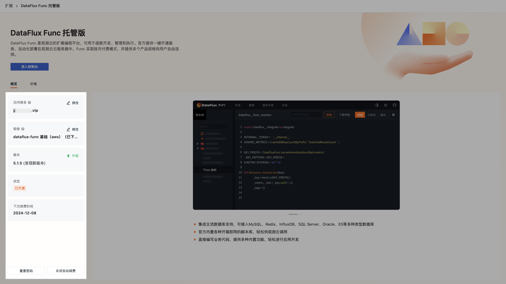

# DataFlux Func
---

<!--
???- quote "更新日志"

    **2023.9.21**：DataFlux Func 托管版和 RUM Headless 现支持海外站点：俄勒冈，法兰克福，新加坡。
-->
DataFlux Func 是一个基于 Python 的脚本开发、管理、执行平台。是[观测云](https://guance.com/) 下属的一个函数计算组件，目前已成为可独立运行的系统。

主要分为 2 个部分：

- Server：使用 Node.js + Express 构建，主要提供 Web UI 服务、对外 API 接口。
- Worker：使用 Python3 + Celery 构建，主要提供 Python 脚本的执行环境（内含 Beat 模块）。

## DataFlux Func 托管版 {#steps}

观测云支持 DataFlux Func 托管版一键开通服务，开通完成后即可在云主机中自动化部署 Func，同时在工作空间的**集成**可以快速登录对应 Func 平台。

### 一键开通

点击 **DataFlux Func 托管版**，进入开通流程：

???+ warning "权限与收费"

    - 一个工作空间只能开通一个 Func，仅 **Owner** 有开通权限和配置权限；  
    - DataFlux Func 托管版<u>按月收费</u>，在开通成功后一次性扣除一个月的费用，在到期日前一天自动扣除下月费用（如：04/13 开通，则 04/12 扣费，05/12 扣费，以此类推...）。

1. 进入**概览**页面，点击**开通**；
2. 填写域名、选择应用所需规格；
3. 点击**立即开通**；       
3. 在弹出的协议窗口，点击**确定**，即可成功开通 DataFlux Func 托管版；
4. 在提示页面中，可以查看您的初始账号密码，并会同步发送至您的邮箱，请注意查收与保存。     

自动化部署过程预计需要 5 分钟。开通完成后，您可以在**集成 > Func > 扩展应用**直接**进入控制台**。点击**配置 > 概览**，即可查看 DataFlux Func 托管版的相关信息。

<!--

-->

### 相关配置

当 DataFlux Func 托管版开通完成后，若您需要修改配置信息，可参考以下内容：

#### 修改访问域名

1. 点击**修改**；
2. 获取并填入邮箱验证码；
3. 点击确定，完成**身份验证**，即可修改当前域名。

**注意**：每日可修改 3 次访问域名。

#### 修改规格

1. 点击**修改**；
2. 获取并填入邮箱验证码；
3. 点击确定，完成身份验证，即可修改当前规格。

**注意**：规格修改后当日立即生效，并按照新规格开始扣费，旧规格将直接弃用，且不会退费。

#### 状态相关

在 DataFlux Func 托管版配置页面，您可以查看当前的应用状态。

您当前的应用可能存在五种状态：

| 状态      | 说明            |
| ----------- | ------------- |
| 开通中      | 表示处于一键开通 Func 托管版流程中。             |
| 已开通      | 表示已完成一键开通 Func 托管版流程。             |
| 方案变更中      | 表示正在修改域名或修改规格。              |
| 升级中      | 表示正在升级当前应用服务。               |
| 操作失败      | 表示在开通流程中存在操作问题，您可以**查看错误反馈**或直接[联系我们](https://www.guance.com/aboutUs/introduce#contact)。           |

#### 重置密码

1. 点击**重置密码**；
2. 获取并填入邮箱验证码；
3. 点击确定，完成身份验证，即可重置密码。您会在邮箱中收到 DataFlux Func 托管版的新密码，请注意查收。

#### 停用应用

1. 点击**停用应用**；
2. 获取并填入邮箱验证码；
3. 点击确定，完成身份验证，即可打开确认页面，您可以查看应用到期日。

DataFlux Func 托管版采用按月收费的模式，在费用到期前，您仍可使用 Func 服务，还可以按需**恢复开通** DataFlux Func 托管版。

#### 应用到期

若您之前开通过 DataFlux Func 托管版，应用到期后，所有数据我们会为您保留 7 天，到期释放。在这 7 天内，若需要再次开通应用，您可以选择**恢复所有数据**或者**不恢复数据**：

- 恢复数据：将之前保留的数据备份到新开通的 Func 中；  
- 不恢复数据：放弃之前的所有数据，[重新开通应用](#steps)。

## DataFlux Func 部署版

> 关于 DataFlux Func 部署版，可参考：

- [ :fontawesome-solid-arrow-up-right-from-square: &nbsp; __DataFlux Func 部署版__ ](https://func.guance.com/doc/maintenance-guide-requirement/)

> 关于 DataFlux Func 的部署和维护手册、脚本开发手册、脚本市场等详细内容，可参考：

- [ :fontawesome-solid-arrow-up-right-from-square: &nbsp; __DataFlux Func 文档库__ ](https://func.guance.com/doc/)

## RUM Headless

- [ :fontawesome-solid-arrow-up-right-from-square: &nbsp; __一键开通 RUM Headless__ ](./headless.md)

