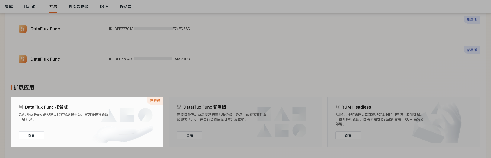

# DataFlux Func
---

DataFlux Func 是一个基于 Python 的脚本开发、管理、执行平台。

前身为 [观测云](https://guance.com/) 下属的一个函数计算组件，目前已成为可独立运行的系统。

主要分为 2 个部分：

- Server：使用 Node.js + Express 构建，主要提供 Web UI 服务、对外 API 接口。
- Worker：使用 Python3 + Celery 构建，主要提供 Python 脚本的执行环境（内含 Beat 模块）。

 

## DataFlux Func 托管版 {#steps}

观测云支持 DataFlux Func 托管版一键开通服务，开通完成后即可在云主机中自动化部署 Func，同时在工作空间的**集成**可以快速登录对应 Func 平台。

### 一键开通

点击 **DataFlux Func 托管版**，进入开通流程：

???+ attention

    - 一个工作空间只能开通一个 Func，仅 **Owner** 有开通权限和配置权限；  
    - DataFlux Func 托管版<u>按月收费</u>，在开通成功后一次性扣除一个月的费用，在到期日前一天自动扣除下月费用（如：04/13 开通，则 04/12 扣费，05/12 扣费，以此类推...）

1、进入**概览**页面，点击**开通**，填写以下信息：

| 字段      | 说明                          |
| ----------- | ------------------------------------ |
| 域名       | 自定义填写；只能包含英文字母（a~z，不区分大小写）、数字（0~9）以及连接符（-）。其中连接符（-）不能连续出现，也不能放在开头和结尾； 二级域名长度不超过 30 个字符。 **注意**：后续您会通过该域名登录 DataFlux Func，请谨慎填写。|
| 选择规格       | 2 核 4G：标准配置，适用于基本的函数开发，数据同步； 4 核 8G：高级配置，适用于多监控场景应用，实现高效检测； 8 核 16G：专业配置，适用于各类业务集成场景应用。 |

2、填写完相关信息后，点击**立即开通**；       
3、在弹出的协议窗口，点击**确定**，即可成功开通 DataFlux Func 托管版。在提示页面中，可以查看您的初始账号密码，并会同步发送至您的邮箱，请注意查收与保存；     
4、自动化部署过程预计需要 5 分钟。开通完成后，您可以在**集成 > Func > 扩展应用**直接**进入控制台**。点击**配置 > 概览**，即可查看 DataFlux Func 托管版的相关信息。

### 相关配置操作

当 DataFlux Func 托管版开通完成后，若您需要修改配置信息，可参考以下内容：

#### 修改访问域名

点击**修改**，完成**身份验证**，即可修改当前域名。

#### 修改规格

点击**修改**，完成**身份验证**，即可修改当前规格。

#### 状态相关

在 DataFlux Func 托管版配置页面，您可以查看当前的应用状态。

???+ info "您当前的应用可能存在五种状态"

    | 状态      | 说明            |
    | ----------- | ------------- |
    | 开通中      | 表示处于一键开通 Func 托管版流程中。             |
    | 已开通      | 表示已完成一键开通 Func 托管版流程。             |
    | 方案变更中      | 表示正在修改域名或修改规格。              |
    | 升级中      | 表示正在升级当前应用服务。               |
    | 操作失败      | 表示在开通流程中存在操作问题，您可以**查看错误反馈**或直接[联系我们](https://www.guance.com/aboutUs/introduce#contact)。           |

#### 重置密码

点击**重置密码**，完成**身份验证**，即可重置密码。您会在邮箱中收到 DataFlux Func 托管版的新密码，请注意查收。

#### 停用应用

若您需要停用当前应用服务，点击**停用应用**，完成**身份验证**，即可打开确认页面，您可以查看应用到期日。

DataFlux Func 托管版采用按月收费的模式，在费用到期前，您仍可使用 Func 服务，还可以按需**恢复开通** DataFlux Func 托管版。

#### 应用到期

若您之前开通过 DataFlux Func 托管版，应用到期后，所有数据我们会为您保留 7 天，到期释放。在这 7 天内，您可以选择**恢复所有数据**或者**不恢复数据**：

- 恢复数据：将之前保留的数据备份到新开通的 Func 中；  
- 不恢复数据：放弃之前的所有数据，[重新开通应用](#steps)

## DataFlux Func 部署版

> 关于 DataFlux Func 部署版，[前往参考](https://func.guance.com/doc/maintenance-guide-requirement/)。

> 关于 DataFlux Func 的部署和维护手册、脚本开发手册、脚本市场等详细内容，可参考：

- [ :fontawesome-solid-arrow-up-right-from-square: &nbsp; __DataFlux Func 文档库__ ](https://func.guance.com/doc/)

 

 

 

 