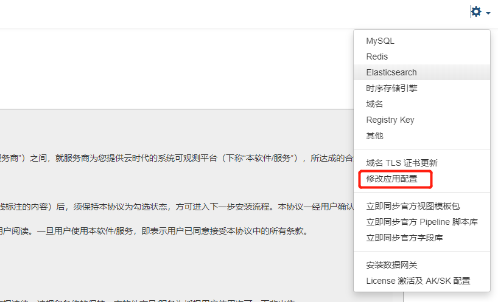

## 概述

本文档旨在通过 launcher 的“修改应用配置”功能来修改相关配置，为了更好的跟自身环境适配，达到优化相关配置和满足个性化配置的目的。

## launcher 操作步骤

1、浏览器访问 launcher 控制台

2、选择右上角，进入**修改应用配置**界面



3、要修改对应的配置文件时，要**勾选修改配置**选项，即可被修改。

4、完成配置修改后，需要勾选页面底部右下角的 **修改配置后自动重启相关服务**，再点击确认修改配置。


## 服务的部分常用配置说明

### Studio 后端服务 {#studio-backend}

#### 配置文件位置

- Namespace: forethought-core
- Launcher 中的配置名称: Core
- kubernetes 中的 Configmap 名称: core

#### 配置文件示例

```YAML

...
token_exp_set:
  # web端默认设置 4小时
  front_web: 14400
  manage: 7200
  ...

...

apiDocPageSwitch:
  admin: false
  front: false
  inner: false
  openapi: false
  center: false
  external: false

...

# query_view 中链路的时间范围偏移量, 单位为 秒
BusinessQueryViewTimeOffset: 900

...

```

#### 配置项详细说明

| 配置项                      | 子项      | 类型 | 默认值 | 描述                                                         |
| --------------------------- | --------- | ---- | ------ | ------------------------------------------------------------ |
| token_exp_set               | front_web | 数值 | 14400  | Studio 浏览端用户登录的有效时长，单位：秒                    |
|                             | manage    | 数值 | 7200   | 管理后台浏览端用户登录的有效时长，单位：秒                   |
| apiDocPageSwitch            | admin     | 布尔 | false  | 管理后台的 API 接口文档开放开关                              |
|                             | front     | 布尔 | false  | Studio 后端 API 接口文档开放开关                             |
|                             | inner     | 布尔 | false  | Inner 服务 API 接口文档开放开关                              |
|                             | openapi   | 布尔 | false  | OpenAPI 接口文档开放开关                                     |
|                             | external  | 布尔 | false  | External API 接口文档开放开关                                |
| BusinessQueryViewTimeOffset |           | 数值 | 900    | 查询 RUM Resource 对应的链路数据的前后时间偏移范围，单位：秒 |

### Studio 前端站点 {#studio-front}

#### 配置文件位置

- Namespace：forethought-webclient
- Launcher 中的配置名称：frontWeb
- kubernetes 中的 Configmap 名称：front-web-config

#### 配置文件示例

```js
window.DEPLOYCONFIG = {
    ...
    "rumDatawayUrl": "https://rum-openway.guance.com",
    "datakitScriptUrl": "https://static.guance.com/datakit",
    "datakitHelmUrl": "https://pubrepo.guance.com",
    "passPublicNetwork": 1,
    "isOverseas": 0,
    "maxTraceSpanLimit": 10000,
    "maxProfileM": 5,
    "paasCustomLoginInfo": [{ "iconUrl":"xxx", "label": "xxx", "url": "xxxx" ,desc:"xxx"}],
    "paasCustomSiteList": [{"url": "xxxx", "label": "xxx"}]
    ...
}

```

#### 配置项详细说明

| 配置项              | 子项 | 类型   | 默认值                              | 描述                                                                                                                                             |
| ------------------- | ---- | ------ | ----------------------------------- | ------------------------------------------------------------------------------------------------------------------------------------------------ |
| rumDatawayUrl       |      | 字符串 | "https://rum-openway.guance.com"    | 用于上报 RUM 数据的专用 DataWay 地址，配置后将显示在 RUM 接入配置页面中                                                                          |
| datakitScriptUrl    |      | 字符串 | "https://static.guance.com/datakit" | DataKit 安装页面的默认安装脚本下载域名，如使用自建的内部静态资源，请修改此配置                                                                   |
| datakitHelmUrl      |      | 字符串 | "https://pubrepo.guance.com"        | DataKit Helm 镜像仓库地址，如使用自建镜像仓库，请修改此配置                                                                                      |
| passPublicNetwork   |      | 数值   | 1                                   | 配置访问 Studio 站点的客户端计算机是否有公网网络，0：无，1：有                                                                                   |
| isOverseas          |      | 数值   | 0                                   | 配置此观测云站点是否为海外部署，将影响 RUM 中的世界地图、中国地图组件的显示                                                                      |
| maxTraceSpanLimit   |      | 数值   | 10000                               | 链路的火焰图中最大的 Span 条数，默认值：10000                                                                                                    |
| maxProfileM         |      | 数值   | 5                                   | 获取 profile 显示火焰图的最大 MB 数,如果不配置，则默认取值: 5                                                                                    |
| paasCustomLoginInfo |      | 数组   | 无                                  | 部署版观测云控制台登录页面单点登录入口配置 新增 iconUrl, desc 自定义字段, iconUrl 为单点登录图标地址,不配置则为默认 icon desc 为单点登录描述文案 |
| paasCustomSiteList  |      | 数组   | 无                                  | 部署版观测云控制台登录页面新增多站点选择配置 label 为站点显示文案 url 为站点地址,如果不存在多站点，可以不添加此配置项                            |

### kodo 组件 {#kodo}

#### 配置文件位置

- Namespace: forethought-kodo
- Launcher 中的配置名称: Kodo
- kubernetes 中的 Configmap 名称: kodo

#### 配置文件示例

```YAML

...

global:
    workers: 8
    log_workers: 8
    tracing_workers: 8
    ...

redis:
    host: "r-xxx.redis.rds.xxx.com:6379"
    password: "..."
    db: 0

asynq_redis:
    host: "r-xxxx.redis.rds.xxx.com:6379"
    password: "..."
    db: 0

dql:
    metric_query_workers: 8 # 时序数据worker数量，默认值为8
    log_query_workers: 8 # 日志数据worker数量，默认值为8
    ...

...

```

#### 配置项详细说明

| 配置项 | 子项                 | 类型 | 默认值 | 描述                                                                   |
| ------ | -------------------- | ---- | ------ | ---------------------------------------------------------------------- |
| global | workers              | 数值 | 8      | 指标数据的处理 worker 数量                                             |
|        | log_workers          | 数值 | 8      | 日志数据的处理 worker 数量                                             |
|        | tracing_workers      | 数值 | 8      | 链路数据的处理 worker 数量，默认使用 log_workers 配置项的值            |
| redis  | host  | 字符串 | ''  | 用于数据处理的 Redis 地址，支持集群版。 注：所有 kodo 相关组件的 Redis 配置必须一致                                           |
| asynq_redis | host  | 字符串 | ''  | 用于异步任务的 Redis 地址，默认使用 `redis` 配置，不支持集群版，如果 `redis` 配置的是集群版，必须配置一个非集群版的 asynq_redis   |
| dql    | metric_query_workers | 布尔 | false  | DQL 指标数据查询 worker 数量                                           |
|        | log_query_workers    | 布尔 | false  | DQL 日志文本类（日志、链路、RUM 等所有文本类数据）数据查询 worker 数量 |

### kodo-inner 组件 {#kodo-inner}

#### 配置文件位置

- Namespace: forethought-kodo
- Launcher 中的配置名称: KodoInner
- kubernetes 中的 Configmap 名称: kodo-inner

#### 配置文件示例

```YAML

...

redis:
    host: "r-xxx.redis.rds.xxx.com:6379"
    password: "..."
    db: 0

asynq_redis:
    host: "r-xxxx.redis.rds.xxx.com:6379"
    password: "..."
    db: 0

dql:
    metric_query_workers: 8 # 时序数据worker数量，默认值为8
    log_query_workers: 8    # 日志数据worker数量，默认值为8
    ...

...

```

#### 配置项详细说明

| 配置项 | 子项                 | 类型 | 默认值 | 描述                                                                   |
| ------ | -------------------- | ---- | ------ | ---------------------------------------------------------------------- |
| redis  | host  | 字符串 | ''  | 用于数据处理的 Redis 地址，支持集群版。 注：所有 kodo 相关组件的 Redis 配置必须一致                       |
| asynq_redis | host  | 字符串 | ''  | 用于异步任务的 Redis 地址，默认使用 `redis` 配置，不支持集群版，如果 `redis` 配置的是集群版，必须配置一个非集群版的 asynq_redis   |
| dql    | metric_query_workers | 布尔 | false  | DQL 指标数据查询 worker 数量                                           |
|        | log_query_workers    | 布尔 | false  | DQL 日志文本类（日志、链路、RUM 等所有文本类数据）数据查询 worker 数量 |

### kodo-x 组件 {#kodo-x}

#### 配置文件位置

- Namespace: forethought-kodo
- Launcher 中的配置名称: KodoX
- kubernetes 中的 Configmap 名称: kodo-x

#### 配置文件示例

```YAML

...

global:
    workers: 8
    log_workers: 8
    tracing_workers: 8
    ...

redis:
    host: "r-xxx.redis.rds.xxx.com:6379"
    password: "..."
    db: 0

asynq_redis:
    host: "r-xxxx.redis.rds.xxx.com:6379"
    password: "..."
    db: 0

doris:
    dial_timeout: 10
    gzip_enable: false

dql:
    metric_query_workers: 8 # 时序数据worker数量，默认值为8
    log_query_workers: 8 # 日志数据worker数量，默认值为8
    ...

...

```

#### 配置项详细说明

| 配置项 | 子项                 | 类型 | 默认值 | 描述                                                                   |
| ------ | -------------------- | ---- | ------ | ---------------------------------------------------------------------- |
| global | workers              | 数值 | 8      | 指标数据的处理 worker 数量                                             |
|        | log_workers          | 数值 | 8      | 日志数据的处理 worker 数量                                             |
|        | tracing_workers      | 数值 | 8      | 链路数据的处理 worker 数量，默认使用 log_workers 配置项的值            |
| redis  | host  | 字符串 | ''  | 用于数据处理的 Redis 地址，支持集群版。 注：所有 kodo 相关组件的 Redis 配置必须一致                                           |
| asynq_redis | host  | 字符串 | ''  | 用于异步任务的 Redis 地址，默认使用 `redis` 配置，不支持集群版，如果 `redis` 配置的是集群版，必须配置一个非集群版的 asynq_redis   |
| dql    | metric_query_workers | 布尔 | false  | DQL 指标数据查询 worker 数量                                           |
|        | log_query_workers    | 布尔 | false  | DQL 日志文本类（日志、链路、RUM 等所有文本类数据）数据查询 worker 数量 |
| doris  | dial_timeout         | 数值 | 10     | 数据写 Doris 引擎，TCP 连接超时时间，单位：毫秒                        |
|        | gzip_enable          | 布尔 | false  | 数据写 Doris 引擎，是否开启 gzip 压缩                                  |

### kodo-servicemap 组件 {#kodo-servicemap}

#### 配置文件位置

- Namespace: forethought-kodo
- Launcher 中的配置名称: kodoServiceMap
- kubernetes 中的 Configmap 名称: kodo-servicemap

#### 配置文件示例

```YAML

...

redis:
    host: "r-xxx.redis.rds.xxx.com:6379"
    password: "..."
    db: 0

asynq_redis:
    host: "r-xxxx.redis.rds.xxx.com:6379"
    password: "..."
    db: 0

...

```

#### 配置项详细说明

| 配置项 | 子项                 | 类型 | 默认值 | 描述                                                                   |
| ------ | -------------------- | ---- | ------ | ---------------------------------------------------------------------- |
| redis  | host  | 字符串 | ''  | 用于数据处理的 Redis 地址，支持集群版。 注：所有 kodo 相关组件的 Redis 配置必须一致                                           |
| asynq_redis | host  | 字符串 | ''  | 用于异步任务的 Redis 地址，默认使用 `redis` 配置，不支持集群版，如果 `redis` 配置的是集群版，必须配置一个非集群版的 asynq_redis   |

### kodo-x-scan 组件 {#kodo-x-scan}

#### 配置文件位置

- Namespace: forethought-kodo
- Launcher 中的配置名称: kodoXScan
- kubernetes 中的 Configmap 名称: kodo-x-scan

#### 配置文件示例

```YAML

...

redis:
    host: "r-xxx.redis.rds.xxx.com:6379"
    password: "..."
    db: 0

asynq_redis:
    host: "r-xxxx.redis.rds.xxx.com:6379"
    password: "..."
    db: 0

...

```

#### 配置项详细说明

| 配置项 | 子项                 | 类型 | 默认值 | 描述                                                                   |
| ------ | -------------------- | ---- | ------ | ---------------------------------------------------------------------- |
| redis  | host  | 字符串 | ''  | 用于数据处理的 Redis 地址，支持集群版。 注：所有 kodo 相关组件的 Redis 配置必须一致                                           |
| asynq_redis | host  | 字符串 | ''  | 用于异步任务的 Redis 地址，默认使用 `redis` 配置，不支持集群版，如果 `redis` 配置的是集群版，必须配置一个非集群版的 asynq_redis   |


### kodo-ws 组件 {#kodo-ws}

#### 配置文件位置

- Namespace: forethought-kodo
- Launcher 中的配置名称: kodoWS
- kubernetes 中的 Configmap 名称: kodo-ws

#### 配置文件示例

```YAML

...

redis:
    host: "r-xxx.redis.rds.xxx.com:6379"
    password: "..."
    db: 0

asynq_redis:
    host: "r-xxxx.redis.rds.xxx.com:6379"
    password: "..."
    db: 0

...

```

#### 配置项详细说明

| 配置项 | 子项                 | 类型 | 默认值 | 描述                                                                   |
| ------ | -------------------- | ---- | ------ | ---------------------------------------------------------------------- |
| redis  | host  | 字符串 | ''  | 用于数据处理的 Redis 地址，支持集群版。 注：所有 kodo 相关组件的 Redis 配置必须一致                                           |
| asynq_redis | host  | 字符串 | ''  | 用于异步任务的 Redis 地址，默认使用 `redis` 配置，不支持集群版，如果 `redis` 配置的是集群版，必须配置一个非集群版的 asynq_redis   |

