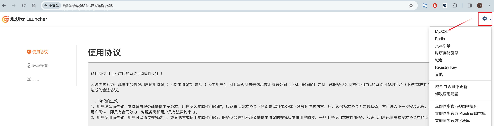
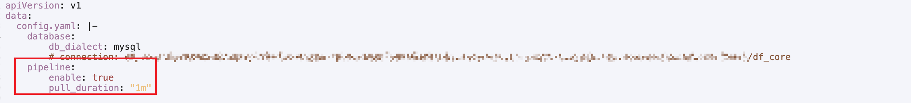

### 简介

本节介绍的是在中心开启Pipeline的功能

### 操作步骤


#### 步骤一：Studio端配置
中心Pipeline功能开关有两个，**站点级**和**空间级**

**站点级**：为新建的工作空间配置默认的 「空间级中心PL服务」开关配置

**空间级**：标志当前工作空间是否启用「空间级中心PL服务」

现阶段修改配置需要连接到df_core数据库中，可以通过下列步骤获取到该数据库信息

1. 浏览器中访问launcher地址，点击右上角功能键-->MySQL获取到df_core的用户信息


2. 通过MySQL客户端工具或者launcher容器里连接到df_core库
```shell
# 进入到launcher容器
kubectl -n launcher get po | grep launcher
kubectl -n launcher exec -it launcher_podname bash
# 连接到MySQL
mysql -h mysql_host -P mysql_port -u df_core -p
```
3. 根据自己的场景执行下列对应的sql

在实际使用过程中，我们可能有以下几种场景：

* **部署时，需要将所有空间**开启中心PL功能
```sql
-- 【开启】中心PL服务开关
INSERT INTO `main_config` (`keyCode`, `description`, `value`) VALUES ('CentralPLServiceSwitch', '中心PL服务支持状态开关。当 isOpen=true 时，新创建的工作空间会默认其开启 自定义中心PL服务支持开关，该开关对应于的 keyCode=CustomCentralPLServiceSwitch', '{\"isOpen\": true}') ON DUPLICATE KEY UPDATE description=VALUES(description),value=VALUES(value);
```
* 系统使用一段时间后，**全部空间**开启中心PL功能
```sql
-- 【开启】中心PL服务开关； 为未配置的工作空间插入配置项
insert into main_workspace_config (uuid, workspaceUUID, keyCode, config, creator, updator, createAt, deleteAt, updateAt)
select
    CONCAT('ctcf_', REPLACE(UUID(), '-', '')) as uuid,
    w.uuid as workspaceUUID,
    "CustomCentralPLServiceSwitch" as keyCode,
    '{"isOpen": true}' as config,
     'SYS' as creator,
     'SYS' as updator,
     UNIX_TIMESTAMP(NOW()) as createAt,
     '-1' as deleteAt,
     UNIX_TIMESTAMP(NOW()) as updateAt
from
    main_workspace as w
where
    status=0
    and uuid not in (
        select
            distinct(workspaceUUID)
        from
            main_workspace_config
        where
            status=0
            and keyCode='CustomCentralPLServiceSwitch'
    );
```
将存量空间开启中心PL功能后，如果想让后续新增的空间也开启中心PL功能，执行以下sql(value字段中true改为false，可让增量空间不开启中心PL功能)
```sql
INSERT INTO `main_config` (`keyCode`, `description`, `value`) VALUES ('CentralPLServiceSwitch', '中心PL服务支持状态开关。当 isOpen=true 时，新创建的工作空间会默认其开启 自定义中心PL服务支持开关，该开关对应于的 keyCode=CustomCentralPLServiceSwitch', '{\"isOpen\": true}') ON DUPLICATE KEY UPDATE description=VALUES(description),value=VALUES(value);
```
* 系统使用一段时间后，**部分空间**开启中心PL功能
```sql
-- 【开启】中心PL服务开关； 为未配置的工作空间插入配置项
insert into main_workspace_config (uuid, workspaceUUID, keyCode, config, creator, updator, createAt, deleteAt, updateAt)
select
    CONCAT('ctcf_', REPLACE(UUID(), '-', '')) as uuid,
    w.uuid as workspaceUUID,
    "CustomCentralPLServiceSwitch" as keyCode,
    '{"isOpen": true}' as config,
     'SYS' as creator,
     'SYS' as updator,
     UNIX_TIMESTAMP(NOW()) as createAt,
     '-1' as deleteAt,
     UNIX_TIMESTAMP(NOW()) as updateAt
from
    main_workspace as w
where
    status=0
    and uuid in ('<工作空间UUID1>')
    and uuid not in (
        select
            distinct(workspaceUUID)
        from
            main_workspace_config
        where
            status=0
            and keyCode='CustomCentralPLServiceSwitch'
    );
```

#### 步骤二：开启Kodo服务中心PL配置
Kodo在部署的时候，需要加一个配置：是否允许工作空间开启中心PL/黑名单功能。需要在forethought-kodo命名空间下修改kodo、kodo-x这两个Configmap，添加以下内容，添加完毕后，重启kodo和kodo-x服务
```yaml
pipeline:
    enable: true            
    pull_duration: "1m"    

# enable：是否开启中心Pipeline功能，true为开启，false为关闭
# pull_duration: 脚本拉取周期
```



