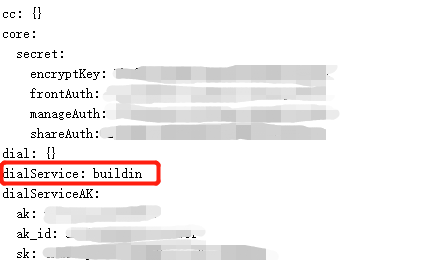
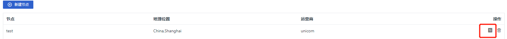
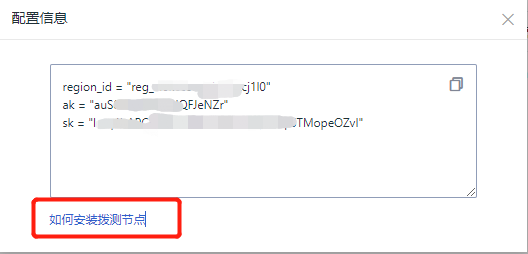
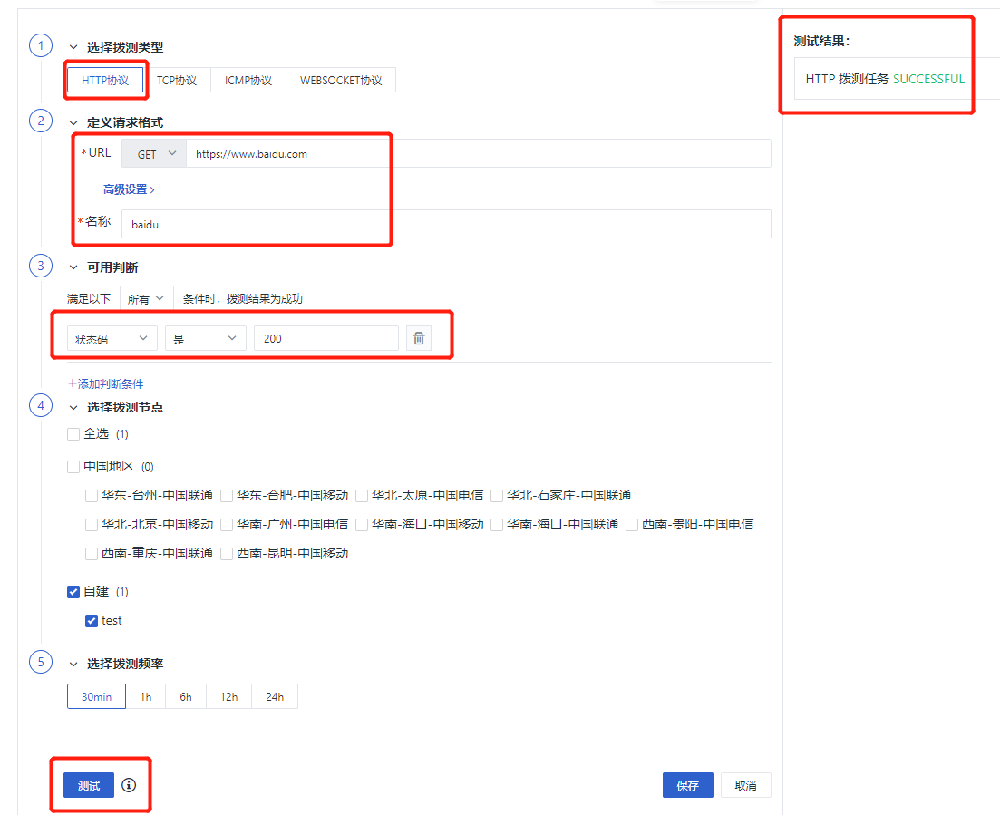
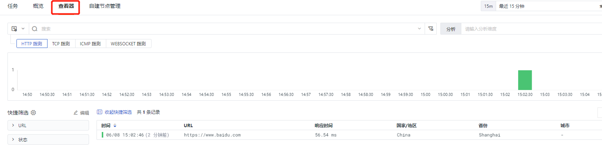

## 概述

官方的拨测中心由<<< custom_key.brand_name >>>进行管理与维护，有定义好的国内及国外的拨测节点，可以实时监测、统计拨测任务可用情况，先于用户发现网络站点的性能问题及受影响范围。

### 适用场景

- 完全无网络，想要自身实现拨测服务。

- 想要实现内网站点的拨测服务。

### 前置条件

- 版本为1.63.128或以上

> 升级时，launcher 服务会指引你是否需要切换到 私有拨测中心
>
> 部署时，会有选项让你选择使用私有拨测中心还是官方拨测中心。

所以此篇文章是为了解决部署后想切换拨测中心的痛点，以下是操作步骤。

## 操作步骤

### 切换到私有拨测中心

登陆 launcher 控制台 ---> 右上角按钮 ---> 其他，增加如下一行 `dialService: buildin` 



> 增加 `dialService: buildin` 为切换成私有拨测中心，修改为 `dialService: saas` 是切换成官方拨测中心。

右上角按钮 ---> 点击**修改应用配置**，修改 forethought-core Namespace 下名为 core 的 ConfigMap 中关于 DialingServer 模块的内容。

```shell
# 云拨测服务
DialingServer:
  # 拨测服务中心的地址配置
  use_https: true                           ## 是否使用https
  host: dflux-dial.<<< custom_key.brand_main_domain >>>               ## 拨测中心地址，换成私有部署的ingress域名，如果要切换回来记得使用原本的地址
  port: 443
  timeout: 10
```

> 默认使用的是官方提供的拨测中心。

### 增加拨测节点

登陆<<< custom_key.brand_name >>>控制台，点击可用性监测 ---> 自建节点管理 ---> 新建节点 。

> 注意：如果节点新建在系统工作空间，那么所有工作空间都能看到这个拨测节点，如果只想要单个工作空间看见，那么就在那个工作空间去新建拨测节点。

点击最右侧的获取配置按钮，按照以下跳转去安装拨测节点。





> 注意： 里面除了这三个字段，DataKit 中的 dialtesting.conf 还需配置 `server` 为需要使用的拨测服务中心的地址（一般为部署或升级时创建的 ingress 域名）。

```shell
[[inputs.dialtesting]]
  # We can also configure a JSON path like "file:///your/dir/json-file-name"
  server = "https://dflux-dial.<<< custom_key.brand_main_domain >>>"

  # [require] node ID
  region_id = "default"

  # if server are dflux-dial.<<< custom_key.brand_main_domain >>>, ak/sk required
  ak = ""
  sk = ""
```

### 验证方法

1、登陆<<< custom_key.brand_name >>>控制台，点击可用性监测 ---> 任务 ---> 新建任务 ---> HTTP 拨测

2、按照以下步骤去新建一个拨测任务，然后保存



3、回到任务点击刚刚创建的拨测任务。



4、数据如上图所示，即为成功。
