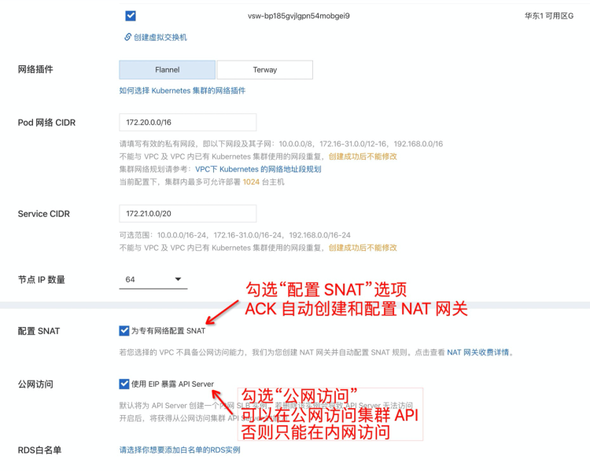
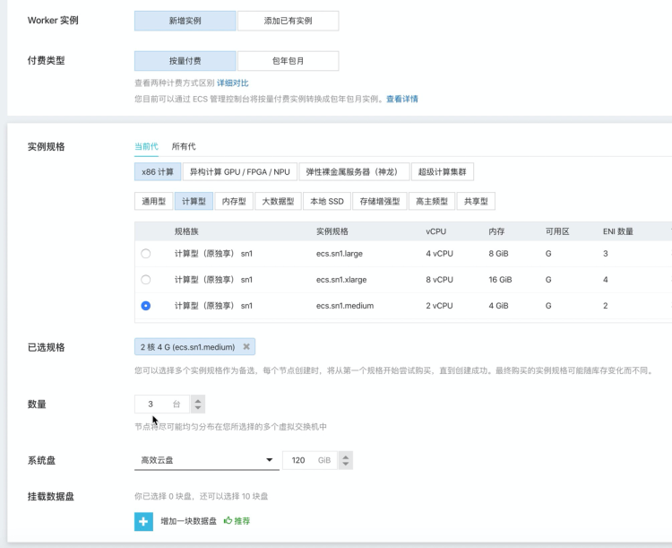
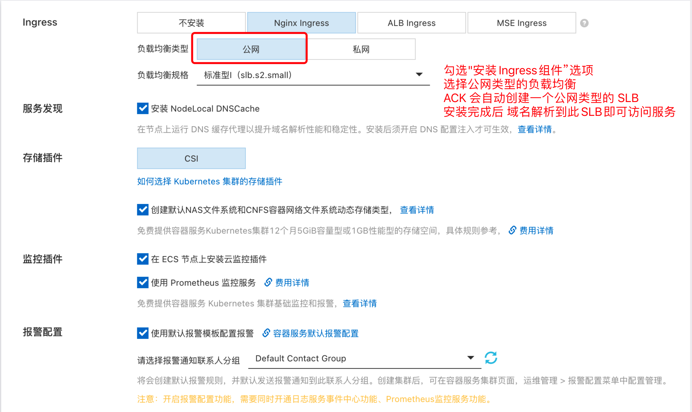
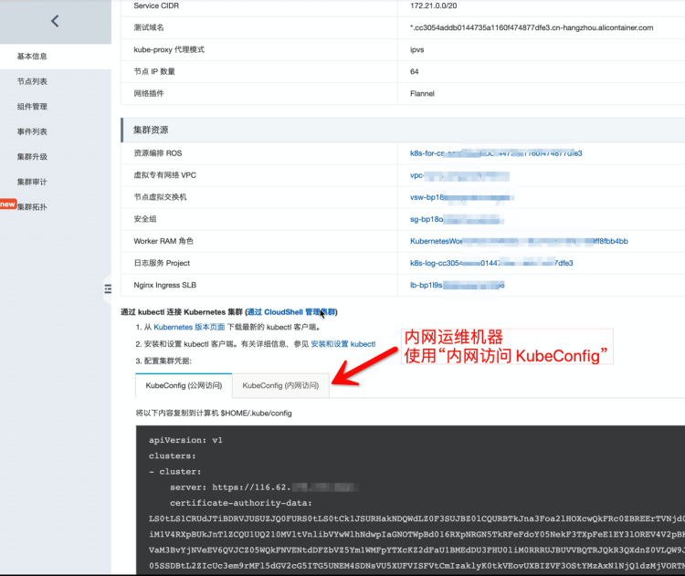

# 阿里云部署手册
---

## 1 前言
### 1.1 本文档说明
本文档主要以在阿里云上部署，介绍从资源规划、配置开始，到部署观测云、运行的完整步骤。

**说明：**

- 本文档以 **dataflux.cn** 为主域名示例，实际部署替换为相应的域名。

### 1.2 关键词

| **词条** | **说明** |
| --- | --- |
| Launcher | 用于部署安装 观测云 的 WEB 应用，根据 Launcher 服务的引导步骤来完成 观测云 的安装与升级 |
| 运维操作机 | 安装了 kubectl，与目标 Kubernetes 集群在同一网络的运维机器 |
| 安装操作机 | 在浏览器访问 launcher 服务来完成 观测云 引导安装的机器 |
| kubectl | Kubernetes 的命令行客户端工具，安装在 **运维操作机** 上 |


### 1.3 部署步骤架构 {#install-step-image}

## 2 资源准备
[阿里云资源清单](cloud-required.md#list)


## 3 基础设施部署

### 3.1 部署说明

**RDS、InfluxDB、OpenSearch、NAS 存储** 按配置要求创建，创建到同一地域的同一个 **VPC** 网络下。
ECS、SLB、NAT 网关，由ACK 来自动创建，不需要单独创建，也就是[部署步骤图](#install-step-image)中的1、2、3 步骤不需要单独创建。

### 3.2 步骤一、二、三  ACK 服务创建

#### 3.2.1 集群配置

进入 **容器服务 kubernetes 版**，创建 **Kubernetes** 集群，选择 **标准托管集群版**，集群配置要注意事项：

- 必须与前面创建的 RDS、 InfluxDB、Elasticsearch 等资源同一地域
- 勾选“配置 SNAT”选项（ACK 自动创建和配置 NAT 网关，使集群有出网能力）
- 勾选“公网访问”选项（可以在公网访问集群 API，如果是在内网运维此集群，可以不勾选此项）
- 开通ACK服务时储存驱动暂时选择flexvolume，CSI驱动本文档暂时未支持



#### 3.2.2 Worker 配置

主要是选择 ECS 规格及数量，规格可以按配置清单要求来创建，或者按实际情况评估，但不可低于最低配置要求，数量至少3台，或3台以上。



#### 3.2.3 组件配置

组件配置，必须勾选“安装 Ingress 组件”选项，选择“公网”类型，ACK 会自动创建一个公网类型的 SLB，安装完成后，将域名触到到此 SLB 的公网 IP。



### 3.3 步骤四、五 动态存储配置

需提前创建 nas 文件系统，获取 nas_server_url

#### 3.3.1 动态存储安装

=== "CSI"

    阿里云容器服务ACK的容器存储功能基于Kubernetes容器存储接口（CSI），深度融合阿里云存储服务云盘EBS，文件存储NAS和CPFS，以及对象存储OSS，本地盘等，并完全兼容Kubernetes原生的存储服务，例如EmptyDir、HostPath、Secret、ConfigMap等存储。本文介绍ACK存储CSI的概览、ACK存储CSI支持的功能、CSI使用授权、CSI使用限制等。控制台将**默认安装**CSI-Plugin和CSI-Provisioner组件。
    
    - 验证插件
      - 执行以下命令，查看CSI-Plugin组件是否成功部署。
        ```shell
        kubectl get pod -n kube-system | grep csi-plugin
        ```
      - 执行以下命令，查看CSI-Provisioner组件是否成功部署。
        ```shell
        kubectl get pod -n kube-system | grep csi-provisioner
        ```
    - 创建 StorageClass
       
      创建并复制以下内容到 alicloud-nas-subpath.yaml 文件中。
    
    ???+ note "alicloud-nas-subpath.yaml"
          ```yaml
          apiVersion: storage.k8s.io/v1
          kind: StorageClass
          metadata:
            name: alicloud-nas
          mountOptions:
          - nolock,tcp,noresvport
          - vers=3
          parameters:
            volumeAs: subpath
            server: "{{ nas_server_url }}:/k8s/"
          provisioner: nasplugin.csi.alibabacloud.com
          reclaimPolicy: Retain
          ```
    
      **{{ nas_server_url }}** 替换为前面创建的 NAS 存储的 Server URL，在**运维操作机**上执行命令：  
    
      ```shell
      kubectl apply -f ./alicloud-nas-subpath.yaml
      ```
=== "flexvolume(官方已废弃)"

    创建阿里云Kubernetes 1.16之前版本的集群时，若存储插件选择为Flexvolume，则控制台默认安装Flexvolume与Disk-Controller组件，但不会默认安装alicloud-nas-controller组件。
    
    - 安装alicloud-nas-controller组件
    
      下载 [nas_controller.yaml](nas_controller.yaml)
      在**运维操作机**上执行命令： 
      ```shell
      kubectl apply -f nas_controller.yaml
      ```
    
    - 验证插件
    
      执行以下命令，查看Disk-Controller组件是否成功部署。
      ```shell
      kubectl get pod -nkube-system | grep alicloud-nas-controller
      ```
    
    - 创建 StorageClass
    
      创建并复制以下内容到 storage_class.yaml 文件中。
    
    ???+ note "storage_class.yaml"
          ```yaml
          apiVersion: storage.k8s.io/v1
          kind: StorageClass
          metadata:
            name: alicloud-nas
            annotations:
              storageclass.beta.kubernetes.io/is-default-class: "true"
              storageclass.kubernetes.io/is-default-class: "true"
          mountOptions:
          - nolock,tcp,noresvport
          - vers=3
          parameters:
            server:  "{{ nas_server_url }}:/k8s/"
            driver: flexvolume
          provisioner: alicloud/nas
          reclaimPolicy: Delete
          ```
      **{{ nas_server_url }}** 替换为前面创建的 NAS 存储的 Server URL，在**运维操作机**上执行命令：  
    
      ```shell
      kubectl apply -f ./storage_class.yaml
      ```
#### 3.3.2 验证部署

##### 3.3.2.1 创建 pvc ,查看状态

执行命令，创建 pvc

```shell
$ cat <<EOF | kubectl apply -f -
apiVersion: v1
kind: PersistentVolumeClaim
metadata:
 name: cfs-pvc001
spec:
 accessModes:
   - ReadWriteOnce
 resources:
   requests:
     storage: 1Gi
 storageClassName: alicloud-nas
EOF
```

##### 3.3.2.2 查看 pvc

```shell
$ kubectl get pvc | grep cfs-pvc001

cfs-pvc001       Bound    pvc-a17a0e50-04d2-4ee0-908d-bacd8d53aaa4   1Gi        RWO            alicloud-nas           3d7h
```

>`Bound` 为部署成功标准

### 3.4 步骤六 缓存服务

- 可使用默认的内置缓存服务。
- 若不使用默认内置缓存服务，请按照以下要求配置 Redis：
  - Redis 版本：6.0，支持单机模式、代理模式以及主从模式的 Redis 集群。
  - 配置 Redis 密码。
  - 将自动创建的 ECS 内网 IP 添加至 Redis 白名单中。

### 3.5 步骤七 InfluxDB

- 创建管理员账号（必须是**管理员账号**，后续安装初始化需要用此账号去创建和初始化 DB 及 RP等信息）
- 将 ACK 自动创建的 ECS 内网 IP，添加到 InfluxDB 白名单

### 3.6 步骤八 OpenSearch

- 创建管理员账号
- 安装中文分词插件
- 将 ACK 自动创建的 ECS 内网 IP，添加到 OpenSearch 白名单

### 3.7 步骤九 RDS

- 创建管理员账号（必须是**管理员账号**，后续安装初始化需要用此账号去创建和初始化各应用 DB）
- 在控制台修改参数配置，将 **innodb_large_prefix** 设置为 **ON**
- 将 ACK 自动创建的 ECS 内网 IP，添加到 RDS 白名单

## 4 kubectl 安装及配置
### 4.1 安装 kubectl
kubectl 是一个 kubernetes 的一个命令行客户端工具，可以通过此命令行工具去部署应用、检查和管理集群资源等。
我们的 Launcher 就是基于此命令行工具，去部署应用的，具体安装方式可以看官方文档：

[https://kubernetes.io/docs/tasks/tools/install-kubectl/](https://kubernetes.io/docs/tasks/tools/install-kubectl/)

### 4.2 配置 kube config
kubectl 要获得管理集群的能力，需要将集群的 kubeconfig 内容放入 **$HOME/.kube/config** 文件内，kubeconfig 内容可以在集群 **基本信息** 中查看到。

选择 公网访问还是内网访问的kubeconfig，取决于你的运维操作机是否与集群内网联通。




## 5 开始安装

操作完成后，可以参考手册 [开始安装](launcher-install.md)
