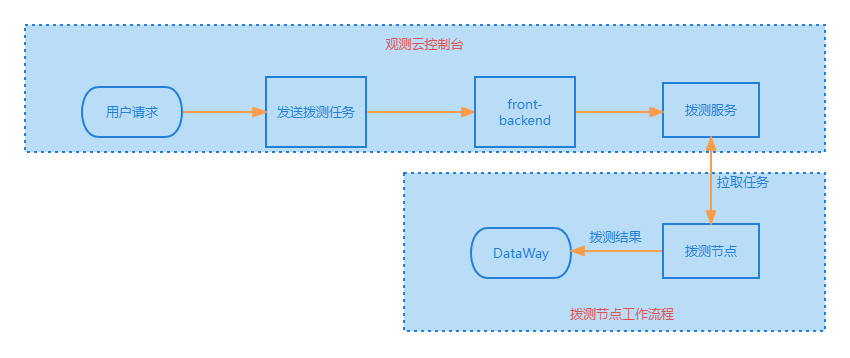
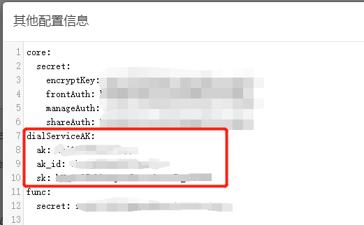
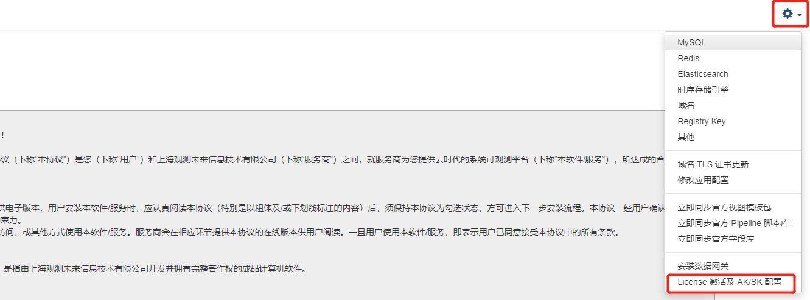
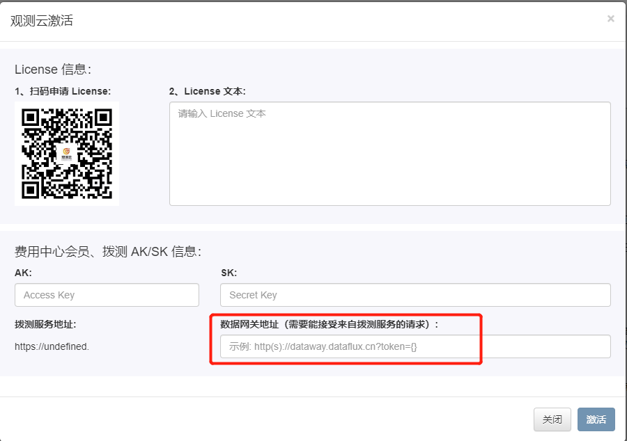

# 可用性监测故障排查

## 拨测自建节点管理 Name or service not known {#service-not-known}

### 问题概述 {#overview}

【自建节点管理】报 `Name or service not known`。


### 错误原因 {#error-cause}

- 由于有些云供应商负载均衡问题，服务无法访问自身的 ingress 的域名

### 操作步骤 {#steps}


#### 1. 打开 Launcher 修改应用配置 {#step-one}

访问 Launcher 服务，点击右上角 `修改应用配置`


#### 2. 添加参数 {#step-two}

修改「命名空间：forethought-core」- 「core」添加 `internal_server` 参数：

```yaml
# 云拨测服务

DialingServer:
   ...
   internal_server: http://dialtesting.utils:9538
```

#### 3. 修改配置后自动重启相关服务 {#step-three}

勾选修改配置后自动重启相关服务


## 可用性监测查看器数据断档 {#no-data}

### 问题概述 {#overview}

本章节将介绍如何排查可用性监测中查看器数据断档的问题。

### 流程图



### 排查思路

#### 步骤一：校验配置

1、首先查看配置文件是否正确

- 查看 forethought-core Namespace 下名为`core`的 ConfigMap 配置是否正确

```shell
# 云拨测服务
DialingServer:
  # 拨测服务中心的地址配置
  use_https: true
  port: 443                                     ## 根据实际情况修改
  host: 'dflux-dial.guance.com'                 ## 根据实际情况修改
  timeout: 10
```

> **dflux-dial.guance.com** 为官方拨测中心，如要切换成私有拨测中心，请查看 ingress 配置。

- 查看 utils Namespace 下名为 dialtesting-config 的 ConfigMap 配置是否正确

```shell
global:
    enable_inner_api: false
    stats_on: 256
    listen: ":9538"
    sys_external_id: "ak_R5Fxxxxxxxxx8Go8-wksp_system"
```

> **sys_external_id** 组成为下文中 **aksk** 表中的 **uuid** + **external_id**

2、确认 MySQL df_dialtesting 数据库中 `aksk` 表中的数据

```sql
mysql -u <user_name> -p -h <mysql_address>
use df_dialtesting;
select * from aksk;
```

| id   | uuid                | accessKey            | secretKey                  | owner  | parent_ak | external_id | status | version | createAt      | updateAt      |
| ---- | ------------------- | -------------------- | -------------------------- | ------ | --------- | ----------- | ------ | ------- | ------------- | ------------- |
| 1    | ak_R5Fxxxxxxxxx8Go8 | asjTxxxxxxxxxxxxxXMJ | zeiX99gxxxxxxxxxxxxxxxx2h5 | system | -1        | wksp_system | OK     | 0       | 1,686,218,468 | 1,686,218,468 |

3、与 df_core 数据库中 main_config 中 `Keycode` 为 `DialingServerSet` 的数据是否一致

```sql
use df_core;
select * from main_config;
```

| id   | keyCode          | description  | value                                                        |
| ---- | ---------------- | ------------ | ------------------------------------------------------------ |
| 6    | DialingServerSet | 拨测服务配置 | "{\"ak\": \"asjTxxxxxxxxxxxxxXMJ\", \"sk\": \"zeiX99gxxxxxxxxxxxxxxxx2h5\", \"dataway\": \"http://deploy-openway.dataflux.cn?token={}\"}" |

4、与 launcher 的 `dialServiceAK` 模块中的数据做对比是否一致

操作步骤：登陆 launcher 界面 ---> 右上角按钮 ---> 其他

 

对应关系表：

| aksk 表中 key 名 | launcher 其他配置中的 dialServiceAK 模块的 key 名 |
| ---------------- | ------------------------------------------------- |
| uuid             | ak_id                                             |
| accessKey        | ak                                                |
| secretKey        | sk                                                |

> 如果不一致，则以数据库为准进行修改。

5、如果切换了拨测中心或者做了修改，需要重新在 launcher 页面上重新激活一下 license，重新写入信息。

> 无需更改 license 配置，直接激活即可





> 确认数据网关地址，是否跟示例的格式完全一致。**token={}** 无需修改。

#### 步骤二：确认通信

在**拨测节点**机器上使用 `ping` 命令确认跟拨测中心和 DataWay 是否能够进行通信。

#### 步骤三：查看数据是否上报

在拨测节点机器中执行以下命令，查看是否上报

- 查看 I/O 通信是否正常

```shell
sudo datakit monitor -M IO

## DYNAMIC_DW 代表拨测中心的服务， Points(ok/total) 一致代表没问题
┌IO Info───────────────────────────────────────────────────────────────────────────────────────────────────────────────────────────────────────────────────────────────────────────────────────────────────────────────────────────────────┐
│       Cat│ChanUsage│   Points(ok/total)│                     Bytes(ok/total/gz)                                                                                                                                                          │
│DYNAMIC_DW│      0/1│          626 /626 │         389.392 k/389.392 k(267.603 k)                                                                                                                                                          │
│         M│      0/1│1.7955 M/1.796043 M│560.715703 M/560.880362 M(240.616886 M)                                                                                                                                                          │
│         O│      0/1│  588.045 k/588.2 k│ 516.475667 M/516.613201 M(37.964566 M)


```

- 查看 input 是否正常

```shell

sudo datakit monitor -M In
## 以下dialtesting 的 Feeds 和 TotalPts 不为0 则代表有数据上传
┌Inputs Info(11 inputs)────────────────────────────────────────────────────────────────────────────────────────────────────────────────────────────────────────────────────────────────────────────────────────────────────────────────────┐
│                Input│Cat│    Feeds│ TotalPts│Filtered│      LastFeed│     AvgCost│Errors                                                                                                                                                 │
│          dialtesting│ L │     626 │     626 │      0 │25 minutes ago│          0s│  0                                                                                                                                                    │
│                  cpu│ M │ 112.71 k│ 112.71 k│      0 │ 6 seconds ago│   237.807?s│  0                                                                                                                                                    │

```

#### 步骤四：查看日志

使用如下命令，查看拨测节点中的 `DataKit` 的日志进一步确定问题。

```shell
tail -f /var/log/datakit/log | grep dial
```
