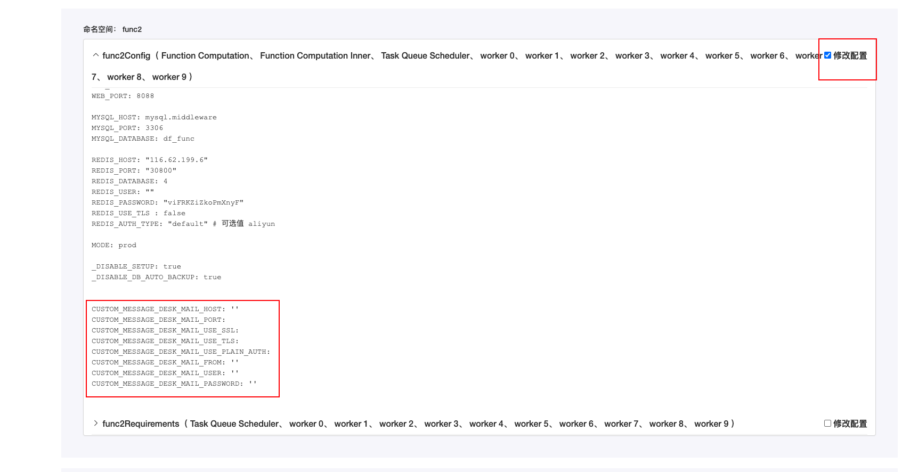

# 配置邮件服务

## 简介

本文将展示如何配置观测云的邮件告警服务。

## 前提条件

- 已完全初始化观测云
- 拥有邮件服务的信息：`host`，`port`，`useTLS`，`user`，`password`, `useSSL`, `usePlainAuth`

## 配置步骤

### 步骤一：测试邮件服务信息

修改以下 python 代码 `host`, `port`, `sender`, `password`, `use_tls`, `recipient`, `useSSL`, `usePlainAuth` 参数， 并在 middleware 下的 message-desk-worker pod 执行创建：

```python
cat <<EOF> test-maile.py
from mailer import Mailer
from mailer import Message

host = 'smtp.example.com'
port = 587
sender = 'your_email@example.com'
password = 'your_email_password'
use_tls = True
recipient = 'recipient@example.com'
use_ssl = False
use_plain_auth = False

message = Message(From=sender, To=recipient)
message.Subject = 'Test email'
message.Body = 'This is a test email'

mailer = Mailer(host=host, port=587, use_tls=use_tls, usr=sender, pwd=password, use_plain_auth=use_plain_auth, use_ssl=use_ssl)

try:
    mailer.send(message)
    print('Email sent successfully.')
except Exception as e:
    print('Error:', e)
EOF
```

然后执行 python 脚本，查看配置是否成功：

```shell
python test-maile.py
```


### 步骤二：修改服务配置

???+ warning "注意"
     请根据自己的实际邮件信息配置来修改配置。

- 登录 Launcher，单击右上角的配置
- 选择 「修改服务配置」

  

- 命名空间：middleware
- messageDeskWorker（ 消息中心 Worker )
- 修改配置
  


- 保存配置并重启

  

**1.90.170** 之后的版本需要参考以下配置设置邮件

- 命名空间：func2
- func2Config（ Function Computation、 Function Computation Inner、 Task Queue Scheduler、 worker 0、 worker 1、 worker 2、 worker 3、 worker 4、 worker 5、 worker 6、 worker 7、 worker 8、 worker 9 )
- 修改配置



- 保存配置并重启

  

### 步骤三：测试和排错

你可以创建错误的告警配置手动触发告警设置。


您可以参考[监控器问题排查](troubleshooting-monitor.md)来排查问题。