# 配置部署版数据转发

## 简介

本文将展示如何配置观测云部署版配置数据转发。


## 前置条件
* 已完全初始化观测云
* 拥有对应云厂商可配置用户、存储桶权限的账号

## 配置步骤
### 步骤一：配置存储桶与账号

#### 华为云
* 创建存储用户
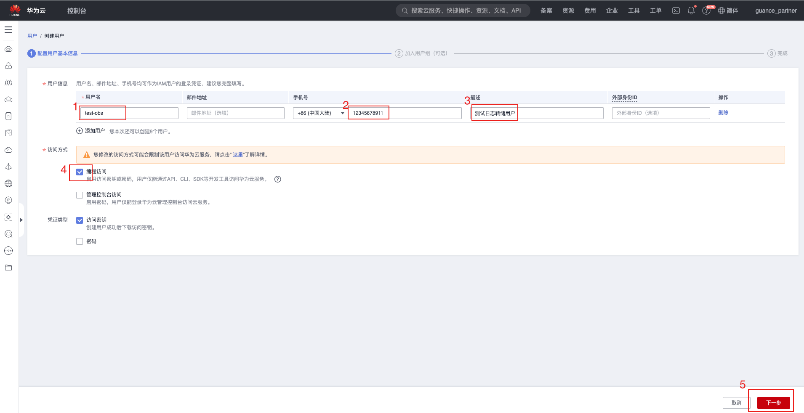
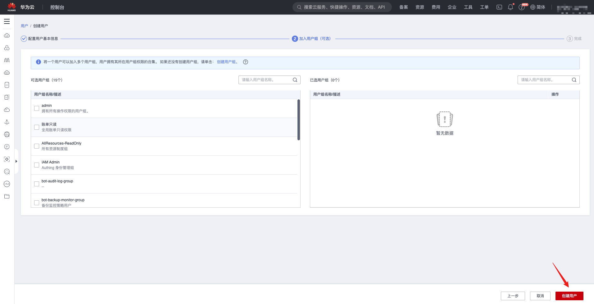
* 保存ak、sk，后续配置到服务中
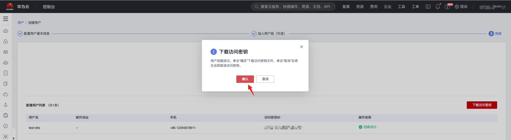 
* 创建并行文件系统
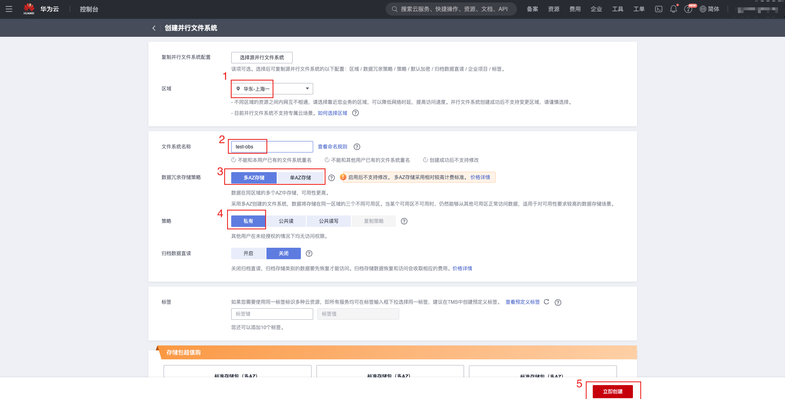
* 配置文件系统访问权限控制
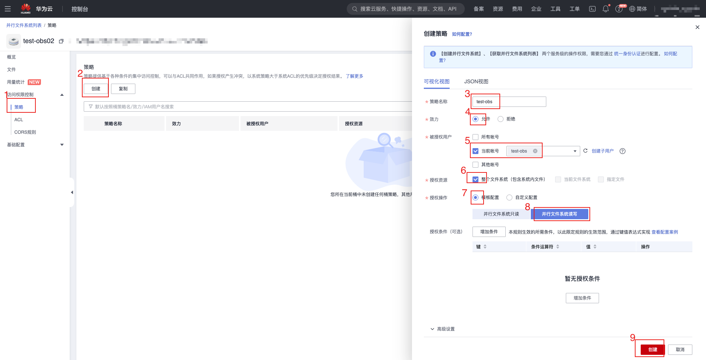


#### 阿里云
* 创建存储用户
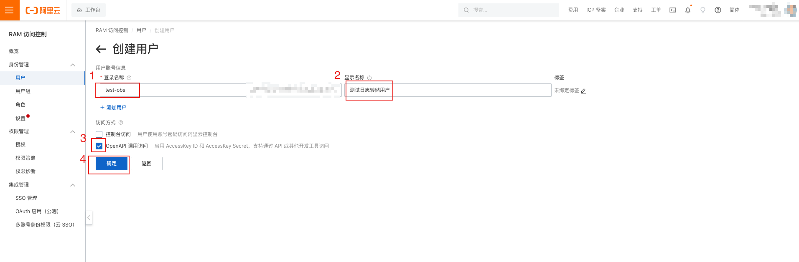
* 保存ak、sk，后续配置到服务中
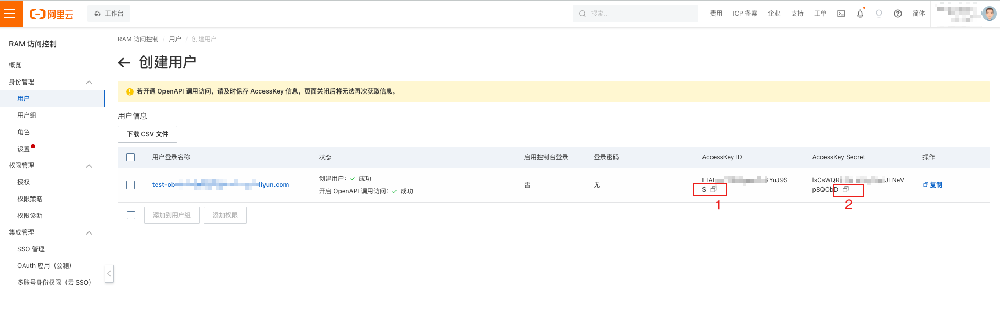
* 创建oss存储桶
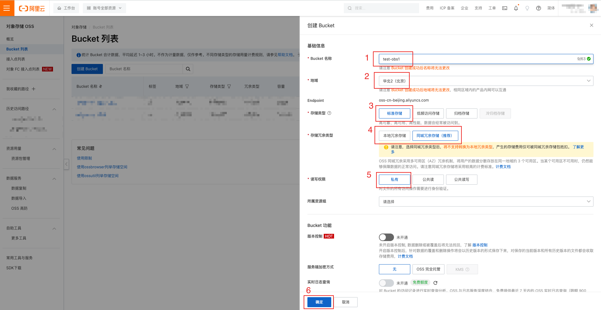
* 为创建的用户授予oss桶权限
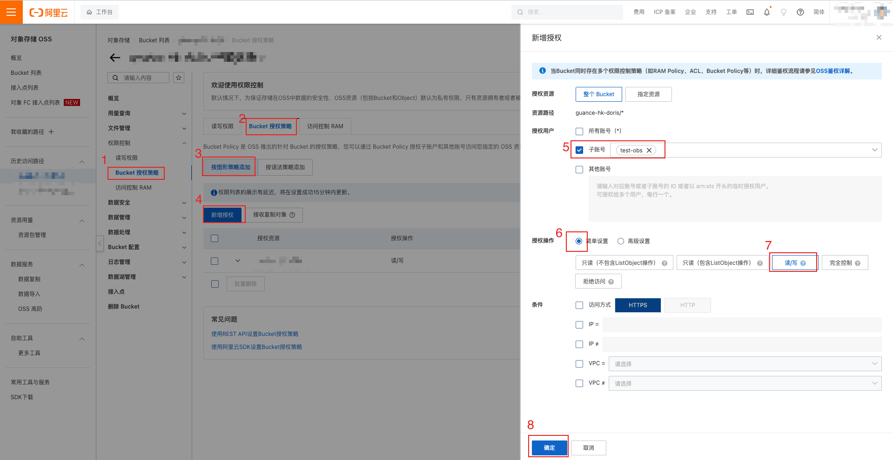

#### AWS
* 创建s3存储桶
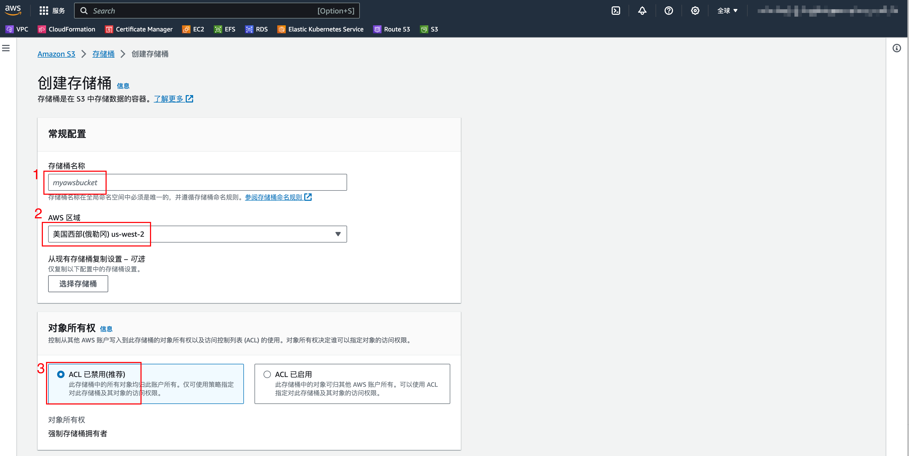
* 创建用户权限策略
```json
{
    "Version": "2012-10-17",
    "Statement": [
        {
            "Sid": "VisualEditor0",
            "Effect": "Allow",
            "Action": "s3:*",
            "Resource": "arn:aws:s3:::bucket-name"
        }
    ]
}
```
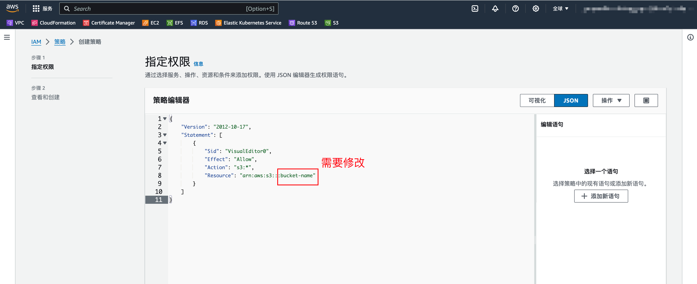
* 创建存储用户
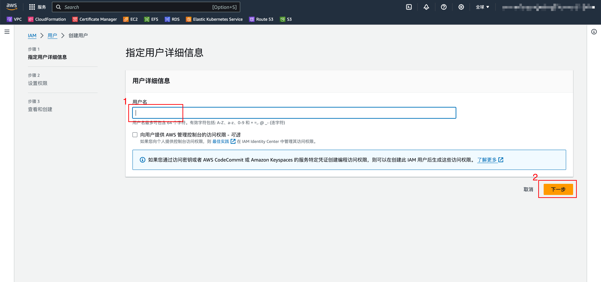
* 给新创建的用户绑定策略
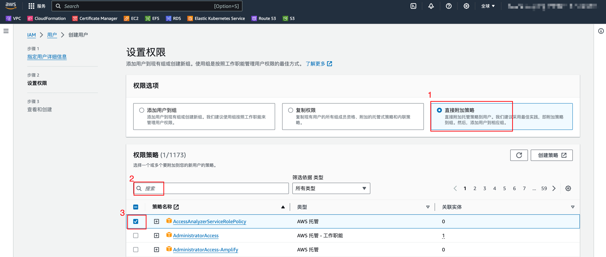
* 创建并保存ak、sk，后续配置到服务中

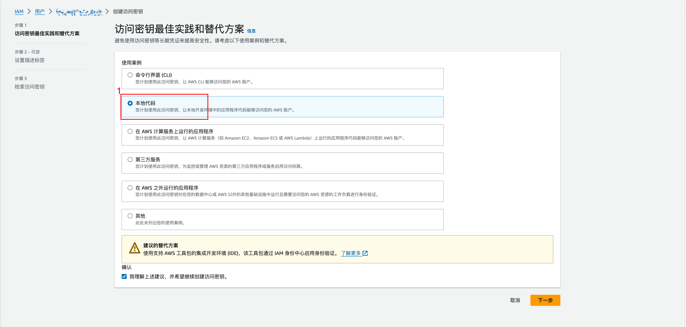

### 步骤二：修改服务配置
需要修改kodo、kodo-x等应用服务的配置让转储配置生效

* 修改forethought-kodo命名空间下名称为kodo、kodo-x、kodo-inner的configmap资源。添加以下内容
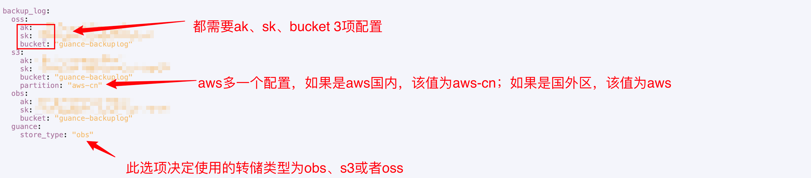
* 修改完成后，重启kodo、kodo-x、kodo-inner、kodo-x-backuplog服务
???+ warning "注意"
     kodo-x-backuplog服务在集群里为Statefulset类型，该服务需要开启数据持久化，并且每个pod都使用独立的PVC，可以与下图中的配置进行对比
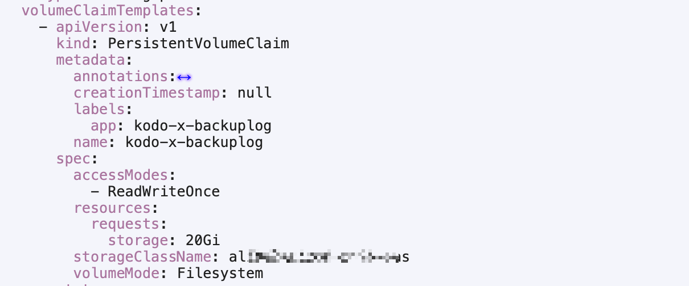
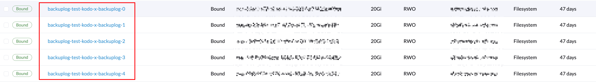
### 步骤三：数据转发配置
当上述步骤都完成后需要登录到观测云中，进行数据转发的配置，配置完成后，可以参考 [数据转发](../management/backup.md) 进行验证
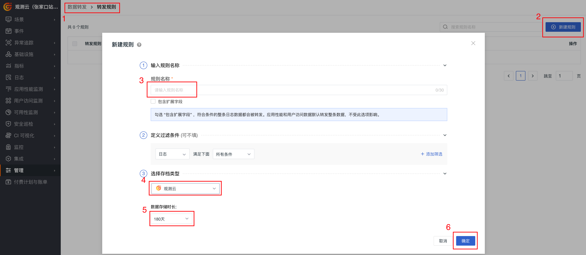


