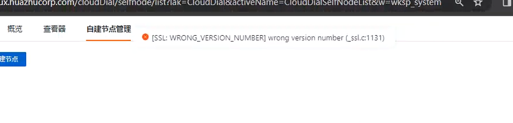
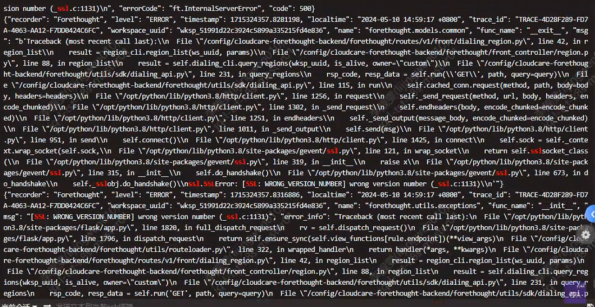
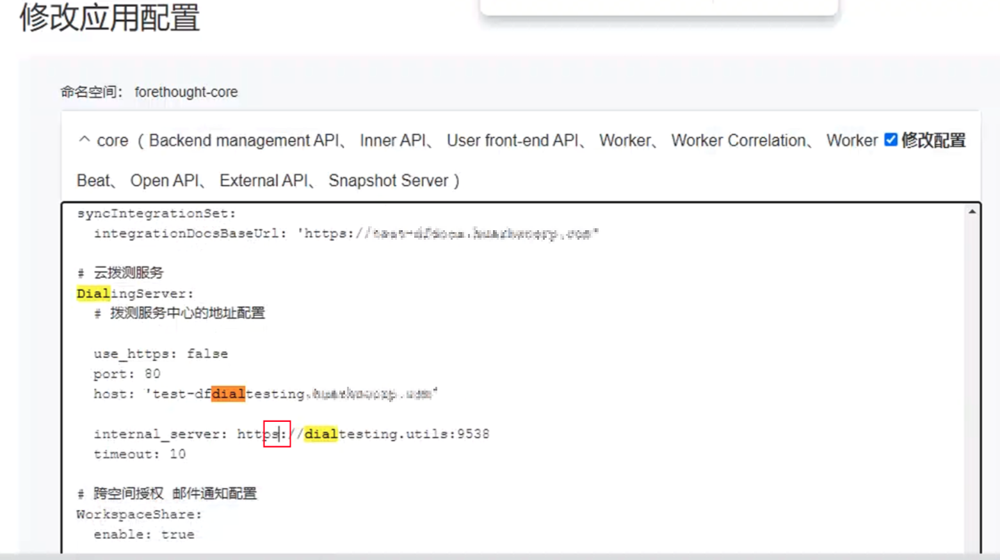

## 1 新建拨测节点报错 SSL: WRONG_VERSION_NUMBER] wrong version number (_ssl.c:1131)

新建拨测节点时报错

查看forethought-core命名空间下的forethought-backend服务日志有如下报错

解决方案：
launcher中【修改应用配置】菜单，修改dialtesting配置，将internal_server处配置的地址值协议从https改为http。


## 2 拨测新增节点报错

问题描述：拨测【新增节点】功能报错：拨测服务接口调用失败

问题解决：

查看 kodo 日志发现错误信息：`get ak error: Ak not found or disabled,ak：xxxx`

登录到数据库中，查询以下 sql

```sql
-- df_core 中查询如下 sql
select value from main_config where keyCode="DialingServerSet"

--  dialtesting 中查询如下 ak 列表
select * from aksk where parent_ak = -1 order by id asc;
```

将 SQL 查询得到的值与 Launcher 界面右上角菜单按钮中的“其他”选项下 `dialServiceAK` 展示的值进行对比，并使用 `dialServiceAK` 中的ak/sk信息值覆盖数据库中的对应记录（通过 UPDATE 语句修改数据库中的数据）。