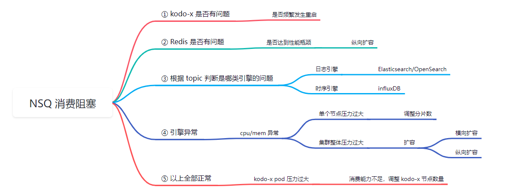
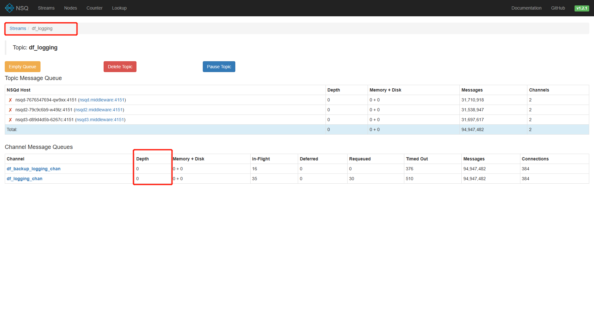
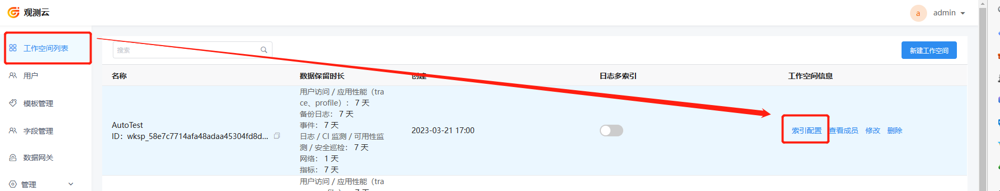
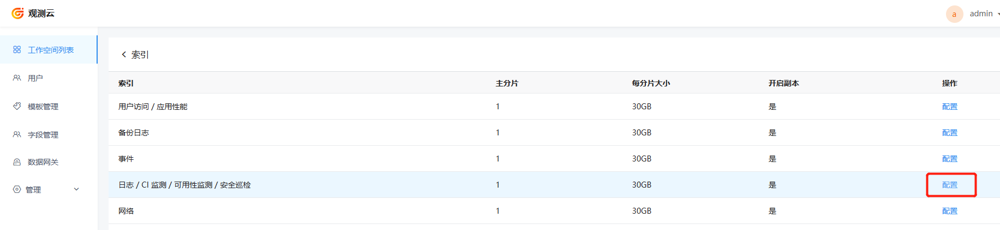
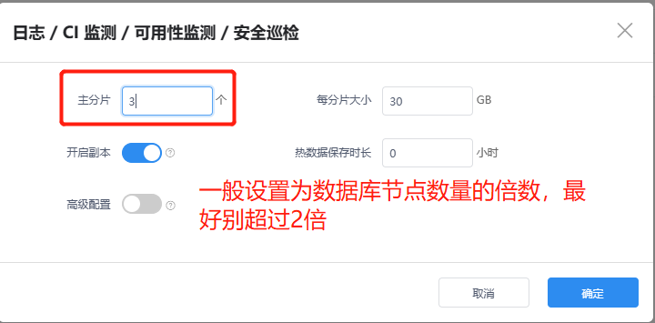

## 概述

本文档基于数据写入延迟大的问题，整理了排查思路。

## 基础设施配置检查

### 1 检查时间

检查 **<<< custom_key.brand_name >>>相关服务** 的机器时间是否正常，如果有延迟，校准机器时区和时间。

### 2 查看数据节点配置

检查 **存储引擎的数据节点** 配置是否根据实际的资源情况进行了修改。 

1）查看数据节点的机器配置

```shell
# 查看服务器cpu及内存的配置
cat /proc/cpuinfo
free -g
```

2）查看存储引擎的相关配置，是否在部署时做了修改。

3）如果没有修改，请按照以下的配置指引去进行修改。

假设上面的查询出的资源状况为 8c32g 的情况下。

```yaml
        # 一般设置为limits一半
        ## 如果是资源足够大的情况下，最大设置为 32g 即可，超过的部分也会浪费资源。
        - name: OPENSEARCH_JAVA_OPTS
          value: -Xmx14g -Xms14g
        # limits不能设满，要给其他程序和系统留一点cpu和内存的余量 
        REsources:
          limits:
            cpu: "7"
            memory: 28Gi
          requests:
            cpu: "7"
            memory: 7Gi
```


## 业务思路排查

以下是排查逻辑的思维导图，可根据此图来确定排查顺序。



### 1 查看 kodo-x 服务是否频繁重启

```shell
kubectl get pods -n forethought-kodo
```

### 2 查看 Redis 中间件

查看一下 Redis 的性能是否达到瓶颈，如果 cpu 或内存的使用率过高，则需要纵向扩容。

### 3 根据 topic 判断是哪类存储引擎

1）修改 middleware Namespace 下的 nsqadmin 服务的 service 配置为 NodePort 。

```shell
kubectl patch svc  nsqadmin -n middleware -p '{"spec": {"type": "NodePort"}}'
```

> 用浏览器查看，node_IP + 端口的方式访问。

2）根据 topic 名称，确定存储引擎类型

除以 df_metric_xxx 开头的是时序引擎的，其余的 topic 全是日志引擎的数据。

3）查看数据节点性能

如果出现了资源占用过大的情况，请参照以下 [引擎异常处理](#exception-handling)的内容。

4）查看对应服务的数据



| 字段名      | 字段解释                                         |
| ----------- | ------------------------------------------------ |
| Topic       | 消息队列的名称                                   |
| Depth       | 当前主题下的消息队列中未处理的消息数量           |
| In-Flight   | 当前已经被消费者获取但尚未确认处理完成的消息数量 |
| Deferred    | 重新入队或明确要延迟分发而未分发的消息数         |
| Connections | 当前最大连接并发消费数                           |

### 4  引擎异常处理 {#exception-handling}

#### 4.1 单台压力过大

<<< custom_key.brand_name >>>的所有索引的配置默认都是1分片，这就意味着只有一个数据节点去进行处理，这里就会产生性能瓶颈。所以需要登录后台管理，调整索引的分片数，目的是为了增加数据节点并行处理能力。







这个时候可以频繁刷新 nsq 管理页面，如果发现 Channel 的 Depth 堆积数量有显著下降。则处理成功。

#### 4.2 集群压力过大

如果整体集群压力过大的话，那么就考虑横向扩容或纵向扩容。

参考[日志引擎容量规划](logengine-capacity-planning.md)

### 5 消费力不足，扩容 kodo-x 服务

如果上述方法依旧没有解决数据堆积的问题，可能是 nsq  管理界面 Channel 的 connections 连接数过小，来不及处理大数据量的请求。这时可以扩容 kodo-x 服务的数量。

假设机器资源足够的情况下，一般都是以2倍的方式逐渐扩容的。直到上文中的 nsq 管理页面中的 Depth 堆积有明显的降低。

```shell
kubectl scale -n forethought-kodo deployment kodo-x --replicas=<kodo-x * 2> 
```
