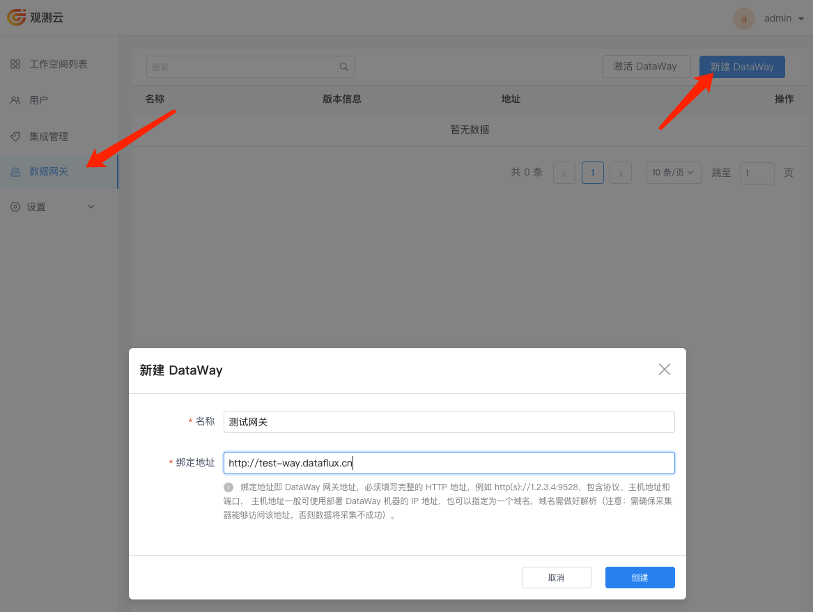
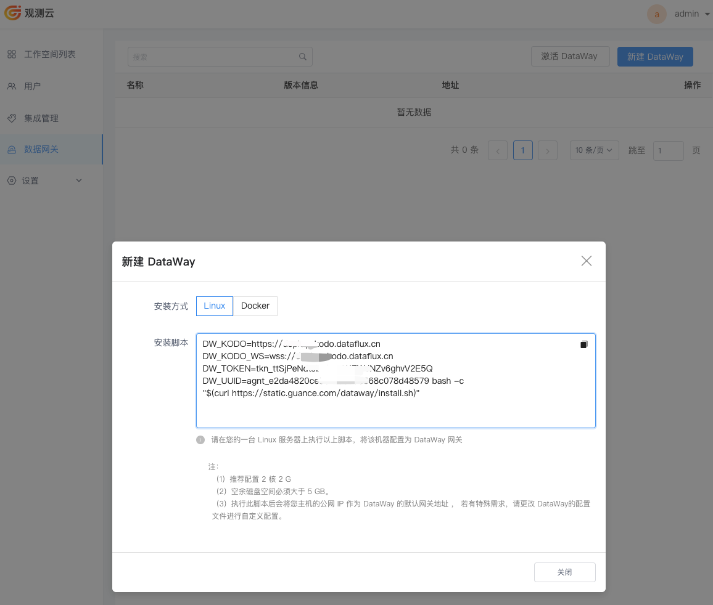

# 观测云 DataWay 部署

???+ warning "注意"
     如果您使用 Launcher 部署过 DataWay，可跳过本文安装步骤。
     本文描述如何使用观测云管理后台注册和安装 DataWay ，您也可以使用 Launcher [快速安装 DataWay](launcher-install.md#dataway-install)

## 前提条件

- 已部署观测云，未部署参考 [使用 Launcher 部署产品](launcher-install.md)

## 基础信息及兼容

| 名称                 | 描述                                            |
| :------------------: | :---------------------------------------------: |
| 观测云管理控制台     | http://df-management.dataflux.cn                |
| 是否支离线安装       | 是                                              |
| 支持架构             | amd64/arm64                                     |
| 部署机器IP           | 192.168.100.105                                 |

## 安装步骤

### 1、注册 DataWay

登录后台管理控制台 `http://df-management.dataflux.cn` ，使用管理员账号，密码为 `admin`，账号为你设置的管理员的账号，进入“**观测云管理后台**”的“**数据网关**”菜单，点击“新建 DataWay”，添加一个数据网关 DataWay 。

- **名称**：自定义名称即可
- **绑定地址**：DataWay 的访问地址，在 DataKit 中接入数据使用，可以使用 `http://ip+端口`

**注意：在配置 DataWay 绑定地址时，必须保证 DataKit 主机与这个 DataWay 地址的连通性，能通过这个 DataWay 地址上报数据。**



### 2、安装 DataWay

=== "主机和docker"

    ???+ warning "注意"
          **此处需要确保部署 DataWay 的这台主机，能访问到前面配置的 kodo 地址，建议 DataWay 通过内网到 kodo！**
     
     DataWay 添加完成后，可获取到一个 DataWay 的安装脚本，复制安装脚本，在部署 DataWay 的主机上运行安装脚本。


     

=== "Kubernetes"

    - 获取 `DW_TOKEN` 和 `DW_UUID`

    

    - 修改配置

    下载 [dataway.yaml](dataway.yaml)

    修改 yaml 文件中的 {{DW_UUID}} 和 {{DW_TOKEN}} 参数

    - 安装

    ```shell
    kubectl apply -f dataway.yaml
    ```

### 3、验证部署

安装完毕后，等待片刻刷新“数据网关”页面，如果在刚刚添加的数据网关的“版本信息”列中看到了版本号，即表示这个 DataWay 已成功与观测云中心连接，前台用户可以通过它来接入数据了。


## DataWay 访问设置

=== "自建 Kubernetes（NodePort）"
    
     - 获取节点 IP

     ```shell
     kubectl get nodes -o wide
     ```
      
     输出结果：

     ```shell
     NAME         STATUS   ROLES           AGE   VERSION   INTERNAL-IP     EXTERNAL-IP   OS-IMAGE                KERNEL-VERSION          CONTAINER-RUNTIME
     k8s-master   Ready    control-plane   9d    v1.24.0   10.200.14.112   <none>        CentOS Linux 7 (Core)   3.10.0-957.el7.x86_64   containerd://1.6.16
     k8s-node01   Ready    <none>          9d    v1.24.0   10.200.14.113   <none>        CentOS Linux 7 (Core)   3.10.0-957.el7.x86_64   containerd://1.6.16
     k8s-node02   Ready    <none>          9d    v1.24.0   10.200.14.114   <none>        CentOS Linux 7 (Core)   3.10.0-957.el7.x86_64   containerd://1.6.16
     ```

     你可以直接访问：`http://10.200.14.112:30928` 

     > 10.200.14.112 是本文节点 IP，您需要根据您自己的集群 IP 来访问。你也可以通过代理服务访问 DataWay，如何设置可参考 [访问代理设置](proxy-install.md)


=== "EKS"

    保存以下内容为 dataway-svc.yaml

    ```yaml
    ---

    apiVersion: v1
    kind: Service
    metadata:
      annotations:
        service.beta.kubernetes.io/aws-load-balancer-nlb-target-type: ip
        service.beta.kubernetes.io/aws-load-balancer-scheme: internal  # 内部 
        # service.beta.kubernetes.io/aws-load-balancer-ssl-cert: "" # 证书
        # service.beta.kubernetes.io/aws-load-balancer-scheme: internet-facing  # 外部
      name: dataway
      namespace: utils
    spec:
      ports:
      - name: 9528tcp02
        port: 80
        protocol: TCP
        targetPort: 9528
      selector:
        app: deployment-utils-dataway
      type: LoadBalancer
    ```

    部署：

    ```shell
    kubectl apply -f dataway-svc.yaml
    ```

    查看 nlb 的地址：

    ```shell
    kubectl get svc -n utils 
    ```

    你可以直接访问：`http://nlbIP`

=== "主机和 docker"

    您可以直接访问安装机器的 `9528` 端口。
