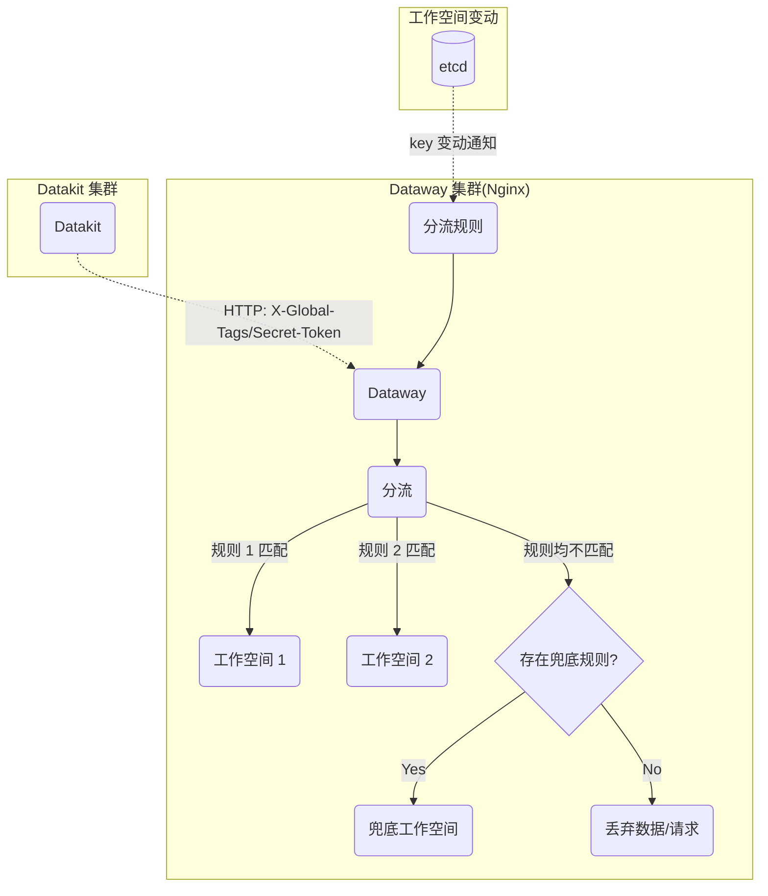
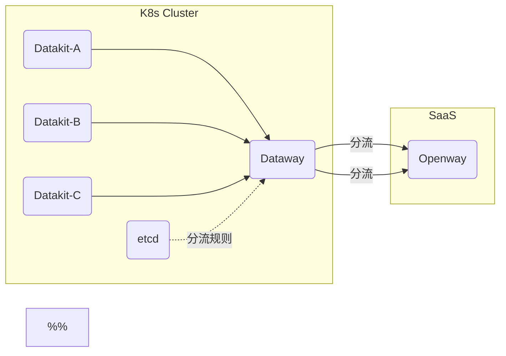

<!-- 不要在 dataflux-doc 仓库直接修改本文件，该文件由 Dataway 项目自动导出 -->

# Dataway Sink
---

[:octicons-tag-24: Version-1.14.0](../datakit/changelog.md#cl-1.14.0) 版本的 Datakit 才能使用这里的 Sinker 功能。

---

## Dataway Sinker 功能介绍 {#sink-intro}

在日常的数据采集过程中，由于存在多个不同的工作空间，我们可能需要将不同的数据打到不同的工作空间。比如在一个公用的 Kubernetes 集群中，所采集的数据可能涉及不同团队或业务部门，这时候我们可以将带有特定属性的数据分别打到各个不同的工作空间，以实现基础设施公用场景下的细粒度采集。

基本的网络拓扑如下：



### Dataway 级连模式 {#cascaded}

对于 SaaS 用户而言，可以在自己本地（k8s Cluster）部署一个 Dataway，专用于分流，然后再将数据转发给 Openway：

<!-- markdownlint-disable MD046 -->
???+ warning

    级连模式下，集群内的 Dataway 需开启级联（cascaded）选项。参见安装文档中的[环境变量说明](dataway.md#dw-envs)
<!-- markdownlint-enable -->



## Dataway 安装 {#dw-install}

参见[这里](dataway.md#install)

## Dataway 设置 {#dw-config}

除了 Dataway 常规的设置之外，需要额外设置几个配置（位于 */usr/local/cloudcare/dataflux/dataway/dataway.yaml*）：

```yaml
# 此处设置 Dataway 要上传的地址，一般为 Kodo，但也可以是另一个 Dataway
remote_host: https://kodo.guance.com

# 如果上传地址为 Dataway，则此处要置为 true，表示 Dataway 级联
cascaded: false

# 该 token 为 dataway 上随意设置的一段 token，我们需要将其填写到
# Datakit 的 datakit.conf 配置中。这里需保持一定长度和格式。
secret_token: tkn_xxxxxxxxxxxxxxxxxxxxxxxxxxxxxxxx

# sinker 规则设置
sinker:
  etcd: # 支持 etcd
    urls:
    - http://localhost:2379
    dial_timeout: 30s
    key_space: /dw_sinker
    username: "dataway"
    password: "<PASSWORD>"

  #file: # 也支持本地文件方式，常用于调试
  #  path: /path/to/sinker.json
```

<!-- markdownlint-disable MD046 -->
???+ warning

    如果不设置 `secret_token`，则任何 Datakit 发送过来的请求都能通过，这不会造成数据问题。但如果 Dataway 部署在公网，还是建议设置一下 `secret_token`。
<!-- markdownlint-enable -->

### Sinker 规则设置 {#setup-sinker-rules}

Dataway Sinker 规则是一组 JSON 形式的配置，匹配规则的写法跟黑名单写法一致，参见[这里](../datakit/datakit-filter.md)。


目前支持两种配置来源：

- 在本地指定一个 JSON 文件，主要用于调试 Sinker 规则，这种情况下，更新 JSON 文件中的 Sinker 规则后，**需要重启 Dataway 才能生效**
- etcd：将调试好的规则文件，存放到 etcd 中，后面微调规则的时候，直接更新 etcd 即可，**不用重启 Dataway**

实际上，存放在 etcd 中的 JSON 跟本地文件中的 JSON 内容相同，下面只介绍 etcd 的托管方式。

#### etcd 设置 {#etcd-settings}

> 以下命令均在 Linux 下操作。

Dataway 作为 etcd 客户端，可以在 etcd 中设置如下用户名和角色（etcd 3.5+），参见[这里](https://etcd.io/docs/v3.5/op-guide/authentication/rbac/#using-etcdctl-to-authenticate){:target="_blank"}

创建 `dataway` 账号以及对应角色：

```shell
# 添加用户名，此处会提示输入密码
$ etcdctl user add dataway

# 添加 sinker 这个角色
$ etcdctl role add sinker

# 将 dataway 添加到角色中
$ etcdctl user grant-role dataway sinker

# 限制 role 的 key 权限（此处 /dw_sinker 和 /ping 是默认使用的两个 key）
$ etcdctl role grant-permission sinker readwrite /dw_sinker
$ etcdctl role grant-permission sinker readwrite /ping       # 用于检测连通性
```

<!-- markdownlint-disable MD046 -->
???+ info "为什么创建角色？"

    角色用来控制对应用户在某些 key 上的权限，此处我们使用的可能是用户已有的 etcd 服务，有必要限制一下 Dataway 这个用户的数据权限。

???+ warning

    如果 etcd 开启了[认证模式](https://etcd.io/docs/v3.5/op-guide/authentication/rbac/#enabling-authentication){:target="_blank"}，执行 `etcdctl` 命令式，需带上对应的用户名和密码：

    ```shell
    $ etcdctl --user name:password ...
    ```
<!-- markdownlint-enable -->

#### 写入 Sinker 规则 {#prepare-sink-rules}

> 新版本（1.3.6）的 Dataway 支持通过 `dataway` 命令来操作 etcd  中的 Sinker 规则。

假定 *sinker.json* 规则定义如下：

```json
{
    "strict":true,
    "rules": [
        {
            "rules": [
                "{ host = 'my-host'}"
            ],
            "url": "https://kodo.guance.com?token=tkn_xxxxxxxxxxxxxxxxxxxxxxxxxxxxxxxx"
        },
        {
            "rules": [
                "{ host = 'my-host' OR cluster = 'cluster-A' }"
            ],
            "url": "https://kodo.guance.com?token=tkn_yyyyyyyyyyyyyyyyyyyyyyyyyyyyyyyy"
        }
     ]
}
```

通过如下命令，可写入 Sinker 规则配置：

```shell
$ etcdctl --user dataway:PASSWORD put /dw_sinker "$(<sinker.json)"
OK
```

<!-- markdownlint-disable MD046 -->
???+ tip "标识工作空间信息"

    由于 *sinker.json* 中不支持注释，我们可以在 JSON 中添加 `info` 字段来作为备忘，以达到注释的效果：

    ``` json hl_lines="5"
    {
        "rules": [
            "{ host = 'my-host' OR cluster = 'cluster-A' }"
        ],
        "info": "这是 yyy 工作空间",
        "url": "https://kodo.guance.com?token=tkn_yyyyyyyyyyyyyyyyyyyyyyyyyyyyyyyy"
    }
    ```
<!-- markdownlint-enable -->

#### 默认规则 {#default-rule}

[:octicons-tag-24: Version-1.6.0](dataway-changelog.md#cl-1.6.0)

在某个具体规则入口中，增加 `as_default` 标识，即可将该规则设置为默认的兜底规则，兜底规则可以不设置任何匹配条件（不配置 `rules` 字段）；同时，它不应该参与常规的规则匹配，一个建议的兜底规则如下：

``` json hl_lines="2"
{
    "as_default": true,
    "info": "这是默认的兜底工作空间",
    "url": "https://kodo.guance.com?token=tkn_xxxxxxxxxxxxxxxxxxxxxxxxxxxxxxxx"
}
```

> 注意：兜底规则应该只设置一个，如果 sinker 配置中存在多个兜底规则，以最后一个为准。

### Token 规则 {#spec-on-secret-token}

由于 Datakit 会对 Dataway 上的 token 做检测，故这里设置的 `token`（含 `secret_token`） 需满足如下条件：

> 以 `token_` 或 `tkn_` 开头，后面的字符长度为 32。

对于不满足该条件的 token，Datakit 会安装失败。

## Datakit 端设置 {#config-dk}

在 Datakit 中，我们需要对其做几个设置，让其可以将采集到的数据打上特定的标签以进行分组。

- 配置全局自定义 Key 列表

Datakit 会在其采集的数据中，寻找带有这些 Key 的字段（只寻找字符串类型的字段），并将其提取出来，作为分组发送的依据。

<!-- markdownlint-disable MD046 -->
=== "主机安装"

    参见[这里](../datakit/datakit-install.md#env-sink)

=== "Kubernetes"

    参见[这里](../datakit/datakit-daemonset-deploy.md#env-sinker)
<!-- markdownlint-enable -->

- 配置「全局主机 Tag」 以及「全局选举 Tag」

在所有 Datakit 上传的数据中，都会带上配置的这些全局 tag（含 tag key 和 tag value），作为分组发送的依据。

<!-- markdownlint-disable MD046 -->
=== "主机安装"

    参见[这里](../datakit/datakit-install.md#common-envs)

=== "Kubernetes"

    参见[这里](../datakit/datakit-daemonset-deploy.md#env-common)
<!-- markdownlint-enable -->

### Datakit 端 Customer Key 设置 {#dk-customer-key}

如果希望某个具体 Datakit 所采集的数据能够满足分流的需求，需要确保几点：

- Datakit 开启了 Sinker 功能
- Datakit 中配置了有效的 Global Customer Key

这两个配置如下：

```toml
# /usr/local/datakit/conf.d/datakit.conf
[dataway]

  # 指定一组 customer key
  global_customer_keys = [
    # 示例：添加 category 和 class 俩个 key
    # 此处不宜配置太多 key，一般 2 ~ 3 个即可
    "category",
    "class",
  ]

  # 开启 sinker 功能
  enable_sinker = true
```

除拨测数据、[常规的数据分类](../datakit/apis.md#category)外，还支持 [Session Replay](../integrations/rum.md#rum-session-replay) 以及 [Profiling](../integrations/profile.md) 等二进制文件数据，故此处可以选择所有的字段名，需要注意的一点是，**不要配置非字符串类型的字段**，正常的 Key 一般都来自于 Tag（所有 Tag 值都是字符串类型）。Datakit 不会将非字符串类型的字段当做分流依据。

#### 全局 Tag 的影响 {#dk-global-tags-on-sink}

除了 `global_customer_keys` 会影响分流标记，Datakit 上配置的[全局 Tag](../datakit/datakit-conf.md#set-global-tag)（含全局选举 Tag 和全局主机 Tag）也会影响分流标记。即如果数据点中带有全局 Tag 中出现的字段（这些字段值类型必须是字符串类型），也会计入分流。假定全局选举 Tag 如下：

```toml
# datakit.conf
[election.tags]
    cluster = "my-cluster"
```

对如下数据点：

```not-set
pi,cluster=cluster_A,app=math,other_tag=other_value value=3.14 1712796013000000000
```

由于全局选举 Tag 中带有 `cluster`（不管该 Tag 配置的值是多少），该点自身也有 `cluster` 这个 Tag，在最终的 `X-Global-Tags` 中，会追加 `cluster=cluster_A` 这对键值：

```not-set
X-Global-Tags: cluster=cluster_A
```

如果 `global_customer_keys` 还配置 `app` 这个 key，那么最终的分流 Header 为（两个键值对出现的顺序不重要）：

```not-set
X-Global-Tags: cluster=cluster_A,app=math
```

<!-- markdownlint-disable MD046 -->
???+ note

    此处示例故意将 *datakit.conf* 中 `cluster` 配置的值跟数据点中 `cluster` 字段值设置不同，主要是强调这里 Tag Key 的影响。可以理解为数据点中一旦出现符合条件的全局 Tag Key，**其效果相当于这个全局 Tag Key 加入了 `global_customer_keys`**。
<!-- markdownlint-enable -->

## Dataway sink 命令 {#dw-sink-command}

Dataway 自版本 [:octicons-tag-24: Version-1.3.6](dataway-changelog.md#cl-1.3.6) 起，支持通过命令行来管理 `sinker` 的配置，具体使用方式如下:

```shell
$ ./dataway sink --help

Usage of sink:
  -add string
        single rule json file
  -cfg-file string
        configure file (default "/usr/local/cloudcare/dataflux/dataway/dataway.yaml")
  -file string
        file path of the rule json, only used for command put and get
  -get
        get the rule json
  -list
        list rules
  -log string
        log file path (default "/dev/null")
  -put
        save the rule json
  -token string
        rules filtered by token, eg: xx,yy
```

**指定配置文件**

命令执行时，默认加载的配置文件是 `/usr/local/cloudcare/dataflux/dataway/dataway.yaml`，如果需要加载其他配置，可以通过 `--cfg-file` 来指定。

```shell
$ ./dataway sink --cfg-file dataway.yaml [--list...]
```

**命令日志设置**

默认情况下，命令的输出日志被禁用，如果需要查看，可以通过设置 `--log` 参数。

```shell
# output log to stdout
$ ./dataway sink --list --log stdout

# output log to file
$ ./dataway sink --list --log /tmp/log
```

**查看规则列表**

```shell

# list all rules
$ ./dataway sink --list

# list all rules filtered by token
$ ./dataway sink --list --token=token1,token2

CreateRevision: 2
ModRevision: 41
Version: 40
Rules:
[
    {
        "rules": [
            "{ workspace = 'zhengb-test'}"
        ],
        "url": "https://openway.guance.com?token=token1"
    }
]
```

**新增规则**

创建规则文件 `rule.json`，内容参考如下:

```json
[
  {
    "rules": [
      "{ host = 'HOST1'}"
    ],
    "url": "https://openway.guance.com?token=tkn_xxxxxxxxxxxxx"
  },
  {
    "rules": [
      "{ host = 'HOST2'}"
    ],
    "url": "https://openway.guance.com?token=tkn_yyyyyyyyyyyyy"
  }
]

```

新增规则

```shell
$ ./dataway sink --add rule.json

add 2 rules ok!

```

**导出配置**

导出配置可以将 `sinker` 配置导出到本地文件。

```shell
$ ./dataway sink --get --file sink-get.json

rules json was saved to sink-get.json!

```

**写入配置**

写入规则将本地规则文件同步到 `sinker` 中。

创建规则文件 `sink-put.json`, 内容参考如下：

```json
{
    "rules": [
        {
            "rules": [
                "{ workspace = 'test'}"
            ],
            "url": "https://openway.guance.com?token=tkn_xxxxxxxxxxxxxx"
        }
    ],
    "strict": true
}

```

写入配置

```shell
$ ./dataway sink --put --file sink-put.json
```

## 配置示例 {#config-examples}

<!-- markdownlint-disable MD046 -->
??? info "Kubernetes 中 dataway.yaml 示例（下拉展开）"

    在 yaml 中直接指定 sinker JSON：


    ```yaml
    ---
    apiVersion: apps/v1
    kind: Deployment
    metadata:
      labels:
        app: deployment-utils-dataway
      name: dataway
      namespace: utils
    spec:
      replicas: 1
      selector:
        matchLabels:
          app: deployment-utils-dataway
      template:
        metadata:
          labels:
            app: deployment-utils-dataway
          annotations:
            datakit/logs: |
              [{"disable": true}]
            datakit/prom.instances: |
              [[inputs.prom]]
                url = "http://$IP:9090/metrics" # 此处端口（默认 9090）视情况而定
                source = "dataway"
                measurement_name = "dw" # 固定为该指标集
                interval = "10s"

                [inputs.prom.tags]
                  namespace = "$NAMESPACE"
                  pod_name = "$PODNAME"
                  node_name = "$NODENAME"
        spec:
          affinity:
            podAffinity: {}
            podAntiAffinity:
              requiredDuringSchedulingIgnoredDuringExecution:
                - labelSelector:
                    matchExpressions:
                      - key: app
                        operator: In
                        values:
                          - deployment-utils-dataway
                  topologyKey: kubernetes.io/hostname

          containers:
          - image: registry.jiagouyun.com/dataway/dataway:1.3.6 # 此处选择合适的版本号
            #imagePullPolicy: IfNotPresent
            imagePullPolicy: Always
            name: dataway
            env:
            - name: DW_REMOTE_HOST
              value: "http://kodo.forethought-kodo:9527" # 此处填写真实的 Kodo 地址，或者下一个 Dataway 地址
            - name: DW_BIND
              value: "0.0.0.0:9528"
            - name: DW_UUID
              value: "agnt_xxxxx" # 此处填写真实的 Dataway UUID
            - name: DW_TOKEN
              value: "tkn_oooooooooooooooooooooooooooooooo" # 此处填写真实的 Dataway token，一般是系统工作空间的 token
            - name: DW_PROM_LISTEN
              value: "0.0.0.0:9090"
            - name: DW_SECRET_TOKEN
              value: "tkn_zzzzzzzzzzzzzzzzzzzzzzzzzzzzzzzz"
            - name: DW_SINKER_FILE_PATH
              value: "/usr/local/cloudcare/dataflux/dataway/sinker.json"
            ports:
            - containerPort: 9528
              name: 9528tcp01
              protocol: TCP
            volumeMounts:
              - mountPath: /usr/local/cloudcare/dataflux/dataway/cache
                name: dataway-cache
              - mountPath: /usr/local/cloudcare/dataflux/dataway/sinker.json
                name: sinker
                subPath: sinker.json
            resources:
              limits:
                cpu: '4'
                memory: 4Gi
              requests:
                cpu: 100m
                memory: 512Mi
          # nodeSelector:
          #   key: string
          imagePullSecrets:
          - name: registry-key
          restartPolicy: Always
          volumes:
          - hostPath:
              path: /root/dataway_cache
            name: dataway-cache
          - configMap:
              name: sinker
            name: sinker
    ---

    apiVersion: v1
    kind: Service
    metadata:
      name: dataway
      namespace: utils
    spec:
      ports:
      - name: 9528tcp02
        port: 9528
        protocol: TCP
        targetPort: 9528
        nodePort: 30928
      selector:
        app: deployment-utils-dataway
      type: NodePort

    ---
    apiVersion: v1
    kind: ConfigMap
    metadata:
      name: sinker
      namespace: utils
    data:
      sinker.json: |
        {
            "strict":true,
            "rules": [
                {
                    "rules": [
                        "{ project = 'xxxxx'}"
                    ],
                    "url": "http://kodo.forethought-kodo:9527?token=tkn_xxxxxxxxxxxxxxxxxxxxxxxxxxxxxxxx"
                },
                {
                    "rules": [
                        "{ project = 'xxxxx'}"
                    ],
                    "url": "http://kodo.forethought-kodo:9527?token=tkn_yyyyyyyyyyyyyyyyyyyyyyyyyyyyyyyy"
                }
             ]
        }
    ```

<!-- markdownlint-enable -->

<!-- markdownlint-disable MD046 -->
??? info "Ingress 配置示例（下拉展开）"

    ```yaml
    apiVersion: networking.k8s.io/v1
    kind: Ingress
    metadata:
      name: dataway-sinker
      namespace: utils
    spec:
      ingressClassName: nginx
      rules:
      - host: datawaysinker-xxxx.com
        http:
          paths:
          - backend:
              service:
                name: dataway
                port:
                  number: 9528
            path: /
            pathType: ImplementationSpecific
    ```

<!-- markdownlint-enable -->

## FAQ {#faq}

### 查看丢弃的请求详情 {#dropped-request}

[:octicons-tag-24: Version-1.3.7](dataway-changelog.md#cl-1.3.7)

但某个请求不符合 Sinker 规则时，Dataway 会丢弃该请求，并在指标中增加一个丢弃计数。但是在调试阶段，我们需要知道某个被丢弃的请求的具体情况，特别是请求 Header 上携带的 `X-Global-Tags` 信息。

我们可以通过如下命令搜索 Dataway 日志：

``` bash
$ cat <path/to/dataway/log> | grep dropped
```

在输出的结果中，我们可以看到类似如下输出：

``` not-set
for API /v1/write/logging with X-Global-Tags <some-X-Global-Tags...> dropped
```

### Datakit 请求被丢弃排查 {#dk-http-406}

[:octicons-tag-24: Version-1.3.9](dataway-changelog.md#cl-1.3.9)

当 Datakit 请求被 Dataway 丢弃时，Dataway 会返回对应的 HTTP 错误，在 Datakit 日志中，会有类似如下报错：

```not-set
post 3641 to http://dataway-ip:9528/v1/write/metric failed(HTTP: 406 Not Acceptable):
{"error_code":"dataway.sinkRulesNotMatched","message":"X-Global-Tags: `host=my-host',
URL: `/v1/write/metric'"}, data dropped
```

此错误标明，请求 `/v1/write/metric` 因自身的 X-Global-Tags 不满足 Dataway 上的所有规则而被丢弃。

同时，在 Datakit monitor（`datakit monitor -V`） 右下角的 `DataWay APIs` 面板中，列 `Status` 会有 `Not Acceptable` 输出，它标明对应的 Dataway API 请求被丢弃。

查看 Datakit 自身指标，也能看到对应指标：

```shell
$ curl -s http://localhost:9529/metrics | grep datakit_io_dataway_api_latency_seconds_count

datakit_io_dataway_api_latency_seconds_count{api="/v1/datakit/pull",status="Not Acceptable"} 50
datakit_io_dataway_api_latency_seconds_count{api="/v1/write/metric",status="Not Acceptable"} 301
```

### Datakit 报错 403 {#dk-403}

如果 Dataway 上 sinker 配置有误，导致所有 Datakit 请求都使用 `secret_token`，而这个 token 中心（Kodo）是不认可的，故报告 403 错误 `kodo.tokenNotFound`。

造成这个问题的原因可能是 etcd 用户名密码有误，导致 Dataway 获取不到 Sinker 配置，进而 Dataway 认为当前 sinker 无效，所有数据都直传中心。

### etcd 权限配置问题 {#etcd-permission}

如果 Dataway 日志中有如下报错，说明权限设置可能有问题：

```not-set
sinker ping: etcdserver: permission denied, retrying(97th)
```

如果权限配置不当，可以将已有的基于 Dataway 的权限全部删掉，再重新配置，具体参见[这里](https://etcd.io/docs/v3.5/op-guide/authentication/rbac/#using-etcdctl-to-authenticate){:target="_blank"}

### Datakit 端 Key 的覆盖关系 {#key-priority}

在配置「全局自定义 Key 列表」时，如果同时「全局主机 Tag」 以及「全局选举 Tag」也带有同名的 Key，那么使用采集的数据中对应的 Key-Value 对。

例如，如果配置的「全局自定义 Key 列表」中有 `key1,key2,key3`，而「全局主机 Tag」 或「全局选举 Tag」中也配置了这些 Key 并且指定了对应的值，比如：`key1=value-1`，在某个数据采集中，其中也带有一个字段 `key1=value-from-data`，那么最终的分组依据，使用的是数据中的 `key1=value-from-data`，忽略「全局主机 Tag」 以及「全局选举 Tag」中配置的对应 Key 的 Value。

如果 「全局主机 Tag」 以及「全局选举 Tag」之间有同名的 Key，则优先「全局选举 Tag」中的 Key。总而言之，Key 的取值来源优先级如下（递减）：

- 采集的数据
- 全局选举 Tag
- 全局主机 TAg

### 内置的「全局自定义 Key」 {#reserved-customer-keys}

Datakit 内置了以下几个可用的自定义 Key，它们一般不会出现在采集的数据中，但 Datakit 可以以这些 Key 来对数据进行分组。如果在这些 Key 的维度有分流的需求，可以将它们添加到「全局自定义 Key」列表中（这些 Key 默认都不配置）。我们可以使用如下内置一些自定义 Key 来实现数据分流。

<!-- markdownlint-disable MD046 -->
???+ warning

    添加的「全局自定义 Key」会导致数据发送时进行分包，如果粒度太细，会导致 Datakit 上传效率急速降低。一般情况下，「全局自定义 Key」不建议超过 3 个。
<!-- markdownlint-enable -->

- `class` 针对对象数据，开启后会针对对象的分类来分流。比如 Pod 的对象分类为 `kubelet_pod`，那么可以针对 pod 来制定分流规则：

``` json
{
    "strict": true,
    "rules": [
        {
            "rules": [
                "{ class = 'kubelet_pod' AND other_conditon = 'some-value' }",
            ],
            "url": "https://openway.guance.com?token=<YOUR-TOKEN>"
        },
        {
            ... # other rules
        }
    ]
}
```

- `measurement` 针对指标数据，我们可以将特定的指标集打到特定的工作空间，比如磁盘的指标集名字为 `disk`，我们可以这样写规则：

```json
{
    "strict": true,
    "rules": [
        {
           "rules": [
               "{ measurement = 'disk' AND other_conditon = 'some-value' }",
           ],
           "url": "https://openway.guance.com?token=<YOUR-TOKEN>"
        },
        {
            ... # other rules
        }
    ]
}
```

- `source` 针对日志（L）、eBPF 网络指标（N）、事件（E）以及 RUM 数据
- `service` 针对 Tracing、Scheck 以及 Profiling
- `category` 针对所有[常规数据分类](../datakit/apis.md#category)，其取值为对应数据分类的「名称」列（如时序是 `metric`，对象为 `object` 等）。以日志为例，我们可以这样来单独针对日志做分流规则：

``` json
{
    "strict": true,
    "rules": [
        {
            "rules": [
                "{ category = 'logging' AND other_conditon = 'some-value' }",
            ],
            "url": "https://openway.guance.com?token=<YOUR-TOKEN>"
        },
        {
            ... # other rules
        }
    ]
}
```

- `__dataway_api` 针对特定的 API 路由，可以实现将指定的规则应用到该请求上。比如针对 Pipeline 的同步请求和选举请求（选举功能涉及两个 API 调用）：

``` json
{
    "strict": true,
    "rules": [
        {
            "rules": [
                "{ __dataway_api in ['/v1/datakit/pull', '/v1/election', '/v1/election/heartbeat'] }",
            ],
            "url": "https://openway.guance.com?token=<YOUR-TOKEN>"
        }
    ]
}
```

<!-- markdownlint-disable MD046 -->
???+ warning

    即使 URL（`__dataway_api`） 匹配了多个 Sink 规则，一些 API 请求只会分流一次。这些 API URL 如下：
        
    - `/v1/election`：选举请求
    - `/v1/election/heartbeat`：选举心跳请求
    - `/v1/datakit/pull`：拉取中心配置的 Pipeline 和黑名单
    - `/v1/query/raw`：DQL 查询
    - `/v1/workspace`：获取工作空间信息
    - `/v1/object/labels`：更新/删除对象数据
    - `/v1/check/token`：检查工作空间 Token 信息
<!-- markdownlint-enable -->
