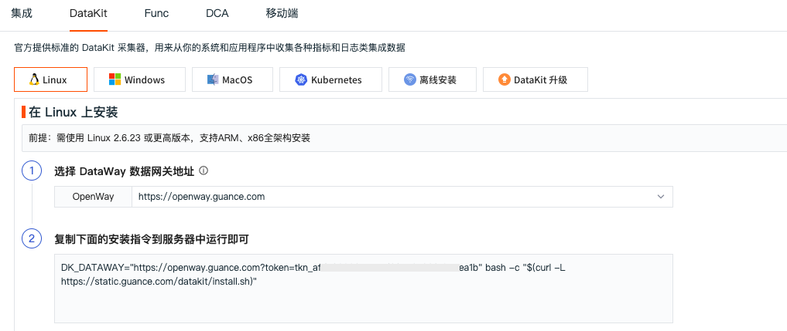
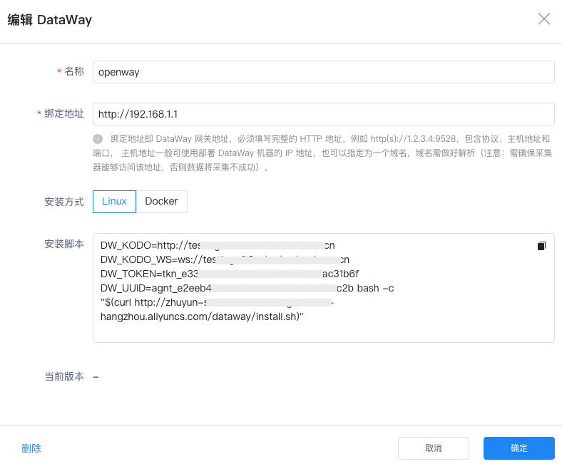

# 数据网关
---

## 简介 {#intro}

DataWay 是观测云的数据网关，采集器上报数据到观测云都需要经过 DataWay 网关，DataWay 网关主要作用有两个：

- 接收采集器发送的数据，然后上报到观测云进行存储，多用于数据代理上报的场景； 
- 将采集的数据进行处理后再发送到观测云进行存储，多用于数据清洗的场景。 

注意：观测云部署版 DataWay 需要在本地服务器进行安装后才可以使用。

## 新建 DataWay {#create}

在观测云管理后台「数据网关」页面，点击「新建 DataWay 」。


输入“名称”、“绑定地址”，点击「创建」。

- 绑定地址：即 DataWay 网关地址，必须填写完整的 HTTP 地址，例如 http(s)://1.2.3.4:9528，包含协议、主机地址和端口， 主机地址一般可使用部署 DataWay 机器的 IP 地址，也可以指定为一个域名，域名需做好解析。**注意：需确保采集器能够访问该地址，否则数据将采集将不成功）**


创建成功后会自动创建新的 DataWay 并生成 DataWay 的安装脚本。


## 安装 DataWay {#install}

新建的 DataWay 支持 Linux 和 Docker 两种安装方式，复制安装脚本到需要部署 DataWay 的服务器中执行。安装成功会提示如下图所示信息。此时 DataWay 默认会自动运行。


安装完毕后，等待片刻刷新“数据网关”页面，如果在刚刚添加的数据网关的“版本信息”列中看到了版本号，即表示这个 DataWay 已成功与观测云中心连接，前台用户可以通过它来接入数据了。



???+ note "注意事项"

    -  只能在 Linux 系统上运行，不要在 Mac/Windows 等非 Linux 机器上执行安装脚本 
    - DataWay 默认安装路径为 */usr/local/cloudcare/dataflux/dataway*
    -  关于 Docker 形式安装 
       -  DataWay 支持以 Docker 方式运行，在执行命令头部增加 `DOCKER=1` 即可
       -  除了增加 `DOCKER=1` 这个设置之外，还可以增加以下这些选项（在非 Docker 安装中，也能指定) 
            - `DW_BIND=<port>`: 这个是容器内部的绑定端口(不要超过 50000)，会占用宿主机的 `10000 + <port>` 端口。如果不指定，该端口默认为 `9528`，即使用宿主机上的 `19528` 端口。故务必确保宿主机上该端口可用。如果不是以 Docker 方式运行，则该处指定的端口即宿主机将占用的端口
            - `DW_KODO=<http://your-kodo-host:port>`: 用于指定特定的 kodo 服务器地址
            - `DW_UPGRADE=1`: 升级的时候，指定该选项即可。另外，即使只是升级，如果被升级的 DataWay 是运行在 Docker 中的，也需要指定 `DOCKER=1` 这个选项
       -  用 Docker 安装，不是登陆到 Docker 容器之后再安装，而是在宿主机上直接执行安装指令 
       -  执行 `docker ps -a |grep <your-agent-uuid>` 即可看到运行 DataWay 的容器情况(需要 root 权限) 
       -  安装完后，数据文件会落在宿主机 `/dataway-data/<your-agent-uuid>/` 目录下，包括程序、配置文件、数据文件以及日志等。如果要更新配置文件以及 license 文件，请再宿主机的该目录下更新即可，更新完后，记得重启容器: `docker restart <dataway-container-id>` 

## 使用 DataWay  {#using}

DataWay 成功与观测云中心连接后，登录观测云控制台，在「集成」-「DataKit」页面，即可查看所有的 DataWay 地址，选择需要的 DataWay 网关地址，获取 DataKit 安装指令在服务器上执行，即可开始采集数据。


## 管理 DataWay {#manage}

### 删除 DataWay {#delete}

在观测云管理后台「数据网关」页面，选择需要删除的 DataWay ，点击「配置」，在弹出的编辑 DataWay 对话框，点击左下角「删除」按钮即可。

???+ attention

    删除 DataWay 后，还需登录部署 DataWay 网关的服务器中停止 DataWay 的运行，然后删除安装目录才可彻底删除 DataWay。



### 升级 DataWay {#upgrade}

在观测云管理后台「数据网关」页面，如果 DataWay 存在可升级的版本，版本信息处会有升级提示。选择需要升级的 DataWay，点击「配置」，在弹出的编辑 DataWay 对话框，打开 DataWay 弹框，点击「获取升级脚本」，复制升级脚本到部署 DataWay 的主机上执行即可。


### 更改 DataWay 配置 {#update-config}

打开配置文件 `dataway.yaml`：

```yaml
bind        : ":9528"                     # 绑定地址和端口，如果希望调整为 1.2.3.4，端口 9538，可配置为 "1.2.3.4:9538"
remote_host : "https://kodo.dataflux.cn/" # kodo服务地址
log         : log                         # 日志文件位置
log_level   : info                        # 日志等级
gin_log     : gin.log                     # gin 日志文件位置

enable_internal_token : false # 允许使用 __internal__ 这个 token，此时数据打到系统工作空间
enable_empty_token    : false # 允许 token 为空，此时数据打到系统工作空间

... # 其它配置保持不变即可
```

### DataWay 状态管理命令 {#manage-service}

**systemd**

``` shell
# 启动
$ systemctl start dataway

# 重启
$ systemctl restart dataway

# 停止
$ systemctl stop dataway
```

**upstart**

``` shell
# 启动
$ start dataway

# 重启
$ restart dataway

# 停止
$ stop dataway
```

**其他**

其他状态管理命令可参考安装成功后的终端提示。

## Dataway API 列表 {#apis}

> 以下各个 API 详情待补充。

### `POST /v1/write/:category` {#v1-write-category}

- API 说明：接收 Datakit 上传的各种采集数据

### `GET /v1/datakit/pull` {#v1-datakit-pull}

- API 说明：处理 Datakit 拉取中心配置（黑名单/Pipeline）请求

### `POST /v1/write/rum/replay` {#v1-write-rum-replay}

- API 说明：接收 Datakit 上传的 Session Replay 数据

### `POST /v1/upload/profiling` {#v1-upload-profiling}

- API 说明：接收 Datakit 上传的 Profiling 数据

### `POST /v1/election` {#v1-election}

- API 说明：处理 Datakit 的选举请求

### `POST /v1/election/heartbeat` {#v1-election-heartbeat}

- API 说明：处理 Datakit 的选举心跳请求

### `POST /v1/query/raw` {#v1-query-raw}

- API 说明：处理 Datakit 端发起的 DQL 查询请求

### `POST /v1/workspace` {#v1-workspace}

- API 说明：处理 Datakit 端发起的工作空间查询请求

### `POST /v1/object/labels` {#v1-object-labels}

- API 说明：处理修改对象 Label 请求

### `DELETE /v1/object/labels` {#v1-delete-object-labels}

- API 说明：处理删除对象 Label 请求

### `GET /v1/check/:token` {#v1-check-token}

- API 说明：检测 tokken 是否合法

## 更新历史 {#changelog}

### 1.3.4(2023/09/01) {#cl-1.3.3}

- 升级 Golang 到 1.9
- 修复 inner token 无数据问题
- 默认配置中调整如下配置：
    - 默认 API 限流增加到 100K
    - 默认最大 Body 增加到 64MB
    - 新增 HTTP 超时设置（Dataway 到中心），默认 30s
    - 新增配置以忽略 TLS 509 报错

### 1.3.3(2023/09/01) {#cl-1.3.3}

- 修复镜像打包 `curl` 问题

---

### 1.3.2(2023/08/30) {#cl-1.3.2}

- 镜像中增加 `curl` 命令，便于查看自身指标

---

### 1.3.1(2023/08/28) {#cl-1.3.1}

- 增加 URL 的 Sinker 功能

---

### 1.3.0(2023/08/24) {#cl-1.3.0}

- 重构整个 Dataway 实现，增加 Sinker 功能

---

### 1.2.12(2023/08/28) {#cl-1.2.12}

- 重构 CI 发布流程，实现 install 脚本双发布

---

### 1.2.8(2022/09/18) {#cl-1.2.8}

- /v1/wirte 接口更新：
    - 移除冗余的 /v1/write/xxx API，增加 /v1/write/:category 接口
    - 写入数据不再进行行协议解码，但仍然进行 Body 读取，用于签名

- 磁盘缓存：
    - 当缓存清理过程中发送中心失败，增加消费暂停策略，直到当前缓存的请求发送成功才清理下一个缓存
    - 更新 pbcache proto 文件
