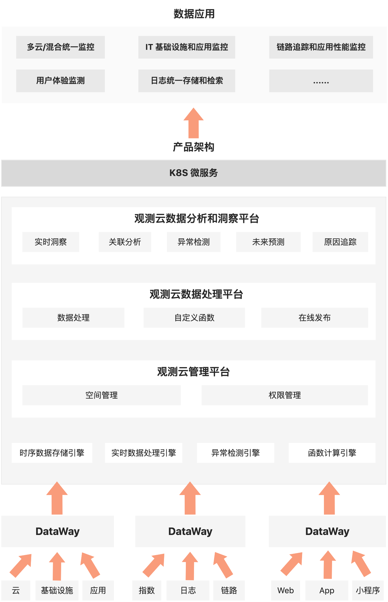
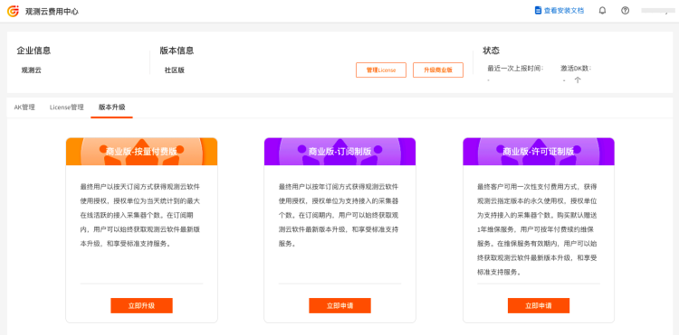

# 产品部署说明
---

{{{ custom_key.brand_name }}}部署版支持用户在自己本地基础设施环境，或私有云环境上，安装{{{ custom_key.brand_name }}}系统软件并运行服务。部署版分成订阅制版、许可证制版和按量付费版。

“{{{ custom_key.brand_name }}}”是一款旨在解决云计算，以及云原生时代系统为每一个完整的应用构建全链路的可观测性的云服务平台。“{{{ custom_key.brand_name }}}”是由上海观测未来自2018年以来全力打造的产品，产品的目标是为中国的广大基于云计算的开发项目组提供服务，相较于复杂多变的开源产品，如ELK，Prometheus，Grafana，Skywalking等，“{{{ custom_key.brand_name }}}”不单纯的只是提供一种监控类的产品，更重要的是提供整体可观测性的服务，我们除了在底层存储和系统架构上是一体化的基础上，也把所有关于云计算及云原生相关的技术栈进行了完整的分析和解构，任何项目团队可以非常轻松的使用我们的产品，无需再投入太多的精力去研究或者改造不成熟的开源产品，同时“{{{ custom_key.brand_name }}}”是以服务方式，按需按量的方式收取费用，完全根据用户产生的数据量收取费用，无需投入硬件，同时对于付费客户，我们还会建立专业的服务团队，帮助客户构建基于数据的核心保障体系，具有实时性、灵活性、易扩展、易部署等特点，支持云端 SaaS 和本地部署模式。

## 支持的操作系统与CPU架构

| 发行版 | X86_64/AMD64                 | ARM64/AARCH64                |
| ------ | ---------------------------- | ---------------------------- |
| CentOS | :white_check_mark:（7.0+）   | :white_check_mark:（8.0+）   |
| RedHat | :white_check_mark:（7.3+）   | :white_check_mark:（8.0+）   |
| Ubuntu | :white_check_mark:（18.04+） | :white_check_mark:（18.04+） |
| 麒麟   | :white_check_mark:（10）     | :white_check_mark:（10）     |
| Amazon Linux | :white_check_mark:（2） | :white_check_mark:（2）(AWS Graviton) |

## 产品架构

## 组件说明 {#module}

|        服务名称         |       namespace       |                           组件功能                           | 备注                                           |
| :---------------------: | :-------------------: | :----------------------------------------------------------: | ---------------------------------------------- |
|     front-webclient     | forethought-webclient |                          控制台前端                          |                                                |
|      dataflux-doc       | forethought-webclient |                           帮助文档                           |                                                |
|  management-webclient   | forethought-webclient |                         管理后台前端                         |                                                |
|       core-worker       |   forethought-core    |                           后端服务                           |                                                |
|    core-worker-beat     |   forethought-core    |                           后端服务                           |                                                |
| core-worker-correlation |   forethought-core    |                           后端服务                           |                                                |
|      front-backend      |   forethought-core    |                           后端服务                           |                                                |
|          inner          |   forethought-core    |                           后端服务                           |                                                |
|   management-backend    |   forethought-core    |                       后台管理api服务                        |                                                |
|        open-api         |   forethought-core    |                      {{{ custom_key.brand_name }}}对外数据服务                      |                                                |
|  static-resource-nginx  |   forethought-core    |                         资源ftp服务                          |                                                |
|       jfr-parser        |   forethought-kodo    |                         Profile 服务                         |                                                |
|          kodo           |   forethought-kodo    |                         dql 后端服务                         |                                                |
|    kodo-asynq-client    |   forethought-kodo    |                       数据定时调度服务                       |                                                |
|       kodo-inner        |   forethought-kodo    |                           内部服务                           |                                                |
|       kodo-nginx        |   forethought-kodo    |                       监控数据代理服务                       |                                                |
|         kodo-ws         |   forethought-kodo    |                           内部服务                           |                                                |
|         kodo-x          |   forethought-kodo    |                         数据消费服务                         | 当采集数据过大时，可根据实际情况添加服务副不数 |
|   python-pprof-parser   |   forethought-kodo    |                         profile 服务                         |                                                |
|         server          |         func2         | Web 服务，提供如下功能： 1. Web 界面 2. API 接口 3. 维护订阅器 |                                                |
|      server-inner       |         func2         |                           内部服务                           |                                                |
|        worker-0         |         func2         |            系统工作单元，不直接参与用户代码的处理            |                                                |
|       worker-1-6        |         func2         | 负责函数同步调用处理，如： 1. 授权链接处理 2. 订阅消息处理 |                                                |
|        worker-7         |         func2         |         负责调试代码处理（即在 Web 界面直接运行函数          |                                                |
|        worker-8         |         func2         |                         自动触发处理                         |                                                |
|        worker-9         |         func2         |                            批处理                            |                                                |
|       worker-beat       |         func2         |                     自动触发任务的触发器                     |                                                |
|      message-desk       |      middleware       |                        {{{ custom_key.brand_name }}}推送中心                        |                                                |
|   message-desk-worker   |      middleware       |                    {{{ custom_key.brand_name }}}推送中心工作单元                    |                                                |
|        nsqadmin         |      middleware       |       Web UI，用于实时内省群集（并执行各种管理任务）。       |                                                |
|          nsqd           |      middleware       |           接收，排队并将消息传递到客户端的守护程序           |                                                |
|          nsqd2          |      middleware       |           接收，排队并将消息传递到客户端的守护程序           |                                                |
|          nsqd3          |      middleware       |           接收，排队并将消息传递到客户端的守护程序           |                                                |
|       nsqlookupd        |      middleware       |        管理拓扑信息并提供最终一致的发现服务的守护程序        |                                                |
|    internal-dataway     |         utils         |                         内部数据网关                         |                                                |
|      utils-server       |         utils         |                         内部工具服务                         |                                                |

## 商业部署版

部署版是通过订阅或购买许可证的方式，获得{{{ custom_key.brand_name }}}平台本地安装包和授权许可，来打造您的专属版{{{ custom_key.brand_name }}}。在服务期内，{{{ custom_key.brand_name }}}将持续提供升级包和在线支持服务，保障您的平台可以升级到最新版本。

### 按量付费版

最终用户以按天订阅方式获得{{{ custom_key.brand_name }}}软件使用授权，授权单位为当天统计到的最大在线活跃的接入采集器个数。在订阅期内，用户可以始终获取{{{ custom_key.brand_name }}}软件最新版本升级，和享受标准支持服务。

注意：按量付费版需要实时向{{{ custom_key.brand_name }}}在公网的网关上报用量数据。

### 订阅制版

最终用户以按年订阅方式获得{{{ custom_key.brand_name }}}软件使用授权，授权单位为支持接入的采集器个数。在订阅期内，用户可以始终获取{{{ custom_key.brand_name }}}软件最新版本升级，和享受标准支持服务。

注意：订阅制版最短订阅周期为1年。

### 许可证制版

最终用户可用一次性支付费用方式，获得{{{ custom_key.brand_name }}}指定版本的永久使用权，授权单位为支持接入的采集器个数。购买默认赠送1年维保服务，用户可按年付费续约维保服务。在维保服务有效期内，用户可以始终获取{{{ custom_key.brand_name }}}软件最新版本升级，和享受标准支持服务。

## 版本对比

| 版本 |  | 可用时长 | 升级服务 | 技术支持 | 安装包获取方式 | 授权许可(License) |
| --- | --- | --- | --- | --- | --- | --- |
| 商业部署版 | 订阅制版 | 1年起订，按年续订 | 订阅有效期内可升级 | 订阅有效期内：5*8小时 | 任意支持的获取路径 | 需要 |
|  | 许可证制版 | 永久，赠送一年维保，维保按年续订 | 维保有效期内可升级 | 维保有效期内：5*8小时 | 任意支持的获取路径 | 需要 |
|  | 按量付费版 | 1天起订，按天续订 | 订阅有效期内可升级 | 订阅有效期内：5*8小时 | 任意支持的获取路径 | 需要 |

