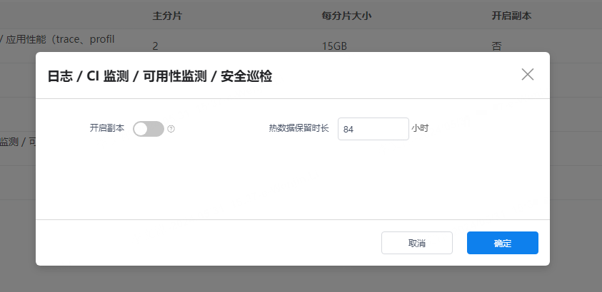
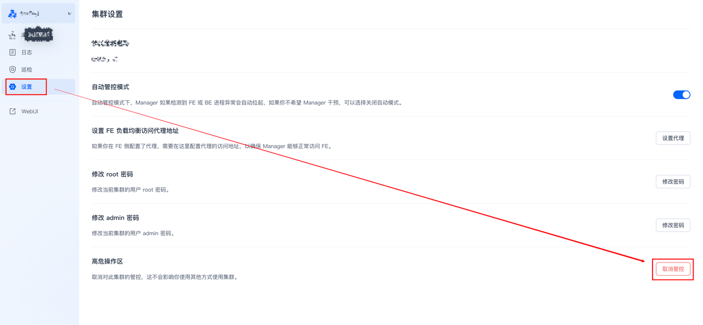

## 1 存储引擎切换为doris后，主机列表为空
问题描述：存储引擎切换为Doris后。创建新的空间，日志中可以查询到数据，但是基础设施中主机列为空，没有信息。
当把搜索截止时间调整到当前时间后一天时，比如当前时间是4月23日16点，可以将查询截止时间调整到4月24日16点时，可以在基础设施中查询出内容。

问题解决: 查询doris集群的时区配置，看是否为Asia/Shanghai,如果不是则修改为Asia/Shanghai。
```sql
# 通过在fe机器中mysql命令连接到集群中
mysql -uroot -h127.0.0.1 -P 9030
show variables like '%time_zone%';
# 如果结果不是Asia/Shanghai,通过下列命令修改
set global time_zone = "Asia/Shanghai";
```

## 2 Doris insert组件报错 磁盘空间不足
问题描述：{{{ custom_key.brand_name }}}数据上报异常，nsq有堆积，但是查询没有报错，通过查询Doris-logs insert组件日志发现磁盘空间不足，通过df -h命令也可以验证。


问题解决：重新挂载该目录，并重启insert组件，如果该问题出现比较频繁，建议升级Doris-logs服务器内存。
```shell
# 如果机器内存为16G，size=8G；机器内存为32G，siez=16G；机器内存为64G。size=16G或者size=32G
mount -o size=8G -t tmpfs none /data-tmp && sudo supervisorctl restart guance-insert
```

## 3 Doris be 节点磁盘使用率100%
问题描述：{{{ custom_key.brand_name }}}数据上报查询异常，nsq有堆积。查询日志发现be节点磁盘空间使用率100%。

问题解决：删表释放磁盘空间。
???+ warning "注意"
     测试环境数据不需要可以进行删表操作，生产环境禁止删表，需要扩容磁盘。

获取大表方式一：
如果be是单节点可能会执行报错。
```sql
# 通过在fe机器中mysql命令连接到集群中
mysql -uroot -h127.0.0.1 -P 9030

# 获取数据量大的表名
select concat(table_schema, '.', table_name)
from information_schema.tables
where table_schema like 'db%'
order by data_length desc
limit 1;

# 删除表 
drop table <table_name>;
```

获取大表方式二：

如果接入了自监控，可以通过查看Doris仪表板【表写入 QPS TOP 10】项发现大表。

从这个图上拿到 accountID 
```sql
drop table db_<accountID>_0.L_default;
```
通过方式一或者方式二删除大表释放磁盘空间，重启be。
```sql
# be节点机器取消坏盘标记 
sed -i '/broken/d' /home/doris/doris/be/conf/be_custom.conf
# 重启be
登陆到manager web重启be节点
```

## 4 如何验证空间级别热数据修改是否有效
问题描述：在{{{ custom_key.brand_name }}}后台中修改了空间级别的索引热数据保留时长，怎么验证修改是否有效。


问题解决：
```sql
# 通过在fe机器中mysql命令连接到集群中
mysql -uroot -h127.0.0.1 -P 9030
show storage policy;
# CooldownTtl 为热数据时长(s),PolicyName 是对应的对象,中间数字为工作空间的 ID
```


## 5 Doris服务器doris用户密码过期
问题描述：Doris服务器doris用户密码过期,过期后manager无法正常托管集群。

问题解决：

方案一：

修改doris用户密码过期策略
```shell
# 查看用户的密码策略
chage -l 用户名
# -M -1表示密码用不过期，具体可查阅chage用法
chage -M -1 username
```

方案二：

修改所有doris服务器doris用户密码后(修改后密码需要保持一致)，在manager-web(fe01_ip:8004)上取消托管集群后，重新托管集群。


## 6 Doris集群be节点缩容
问题描述：因为数据量接入减少，Doris集群配置过高需要缩容be节点减少be节点数量。

问题解决：

在manager-web上下线be节点。


等待下线的be节点tablet数量完全迁移完。
```sql
# 通过在fe机器中mysql命令连接到集群中
mysql -uroot -h127.0.0.1 -P 9030
show backends;
# TabletNum 和 DataUsedCapacity 减少为0,则说明数据迁移完成
```
回收下线的节点机器。

## 7 点击主机对象页面报错: kodo服务API请求错误: Service Unavailable

问题描述：点击主机对象报kodo服务API请求错误: Service Unavailable 错误

问题解决：

查看GuanceDB for logs select组件日志，发现报错 

``` shell
connect: connection refused" (Unavailable; AuthenticateBasicToken)
```

登录到 Doris manager web，查看BE角色参数，发现不存在 `arrow_flight_sql_port`参数，在 manager 中为BE 节点添加 `arrow_flight_sql_port` 参数。

```shell
arrow_flight_sql_port = 9090 
```

添加完成后重启 be 节点。