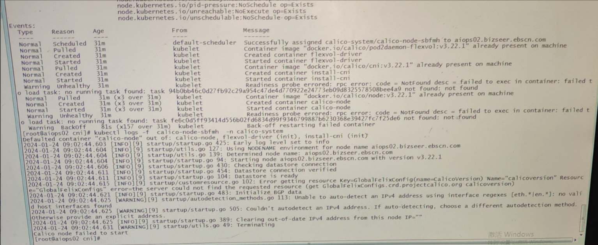
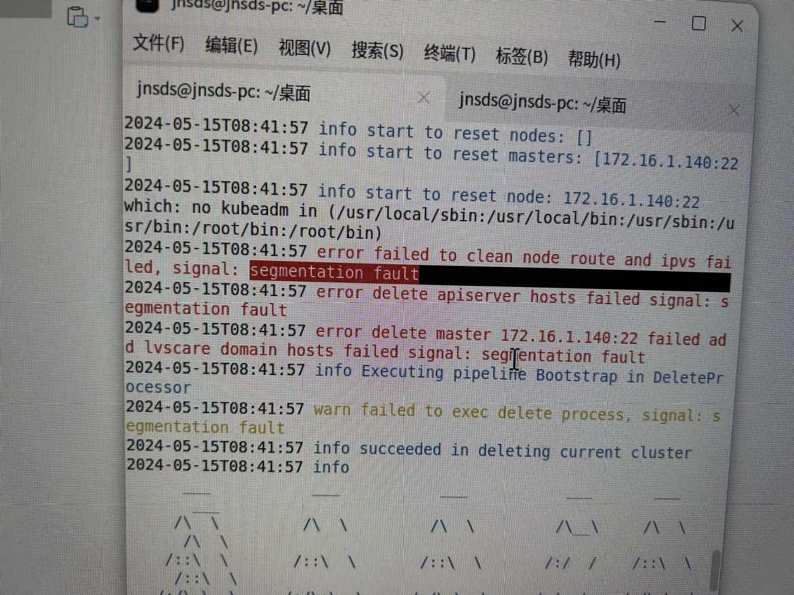
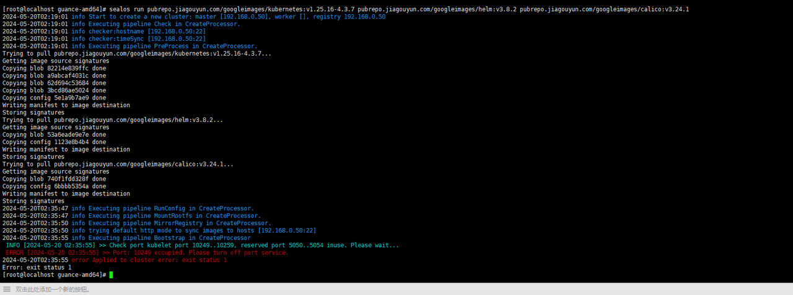

## 1 Sealos 节点 notready，kubelet 报 node not found
登陆问题节点，查看kubelet日志。
```shell
journalctl -xeu kubelet
```
日志中发现 apiserver 无法连接，测试网络联通性。
```shell
telent apiserver.cluster.local 6443
```
测试发现网络不通，关闭master节点防火墙，问题解决。
```shell
systemctl stop firewalld
```

## 2 麒麟 ARM 架构 Sealos 部署超时
查看是否部署其他容器化产品。
```shell
rpm -qa | grep docker
rpm -qa | grep podman
```
发现冗余软件，卸载冗余软件。
```shell
rpm -e <冗余软件名称>
```
卸载 sealos，重新安装。
```shell
sealos reset
```

## 3 物理机部署k8s集群，calico组件无法启动
物理机部署k8s集群时候，calico组件无法启动，报错如下。


```shell
kubectl -n calico-system get installations.operator.tigera.io 
kubectl -n calico-system edit installations.operator.tigera.io default

# 改为 interface: eth.*|en.*|bound.*  bound.*改成什么取决于物理机网卡叫什么，需要正则表达式能匹配到
nodeAddressAutodetectionV4:
  interface: eth.*|en.*
```

## 4 麒麟 ARM 架构 sealos 部署报 segmentation fault

安装新版本sealos 和 k8s集群。
```shell
# sealos
wget https://mirror.ghproxy.com/https://github.com/labring/sealos/releases/download/v4.3.7/sealos_4.3.7_linux_arm64.tar.gz \
   && tar zxvf sealos_4.3.7_linux_arm64.tar.gz sealos && chmod +x sealos && mv sealos /usr/bin
# k8s集群   
sealos run pubrepo.guance.com/googleimages/kubernetes:v1.25.16-4.3.7 pubrepo.guance.com/googleimages/helm:v3.8.2 pubrepo.guance.com/googleimages/calico:v3.24.1  --single  --debug
```

## 5 Selaos 安装报端口冲突，'Port: 10249 occupied'

检测端口是否冲突，如果冲突请关闭该端口。
```shell
lsof -i: <端口号>
```
如果上述命令无输出，可能是lsof命令异常。
```shell
whereis lsof
# 如果有多个lsof命令，且只有一个正常，可以将其他的lsof二进制命令mv重命名或者移动到其他路径
```

## 6 sealos部署集群 kubelet无法启动
**OS为openEuler 22.03版本**
问题描述：sealos部署过程中，一直报错，卡在这里无法启动集群，判断应该是kubelet的问题，查看kubelet日志。

通过查看/var/log/message日志发现 /etc/resolv.conf文件不存在。

新建文件，并配置正确的dns服务器，重装sealos。