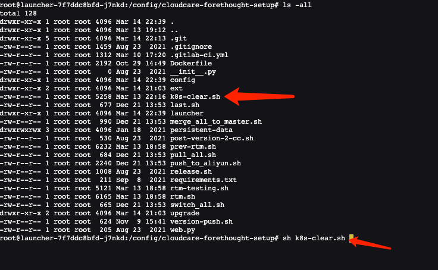

[faq.md](faq.md)# 常见问题

## 1 初次安装发生问题，需要清理后重新安装怎么办！
**注意：仅限初次安装时发生问题，需要铲除重新安装的场景，请仔细确认后再执行此以下清理步骤！**

如果发生安装问题，需要全部铲除后重新安装，需要清理以下三个地方，才可以从 Launcher 开始重新安装{{{ custom_key.brand_name }}}：
### 1.1 清理已安装的{{{ custom_key.brand_name }}}应用服务
清理 Kubernetes 中已安装的各种{{{ custom_key.brand_name }}}应用服务，可以在运维操作机上，进入 Launcher 容器，执行 Launcher 自带的清理脚本：
```
kubectl exec -it launcher-xxxxxxxx-xxx -n launcher /bin/bash
```
**launcher-xxxxxxxx-xxx 为您的 launcher 服务 pod 名称！**
进入容器后，可以看到 Launcher 服务自带的 k8s-clear.sh（1.47.103 之后的版本，这个脚本在 /config/tools 目录中） 脚本，执行此脚本，将清理所有{{{ custom_key.brand_name }}}应用服务及 k8s 的资源：



### 1.2 清理 MySQL 中自动创建的数据库
可以进入 Launcher 容器，Launcher 容器中自带了 mysql 客户端工具，使用以下命令连接到{{{ custom_key.brand_name }}}MySQL 实例：
```
mysql -h <mysql 实例 host> -u root -P <mysql 端口> -p  
```
需要使用 mysql 管理员账号连接，连接后，执行以下 6 个 MySQL 数据库及用户清理命令：
```
drop database df_core;
drop user df_core;
drop database df_message_desk;
drop user df_message_desk;
drop database df_func;
drop user df_func;
drop database df_dialtesting;
drop user df_dialtesting;
```
### 1.3 清理 InfluxDB 中自动创建的用户
使用 influx 客户端工具，连接 InfluxDB，执行以下两个用户清理命令：
```
drop user user_wr;
drop user user_ro;
```
## 2 部署注意事项
### 2.1 部署好之后，能不能手工修改安装程序自动生成的 Kubernetes 资源？
**不可以手工修改**，因为下次新版本发布后，使用 Launcher 升级安装，会根据安装时填写的配置信息重新生成 **Deployment、Service、Ingress** 等资源（ Configmap 除外，Configmap 配置项中的信息可以任意手工修改，但随意修改可能会造成程序运行异常）。

## 3 独立容器 Rancher Server 证书更新
### 3.1 证书未过期如何处理
rancher server 可以正常运行。升级到 Rancher v2.0.14+ 、v2.1.9+、v2.2.2+ 后会自动检查证书有效期，如果发现证书即将过期，将会自动生成新的证书。所以独立容器运行的 Rancher Server，只需在证书过期前把 rancher 版本升级到支持自动更新 ssl 证书的版本即可，无需做其他操作。
### 3.2 证书已过期如何处理
 rancher server 无法正常运行。即使升级到 Rancher v2.0.14+ 、v2.1.9+、v2.2.2+ 也可能会提示证书错误。如果出现这种情况，可通过以下操作进行处理：

1.正常升级 rancher 版本到 v2.0.14+ 、v2.1.9+、v2.2.2+；

2.执行以下命令：

- 2.0 或 2.1 版本

```shell
docker exec -ti <rancher_server_id>mv /var/lib/rancher/management-state/certs/bundle.json /var/lib/rancher/management-state/certs/bundle.json-bak
```

- 2.2 +

```shell
docker exec -ti <rancher_server_id>mv /var/lib/rancher/management-state/tls/localhost.crt /var/lib/rancher/management-state/tls/localhost.crt-bak
```

- 2.3 +

```shell
 docker exec -ti <rancher_server_id>mv /var/lib/rancher/k3s/server/tls /var/lib/rancher/k3s/server/tlsbak
 
 # 执行两侧，第一次用于申请证书，第二次用于加载证书并启动
 docker restart <rancher_server_id>
```

- 2.4 +

​       a. exec 到 rancher server

```shell
kubectl --insecure-skip-tls-verify -n kube-system delete secrets k3s-serving
kubectl --insecure-skip-tls-verify delete secret serving-cert -n cattle-system
rm -f /var/lib/rancher/k3s/server/tls/dynamic-cert.json
```

​      b. 重启 rancher-server

```shell
docker restart <rancher_server_id>
```

​      c. 执行以下命令刷新参数

```shell
curl --insecure -sfL https://server-url/v3
```

3.重启 Rancher Server 容器

```shell
docker restart <rancher_server_id>
```
## 4 rancher server 证书已过期导致无法纳管k8s集群处理
如果集群证书已经过期，那么即使升级到Rancher v2.0.14、v2.1.9以及更高版本也无法轮换证书。rancher 是通过Agent去更新证书，如果证书过期将无法与Agent连接。
### 4.1 解决方法
可以手动设置节点的时间，把时间往后调整一些。因为Agent只与K8S master和Rancher Server通信，如果 Rancher Server 证书未过期，那就只需调整K8S master节点时间。
调整命令：
```shell
# 关闭ntp同步，不然时间会自动更新
timedatectl set-ntp false
# 修改节点时间
timedatectl set-time '2019-01-01 00:00:00'
```

然后再对 Rancher Server 进行升级，等到证书轮换完成后再把时间同步回来。
```shell
timedatectl set-ntp true
```
检查证书有效期
```shell
openssl x509 -in /etc/kubernetes/ssl/kube-apiserver.pem -noout -dates
```

## 5 创建了 DataWay 为什么在前台看不到
### 5.1 常见原因分析

-       Dataway 服务部署到服务器上之后并未正常运行。
-       Dataway 服务配置文件错误，未配置对正确的监听、工作空间token信息。
-       Dataway 服务运行配置错误，具体可以通过查看dataway 日志定位。
-       部署Dataway 的服务器无法与 kodo 服务通信。（包括dataway服务器并未在hosts中添加df-kodo 服务的正确解析）
-       kodo 服务异常，具体可通过查看kodo 服务日志进行确认。
-       df-kodo ingress 服务未正确配置。具体表现为无法访问 `http|https://df-kodo.<xxxx>:<port>`

## 6 为什么不能使用拨测服务
### 6.1 原因剖析

-       部署的{{{ custom_key.brand_name }}}应用为离线环境，物理节点网络环境无法出网。（较为常见）
-       自建探测节点网络异常。
-       地区供应商网络异常。
-       拨测任务创建错误。


## 7 部署常见问题及解决方法

### 7.1 `describe pods` 报 `unbound immediate PersistentVolumeClaims` 错误

- 查看 pvc 

```shell
NAMESPACE    NAME                                     STATUS    VOLUME                                     CAPACITY   ACCESS MODES   STORAGECLASS       AGE
default      opensearch-single-opensearch-single-0    Bound     pvc-0da2cb6f-1cb9-4630-b0ab-512ce57743a8   16Gi       RWO            openebs-hostpath   19d
launcher     persistent-data                          Pending                                                                        df-nfs-storage     6m3s
middleware   data-es-cluster-0                        Bound     pvc-36e48f5a-37b3-4c28-ad14-059265ee3009   50Gi       RWO            openebs-hostpath   18d
```

发现 persistent-data 的状态为 `Pending`。

- 查看 nfs-subdir-external-provisioner 容器状态

```shell
kubectl get pods -n kube-system  | grep nfs-subdir-external-provisioner
nfs-provisioner-nfs-subdir-external-provisioner-58b7cdf6f5dr5vr   0/1     ContainerCreating   0             7h7m
```

- 查看 `nfs-provisioner-nfs-subdir-external-provisioner-58b7cdf6f5dr5vr` 信息

```shell
kubectl describe  -n kube-system pods nfs-provisioner-nfs-subdir-external-provisioner-58b7cdf6f5dr5vr
....
  Type     Reason       Age                     From     Message
  ----     ------       ----                    ----     -------
  Warning  FailedMount  30m (x49 over 6h53m)    kubelet  Unable to attach or mount volumes: unmounted volumes=[nfs-subdir-external-provisioner-root], unattached volumes=[kube-api-access-5p4qn nfs-subdir-external-provisioner-root]: timed out waiting for the condition
  Warning  FailedMount  5m27s (x136 over 7h4m)  kubelet  Unable to attach or mount volumes: unmounted volumes=[nfs-subdir-external-provisioner-root], unattached volumes=[nfs-subdir-external-provisioner-root kube-api-access-5p4qn]: timed out waiting for the condition
  Warning  FailedMount  74s (x217 over 7h6m)    kubelet  MountVolume.SetUp failed for volume "nfs-subdir-external-provisioner-root" : mount failed: exit status 32
Mounting command: mount
Mounting arguments: -t nfs 10.200.14.112:/nfsdata /var/lib/kubelet/pods/3970ff5f-5dbf-419e-a6af-3080508d2524/volumes/kubernetes.io~nfs/nfs-subdir-external-provisioner-root
Output: mount: wrong fs type, bad option, bad superblock on 10.200.14.112:/nfsdata,
       missing codepage or helper program, or other error
       (for several filesystems (e.g. nfs, cifs) you might
       need a /sbin/mount.<type> helper program)

       In some cases useful info is found in syslog - try
       dmesg | tail or so.
```

`wrong fs type, bad option` 原因为未安装 `nfs-utils`

- 安装 `nfs-utils`


主机执行以下命令：

```shell
yum install nfs-utils 
```

