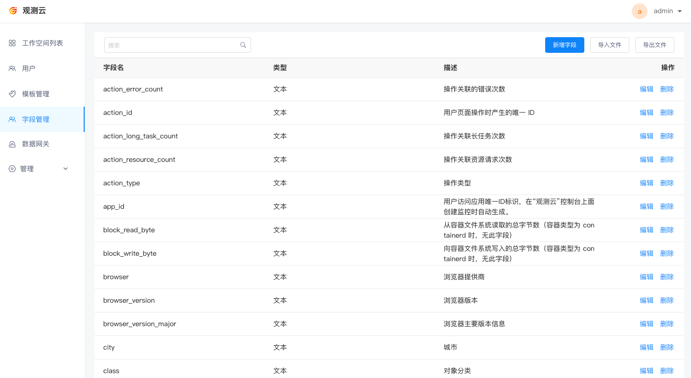
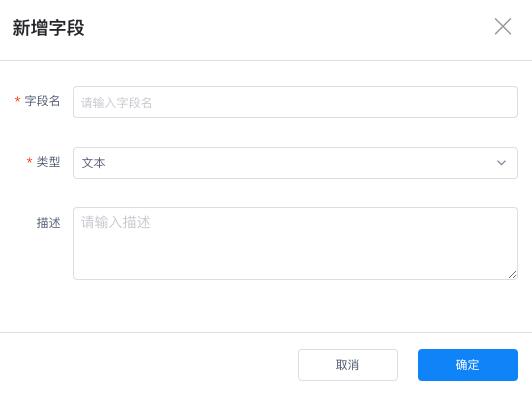

# 字段管理
---

## 简介

字段管理页面支持查看和搜索<<< custom_key.brand_name >>>所有系统默认的字段，包括字段名、类型和字段的描述详情。您可以在场景图表查询、监控器的检测指标、DQL 查询的简单查询模式、指标分析等同步查看字段说明，帮助您快速理解字段含义来应用字段。

## 管理字段

在<<< custom_key.brand_name >>>管理后台**字段管理**可查看目前所有系统默认的字段。支持关键字搜索、新建字段、导入文件、导出文件、以及编辑和删除字段。

### 新增字段

在字段管理，点击**新增字段**即可创建一个新的字段。

### 编辑/删除字段

字段创建后，可点击字段右侧的**编辑**、**删除**按钮对字段进行编辑和删除。

### 导入/导出字段文件

除了新增字段以外，支持下载导入模版，一键导入所有系统字段，同时支持一键导出所有系统字段。
