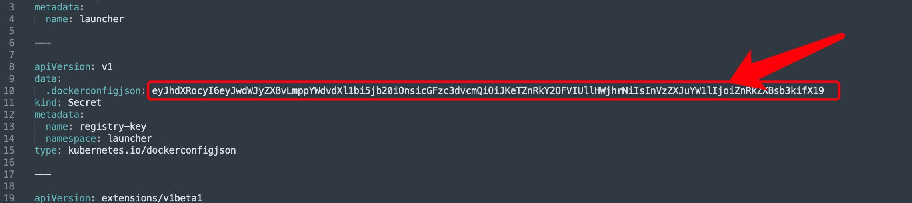

# 应用镜像获取


## 在线部署方式 {#online-image}

在线部署是指 Kubernetes 环境可以访问公网，那么部署时可以由 Kubernetes 从{{{ custom_key.brand_name }}}官方的公网镜像仓库自动下载镜像。

{{{ custom_key.brand_name }}}镜像公网地址获取，可以访问 [{{{ custom_key.brand_name }}}版本历史](changelog.md)。


## 离线部署方式 {#offline-image}

### {{{ custom_key.brand_name }}}离线镜像包的下载以及导入

???+ warning "注意"
     如果 kubernetes 节点主机可以访问公网，不需要通过以上离线导入的方式导入镜像，安装程序会自动下载镜像。

=== "amd64"

    如果是离线网络环境下安装，需要先手工下载最新的{{{ custom_key.brand_name }}}镜像包，通过  docker load  命令将所有镜像导入到各个 kubernetes 工作节点上后，再进行后续的引导安装。

    最新的{{{ custom_key.brand_name }}} Docker 镜像包下载地址：[https://{{{ custom_key.static_domain }}}/dataflux/package/guance-amd64-latest.tar.gz](https://{{{ custom_key.static_domain }}}/dataflux/package/guance-amd64-latest.tar.gz)

    1. 通过以下命令，将 Docker 镜像包下载到本地：
    ```shell
    $ wget https://{{{ custom_key.static_domain }}}/dataflux/package/guance-amd64-latest.tar.gz
    ```

    2. 下载后，将 Docker 镜像包上传到 kubernetes 的每一个 node 主机上后，执行以下命令，导入 Docker 镜像：
    - **Docker 环境导入镜像命令：**
    ```shell
    $ gunzip -c guance-amd64-latest.tar.gz | docker load
    ```

    - **Containterd 环境导入镜像命令：**
    ```shell
    $ gunzip guance-amd64-latest.tar.gz
    $ ctr -n=k8s.io images import guance-amd64-latest.tar
    ```
=== "arm64"

    如果是离线网络环境下安装，需要先手工下载最新的{{{ custom_key.brand_name }}}镜像包，通过  docker load  命令将所有镜像导入到各个 kubernetes 工作节点上后，再进行后续的引导安装。

    最新的{{{ custom_key.brand_name }}} Docker 镜像包下载地址：[https://{{{ custom_key.static_domain }}}/dataflux/package/guance-arm64-latest.tar.gz](https://{{{ custom_key.static_domain }}}/dataflux/package/guance-arm64-latest.tar.gz)

    1. 通过以下命令，将 Docker 镜像包下载到本地：
    ```shell
    $ wget https://{{{ custom_key.static_domain }}}/dataflux/package/guance-arm64-latest.tar.gz
    ```

    2. 下载后，将 Docker 镜像包上传到 kubernetes 的每一个 node 主机上后，执行以下命令，导入 Docker 镜像：
    - **Docker 环境导入镜像命令：**
    ```shell
    $ gunzip -c guance-arm64-latest.tar.gz | docker load
    ```

    - **Containterd 环境导入镜像命令：**
    ```shell
    $ gunzip guance-arm64-latest.tar.gz
    $ ctr -n=k8s.io images import guance-arm64-latest.tar
    ```


### launcher 自建镜像仓库配置 {#registry-key-change}

???+ warning "注意"
     如下载的离线镜像包导入到自建的镜像仓库后使用，请做以下配置。

     此操作必须要在部署 luancher 前操作。

=== "helm"
    
    安装 launcher 时，添加 `imageSecrets.url`，`imageSecrets.username`，`imageSecrets.password` 参数。

    ```shell hl_lines='4'
    helm install launcher launcher  --repo https://pubrepo.guance.com/chartrepo/launcher -n launcher \
    --create-namespace  \
    --set ingress.hostName=<Hostname>,storageClassName=<Stroageclass> \
    --set imageSecrets.url=<warehouseaddress>,imageSecrets.username=<warehouse username>,imageSecrets.password=<warehouse passwd>
    ```


=== "yaml"

    - 生成密钥

      ```shell
      kubectl create secret docker-registry dataflux-test --docker-server='<Repo Server>' --docker-username='<Repo Username>' --docker-password='<Repo Password>'
      ```
      > 注意替换 docker-server、docker-username、docker-password 三个参数的值，分别是你的镜像仓库地址、账号、密码。

    - 获取密钥
    
      ```shell
      kubectl get secrets dataflux-test -o jsonpath='{.data.\.dockerconfigjson}'
      ```

      执行结果：
      ```shell
      eyJhdXRocyI6eyJwdWJyZXBvLmd1YW5jZxxxxxxxxxiJkZXBsb3kiLCJwYXNzd29yZCI6IlFXRVIiLCJhdXRoIjoiWkdWd2JHOTVPbEZYUlZJPSJ9fX0=
      ```

    - 安装

      Launcher YAML 下载：[https://{{{ custom_key.static_domain }}}/launcher/launcher.yaml](https://{{{ custom_key.static_domain }}}/launcher/launcher.yaml)
      
      将上面的 YAML 内容保存为 **launcher.yaml** 文件，放到**运维操作机**上，然后替换文档内的变量部分：
    
      - {{ launcher_image }} 替换为最新版的 Launcher 应用的镜像地址，可以在 [部署镜像](changelog.md) 文档中获取到最新版本的 Launcher 安装镜像地址
      - {{ domain }} 替换为主域名，如使用 dataflux.cn
      - {{ storageClassName }}替换为storage class name，如 alicloud-nas

      将密钥替换 .dockerconfigjson 内容

      

      执行安装：

      ```shell
      kubectl apply -f launcher.yaml
      ```
