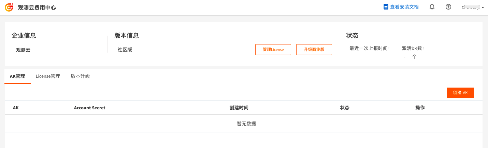

# 申请 License
观测云部署版为老师、学生、云计算爱好者等社区用户提供一个简单易得又功能完备的产品化本地部署平台。欢迎免费申请并下载试用，搭建您自己的观测云平台，体验完整的产品功能。

## 步骤

### 注册部署版账号

直接打开部署版注册地址（[https://boss.guance.com/index.html#/signup?type=private](https://boss.guance.com/index.html#/signup?type=private)），根据提示注册部署版账号。

注册完成后，进入观测云部署版费用中心。

### 获取 AK/SK

在观测云部署版费用中心的“AK 管理”，点击“创建 AK”，创建的 AK 和 SK复制后可填入“Step4：激活部署版”的 AK 和 SK 中。

### 获取 License

在观测云部署版费用中心的“License 管理”，点击“创建 License”，创建 License 时需要同意部署版用户许可协议并通过手机验证。创建的 License 复制后可填入“Step2：激活部署版”的 License 文本中。

