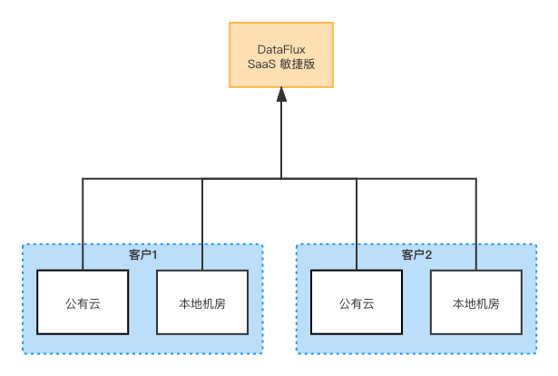
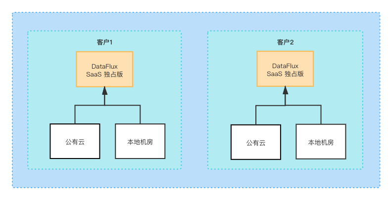
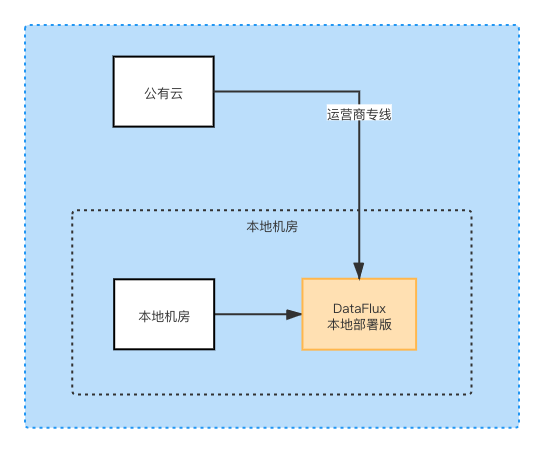

# 如何选择部署版本方案
---

## 概述
“<<< custom_key.brand_name >>>” 系统可观测平台，为客户应用系统提供**全链路的可观测性**的云服务平台，根据客户应用系统的实际使用场景与特点提供了多种部署方案供选择。可选的 “<<< custom_key.brand_name >>>” 部署方案包括：**SaaS 商业版**、**SaaS 独占版**、**本地部署版**。
## 版本说明 
三种不同的部署方案，都采用按量计费的收费模式，也就是功能本身免费，都是基于数据收费，能很好的适配大中小不同应用规模的客户，根据数据量的大小支付不同的费用。

### SaaS 商业版
是我们部署在云上的 SaaS 公有版本，客户可以开箱即用，迅速拥有一套强大的系统可观测平台，只需要安装 DataKit 后配置相关数据采集器即完成了可观测接入。

相比于本地部署版，SaaS 版有很多优势：
**更高性能： **
“<<< custom_key.brand_name >>>” 的可观测数据主要为时序指标数据（InfluxDB），和日志文本类数据（Elasticsearch），需要巨量的数据来完成对系统的可观测目的，对系统资源的消耗很大。使用云上资源，由云提供了强大的硬件能力支撑。

**更弹性：**
相比部署版本，用户无需关心资源的扩容，用户也无需再为扩容的资源买单。可以专注与自己的可观测数据。

**更安全：**
每个用户的工作空间数据都是独立 DB 级别隔离，数据查询天然限定在自己的 DB 内，无需担心数据安全问题。
所有数据按照等保三的要求，存储在阿里云存储之上。

**更可靠：**
我们是小步快走模式，迭代升级速度快，每周都会进行问题 fix，每两周一个新版本上线。
由驻云庞大的 SRE 团队保障平台的安全稳定运行。

**更及时的专家支持：**
SRC 团队可以通过客户授权及时响应客户的需求。

**网络拓扑结构：**

### SaaS 独占版
与 SaaS 商业版类似，也是在云上部署，但是客户独享使用，拥有** SaaS **商业版** **的所有优势。
另外，独占版本，我们为每个客户在各自独立的阿里云账号内部署一套 “<<< custom_key.brand_name >>>”，每个客户独占使用，安全级别更高。
计费也是按量方式，但由于是客户独享使用，SRC 团队单独提供支持，所以价格上相比 SaaS 商业版要贵 20% ~ 30%。

**网络拓扑结构：**

### 本地部署版
与 SaaS 独占版类似，是客户独享使用，但是部署在客户的本地物理机资源上，需要用户自己准备服务资源，需要一笔一次性的资源费用，大概15万的服务器资源费用（具体要看被监测对象规模）。
本地物理资源上部署，失去了在云上的所有优势，所有安全、可靠性都要自己保证，资源无法弹性。
另外，如果用户被监测对象云上云下混合，“<<< custom_key.brand_name >>>” 部署在没有固定公网 IP 的本地机房，还需要云运营商专线拉到本地机房，才能将云上的监测对象数据采集到本地 “<<< custom_key.brand_name >>>” 系统中，其中光专线就是一大块成本。

**网络拓扑结构：**

综上所述，SaaS 商业版是最便捷、接入速度最快、成本最低的接入方案。

