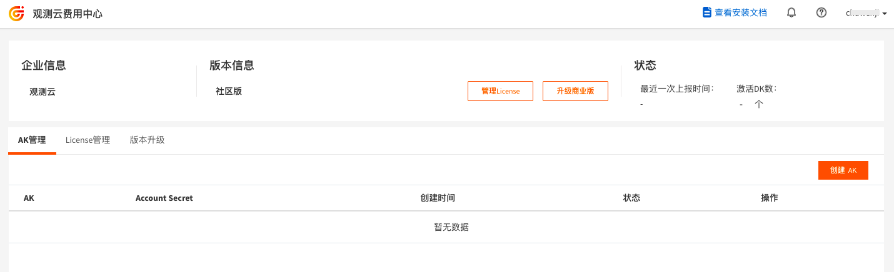
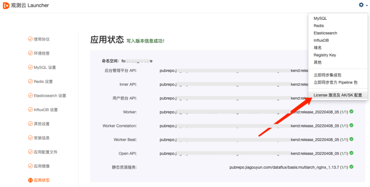
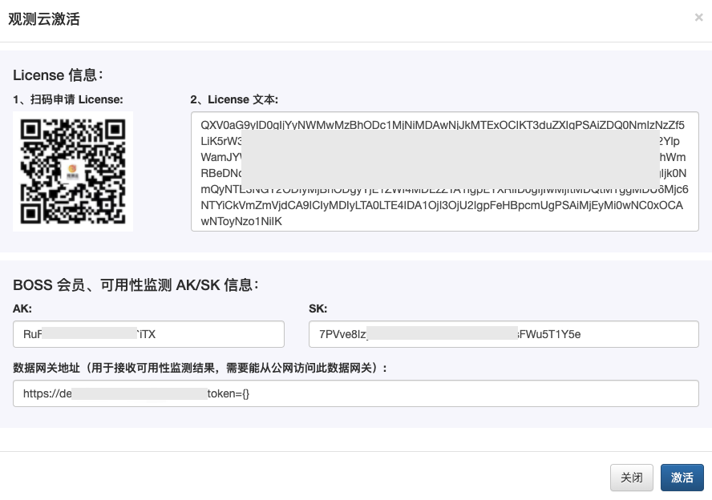
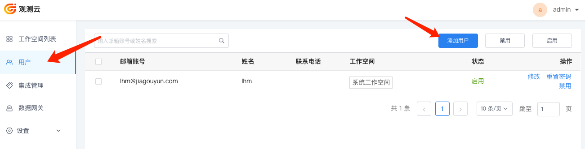
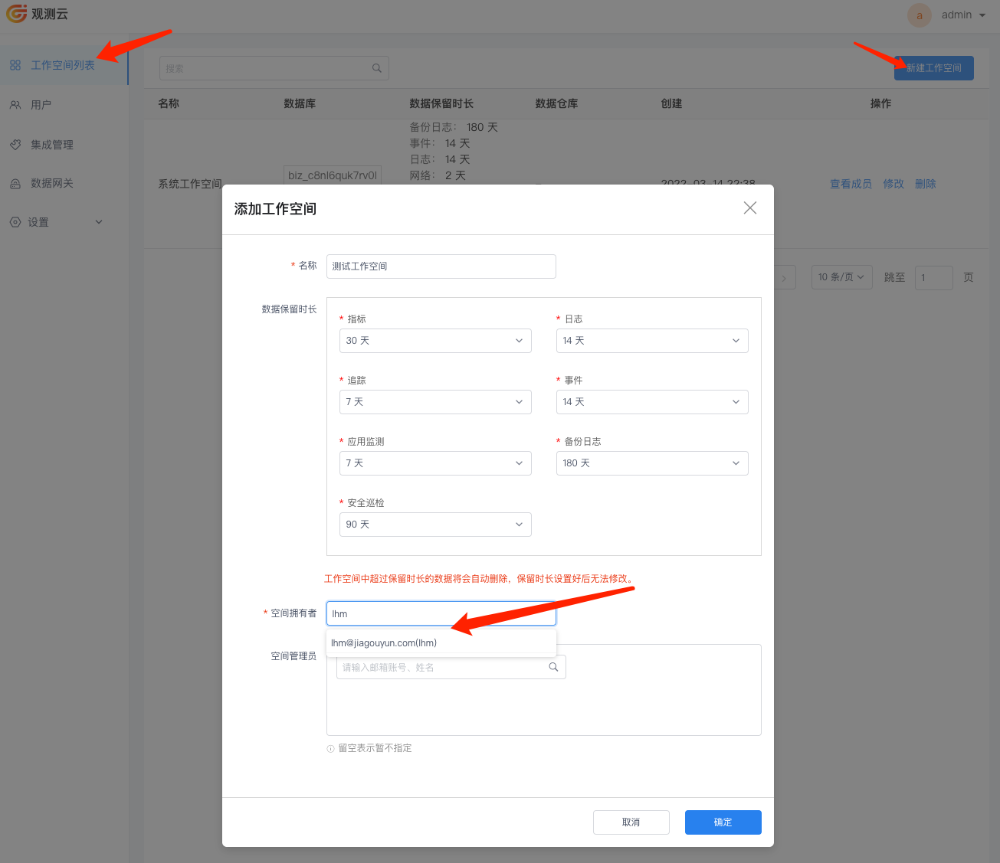

# 如何开始
---

<<< custom_key.brand_name >>>部署完成以后，需要进行配置并激活才能开始使用。

## 前提条件

您可以参考文档 [云上部署](cloud-deployment-manual.md) 或者 [线下环境部署](offline-deployment-manual.md)  或者 [阿里云计算巢部署](https://help.aliyun.com/document_detail/416711.html?spm=5176.26884182.J_4028621810.1.3a4b7bbbT89v0m)，进行线上或者线下部署。部署完成后，您可以获得以下<<< custom_key.brand_name >>>相关平台的登录方式。

- dataflux 【**用户前台（<<< custom_key.brand_name >>>）**】
- df-management 【**管理后台**】
- df-openapi 【**OpenAPI**】

## 方法步骤

### Step1：部署 DataWay

<<< custom_key.brand_name >>>部署完成后，需要先部署 DataWay，才能通过 DataWay 来上报数据到<<< custom_key.brand_name >>>工作空间。在这期间我们会有一个 DataWay 数据网关地址，用于激活部署版。

#### 新建 DataWay
使用管理员账号，进入“**<<< custom_key.brand_name >>>管理后台**”的“**数据网关**”菜单，点击“新建 DataWay”，添加一个数据网关 DataWay 。

- **名称**：自定义名称即可
- **绑定地址**：DataWay 的访问地址，在 DataKit 中接入数据使用，可以使用 `http://ip+端口`

**注意：在配置 DataWay 绑定地址时，必须保证 DataKit 主机与这个 DataWay 地址的连通性，能通过这个 DataWay 地址上报数据。**

#### 安装 DataWay
DataWay 添加完成后，可获取到一个 DataWay 的安装脚本，复制安装脚本，在部署 DataWay 的主机上运行安装脚本。

**注意：此处需要确保部署 DataWay 的这台主机，能访问到前面配置的 kodo 地址，建议 DataWay 通过内网到 kodo！**

安装完毕后，等待片刻刷新“数据网关”页面，如果在刚刚添加的数据网关的“版本信息”列中看到了版本号，即表示这个 DataWay 已成功与<<< custom_key.brand_name >>>中心连接，前台用户可以通过它来接入数据了。

### Step2：激活部署版

#### 注册部署版账号

打开部署版注册网址（[https://boss.guance.com/index.html#/signup?type=private](https://boss.guance.com/index.html#/signup?type=private），根据提示注册部署版账号。

注册完成后，进入<<< custom_key.brand_name >>>部署版费用中心。

<!--

-->
#### 获取 AK/SK

在<<< custom_key.brand_name >>>部署版费用中心的“AK 管理”，点击“创建 AK”。

#### 获取 License

在<<< custom_key.brand_name >>>部署版费用中心的“License 管理”，点击“创建 License”。

#### 激活部署版
打开<<< custom_key.brand_name >>> Launcher，在右上角设置，点击“License 激活及 AK/SK 配置”。

在<<< custom_key.brand_name >>> Launcher 的“<<< custom_key.brand_name >>>激活”对话框中，填入 AK/SK、License 和 数据网关地址，完成部署版激活。
注意：您可以扫码关注<<< custom_key.brand_name >>>服务号，获取更多<<< custom_key.brand_name >>>的官方信息。

### Step3：开始使用<<< custom_key.brand_name >>>
#### 创建用户
<<< custom_key.brand_name >>>部署版，不提供用户注册功能，需要登录“**<<< custom_key.brand_name >>>管理后台**”的“**用户**”菜单，点击“添加用户”来添加用户。

#### 创建工作空间
添加完用户以后，在“**<<< custom_key.brand_name >>>管理后台**”的“**工作空间列表**”菜单，点击“新建工作空间”，继续创建一个工作空间。
**注意：默认的“系统工作空间”不要作为日常业务上的观测使用！**

#### 添加工作空间成员
创建完工作空间以后，点击「查看成员」，进入对应的工作空间成员页面，可以查看到该空间下的所有成员基本信息。

在工作空间成员列表，点击右上角「添加用户」，选择新添加的用户并设置好权限后，点击「确定」即可在此空间中添加一名新用户。

#### 登录<<< custom_key.brand_name >>>
打开<<< custom_key.brand_name >>>部署版访问地址，即可使用以上创建的用户登录到对应的工作空间开始使用<<< custom_key.brand_name >>>的所有功能。详细功能使用介绍可参考 [<<< custom_key.brand_name >>>帮助手册](<<< homepage >>>/)。

