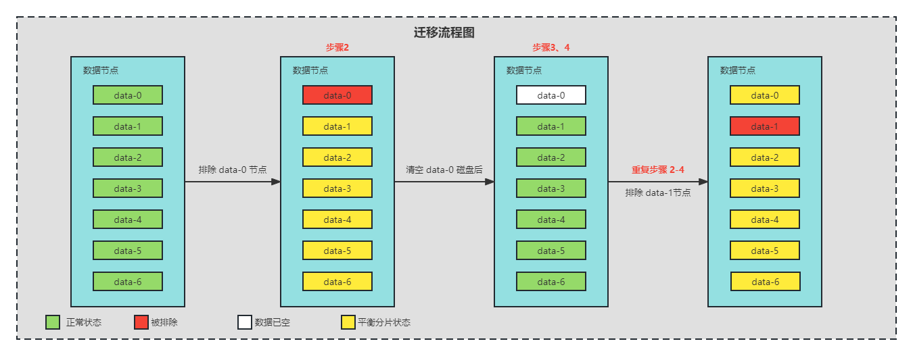

## 概述

在部署生产环境的时候，很多时候为了节约成本，OpenSearch 集群在使用量不大的情况下，会选择较低的 I/O 和 吞吐量的磁盘。但之后随着数据量的增大，性能也会随之出现瓶颈。这时候就想到了，更换磁盘类型来提高它的 I/O 和吞吐量。

### 前提条件

- 华为云 CCE v1.23
- 使用的华为云自身的 StorageClass `csi-disk-topology`
- 部署了高可用的 OpenSearch 集群

### 流程图

请根据以下的**操作步骤**结合来看。



## 操作步骤

### 步骤一：更改 csi-disk-topology 的默认磁盘类型

因为使用的是华为云 CCE 集群自带的 StorageClass ，所以要对其进行修改，保证默认创建出来的磁盘类型能够满足自身的需求。

```shell
kubectl edit sc -n middleware csi-disk-topology
```

```yaml
---
allowVolumeExpansion: true
apiVersion: storage.k8s.io/v1
kind: StorageClass
metadata:
  name: csi-disk-topology
parameters:
  csi.storage.k8s.io/csi-driver-name: disk.csi.everest.io
  csi.storage.k8s.io/fstype: ext4
  everest.io/disk-volume-type: SSD    ## 修改磁盘类型
  everest.io/passthrough: "true"
provisioner: everest-csi-provisioner
reclaimPolicy: Delete
volumeBindingMode: WaitForFirstConsumer
```

- 参数说明

| 参数                        | 描述                                                         |
| --------------------------- | ------------------------------------------------------------ |
| everest.io/disk-volume-type | 云硬盘类型，全大写。SAS：高I/O SSD：超高I/O   GPSSD：通用型SSD    ESSD：极速型SSD |

### 步骤二：迁移分片、调整速率

- 根据节点名排除节点，以下按照顺序从小到大依次进行排除，排除节点后，分片就不会再往这个数据节点上继续写入。并且原本在这个节点上的分片，也会因为集群自平衡的原则，迁移到其他节点。

  > 注意，执行此操作的时候。需要**确保其他节点的存储能够承载被排除节点的数据**。

```json
PUT _cluster/settings
{
  "persistent" : {
    "cluster.routing.allocation.exclude._name" : "opensearch-cluster-data-0"
  }
}
```

- 配置平衡分片最大值。
- incoming 表示写入的最大分片数，一般代表除被排除的节点，接受其写入的分片数量。
- outcoming 表示输出的最大分片数。一般代表被排除节点输出的分片数量。推荐设置为 **其余节点数 * 写入的最大分片数**

```json
PUT _cluster/settings
{
  "persistent": {
    "cluster.routing.allocation.node_concurrent_incoming_recoveries": 2, 
    "cluster.routing.allocation.node_concurrent_outgoing_recoveries": 12
  }
}
```

- 配置平衡分片过程的最大传输速率
- 可以根据使用情况，对迁移过程的吞吐量进行速率限制。目的是为了不影响业务，可以在白天设置的低一点，晚上设置的高一点。

```json
PUT _cluster/settings
{
  "persistent": {
    "indices.recovery.max_bytes_per_sec": "100mb"
  }
}
```

> 注意：请根据实际磁盘的吞吐量进行调整。

- 查看迁移状态

```shell
GET _cluster/health  ## 查看集群状态
GET _cat/tasks?v     ## 查看详细分片信息
GET _cat/indices?v&s=health:desc     ## 按照顺序查看索引的健康状态
```

### 步骤三：更换磁盘

- 删除前面对应的排除的数据节点的 pvc 和 pod，使其能够自动使用**步骤一**中修改后的 StorageClass 。
- 注意删除顺序不能错。

```
kubectl delete pvc -n middleware opensearch-cluster-data-opensearch-cluster-data-0
kubectl delete pods -n middleware opensearch-cluster-data-0
```

> pvc 删除的时候会卡住，直接 **Ctrl + c** 跳过即可。

### 步骤四：扩容新磁盘

- 华为云控制台上直接把新创建的磁盘扩容到需要的大小

- 更改对应数据节点的 pvc 的大小，修改成跟其他节点相同的大小

```shell
kubectl edit pvc -n middleware opensearch-cluster-data-opensearch-cluster-data-0
```

```yaml
spec:
  accessModes:
  - ReadWriteOnce
  resources:
    requests:
      storage: 2500Gi    ## 修改成跟其他节点相同的大小。
  storageClassName: csi-disk-topology
  volumeMode: Filesystem
  volumeName: pvc-7025138f-04e0-4d5b-879d-7cf998f54628
```

> 注意：磁盘只能扩容不能缩容，所以选择的大小要慎重

### 步骤五：取消排除节点

因为是整个集群的迁移，以上的步骤 2-4 只是迁移并更换了一个数据节点的磁盘类型，所以需要重复执行步骤 2-4 ，直到所有节点的磁盘类型全部更换完毕后，再执行以下语句把排除节点置空，这样根据集群的自平衡特性，他就会自动从平衡分片到最后的空节点上。

```json
PUT _cluster/settings
{
  "persistent" : {
    "cluster.routing.allocation.exclude._name" : ""
  }
}
```

## 验证方法

```shell
GET _cluster/health
```

> 如果集群状态没有问题，则不要忘记释放掉旧的磁盘，避免产生额外费用。
